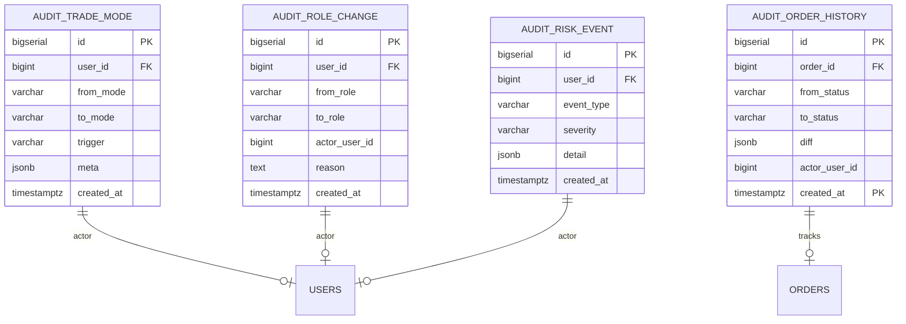

# TradePilot ERD (Entity Relationship Diagram)

> 문서 ID: 30_ERD
> 버전: v1.0
> 작성자: DBA
> 최종 수정일: 2026-05-12
> 검토자: DevLead, BackendSenior, Planner

본 문서는 TradePilot 시스템의 PostgreSQL 데이터 모델을 도메인별로 분리하여 ERD로 정의한다. 각 도메인은 별도 PostgreSQL 스키마로 격리되며, 권한 분리·파티셔닝 전략의 기반이 된다.

---

## 0. 도메인 구분

| 스키마 | 도메인 | 책임 범위 |
|---|---|---|
| `tp_user` | 사용자 | 계정, 프로필, 설정, OTP, 세션, 즐겨찾기 |
| `tp_market` | 시장 데이터 | 종목 마스터, 섹터, 일봉/분봉, 지수, 기업액션 |
| `tp_analysis` | 분석 데이터 | 지표 캐시, 추천, 시그널, ML 예측 |
| `tp_trade` | 매매 | 전략, 주문, 체결, 포지션, 포트폴리오, 한도, Kill Switch |
| `tp_trade` | 백테스트 | 백테스트 잡, 결과, 거래내역 (별도 스키마 분리 가능) |
| `tp_notify` | 알림 | 알림 큐, 채널, 룰 |
| `tp_audit` | 감사 | 로그인 이력, 권한 변경, 주문 변경 이력 |

> 본 ERD는 가독성을 위해 도메인별로 분할 표기한다. 도메인 간 FK는 각 다이어그램 끝 "Cross-Domain Links" 절에 요약.

---

## 1. 사용자 도메인 (`tp_user`)

```mermaid
erDiagram
    USERS ||--o| USER_PROFILES : has
    USERS ||--o| USER_SETTINGS : has
    USERS ||--o{ OTP_CODES : requests
    USERS ||--o{ SESSIONS : owns
    USERS ||--o{ USER_FAVORITES : adds
    USERS ||--o{ AUDIT_LOGIN : logs

    USERS {
        bigserial id PK
        uuid public_id UK
        citext email UK
        varchar password_hash
        varchar nickname
        varchar phone
        varchar role
        varchar trade_mode
        boolean email_verified
        boolean phone_verified
        timestamptz disclaimer_agreed_at
        timestamptz last_login_at
        int login_fail_count
        timestamptz locked_until
        timestamptz created_at
        timestamptz updated_at
        timestamptz deleted_at
    }

    USER_PROFILES {
        bigint user_id PK_FK
        varchar avatar_url
        varchar timezone
        varchar locale
        jsonb extra
        timestamptz created_at
        timestamptz updated_at
    }

    USER_SETTINGS {
        bigint user_id PK_FK
        varchar theme
        boolean noti_inapp
        boolean noti_email
        boolean noti_telegram
        jsonb noti_rules
        jsonb schedule
        timestamptz created_at
        timestamptz updated_at
    }

    OTP_CODES {
        bigserial id PK
        bigint user_id FK
        uuid otp_id UK
        varchar purpose
        varchar code_hash
        varchar channel
        timestamptz expires_at
        timestamptz consumed_at
        int attempt_count
        timestamptz created_at
    }

    SESSIONS {
        bigserial id PK
        bigint user_id FK
        varchar refresh_token_hash UK
        varchar user_agent
        inet ip_address
        timestamptz expires_at
        timestamptz revoked_at
        timestamptz created_at
    }

    USER_FAVORITES {
        bigint user_id PK_FK
        bigint stock_id PK_FK
        timestamptz created_at
    }

    AUDIT_LOGIN {
        bigserial id PK
        bigint user_id FK
        varchar event
        varchar result
        inet ip_address
        varchar user_agent
        jsonb meta
        timestamptz created_at
    }
```

---

## 2. 시장 도메인 (`tp_market`)

```mermaid
erDiagram
    SECTORS ||--o{ STOCK_SECTORS : maps
    STOCKS ||--o{ STOCK_SECTORS : has
    STOCKS ||--o{ PRICE_DAILY : daily
    STOCKS ||--o{ PRICE_MINUTE : minute
    STOCKS ||--o{ CORPORATE_ACTIONS : announces
    MARKET_INDEX ||--o{ MARKET_INDEX_DAILY : daily

    STOCKS {
        bigserial id PK
        varchar code UK
        varchar name
        varchar market
        varchar status
        int listing_shares
        bigint market_cap
        int par_value
        timestamptz listed_at
        timestamptz delisted_at
        timestamptz created_at
        timestamptz updated_at
    }

    SECTORS {
        bigserial id PK
        varchar code UK
        varchar name
        varchar parent_code
        int sort_order
        timestamptz created_at
        timestamptz updated_at
    }

    STOCK_SECTORS {
        bigint stock_id PK_FK
        bigint sector_id PK_FK
        boolean is_primary
        timestamptz created_at
    }

    PRICE_DAILY {
        bigint stock_id PK_FK
        date trade_date PK
        numeric open
        numeric high
        numeric low
        numeric close
        bigint volume
        numeric volume_amount
        numeric change_pct
        numeric adj_close
        timestamptz created_at
    }

    PRICE_MINUTE {
        bigint stock_id PK_FK
        timestamptz ts PK
        smallint interval_min
        numeric open
        numeric high
        numeric low
        numeric close
        bigint volume
        numeric volume_amount
        timestamptz created_at
    }

    CORPORATE_ACTIONS {
        bigserial id PK
        bigint stock_id FK
        varchar action_type
        date effective_date
        numeric ratio
        numeric cash_amount
        jsonb detail
        timestamptz created_at
    }

    MARKET_INDEX {
        bigserial id PK
        varchar code UK
        varchar name
        varchar market
        timestamptz created_at
    }

    MARKET_INDEX_DAILY {
        bigint index_id PK_FK
        date trade_date PK
        numeric open
        numeric high
        numeric low
        numeric close
        bigint volume
        numeric change_pct
        timestamptz created_at
    }
```

---

## 3. 분석 도메인 (`tp_analysis`)

```mermaid
erDiagram
    INDICATORS_DAILY }o--|| STOCKS : computed_for
    SECTOR_METRICS_DAILY }o--|| SECTORS : computed_for
    RECOMMENDATIONS }o--|| STOCKS : about
    RECOMMENDATIONS }o--o| STRATEGIES : by
    SIGNALS }o--|| STOCKS : about
    SIGNALS }o--|| STRATEGIES : by
    SIGNALS }o--|| USERS : owned_by
    ML_PREDICTIONS }o--|| STOCKS : about

    INDICATORS_DAILY {
        bigint stock_id PK_FK
        date trade_date PK
        numeric ma5
        numeric ma20
        numeric ma60
        numeric ma120
        numeric rsi14
        numeric macd
        numeric macd_signal
        numeric macd_hist
        numeric bb_mid
        numeric bb_upper
        numeric bb_lower
        numeric obv
        numeric vwap
        numeric stoch_k
        numeric stoch_d
        numeric atr14
        timestamptz computed_at
    }

    SECTOR_METRICS_DAILY {
        bigint sector_id PK_FK
        date trade_date PK
        numeric change_pct
        numeric volume_amount
        numeric inflow_amount
        numeric outflow_amount
        numeric net_flow
        jsonb correlation
        timestamptz created_at
    }

    RECOMMENDATIONS {
        bigserial id PK
        bigint stock_id FK
        bigint strategy_id FK
        date trade_date
        numeric score
        varchar reason_code
        text reason_text
        jsonb features
        timestamptz created_at
    }

    SIGNALS {
        bigserial id PK
        uuid public_id UK
        bigint user_id FK
        bigint strategy_id FK
        bigint stock_id FK
        varchar action
        varchar confidence
        numeric trigger_price
        varchar status
        jsonb condition_trace
        timestamptz generated_at
        timestamptz expires_at
        timestamptz ignored_at
        timestamptz created_at
        timestamptz updated_at
    }

    ML_PREDICTIONS {
        bigserial id PK
        bigint stock_id FK
        date base_date
        smallint horizon
        numeric pred_mean
        numeric pred_lower
        numeric pred_upper
        varchar model_version
        numeric mape
        numeric direction_acc
        timestamptz created_at
    }
```

---

## 4. 매매/포트폴리오 도메인 (`tp_trade`)

```mermaid
erDiagram
    USERS ||--o{ STRATEGIES : owns
    STRATEGIES ||--o{ STRATEGY_RULES : has
    USERS ||--o{ ORDERS : places
    STRATEGIES ||--o{ ORDERS : drives
    ORDERS ||--o{ FILLS : produces
    USERS ||--o{ PORTFOLIOS : holds
    USERS ||--o{ POSITIONS : holds
    USERS ||--o| TRADE_LIMITS : configures
    USERS ||--o{ DAILY_PNL : aggregates
    USERS ||--o{ KILL_SWITCH_LOG : triggers

    STRATEGIES {
        bigserial id PK
        uuid public_id UK
        bigint user_id FK
        varchar name
        text description
        jsonb entry_rules
        jsonb exit_rules
        jsonb universe
        jsonb limits
        boolean active
        timestamptz activated_at
        timestamptz deactivated_at
        timestamptz created_at
        timestamptz updated_at
        timestamptz deleted_at
    }

    STRATEGY_RULES {
        bigserial id PK
        bigint strategy_id FK
        varchar rule_type
        varchar indicator
        varchar op
        numeric value
        int priority
        timestamptz created_at
    }

    ORDERS {
        bigserial id PK
        uuid public_id UK
        bigint user_id FK
        bigint strategy_id FK
        bigint signal_id FK
        bigint stock_id FK
        varchar trade_mode
        varchar side
        varchar order_type
        numeric qty
        numeric price
        varchar status
        varchar broker_order_no
        varchar idempotency_key
        text reject_reason
        timestamptz ordered_at PK
        timestamptz filled_at
        timestamptz canceled_at
        timestamptz created_at
        timestamptz updated_at
    }

    FILLS {
        bigserial id PK
        bigint order_id FK
        bigint user_id FK
        bigint stock_id FK
        varchar trade_mode
        numeric fill_qty
        numeric fill_price
        numeric fee
        numeric tax
        numeric slippage
        timestamptz filled_at PK
        timestamptz created_at
    }

    POSITIONS {
        bigserial id PK
        bigint user_id FK
        bigint stock_id FK
        varchar trade_mode
        numeric qty
        numeric avg_price
        numeric realized_pnl
        timestamptz opened_at
        timestamptz updated_at
    }

    PORTFOLIOS {
        bigserial id PK
        bigint user_id FK
        varchar trade_mode
        numeric cash
        numeric equity
        numeric total_value
        timestamptz snapshot_at
    }

    DAILY_PNL {
        bigint user_id PK_FK
        date trade_date PK
        varchar trade_mode PK
        numeric realized_pnl
        numeric unrealized_pnl
        numeric total_pnl
        numeric mdd
        int win_count
        int loss_count
        timestamptz created_at
    }

    TRADE_LIMITS {
        bigint user_id PK_FK
        numeric daily_buy_amount
        int daily_buy_count
        numeric per_stock_amount
        int max_positions
        numeric stop_loss_pct
        numeric take_profit_pct
        numeric daily_loss_limit_pct
        int single_order_max_qty
        timestamptz updated_at
        timestamptz created_at
    }

    KILL_SWITCH_LOG {
        bigserial id PK
        bigint user_id FK
        varchar trigger_type
        text reason
        int canceled_count
        int failed_count
        jsonb detail
        timestamptz triggered_at
    }
```

---

## 5. 백테스트 도메인 (`tp_trade` 내 분리)

```mermaid
erDiagram
    USERS ||--o{ BACKTEST_RUNS : runs
    STRATEGIES ||--o{ BACKTEST_RUNS : uses
    BACKTEST_RUNS ||--o{ BACKTEST_TRADES : has
    BACKTEST_RUNS ||--o| BACKTEST_RESULTS : produces

    BACKTEST_RUNS {
        bigserial id PK
        uuid job_id UK
        bigint user_id FK
        bigint strategy_id FK
        jsonb universe
        date period_from
        date period_to
        numeric initial_capital
        numeric slippage
        numeric fee_rate
        varchar status
        smallint progress
        timestamptz queued_at
        timestamptz started_at
        timestamptz finished_at
        text error_message
        timestamptz created_at
    }

    BACKTEST_RESULTS {
        bigint run_id PK_FK
        varchar label
        numeric cumulative_return
        numeric annualized_return
        numeric mdd
        numeric sharpe
        numeric win_rate
        int trade_count
        jsonb equity_curve
        jsonb summary
        timestamptz saved_at
    }

    BACKTEST_TRADES {
        bigserial id PK
        bigint run_id FK
        bigint stock_id FK
        varchar side
        numeric entry_price
        numeric exit_price
        numeric qty
        numeric pnl
        timestamptz entry_at
        timestamptz exit_at
    }
```

---

## 6. 알림 도메인 (`tp_notify`)

```mermaid
erDiagram
    USERS ||--o{ NOTIFICATIONS : receives
    USERS ||--o| NOTIFICATION_CHANNELS : configures
    USERS ||--o{ ALERT_RULES : sets

    NOTIFICATIONS {
        bigserial id PK
        bigint user_id FK
        varchar event_type
        varchar priority
        varchar channel
        varchar title
        text body
        jsonb payload
        boolean read
        timestamptz read_at
        timestamptz sent_at
        timestamptz created_at
    }

    NOTIFICATION_CHANNELS {
        bigint user_id PK_FK
        boolean inapp_enabled
        boolean email_enabled
        boolean telegram_enabled
        varchar telegram_chat_id
        timestamptz updated_at
    }

    ALERT_RULES {
        bigserial id PK
        bigint user_id FK
        varchar event_type
        jsonb condition
        varchar priority
        boolean active
        timestamptz created_at
        timestamptz updated_at
    }
```

---

## 7. 감사 도메인 (`tp_audit`)



---

## 8. Cross-Domain Links 요약

| From | To | 관계 | ON DELETE 정책 |
|---|---|---|---|
| `tp_user.users` | `tp_user.user_profiles` | 1:1 | CASCADE |
| `tp_user.users` | `tp_user.user_settings` | 1:1 | CASCADE |
| `tp_user.users` | `tp_user.user_favorites` | 1:N | CASCADE |
| `tp_user.user_favorites` | `tp_market.stocks` | N:1 | RESTRICT |
| `tp_market.stocks` | `tp_market.price_daily/minute` | 1:N | CASCADE |
| `tp_market.stocks` | `tp_market.stock_sectors` | M:N | CASCADE |
| `tp_market.stocks` | `tp_analysis.indicators_daily` | 1:N | CASCADE |
| `tp_user.users` | `tp_analysis.signals` | 1:N | CASCADE |
| `tp_analysis.signals` | `tp_trade.orders` | 1:N | SET NULL |
| `tp_user.users` | `tp_trade.orders` | 1:N | SET NULL (마스킹 후 보존) |
| `tp_trade.orders` | `tp_trade.fills` | 1:N | CASCADE |
| `tp_trade.strategies` | `tp_trade.orders` | 1:N | SET NULL |
| `tp_user.users` | `tp_trade.trade_limits` | 1:1 | CASCADE |
| `tp_user.users` | `tp_notify.notifications` | 1:N | CASCADE |
| `tp_trade.orders` | `tp_audit.audit_order_history` | 1:N | RESTRICT |
| `tp_user.users` | `tp_audit.*` | 1:N | RESTRICT (감사 데이터 보존) |

> 거래 내역(orders/fills)은 법정 보존 10년 요건(NFR-DATA-002)으로 사용자 삭제 시 CASCADE 하지 않고 SET NULL + 익명화 처리한다.

---

## 9. 핵심 설계 결정 요약

1. **사용자 노출 ID = UUID**(`public_id`), 내부 PK = `BIGSERIAL` 이중화 → URL 노출 안전성 + 인덱스 효율 동시 확보.
2. **시세 분봉(`price_minute`)은 월별 RANGE 파티셔닝** → 5년치 누적 시 단일 테이블 수십억 행 회피.
3. **주문/체결도 월별 파티셔닝** → 10년 보존 + 일일 조회 성능 분리.
4. **감사 로그는 `tp_audit` 스키마로 분리** → 권한 격리 및 RESTRICT FK로 데이터 보존 강제.
5. **`trade_mode`(SIM/LIVE)를 모든 거래 테이블의 컬럼으로 포함** → 단일 시스템에서 모드 격리 및 리포트 분리.

---

## 10. 변경 이력
| 버전 | 일자 | 작성자 | 내용 |
|---|---|---|---|
| v1.0 | 2026-05-12 | DBA | 최초 작성 |
