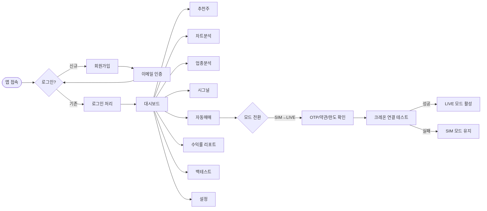
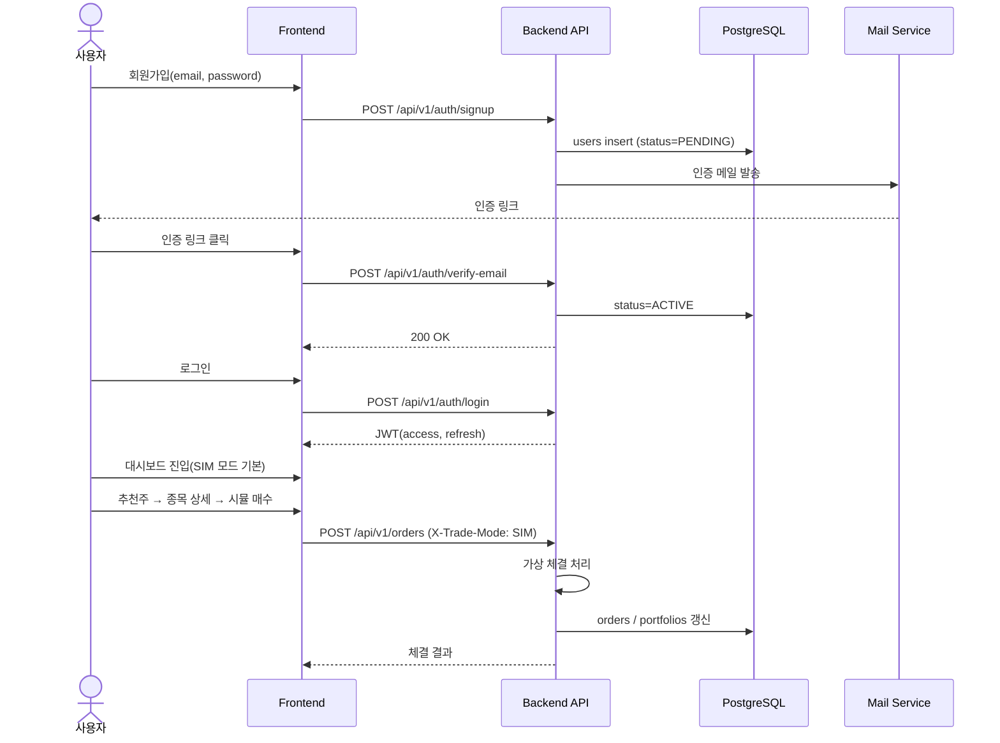
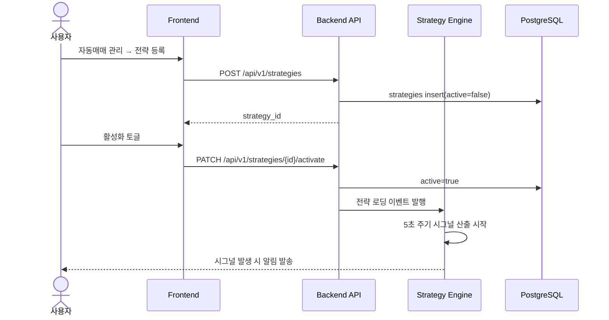
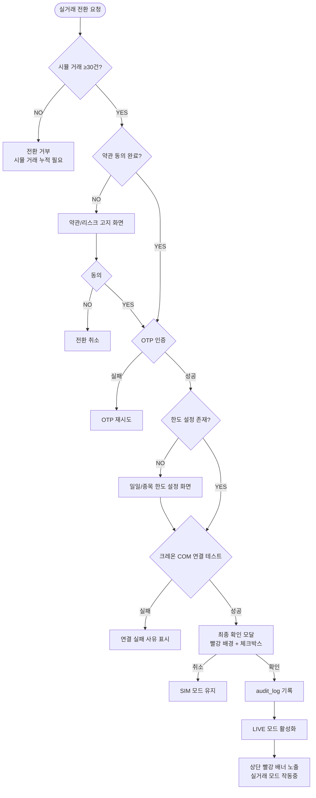
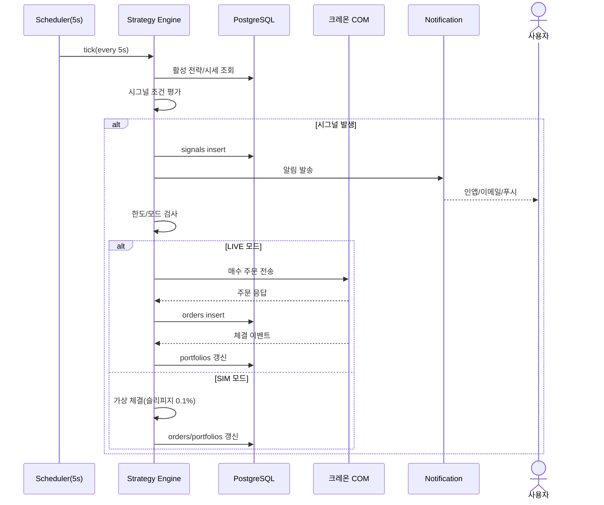
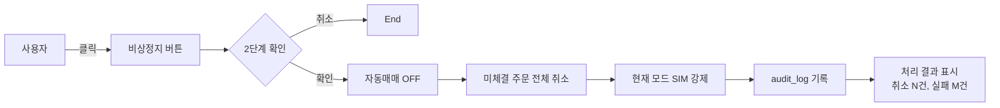
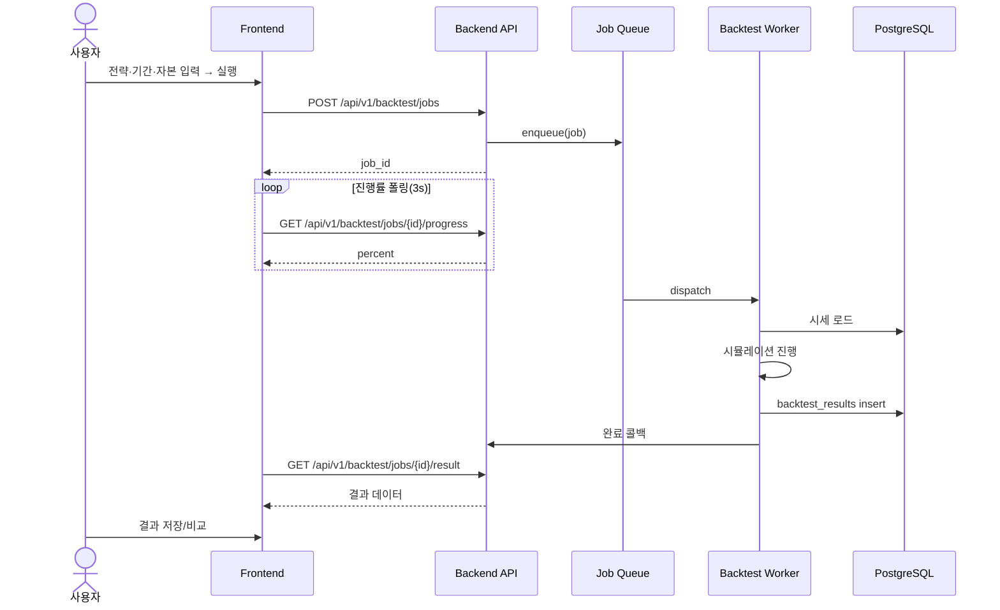
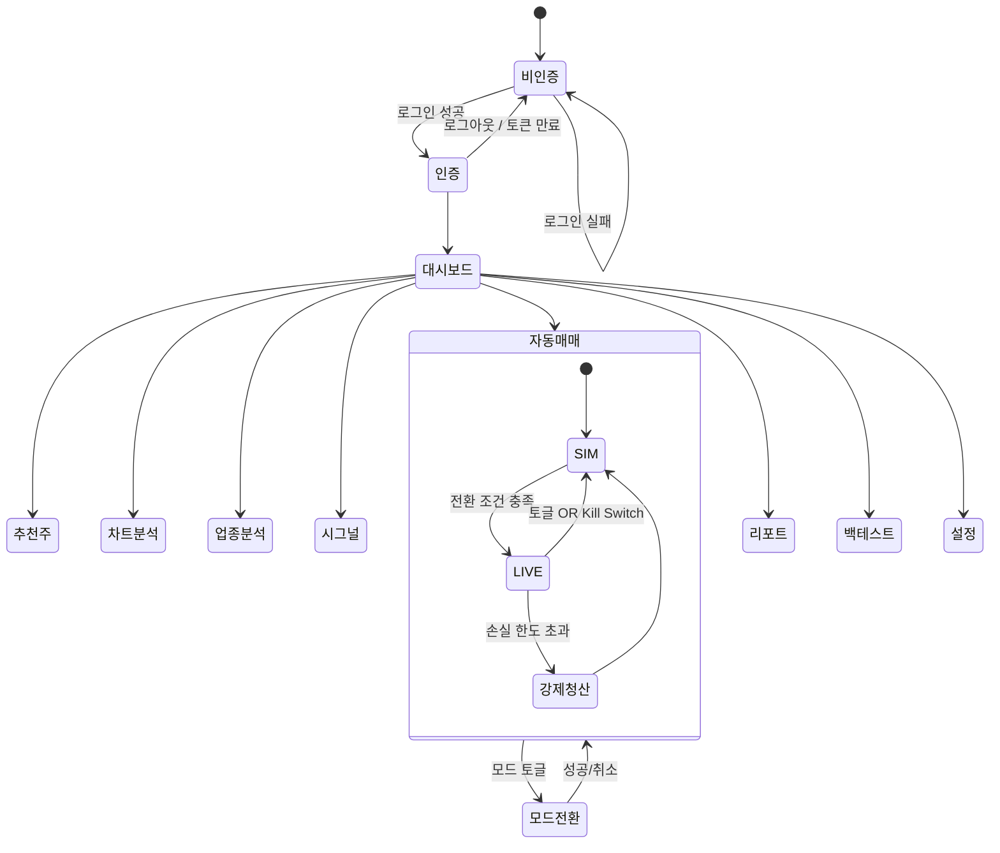

# TradePilot 화면 흐름도 (Screen Flow)

> 문서 ID: 12_SCREEN_FLOW
> 버전: v1.0
> 작성자: Planner
> 최종 수정일: 2026-05-12

---

## 1. 메뉴 구조도 (IA)

```mermaid
graph TD
    A[TradePilot] --> B[인증]
    A --> C[메인]

    B --> B1[로그인]
    B --> B2[회원가입]
    B --> B3[비밀번호 재설정]

    C --> D[대시보드]
    C --> E[추천주]
    C --> F[차트분석]
    C --> G[업종분석]
    C --> H[매매타이밍/시그널]
    C --> I[자동매매 관리]
    C --> J[수익률 리포트]
    C --> K[백테스트]
    C --> L[설정]

    E --> E1[전략별 추천 리스트]
    E --> E2[종목 상세]

    F --> F1[캔들/지표]
    F --> F2[2종목 비교]

    G --> G1[섹터 랭킹]
    G --> G2[자금 흐름]
    G --> G3[순환 히트맵]

    H --> H1[활성 시그널]
    H --> H2[시그널 이력]
    H --> H3[알림 설정]

    I --> I1[전략 목록]
    I --> I2[전략 등록/수정]
    I --> I3[모드 전환]
    I --> I4[한도/리스크]
    I --> I5[비상정지]

    J --> J1[일/주/월 수익률]
    J --> J2[종목별 손익]
    J --> J3[거래 내역]
    J --> J4[전략별 성과]

    K --> K1[백테스트 실행]
    K --> K2[결과 조회]
    K --> K3[결과 비교]

    L --> L1[프로필]
    L --> L2[보안/OTP]
    L --> L3[알림 채널]
    L --> L4[테마]
```

---

## 2. 사용자 페르소나

| 페르소나 | 설명 | 핵심 니즈 |
|---|---|---|
| 김주식 (30대 직장인) | 평일 장중 매매 불가, 자동매매 의존 | 안정적 수익, 손실 통제, 알림 |
| 박분석 (40대 전업) | 다양한 전략 검증, 백테스트 활용 | 정교한 지표, 성과 비교, 빠른 차트 |
| 이체험 (20대 초보) | 시뮬레이션으로 학습 | 직관적 UI, 추천주, 가이드 |

---

## 3. 전체 사용자 흐름 (Top-level User Flow)

---

## 4. 시나리오별 상세 흐름

### 4.1 시나리오 A: 신규 사용자 가입 → 시뮬레이션 첫 거래

### 4.2 시나리오 B: 자동매매 전략 등록 및 활성화

### 4.3 시나리오 C: 시뮬레이션 → 실거래 전환 (가장 중요한 안전 흐름)

### 4.4 시나리오 D: 시그널 발생 → 자동 주문 → 체결

### 4.5 시나리오 E: 비상정지(Kill Switch)

### 4.6 시나리오 F: 백테스트 실행 및 결과 비교

---

## 5. 페이지 전이 다이어그램 (State)

---

## 6. 모달/팝업 정의

| 모달 ID | 명칭 | 트리거 | 액션 |
|---|---|---|---|
| MD-001 | 매매 모드 전환 확인 | 모드 토글 | 확인/취소, 빨강 배경 |
| MD-002 | 약관 동의 | 첫 LIVE 전환 | 스크롤 끝 + 체크박스 |
| MD-003 | OTP 입력 | LIVE 전환, 출금 등 | 6자리 입력, 만료 3분 |
| MD-004 | 비상정지 확인 | Kill Switch | 사유 입력(선택), 확인/취소 |
| MD-005 | 강제 청산 알림 | 시스템 트리거 | 안내 + 결과 표 |
| MD-006 | 주문 확인 | 수동 매매 시 | 종목/수량/가격 표시 |
| MD-007 | 백테스트 결과 저장 | 완료 후 | 라벨 입력 |

---

## 7. 빈/오류/로딩 상태 정의

| 상태 | 화면 처리 |
|---|---|
| 로딩 | 스켈레톤 + 5초 초과 시 진행 표시 |
| 빈 상태 | 일러스트 + CTA 버튼 (예: "전략 등록하기") |
| 부분 장애 | 영역 단위 에러 카드, 재시도 버튼 |
| 시세 지연 | 가격 옆 "지연" 배지 + 마지막 갱신 시각 |
| 장 종료 | 상단 배너 + 매매 버튼 비활성 |

---

## 8. 반응형 Breakpoint

| 화면 | Desktop(≥1024) | Tablet(≥768) | Mobile(<768) |
|---|---|---|---|
| 대시보드 | 3컬럼 | 2컬럼 | 1컬럼 스택 |
| 차트분석 | 메인 + 사이드 지표 | 메인 + 하단 탭 | 메인 전용 + 모달 지표 |
| 추천주 | 테이블 | 테이블(가로 스크롤) | 카드 리스트 |
| 자동매매 | 좌측 메뉴 + 우측 컨텐츠 | 상단 탭 | 풀스크린 탭 |

---

## 9. 접근성/단축키

| 단축키 | 동작 |
|---|---|
| `Ctrl + K` | 종목 검색 |
| `Ctrl + Shift + S` | 비상정지(2단계 확인) |
| `Ctrl + M` | 모드 토글 |
| `Esc` | 모달 닫기 |

---

## 10. 변경 이력
| 버전 | 일자 | 작성자 | 내용 |
|---|---|---|---|
| v1.0 | 2026-05-12 | Planner | 최초 작성 |
