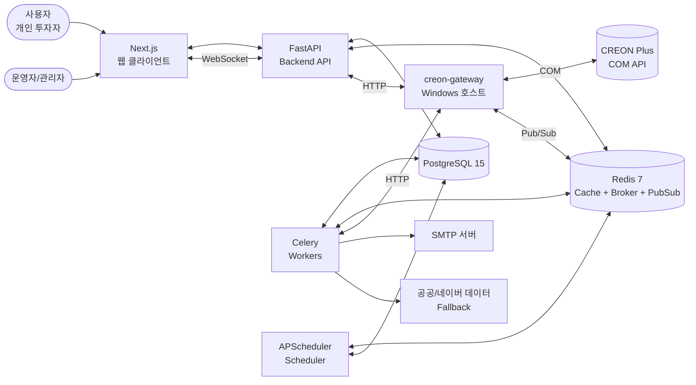
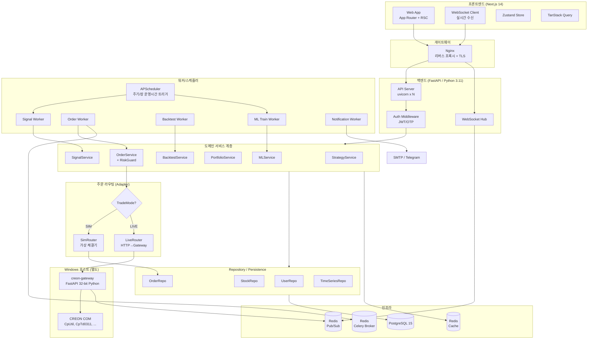
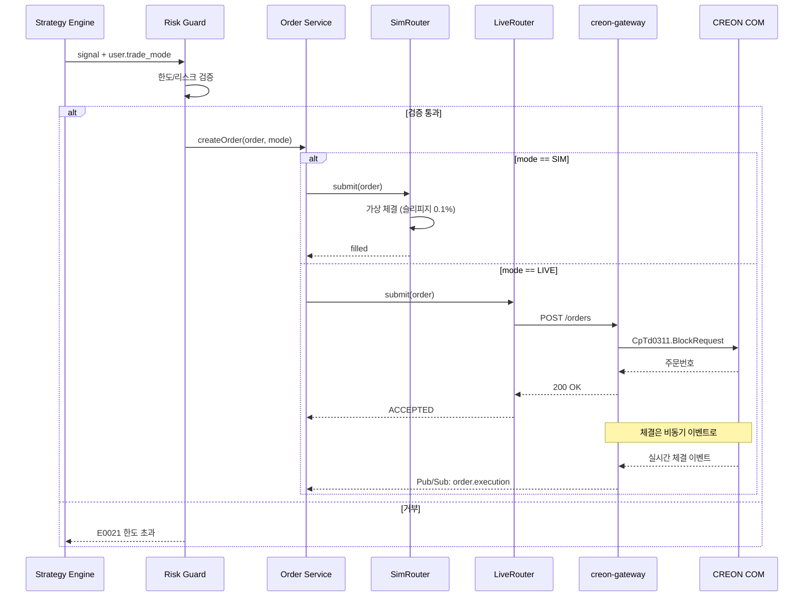
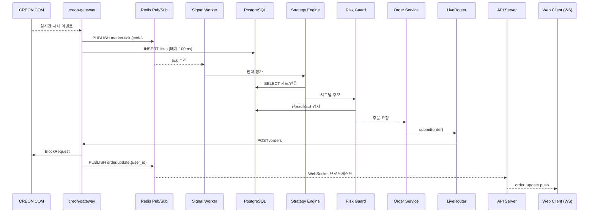
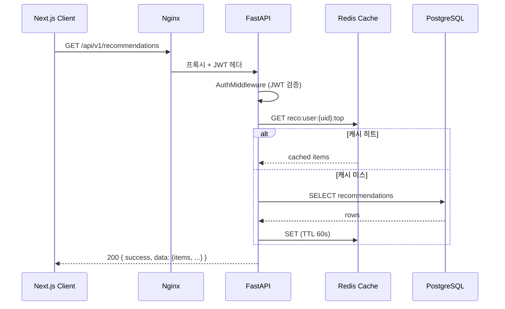
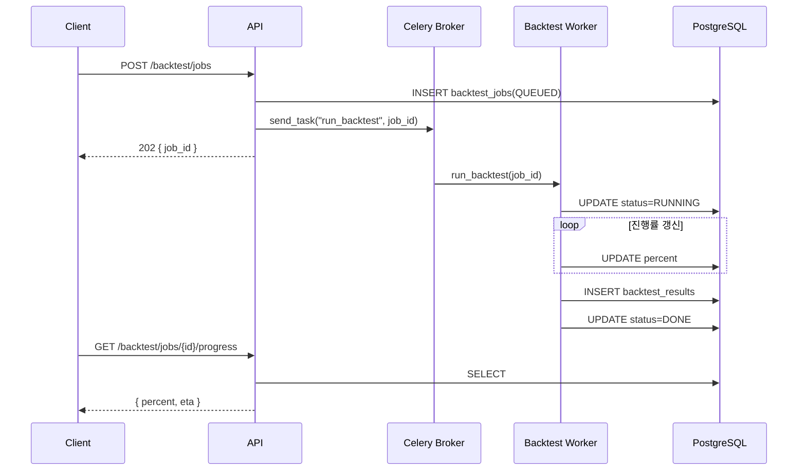
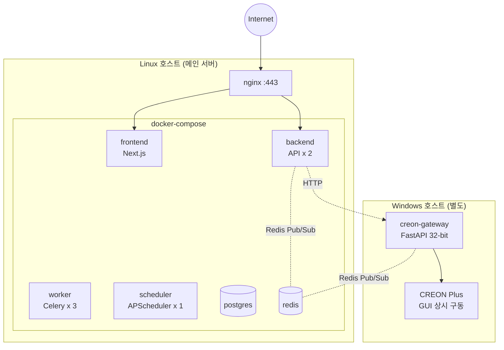

# TradePilot 시스템 아키텍처 (System Architecture)

> 문서 ID: 20_ARCHITECTURE
> 버전: v1.0
> 작성자: DevLead
> 최종 수정일: 2026-05-12
> 검토자: PM, BackendSenior, FrontendSenior, DBA, QA

---

## 1. 문서 개요

본 문서는 TradePilot의 시스템 아키텍처, 컴포넌트 구성, 데이터 흐름, 배포 토폴로지, 시뮬레이션/실거래 어댑터 패턴을 정의한다. 본 문서는 모든 개발자가 구현 전 반드시 숙지해야 하는 기준 문서이다.

### 1.1 아키텍처 원칙
- **단일 코드베이스 / 멀티 모드**: 시뮬레이션과 실거래는 어댑터로 분기하여 동일 비즈니스 로직을 공유한다.
- **레이어드 + 헥사고날 일부 채택**: 도메인 계층은 외부 시스템(크레온, DB, 메시지 큐)에 직접 의존하지 않고 포트(Port) 인터페이스에 의존한다.
- **수평 확장 가능**: 시세/시그널/주문 워커는 컨테이너 단위로 독립 스케일링한다.
- **장애 격리**: 크레온 COM의 Windows 종속성을 외부 게이트웨이로 분리하여 본체는 Linux 환경에서 동작한다.
- **관측 가능성(Observability)**: 모든 컴포넌트는 trace_id 기반으로 로그를 연결하며, 헬스체크 엔드포인트를 제공한다.

---

## 2. 시스템 컨텍스트 (System Context)



### 2.1 외부 행위자
| 행위자 | 역할 |
|---|---|
| 사용자 | 분석/시그널/자동매매 사용 |
| 관리자 | 시스템 운영, 마스터 데이터 관리 |
| CREON Plus | 증권사 주문/시세 제공 |
| SMTP / 알림 채널 | 이메일/텔레그램 발송 |
| 공공·네이버 데이터 | 시세 백업 소스 |

---

## 3. 컴포넌트 아키텍처

### 3.1 컴포넌트 다이어그램



### 3.2 컴포넌트 책임

| 컴포넌트 | 기술 | 책임 |
|---|---|---|
| Web App | Next.js 14 (App Router) + TS | UI 렌더링, SSR/CSR 하이브리드, 차트 시각화 |
| API Server | FastAPI + uvicorn | REST API 처리, 인증/인가, 도메인 서비스 호출 |
| WebSocket Hub | FastAPI WebSocket | 시세/시그널/알림 푸시 채널 |
| Signal Worker | Celery | 5초 주기 시그널 산출, 알림 디스패치 |
| Order Worker | Celery | 주문 라이프사이클 처리, 재시도/취소 |
| Backtest Worker | Celery | 비동기 백테스트 실행, 진행률 관리 |
| ML Train Worker | Celery | LSTM 일별 재학습, 모델 버전 관리 |
| Notification Worker | Celery | 이메일/텔레그램 발송, 실패 재시도 |
| Scheduler | APScheduler | 장 운영시간 트리거, 야간 배치, 마스터 갱신 |
| creon-gateway | FastAPI 32-bit Python (Windows) | COM 어댑터, 실거래 주문/시세 수집 |
| PostgreSQL | RDBMS | 도메인 데이터, 시계열, 감사 로그 |
| Redis | KV/메시지 | 캐시(시세/지표), Celery 브로커, Pub/Sub |

---

## 4. 어댑터 패턴 (SimRouter / LiveRouter)

### 4.1 포트 정의 (Port Interface)

```python
# domain/ports/order_router.py
from abc import ABC, abstractmethod
from domain.entities.order import Order, OrderResult, ExecutionEvent

class OrderRouterPort(ABC):
    @abstractmethod
    def submit(self, order: Order) -> OrderResult: ...

    @abstractmethod
    def cancel(self, order_id: str) -> OrderResult: ...

    @abstractmethod
    def fetch_executions(self, since: datetime) -> list[ExecutionEvent]: ...
```

### 4.2 어댑터 구현 매핑

| 모드 | 어댑터 | 동작 |
|---|---|---|
| SIM | `SimRouter` | 시장가 ±0.1% 슬리피지로 즉시 가상 체결, `orders`/`portfolios` 직접 갱신 |
| LIVE | `LiveRouter` | `creon-gateway`에 HTTP POST → COM 호출 → 결과 수신, Pub/Sub로 비동기 체결 이벤트 수신 |

### 4.3 라우팅 결정 시퀀스



### 4.4 모드 전환 가드

- 모든 주문 API 진입 시 `X-Trade-Mode` 헤더와 `users.trade_mode`를 비교한다 (`E0006`).
- SIM → LIVE 전환은 `15_trading_policy.md` §2.1의 7개 조건을 모두 통과해야 한다.
- LIVE 자동 강등(SIM 강제) 트리거는 동일 어댑터를 통해 SimRouter로 전환된다 (코드 변경 없음).

---

## 5. 데이터 흐름 (Data Flow)

### 5.1 시세 수신 → 시그널 → 주문 (End-to-End)



### 5.2 사용자 요청 흐름 (REST)



### 5.3 백테스트 비동기 흐름



---

## 6. 배포 토폴로지 (Deployment)

### 6.1 환경 구성



### 6.2 배포 구분

| 환경 | 호스트 | 컴포넌트 | 비고 |
|---|---|---|---|
| 메인 서버 | Linux (Docker) | nginx, frontend, backend(API/Worker/Scheduler), postgres, redis | docker-compose |
| 크레온 게이트웨이 | Windows 10/11 (네이티브) | creon-gateway (Python 3.11 32-bit), CREON Plus | 자세한 셋업은 `23_creon_gateway.md` |
| CI/CD | GitHub Actions | 빌드/테스트/이미지 푸시 | main 브랜치 → 스테이징 자동 배포 |

### 6.3 포트 매핑

| 컴포넌트 | 컨테이너 포트 | 외부 노출 | 비고 |
|---|---|---|---|
| nginx | 443/80 | 443/80 | TLS 종단 |
| frontend | 3000 | 내부망 | nginx 프록시 |
| backend (api) | 8000 | 내부망 | nginx 프록시 |
| postgres | 5432 | 미노출 | 개발 시 localhost:5432 |
| redis | 6379 | 미노출 | 개발 시 localhost:6379 |
| creon-gateway | 9100 | 내부망 한정 | 백엔드와 VPN/사설망 |

---

## 7. 보안 아키텍처

### 7.1 인증 계층
- **로그인**: 이메일 + 비밀번호 → bcrypt(cost=12) 비교 → JWT access(30분) / refresh(7일) 발급.
- **OTP**: 실거래 전환 시 추가 인증. SMS or 이메일 6자리, 3분 유효, 5회 실패 시 잠금.
- **권한**: `ROLE_*` 5단계 (RBAC), 데코레이터 기반 엔드포인트 가드.

### 7.2 시크릿 관리
- `.env` 파일은 git ignore.
- 크레온 계좌 비밀번호는 OS Keystore (Windows DPAPI) 또는 AES-256(GCM)으로 암호화 후 DB 저장.
- JWT 시크릿, DB 패스워드는 환경변수로 주입.

### 7.3 통신 보안
- 외부: HTTPS 강제 (nginx TLS 1.2+).
- 내부: 백엔드 ↔ creon-gateway는 사설망 + API 키 헤더 검증.

---

## 8. 관측 가능성 (Observability)

### 8.1 로깅
- 구조화 로그(JSON), `trace_id` 모든 로그에 포함.
- 레벨: DEBUG/INFO/WARN/ERROR/CRITICAL (`14_exception_policy.md` §9).

### 8.2 헬스체크
| 엔드포인트 | 응답 |
|---|---|
| `GET /healthz` | 컨테이너 liveness (즉시 OK) |
| `GET /readyz` | DB/Redis/gateway 상태 종합 |
| `GET /api/v1/admin/system/health` | 상세 의존성 상태 (ADMIN) |

### 8.3 메트릭 (v1.1+)
- Prometheus exporter 준비 (단, v1.0 출시는 로그 기반).
- 주요 지표: 주문 처리 지연(P50/P95), 시그널 큐 길이, 크레온 RTT.

---

## 9. 데이터 아키텍처 요약

> 상세 스키마는 DBA가 별도 문서로 관리.

| 영역 | 주요 테이블 | 비고 |
|---|---|---|
| 사용자 | users, user_settings, risk_limits, audit_log | bcrypt 해시, 마스킹 |
| 마스터 | stocks, sectors, market_calendar | 일 1회 배치 갱신 |
| 시계열 | candles_d, candles_m (분봉), ticks | 월 단위 파티셔닝 |
| 전략 | strategies, strategy_versions, recommendations | JSON DSL |
| 시그널 | signals (status: ACTIVE/CONSUMED/IGNORED) | TTL 30일 후 아카이브 |
| 주문 | orders, executions, portfolios | mode 컬럼으로 SIM/LIVE 구분 |
| 백테스트 | backtest_jobs, backtest_results, backtest_trades | 결과 30일 보관 |
| ML | ml_models, ml_predictions, ml_metrics | 모델 버전 관리 |
| 알림 | notifications, notification_settings | 채널별 설정 |

캐시 키 네임스페이스:
- `quote:{code}` (TTL 3s)
- `candles:{code}:{interval}:{from}:{to}` (TTL 60s, 분봉)
- `reco:user:{uid}:top` (TTL 60s)
- `session:{user_id}` (refresh token jti 저장)

---

## 10. 확장성 / 미래 변경 포인트

| 변경 포인트 | 대응 전략 |
|---|---|
| 증권사 추가(키움/이베스트) | OrderRouterPort 추가 어댑터 구현 |
| ML 모델 교체(Transformer 등) | MLService의 Strategy 인터페이스 교체 |
| 동시 사용자 200 → 1000 | API/Worker 수평 확장 + Postgres read-replica |
| 실시간 시세 폭증 | Redis Streams + 별도 tick 처리 워커 |
| 다중 크레온 게이트웨이 | gateway-id 라우팅 키 + 사용자 매핑 테이블 |

---

## 11. 기술 결정 사항 (ADR 요약)

| ID | 결정 | 사유 |
|---|---|---|
| ADR-01 | 백엔드 언어: Python | 크레온 COM(pywin32) 직접 호출 용이, ML 생태계 |
| ADR-02 | 프레임워크: FastAPI | 비동기, 타입 안전(Pydantic v2), OpenAPI 자동 생성 |
| ADR-03 | DB: PostgreSQL 15 | 시계열 파티셔닝, JSONB, 윈도우 함수 |
| ADR-04 | 비동기 작업: Celery + Redis | 재시도/스케줄러 성숙, 운영 경험 풍부 |
| ADR-05 | 프론트: Next.js 14 (App Router) | SSR/CSR 혼합, RSC로 초기 로딩 최적화 |
| ADR-06 | 상태 관리: Zustand + TanStack Query | 서버/클라이언트 상태 분리, 보일러플레이트 최소 |
| ADR-07 | 크레온 게이트웨이 분리 | Windows COM 종속성을 본체에서 격리 |
| ADR-08 | 어댑터 패턴 적용 | SIM/LIVE 분기를 단일 코드베이스로 유지 |

---

## 12. 변경 이력
| 버전 | 일자 | 작성자 | 내용 |
|---|---|---|---|
| v1.0 | 2026-05-12 | DevLead | 최초 작성 |
