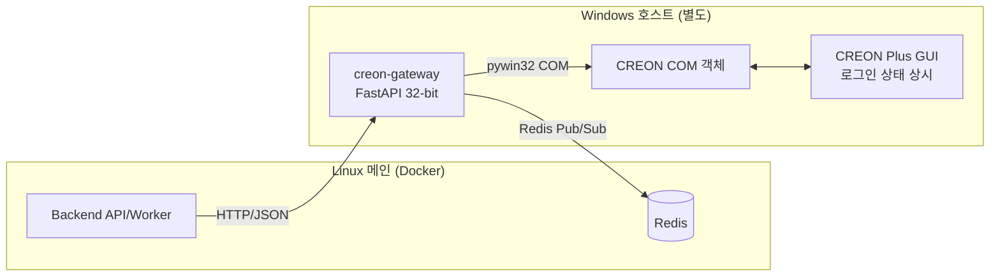
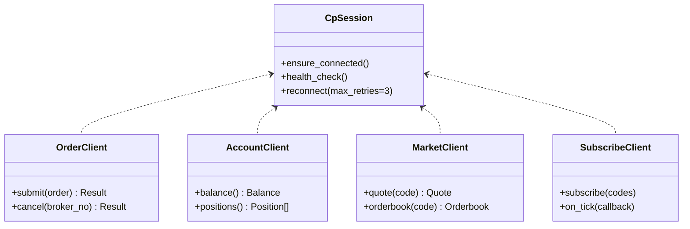

# TradePilot 크레온 게이트웨이 설계 (creon-gateway)

> 문서 ID: 23_CREON_GATEWAY
> 버전: v1.0
> 작성자: DevLead
> 최종 수정일: 2026-05-12
> 검토자: BackendSenior, QA

본 문서는 CREON Plus(Windows COM) API를 본체 백엔드와 격리하여 운영하기 위한 별도 프로세스 **creon-gateway**의 설계를 정의한다.

---

## 1. 분리 이유

| 항목 | 사유 |
|---|---|
| OS 종속성 | CREON COM 객체는 Windows에서만 동작 (Linux/Docker 불가) |
| 비트 제약 | CREON Plus는 32-bit 프로세스만 지원 → Python 3.11 (32-bit) 필요 |
| 단일 세션 | 동일 PC 1세션만 가능 → 본체 멀티 워커와 직접 결합 불가 |
| 장애 격리 | COM 멈춤/충돌이 본체로 전파되지 않도록 분리 |
| 보안 | 계좌 비밀번호/세션을 별도 호스트에서 관리 |

---

## 2. 시스템 위치



- **본체 → 게이트웨이**: 동기 요청(주문, 잔고 조회)은 HTTP.
- **게이트웨이 → 본체**: 실시간 이벤트(시세 tick, 체결 알림)는 Redis Pub/Sub.
- **양방향 헬스체크**: HTTP `/healthz` + Redis heartbeat.

---

## 3. Windows 환경 셋업

### 3.1 사전 요구사항
| 항목 | 값 |
|---|---|
| OS | Windows 10/11 Pro 64-bit |
| 시간 동기화 | NTP 활성, KST |
| 권한 | 관리자 권한 (COM 등록) |
| 안티바이러스 | CREON 프로세스 예외 등록 |
| 절전 모드 | 끄기 (장중 휴면 방지) |
| 자동 업데이트 | 장중 비활성 |

### 3.2 설치 절차
1. **CREON Plus 설치**: 대신증권 홈페이지 → CREON Plus 다운로드 → 설치.
2. **CREON Plus 로그인**: GUI에서 ID/PW + 공인인증서 로그인. 자동 로그인 옵션 활성.
3. **Python 32-bit 설치**:
   - `python-3.11.x-win32.exe` 다운로드 → 설치.
   - 환경변수 `PATH` 자동 등록.
4. **가상환경 생성**:
   ```powershell
   py -3.11-32 -m venv C:\tradepilot\.venv
   C:\tradepilot\.venv\Scripts\activate
   pip install -r creon-gateway\requirements.txt
   ```
5. **방화벽 허용**: 9100 포트 인바운드 허용 (내부망 한정).
6. **서비스 등록**: NSSM(non-sucking service manager)로 Windows 서비스 등록.
   ```powershell
   nssm install TradePilotGateway "C:\tradepilot\.venv\Scripts\python.exe" "-m" "uvicorn" "creon_gateway.main:app" "--host" "0.0.0.0" "--port" "9100"
   nssm set TradePilotGateway AppDirectory "C:\tradepilot\creon-gateway"
   nssm start TradePilotGateway
   ```

### 3.3 의존 패키지 (`creon-gateway/requirements.txt`)
```
fastapi==0.110.*
uvicorn[standard]==0.29.*
pywin32==306
pydantic==2.6.*
pydantic-settings==2.2.*
redis==5.0.*
httpx==0.27.*
loguru==0.7.*
tenacity==8.2.*
```

> 주의: 32-bit Python 환경이므로 wheel 호환성 확인 필요.

---

## 4. 게이트웨이 디렉토리 구조

```
creon-gateway/
├── pyproject.toml
├── requirements.txt
├── README.md
├── nssm-install.ps1
├── tests/
└── creon_gateway/
    ├── __init__.py
    ├── main.py                  # FastAPI 엔트리포인트
    ├── config.py                # 환경변수
    ├── logging.py
    ├── api/
    │   ├── __init__.py
    │   ├── orders.py            # POST /orders, /orders/{id}/cancel
    │   ├── account.py           # GET /account/balance, /account/positions
    │   ├── market.py            # GET /market/quote, /market/orderbook
    │   ├── stocks.py            # GET /stocks/master (마스터 다운로드)
    │   ├── candles.py           # GET /candles/{code}
    │   └── system.py            # /healthz, /readyz, /system/reconnect
    ├── com/
    │   ├── __init__.py
    │   ├── session.py           # CpCybos 연결/재연결, 헬스체크
    │   ├── order_client.py      # CpTd0311 (주문), CpTd0314 (취소)
    │   ├── account_client.py    # CpTd6033 (잔고)
    │   ├── market_client.py     # CpMarketEye, StockMst
    │   ├── chart_client.py      # CpSysDib StockChart
    │   ├── subscribe_client.py  # CpPbStockCur 실시간 시세
    │   └── exceptions.py        # ComError, ConnectionLost
    ├── publish/
    │   ├── __init__.py
    │   ├── redis_publisher.py   # tick/execution/healthbeat 발행
    │   └── channels.py
    ├── security/
    │   ├── api_key.py           # 헤더 인증
    │   └── crypto.py            # 계좌 PW DPAPI 보호
    └── workers/
        ├── tick_subscriber.py   # 실시간 시세 구독 → Redis 발행
        └── healthbeat.py        # 5초 heartbeat
```

---

## 5. 통신 프로토콜

### 5.1 HTTP 인터페이스 (본체 → 게이트웨이)

| Method | Path | 설명 | 요청 본문 | 응답 |
|---|---|---|---|---|
| GET | `/healthz` | 프로세스 liveness | - | `{ok: true}` |
| GET | `/readyz` | COM 세션 readiness | - | `{ok, com_connected, account_loaded}` |
| GET | `/system/status` | 상세 상태 | - | `{connected, account_masked, last_ping_at, version}` |
| POST | `/system/reconnect` | COM 강제 재연결 | - | `{reconnected: true}` |
| POST | `/orders` | 주문 발주 | `{order_id, code, side, qty, order_type, price?}` | `{accepted, broker_order_no, raw_code, raw_msg}` |
| POST | `/orders/{id}/cancel` | 주문 취소 | `{broker_order_no, code}` | `{canceled, ...}` |
| POST | `/orders/liquidate-all` | 전 보유 청산 | `{reason?}` | `{processed: [...], failed: [...]}` |
| GET | `/account/balance` | 예수금/추정자산 | - | `{cash, equity, eval_amount}` |
| GET | `/account/positions` | 보유 종목 | - | `[{code, qty, avg_price, eval_pnl}]` |
| GET | `/market/quote/{code}` | 현재가 | - | `{price, change, volume, ts}` |
| GET | `/market/orderbook/{code}` | 호가 10단계 | - | `{bids, asks}` |
| GET | `/stocks/master` | 종목 마스터 | `?market=KOSPI` | `[{code, name, sector, ...}]` |
| GET | `/candles/{code}` | 캔들 | `?interval=D&from=&to=` | OHLCV[] |
| POST | `/subscribe/quote` | 시세 구독 | `{codes: []}` | `{subscribed: n}` |
| POST | `/unsubscribe/quote` | 구독 해제 | `{codes: []}` | `{unsubscribed: n}` |

### 5.2 헤더 / 인증
| 헤더 | 설명 |
|---|---|
| `X-Gateway-Api-Key` | 사전 공유 키 검증 (필수) |
| `X-Request-Id` | 본체 trace_id 전파 |
| `Content-Type` | `application/json` |

### 5.3 응답 포맷
```json
{
  "success": true,
  "data": { ... },
  "raw": { "code": 0, "message": "정상" }
}
```
- 실패 시:
```json
{
  "success": false,
  "error": { "code": "G0023", "message": "주문 실패", "raw_code": -307, "raw_msg": "잔고부족" }
}
```

### 5.4 게이트웨이 에러 코드 (본체 매핑)

| 게이트웨이 코드 | 본체 매핑 | 설명 |
|---|---|---|
| G0001 | E0012 | COM 초기화 실패 |
| G0002 | E0012 | 연결 단절 |
| G0010 | E0023 | 주문 응답 코드 != 0 |
| G0011 | E0024 | 증거금 부족 |
| G0012 | E0026 | 호가단위 오류 |
| G0013 | E0027 | 상하한가 도달 |
| G0014 | E0028 | 거래 정지 |
| G0020 | E0072 | 응답 타임아웃 |
| G0030 | E0061 | 시세 미수신 |

---

## 6. Redis Pub/Sub 채널 명세

게이트웨이와 본체가 공유하는 단일 Redis를 사용한다. 채널 네임스페이스는 `tp:` 접두사로 통일한다.

### 6.1 채널 목록

| 채널 | 방향 | 메시지 | 발행 주기 |
|---|---|---|---|
| `tp:market.tick.{code}` | GW → BE | `{code, price, volume, ts}` | 시세 변동 시 |
| `tp:market.orderbook.{code}` | GW → BE | `{code, bids, asks, ts}` | 호가 변동 시 |
| `tp:account.execution` | GW → BE | `{user_id, broker_order_no, code, side, qty, price, ts}` | 체결 발생 시 |
| `tp:account.order_update` | GW → BE | `{broker_order_no, status, filled_qty, ts}` | 주문 상태 변경 시 |
| `tp:gateway.healthbeat` | GW → BE | `{gateway_id, com_connected, ts}` | 5초 |
| `tp:gateway.alert` | GW → BE | `{level, code, message}` | 이벤트 발생 시 |
| `tp:gateway.command` | BE → GW | `{action: subscribe|unsubscribe|reconnect, payload}` | 필요 시 |

### 6.2 메시지 스키마 (예시)

```json
// tp:market.tick.005930
{
  "code": "005930",
  "price": 71200,
  "change": 300,
  "change_pct": 0.42,
  "volume": 12345678,
  "amount": 879543210000,
  "source": "creon",
  "ts": "2026-05-12T10:11:22.345+09:00"
}

// tp:account.execution
{
  "user_id": "uuid",
  "order_id": "uuid",
  "broker_order_no": "12345678",
  "code": "005930",
  "side": "BUY",
  "qty": 10,
  "price": 71200,
  "fee": 107,
  "tax": 0,
  "ts": "2026-05-12T10:11:23+09:00"
}

// tp:gateway.healthbeat
{
  "gateway_id": "primary",
  "com_connected": true,
  "account_loaded": true,
  "subscribed_codes": 247,
  "rps": 2.4,
  "ts": "2026-05-12T10:11:25+09:00"
}
```

### 6.3 큐 (작업 백로그)
실시간 Pub/Sub 외에 영속 큐가 필요한 경우 Redis Streams 사용:
- `tp:execution.stream` — 체결 이벤트 영속화 (consumer group: `backend-order-worker`).
- 본체 워커가 ACK 후 DB에 반영, 미처리 메시지는 재전송.

---

## 7. COM 어댑터 패턴



### 7.1 세션 관리 (CpSession)
- 싱글톤. 프로세스 기동 시 1회 초기화.
- `CpCybos.IsConnect == 1` 확인 후 객체 생성.
- 5초 주기 헬스체크 → 단절 시 자동 재연결(최대 3회).
- 3회 실패 시 `tp:gateway.alert`로 CRITICAL 발행.

### 7.2 주문 클라이언트 (OrderClient)
```python
def submit(self, order: OrderRequest) -> OrderResult:
    self._session.ensure_connected()
    obj = win32com.client.Dispatch("CpTrade.CpTd0311")
    obj.SetInputValue(0, "2" if order.side == "BUY" else "1")
    obj.SetInputValue(1, self._account_no)
    obj.SetInputValue(2, self._account_kind)
    obj.SetInputValue(3, order.code)
    obj.SetInputValue(4, order.qty)
    obj.SetInputValue(5, int(order.price or 0))
    obj.SetInputValue(7, "0")   # IOC/FOK 미사용
    obj.SetInputValue(8, "01" if order.order_type == "LIMIT" else "03")  # 03: 시장가
    ret = obj.BlockRequest()
    if ret != 0:
        raise ComError(code="G0010", raw=obj.GetDibStatus(), msg=obj.GetDibMsg1())
    return OrderResult(broker_order_no=obj.GetHeaderValue(8), ...)
```

### 7.3 실시간 구독 (SubscribeClient)
- `CpPbStockCur` 인스턴스를 종목별 또는 그룹별로 보유.
- 이벤트 수신 → 변환 → Redis publish.
- 구독 한도(약 400종목) 관리. 본체에서 활성 사용자의 관심종목 + 보유종목 우선.

### 7.4 RateLimit
- CREON 정책: 초당 15건. 5건 안전 마진.
- `tenacity` + 토큰 버킷으로 게이트웨이 내부 RateLimiter 구현.
- 초과 시 큐잉, 본체에는 `Retry-After` 헤더 반환.

---

## 8. 헬스체크 / 페일오버

### 8.1 헬스 지표
| 지표 | 정상 기준 | 측정 방법 |
|---|---|---|
| 프로세스 alive | `/healthz` 200 | uvicorn 응답 |
| COM 연결 | `CpCybos.IsConnect == 1` | 5초 헬스 |
| 계정 로드 | 보유 종목 조회 성공 | 60초 주기 |
| 실시간 구독 | tick 5초 이상 미수신 시 경고 | 카운터 |
| RTT (본체→GW) | < 500ms | 본체 측 ping |

### 8.2 본체 측 모니터링
- `tp:gateway.healthbeat` 5초 미수신 → `creon_gateway_status=DEGRADED`.
- 15초 미수신 → `DOWN` 처리 → 자동매매 일시중지 + 운영자 알림.
- LIVE 모드 사용자는 자동으로 SIM 강제 전환 (`15_trading_policy.md` §2.3).

### 8.3 페일오버 시나리오
| 상황 | 자동 조치 | 수동 조치 |
|---|---|---|
| COM 일시 단절 (재연결 성공) | 진행 중 주문 상태 재동기화 | - |
| COM 단절 + 재연결 3회 실패 | LIVE→SIM 강제, 자동매매 OFF | Windows 호스트 점검 |
| 게이트웨이 프로세스 다운 | NSSM 자동 재시작 | 로그 확인 |
| CREON Plus 강제 종료 | 게이트웨이가 `ConnectionLost` 이벤트 publish | CREON Plus 재로그인 |
| 인증서 만료 | 시작 시 감지 → 알림 | 인증서 갱신 |

### 8.4 페일오버용 보조 게이트웨이 (v1.1 이후)
- 동일 사용자 계정으로 2대 운영은 CREON 정책상 불가.
- v1.1에서는 본체에 "최근 N분 데이터 캐시 재생" 모드 검토.

---

## 9. 설정 / 환경변수 (creon-gateway 측)

```env
# 본체와 공유
REDIS_URL=redis://10.0.0.10:6379/0
GATEWAY_API_KEY=<long-random-string>

# 게이트웨이 고유
GATEWAY_ID=primary
GATEWAY_HOST=0.0.0.0
GATEWAY_PORT=9100

# CREON
CREON_ACCOUNT_NO=12345678
CREON_ACCOUNT_KIND=01
CREON_PASSWORD_ENCRYPTED=<DPAPI-protected>
CREON_AUTO_RECONNECT_MAX=3
CREON_HEALTHCHECK_INTERVAL_SEC=5

# 시세 구독 한도
SUBSCRIBE_MAX_CODES=400
RATE_LIMIT_PER_SEC=10

LOG_LEVEL=INFO
LOG_PATH=C:\tradepilot\logs\gateway.log
```

> 비밀번호는 Windows DPAPI(`win32crypt.CryptProtectData`)로 암호화 후 저장.

---

## 10. 로깅 / 감사

- 일자별 롤링 (`gateway.log.YYYYMMDD`).
- 보안 로그: 주문 발주/취소는 별도 `audit.log`에 hash 체인 형태로 저장.
- PII/비밀번호 절대 로깅 금지.

---

## 11. 보안

| 항목 | 정책 |
|---|---|
| 네트워크 | 내부망(VPN/사설망)에서만 본체와 통신 |
| 인증 | `X-Gateway-Api-Key` 헤더 검증 (TLS 종단 또는 mTLS 권장) |
| 비밀번호 | Windows DPAPI 암호화 |
| 인증서 | 공인인증서 자동입력 사용 시 별도 보안 검토 |
| 방화벽 | 인바운드 9100, 아웃바운드 53/443/6379(Redis)만 허용 |
| RDP/원격 접근 | 다중 인증 필수, 장중 원격 작업 금지 |

---

## 12. 테스트 전략

| 레벨 | 방법 |
|---|---|
| Unit | COM 객체 모킹 (`unittest.mock`) |
| Integration | CREON 가상 매매 환경 또는 시간외 거래로 테스트 |
| Smoke | 본체에서 `POST /system/reconnect`, `GET /readyz` 호출 |
| 시나리오 | 매수 → 체결 이벤트 수신 → 본체 portfolio 반영까지 E2E |

- 운영 점검은 매주 월요일 08:30 자동 점검 스케줄.

---

## 13. 운영 체크리스트 (일일)

- [ ] CREON Plus 로그인 상태
- [ ] 게이트웨이 서비스 RUNNING
- [ ] `/readyz` 응답 OK
- [ ] 최근 1시간 `tp:gateway.healthbeat` 정상 수신
- [ ] 디스크 / 메모리 사용량
- [ ] 로그에 CRITICAL/ERROR 없음

---

## 14. 변경 이력
| 버전 | 일자 | 작성자 | 내용 |
|---|---|---|---|
| v1.0 | 2026-05-12 | DevLead | 최초 작성 |
