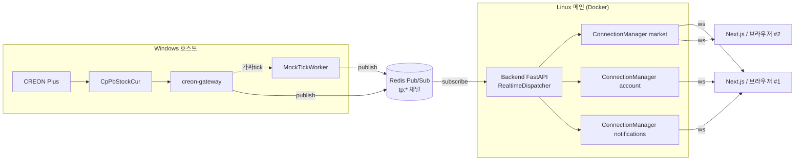

# TradePilot 실시간 WebSocket 가이드

> 문서 ID: 33_REALTIME_WEBSOCKET_GUIDE
> 버전: v1.0
> 작성자: BackendSenior
> 최종 수정일: 2026-05-13
> 검토자: DevLead, FrontendSenior, QA

본 문서는 TradePilot의 실시간 시세/체결/알림 WebSocket 채널의 아키텍처, 메시지 프로토콜,
재연결 정책, 부하 한도, 클라이언트 사용법을 정의한다. 구현체는 `backend/app/api/websocket/`,
`backend/app/integrations/creon/realtime_dispatcher.py`, `frontend/src/lib/realtime/`,
`frontend/src/hooks/useRealtime*.ts`에 위치한다.

관련 문서: `docs/13_api_requirements.md` §17, `docs/23_creon_gateway.md` §6.

---

## 1. 아키텍처



- 게이트웨이는 CREON COM 콜백을 받아 `tp:market.tick.<code>`, `tp:account.execution[.<uid>]`,
  `tp:notifications.<uid>` 채널로 publish.
- 백엔드 `RealtimeDispatcher`가 Redis Pub/Sub을 구독해 `ConnectionManager`로 라우팅.
- 종목별 broadcast는 `tp:market.tick.<code>` → `market` 매니저의 구독자에게만 전달.
- 사용자별 송신은 메시지 페이로드의 `user_id` (= JWT `sub`/`User.public_id`)로 라우팅.

---

## 2. 엔드포인트

| 경로 | 채널 매니저 | 종목 구독 | 메시지 종류 |
|---|---|---|---|
| `GET /ws/market` | market | 가능 (최대 50/연결) | `tick`, `subscribed`, `unsubscribed`, `pong`, `error` |
| `GET /ws/account` | account | 불가 | `execution`, `pong`, `error` |
| `GET /ws/notifications` | notifications | 불가 | `notification`, `pong`, `error` |

모든 엔드포인트는 인증 필수. 인증 실패 시 close code **1008 (Policy Violation)**.

### 2.1 인증 방식

두 가지 중 선택:

1. **Query string** (브라우저 친화):
   `wss://api.example.com/ws/market?token=<access_jwt>`

2. **첫 메시지 인증** (토큰을 URL에 노출 안 함):
   ```json
   {"type": "auth", "token": "<access_jwt>"}
   ```
   서버는 첫 메시지가 `type=auth`가 아니면 즉시 close.

JWT는 **access 토큰** (HS256, `type=access`). 만료된 토큰은 close 1008.

---

## 3. 메시지 프로토콜

### 3.1 공통 규칙
- 인코딩: UTF-8 JSON
- 키: snake_case
- 시간: ISO-8601 UTC (예: `"2026-05-13T13:30:01.123Z"`)
- 모든 메시지에 `type` 필드 필수
- 종목 코드: 6자리 숫자 문자열

### 3.2 클라이언트 → 서버

```json
// 인증 (path에 token 없을 때 첫 메시지)
{"type": "auth", "token": "eyJhbGc..."}

// 종목 구독 (market 채널)
{"type": "subscribe", "stock_codes": ["005930", "000660"]}

// 종목 구독 해제
{"type": "unsubscribe", "stock_codes": ["005930"]}

// 헬스체크
{"type": "ping", "ts": "2026-05-13T13:30:01.123Z"}
```

### 3.3 서버 → 클라이언트

```json
// 시세
{
  "type": "tick",
  "stock_code": "005930",
  "price": 71500,
  "volume": 120,
  "change": 300,
  "change_pct": 0.42,
  "ts": "2026-05-13T13:30:01.123Z"
}

// 체결
{
  "type": "execution",
  "order_id": "uuid",
  "broker_order_no": "12345678",
  "stock_code": "005930",
  "side": "BUY",
  "qty": 10,
  "price": 71500,
  "ts": "2026-05-13T13:30:02.000Z"
}

// 알림
{
  "type": "notification",
  "notification_id": 1234,
  "title": "BUY 시그널",
  "body": "삼성전자 70,500원 매수 시그널 발생",
  "severity": "INFO",
  "event_type": "SIGNAL",
  "payload": {"stock_code": "005930"},
  "ts": "2026-05-13T13:30:03.500Z"
}

// 구독 ack
{"type": "subscribed", "stock_codes": ["005930"], "total": 1}
{"type": "unsubscribed", "stock_codes": ["005930"], "total": 0}

// heartbeat 응답
{"type": "pong", "ts": "2026-05-13T13:30:00.000Z"}

// 에러 (연결은 유지)
{"type": "error", "code": "E0003", "message": "잘못된 종목 코드"}
```

---

## 4. 부하 한도 / 정책

| 항목 | 값 | 비고 |
|---|---:|---|
| 동시 연결 (사용자 합산) | 1,000 | 운영 단일 백엔드 인스턴스 기준 |
| 종목 구독 / 연결 | 50 | 초과 시 `E0021` error 메시지, 기존 구독은 유지 |
| 종목별 메시지 throttle | 100ms | 같은 종목 100ms 이내 추가 tick은 drop (서버측) |
| 연결당 송신 큐 cap | 1,000건 | 초과 시 oldest drop, `drop_count` 메트릭 누적 |
| 메시지율 권장 | 10/sec | 클라이언트 측 처리 가능 한계 |
| heartbeat | 30초 ping | 클라이언트가 보냄, 70초 pong 미수신 시 재연결 |
| 인증 실패 close code | 1008 | Policy Violation |
| 정상 종료 close code | 1000 | 클라이언트 close 시 |
| pong 타임아웃 close code | 4000 | 사용자 정의, 재연결 트리거 |

---

## 5. 재연결 / 오류 정책

### 5.1 클라이언트
- 1초부터 시작하여 지수 백오프 (1s, 2s, 4s, …, 최대 30s) + 0~500ms 지터.
- close code **1008 (정책 위반)** 또는 명시적 `client.close()` 호출 시 재연결 안 함.
- 재연결 성공 시 이전에 구독했던 종목 자동 재등록 (market 채널).
- pong 타임아웃 시 강제 close → 재연결 사이클 진입.

### 5.2 서버
- WebSocket send 실패 시 즉시 disconnect 처리.
- Redis 구독이 끊기면 0.5초 후 재구독 시도.
- 메시지 큐 cap 초과는 oldest drop (back-pressure 보호).
- 종목별 throttle 100ms는 `respect_throttle=True` 인 broadcast에만 적용. 사용자 직 송신(체결/알림)은 throttle 없음.

---

## 6. 클라이언트 사용 예제 (Next.js / React)

### 6.1 종목 시세 hook

```tsx
import { useRealtimeTick } from '@/hooks/useRealtimeTick';

function SamsungPrice() {
  const tick = useRealtimeTick('005930');
  if (!tick.price) return <span>대기중...</span>;
  return (
    <span>
      {tick.price.toLocaleString()} ({tick.changePct.toFixed(2)}%)
      {tick.isLive && <span className="dot live" />}
    </span>
  );
}
```

### 6.2 차트 실시간 갱신

```tsx
<CandlestickChart data={candles.data} realtime stockCode="005930" />
```

### 6.3 헤더 인디케이터

```tsx
import { RealtimeIndicator } from '@/components/ui/realtime-indicator';

<RealtimeIndicator />  // 점 + 라벨
<RealtimeIndicator showLabel={false} />  // 점만
```

체결/알림은 `RealtimeProvider`에서 자동 hook 마운트 (`useRealtimeExecution`,
`useRealtimeNotifications`)로 toast + TanStack Query 캐시 무효화가 동작한다.

---

## 7. Mock 모드 (개발/CI E2E)

`creon-gateway`의 `MOCK_TICK_ENABLED=true` 설정 시 (기본값) 게이트웨이가 mock
어댑터 사용 환경에서 1초마다 4개 기본 종목 + 어댑터에 구독된 종목들에 대해
랜덤 워크 가짜 tick을 publish한다. 백엔드 → 프론트 E2E 검증에 그대로 사용 가능.

기본 종목: `005930`, `000660`, `035420`, `035720`

---

## 8. 운영 체크리스트

- [ ] 백엔드 `/ws/market?token=...` 핸드셰이크 200
- [ ] `RealtimeDispatcher.stats()` 의 `messages_total` 가 증가
- [ ] Prometheus: `tradepilot_gateway_connected=1`
- [ ] 헤더 인디케이터 LIVE (녹색 펄스)
- [ ] 동시 100 클라이언트 부하 시 `drop_count` 0 유지
- [ ] LIVE 모드에서 pong 타임아웃 발생률 1% 미만

---

## 9. 변경 이력
| 버전 | 일자 | 작성자 | 내용 |
|---|---|---|---|
| v1.0 | 2026-05-13 | BackendSenior | 최초 작성 (3개 채널 + Mock tick worker) |
