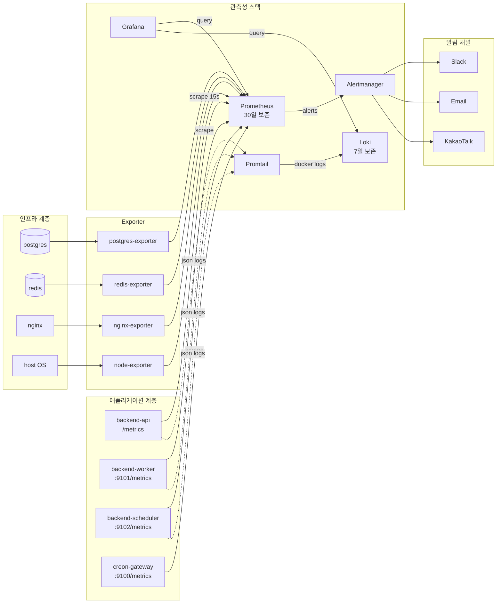

# TradePilot 관측성(Observability) 가이드

> 문서 ID: 45_OBSERVABILITY_GUIDE
> 버전: v1.0
> 작성자: DevLead
> 검토자: PM, BackendSenior, DBA, QA
> 최종 수정일: 2026-05-14

본 문서는 TradePilot 의 **메트릭/로그/알림 통합 관측 스택**의 아키텍처와 운영 절차를 정의한다. 매매 시스템 KPI 와 인프라 헬스를 단일 시점에서 추적하여 SEV-1/2 사고 발생 시 평균 탐지 시간(MTTD)을 5분 이내로 단축하는 것이 목표다.

---

## 1. 아키텍처

### 1.1 다이어그램



### 1.2 컴포넌트

| 컴포넌트 | 버전 | 보존 | 외부 노출 |
|---|---|---|---|
| Prometheus | v2.51 | 30일 / 10GB | X (사설망) |
| Alertmanager | v0.27 | - | X |
| Grafana | 10.4 | - | O (nginx 경유, TLS) |
| Loki | 2.9 | 7일 | X |
| Promtail | 2.9 | - | X |
| node-exporter | 1.7 | - | X |
| postgres-exporter | 0.15 | - | X |
| redis-exporter | 1.58 | - | X |
| nginx-exporter | 1.1 | - | X |

### 1.3 데이터 흐름 결정 사항

- **scrape_interval = 15s**: 일반 모니터링에 충분, 매매 핵심 지표는 별도 5s 잡 검토(향후).
- **메트릭 보존 30일**: 월별 회고와 SLA 보고에 필요한 최소치.
- **로그 보존 7일**: 단일 노드 디스크 부담 + 사고 분석 표준 윈도우.
- **장기 보존**: 30일 이상은 별도 S3 archive (수동 export, 비용 별도).

---

## 2. 메트릭 카탈로그

### 2.1 HTTP / 서비스 (백엔드 자체)

| 이름 | 타입 | 라벨 | 의미 |
|---|---|---|---|
| `http_requests_total` | Counter | method, endpoint, status | HTTP 요청 누적 수 |
| `http_request_duration_seconds` | Histogram | method, endpoint | HTTP 응답시간 분포 |
| `websocket_connections` | Gauge | channel | 활성 WS 연결 수(market/account/notifications) |

### 2.2 매매 KPI

| 이름 | 타입 | 라벨 | 의미 |
|---|---|---|---|
| `orders_submitted_total` | Counter | mode, side, result | 주문 제출 누적 (SIM/LIVE × BUY/SELL × success/failure) |
| `signals_generated_total` | Counter | strategy_id | 전략별 시그널 생성 누적 |
| `kill_switch_triggered_total` | Counter | source, result | Kill Switch 발동 누적 (user/system/security) |
| `live_mode_users` | Gauge | - | 현재 LIVE 모드 사용자 수 |
| `sim_mode_users` | Gauge | - | 현재 SIM 모드 사용자 수 |
| `daily_pnl_p50` / `_p95` / `_p05` | Gauge | - | 당일 PnL 분위 집계 |
| `pnl_users_below_threshold` | Gauge | threshold | 일일 손실 임계 초과 사용자 수 |
| `tradepilot_market_open` | Gauge | - | 장 개장 여부(룰 평가용) |

### 2.3 외부 연동 (Creon Gateway)

| 이름 | 타입 | 라벨 | 의미 |
|---|---|---|---|
| `creon_gateway_requests_total` | Counter | result | 게이트웨이 호출 누적 |
| `creon_gateway_requests_duration_seconds` | Histogram | operation | 호출 응답시간 분포 |
| `tradepilot_gateway_connected` | Gauge | - | COM 연결 상태 (게이트웨이 자체 노출) |
| `tradepilot_gateway_request_count_4s` | Gauge | - | 4초 윈도우 요청 수(한도 15) |
| `tradepilot_gateway_trade_env` | Gauge | - | 1=SIM, 2=REAL |

### 2.4 보안

| 이름 | 타입 | 라벨 | 의미 |
|---|---|---|---|
| `auth_failures_total` | Counter | reason | 인증 실패 누적 (invalid_credentials / invalid_token / expired / locked / mfa_failed) |
| `refresh_replay_detected_total` | Counter | - | refresh token 재사용 감지 (CRITICAL) |

### 2.5 인프라 (Exporter)

| Exporter | 주요 메트릭 |
|---|---|
| node-exporter | `node_cpu_seconds_total`, `node_memory_MemAvailable_bytes`, `node_filesystem_*`, `node_network_*` |
| postgres-exporter | `pg_stat_activity_count`, `pg_stat_activity_max_tx_duration`, `pg_settings_max_connections` |
| redis-exporter | `redis_memory_used_bytes`, `redis_commands_processed_total`, `redis_connected_clients` |
| nginx-exporter | `nginx_http_requests_total`, `nginx_connections_active`, `nginx_connections_waiting` |

### 2.6 카디널리티 보호 규칙

- **user_id 는 라벨 금지**. 사용자별 PnL/포지션은 집계 메트릭(percentile, count below threshold) 으로만 노출.
- **endpoint 는 라우트 패턴(`/orders/{id}`)** 으로 정규화. `metrics.py:normalize_endpoint()` 가 처리.
- **strategy_id 는 허용** (총 < 50개 가정). 100개 초과 시 라벨 압축 검토.

---

## 3. 대시보드

### 3.1 일람

| ID | 제목 | 용도 | 새로고침 |
|---|---|---|---|
| `tradepilot-service-health` | 01. 서비스 헬스 | API/Worker/Scheduler 상태, p50/95/99, 5xx 비율 | 30s |
| `tradepilot-trading-kpi` | 02. 매매 KPI | 주문/체결, 시그널, Kill Switch, PnL 분위 | 30s |
| `tradepilot-infrastructure` | 03. 인프라 | CPU/RAM/디스크/네트워크/postgres/redis | 30s |
| `tradepilot-security` | 04. 보안 | 인증 실패, JWT 검증 실패, refresh replay, RateLimit | 30s |

### 3.2 대시보드 추가 절차

1. Grafana UI 에서 대시보드 작성 후 JSON export.
2. `infra/observability/grafana/dashboards/NN_name.json` 으로 저장.
3. `disableDeletion: false` 가 설정되어 있으므로 PR 머지 시 자동 반영.
4. 백업: `bash scripts/backup-dashboards.sh` 로 일일 백업.

---

## 4. 알림 룰 카탈로그

### 4.1 분류

| 카테고리 | 파일 | 룰 수 | severity 분포 |
|---|---|---|---|
| service_health | `service_health.yml` | 9 | critical 6 / warning 3 |
| trading_kpi | `trading_kpi.yml` | 7 | critical 2 / warning 5 |
| infrastructure | `infrastructure.yml` | 11 | critical 4 / warning 7 |
| security | `security.yml` | 8 | critical 3 / warning 5 |
| **합계** | - | **35** | **critical 15 / warning 20** |

### 4.2 핵심 critical 알림

| Alert | 트리거 | 라우팅 |
|---|---|---|
| `BackendApiDown` | `up{job="backend-api"}==0 for 1m` | slack-critical + email |
| `CreonGatewayDown` | `up{job="creon-gateway"}==0 for 1m` | slack-critical + email |
| `CreonComDisconnected` | `tradepilot_gateway_connected==0 for 30s` | slack-critical + email |
| `OrderFailureRateHigh` | LIVE 실패율 > 5% for 3m | slack-critical + email |
| `KillSwitchTriggered` | 1분 내 발동 1건 이상 | slack-critical + email |
| `KillSwitchSecurityTriggered` | source=security 발동 | security-pager (Slack+email+kakao) |
| `RefreshTokenReplayDetected` | replay 1건 감지 | security-pager |
| `HostMemoryHigh` | RAM > 90% for 5m | slack-critical + email |
| `HostDiskCritical` | 디스크 < 5% for 1m | slack-critical + email |
| `PostgresDown` | postgres exporter down | slack-critical + email |
| `RedisDown` | redis exporter down | slack-critical + email |
| `AuthLoginFailureCritical` | 로그인 실패 > 100/min | security-pager |

### 4.3 라우팅 규칙

| 조건 | Receiver | repeat |
|---|---|---|
| `severity=critical` + `category=security` | `security-pager` (Slack+Email+Kakao) | 30분 |
| `severity=critical` | `slack-critical` + email | 1시간 |
| `severity=warning` | `slack-default` (5분 묶음) | 4시간 |
| `severity=info` | `slack-default` (30분 묶음) | 24시간 |

### 4.4 룰 수정 절차

1. `infra/observability/prometheus/rules/*.yml` 편집.
2. `bash infra/observability/scripts/seed-alert-rules.sh` 로 검증.
3. PR 생성 → DevLead 리뷰.
4. 머지 후 Prometheus reload: `curl -X POST http://prometheus:9090/-/reload`.

---

## 5. 로그 (Loki)

### 5.1 수집 대상

- 모든 `tp-*` 컨테이너 stdout (structlog JSON / nginx access).
- 시스템 syslog (옵션).

### 5.2 라벨 (인덱싱)

| 라벨 | 카디널리티 | 비고 |
|---|---|---|
| `service` | < 10 | tp-backend-api / tp-backend-worker / tp-nginx 등 |
| `role` | 3 | api / worker / scheduler |
| `level` | 5 | DEBUG/INFO/WARN/ERROR/CRITICAL |
| `compose_service` | < 10 | docker compose 서비스명 |
| `status` (nginx만) | < 20 | HTTP 상태 코드 |

> **주의**: `trace_id`, `request_id`, `user_id` 는 라벨로 인덱싱하지 않고 본문 보존(LogQL JSON 파싱으로 검색).

### 5.3 주요 LogQL 예시

```logql
# 에러 로그
{service=~"tp-backend.*", level="ERROR"} |= "kill_switch"

# trace_id 추적
{service="tp-backend-api"} | json | trace_id="abc-123-..."

# 응답시간 > 1초인 요청
{service="tp-nginx"} | regexp "duration=(?P<d>[0-9.]+)" | d > 1.0
```

### 5.4 DEBUG 로그 드랍

Promtail 파이프라인에서 `level=DEBUG` 는 drop. 로컬 개발 시에만 보임.

---

## 6. 운영 절차

### 6.1 일일 점검 (5분)

```bash
# 1) 스택 상태
docker compose -f infra/observability/docker-compose.observability.yml ps

# 2) 대시보드 4종 1차 확인
#    - 01_service_health: 모든 up==1
#    - 02_trading_kpi: 주문 실패율 < 5%
#    - 03_infrastructure: CPU/RAM/디스크 정상
#    - 04_security: 로그인 실패 burst 없음

# 3) Alertmanager 활성 알림
curl -s http://alertmanager:9093/api/v2/alerts | jq '.[] | .labels.alertname' | sort -u
```

### 6.2 주간 점검 (30분)

- [ ] 대시보드 JSON 백업 (`backup-dashboards.sh`)
- [ ] 룰 적중률 회고: false positive 가 많은 룰 임계 재조정
- [ ] Loki 디스크 사용량 (`du -sh /var/lib/docker/volumes/tradepilot_loki-data`)
- [ ] Prometheus tsdb 크기 (`docker exec tp-prometheus du -sh /prometheus`)

### 6.3 월간 점검 (1시간)

- [ ] 메트릭 카탈로그 갱신 (신규 메트릭 반영)
- [ ] 대시보드 사용 통계 (Grafana usage stats) 검토 후 미사용 패널 제거
- [ ] 알림 룰 카디널리티 검토 (`prometheus_engine_query_duration_seconds`)
- [ ] Grafana 사용자 권한 audit (`Org Admin` 최소화)

---

## 7. 보존 정책

| 데이터 | 보존 | 위치 | 백업 |
|---|---|---|---|
| Prometheus TSDB | 30일 | `prometheus-data` 볼륨 | 미백업 (재수집 가능) |
| Loki chunks | 7일 | `loki-data` 볼륨 | 미백업 (단기 데이터) |
| Grafana 대시보드 | 무기한 | `grafana-data` + JSON (Git) | 일일 export, Git 커밋 |
| Alertmanager silences | 자동만료 | `alertmanager-data` 볼륨 | 미백업 |
| 사고 시 보존 | 사고일+30일 | 별도 export (S3) | 수동 보존 (SEV-1/2) |

---

## 8. 비용 추정 (운영 환경, 1대 호스트 기준)

| 항목 | 추정 |
|---|---|
| CPU | 1 vCPU avg, 2 vCPU peak |
| RAM | 1.5GB (Prometheus 800MB + Grafana 250MB + Loki 300MB + Promtail 150MB) |
| 디스크 | 12GB (Prometheus 10GB + Loki 1.5GB + 메타 0.5GB) |
| 네트워크 | scrape 트래픽 ~1MB/min, 로그 ~10MB/min |
| 클라우드 (소형) | $20 ~ $30/월 (AWS t3.small + 30GB gp3) |

> 추후 트래픽 증가(다중 인스턴스) 시 Prometheus remote_write → Thanos/Mimir 검토.

---

## 9. 보안 고려

- Grafana admin 패스워드는 `.env` 의 `GRAFANA_ADMIN_PASSWORD` 로 주입. placeholder 값(`admin`, `password`, `change*` 등)이면 `up.sh` 가 기동 차단.
- Prometheus/Loki/Alertmanager 는 외부 노출 금지. 모든 외부 접근은 Grafana 만 nginx 경유.
- `/metrics` 엔드포인트는 nginx 의 사설망 화이트리스트로 보호 (`infra/nginx/conf.d/tradepilot.conf:103-115`).
- Prometheus 컨테이너 `user: nobody`, Grafana `user: 472` 로 최소 권한.
- 분석 정보 외부 전송 비활성화 (`GF_ANALYTICS_REPORTING_ENABLED=false`, `analytics.reporting_enabled=false`).
- 알림 webhook URL 은 `.env` 비밀로 관리, 코드 리포지토리에 평문 금지.

---

## 10. 향후 작업 (Backlog)

| 우선순위 | 항목 | 비고 |
|---|---|---|
| P1 | OpenTelemetry 분산 추적 (Tempo 도입) | trace_id 점프 활성화 |
| P1 | Worker/Scheduler 자체 `/metrics` 서버 구현 | BackendSenior 작업 |
| P2 | Remote_write → Thanos | 다중 인스턴스 확장 시 |
| P2 | Slack webhook → PagerDuty 대체 | SEV-1 호출 강화 시 |
| P3 | SLO 기반 burn rate alert | error_budget 도입 시 |
| P3 | Grafana 익명 read-only 뷰 (사용자 노출용) | 마케팅 페이지 KPI |

---

## 11. 변경 이력

| 버전 | 일자 | 작성자 | 내용 |
|---|---|---|---|
| v1.0 | 2026-05-14 | DevLead | 최초 작성 - Prometheus/Grafana/Loki/Alertmanager 스택 구축 |
