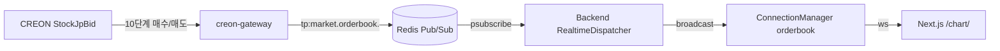

# TradePilot 실시간 호가창 (Level 2) 가이드

> 문서 ID: 47_ORDERBOOK_GUIDE
> 버전: v1.0
> 작성자: BackendSenior
> 최종 수정일: 2026-05-14
> 검토자: DevLead, FrontendSenior, QA

본 문서는 CREON `StockJpBid` 기반 실시간 호가창(매수/매도 10단계) 기능의 데이터 흐름,
메시지 프로토콜, 부하 한도, UI 사양을 정의한다.

관련 문서:
- `docs/33_realtime_websocket_guide.md` §1, §3 (전체 실시간 채널 아키텍처)
- `docs/23_creon_gateway.md` §6 (Redis 채널 규약)
- `docs/13_api_requirements.md` §17

---

## 1. 아키텍처



- 게이트웨이가 CREON `StockJpBid` 콜백/BlockRequest로 매수 10단계 + 매도 10단계 호가를 수신.
- Mock 어댑터/Mock 워커는 동일 채널로 deterministic 데이터를 1초마다 발행.
- 백엔드 `RealtimeDispatcher`가 `tp:market.orderbook.*` 패턴을 psubscribe → 종목별 broadcast.
- 시세(`/ws/market`)와 호가(`/ws/orderbook`)는 **별도 채널/별도 ConnectionManager**로 부하 격리.

---

## 2. 메시지 프로토콜

### 2.1 Redis 채널

| 채널 | 발행자 | 페이로드 |
|---|---|---|
| `tp:market.orderbook.<code>` | creon-gateway / MockOrderbookWorker | `{stock_code, bids, asks, total_bid_qty, total_ask_qty, ts, source}` |

페이로드 예시:

```json
{
  "stock_code": "005930",
  "bids": [[71200, 5430], [71150, 12300], [71100, 8500], "..."],
  "asks": [[71250, 4200], [71300, 9800], [71350, 6100], "..."],
  "total_bid_qty": 84500,
  "total_ask_qty": 73200,
  "source": "creon",
  "ts": "2026-05-14T01:23:45.678+00:00"
}
```

- `bids`/`asks`는 항상 10단계 (`[[price, qty], ...]`)
- index 0이 최우선 호가 (매수=가장 높은 가격, 매도=가장 낮은 가격)

### 2.2 WebSocket 채널

| 경로 | 설명 |
|---|---|
| `GET /ws/orderbook` | 실시간 호가창 |

서버 → 클라이언트 (`OrderbookMessage`):

```json
{
  "type": "orderbook",
  "stock_code": "005930",
  "bids": [[71200, 5430], ...],
  "asks": [[71250, 4200], ...],
  "total_bid_qty": 84500,
  "total_ask_qty": 73200,
  "ts": "2026-05-14T01:23:45.678+00:00"
}
```

클라이언트 → 서버 메시지는 `/ws/market`과 동일 (`auth`, `subscribe`, `unsubscribe`, `ping`).

---

## 3. 부하 한도

| 항목 | 값 | 비고 |
|---|---|---|
| 종목당 broadcast throttle | **200ms** | 시세(100ms) 대비 2배 - 호가가 더 빈번 변경 |
| 사용자(연결)당 최대 구독 종목 수 | **30종목** | 시세 채널 50개와 별개 카운트 |
| 종목당 동시 구독자 한도 | **50명** | `MAX_SUBSCRIBERS_PER_STOCK` 정책 (게이트웨이 부하 보호) |
| 연결당 송신 큐 cap | **1000건** | 초과 시 oldest drop (`drop_count` 증가) |
| Pub/Sub 패턴 | `tp:market.orderbook.*` | 게이트웨이/백엔드 모두 동일 |

부하 격리 원칙:
- `market_manager`와 `orderbook_manager`는 **별개 ConnectionManager 인스턴스**.
- 메시지 라우팅도 분리되어 한 채널 폭주가 다른 채널에 영향 없음.

---

## 4. UI 사양

### 4.1 컴포넌트

- `frontend/src/components/orderbook/OrderBook.tsx` - 매수/매도 10단계 호가창 본체
- `frontend/src/components/orderbook/OrderBookRow.tsx` - 호가 1단계 row
- `frontend/src/components/orderbook/OrderBookHeader.tsx` - 컬럼 헤더

### 4.2 표시 규칙

- 매도 10 → 매도 1 (상단, 가격 내림차순)
- 매수 1 → 매수 10 (하단, 가격 내림차순)
- **색상 (한국 시장 표준)**: 매수=빨강(`.text-up`), 매도=파랑(`.text-down`)
- **누적 잔량 막대**: 각 호가 행 배경에 잔량/최대잔량 비율로 막대 표시
  - 매수=오른쪽→왼쪽, 매도=왼쪽→오른쪽 정렬
- **최우선 호가(1단계) 강조**: `fw-semibold`

### 4.3 인터랙션

- **호가 가격 클릭** → 차트 페이지의 가격 상태(`price`) 자동 갱신
  → 빠른 주문 패널 / OrderModal에 `defaultPrice`로 전달
- 키보드 접근성: 행에 `tabIndex={0}`, Enter/Space로 가격 적용
- ARIA: `role="table"` / `role="rowgroup"` / `role="row"` + `aria-label`

### 4.4 반응형

| 화면 폭 | 레이아웃 |
|---|---|
| ≥ 1280px | 3컬럼 (차트 / 호가창 260px / 주문패널 320px) |
| 1024~1279px | 2컬럼 (차트 / 우측에 호가창+주문패널 320px) |
| ≤ 1024px | 1컬럼 (위→아래: 차트, 호가창, 주문패널) |

---

## 5. Hook & Client

### `useRealtimeOrderbook(stockCode)`

`frontend/src/hooks/useRealtimeOrderbook.ts`

- 마운트 시 `/ws/orderbook` 연결 + `stockCode` 구독, 언마운트 시 listener 해제.
- 반환: `{ bids, asks, totalBidQty, totalAskQty, ts, isLive }`
- 환경변수 `NEXT_PUBLIC_USE_MOCK=true` 시 client 연결 없이 1초마다 deterministic mock 발행.

### `getOrderbookClient()`

`frontend/src/lib/realtime/orderbook-channel.ts`

- `/ws/orderbook` 전용 싱글톤 RealtimeClient (시세 client와 분리).
- 자동 재연결/heartbeat은 `ws-client.ts`와 동일.

---

## 6. REST 스냅샷 API

`GET /api/v1/stocks/{code}/orderbook`

응답 (`OrderbookOut`):

```json
{
  "success": true,
  "data": {
    "code": "005930",
    "bids": [{"price": 71200, "qty": 5430}, ...],
    "asks": [{"price": 71250, "qty": 4200}, ...],
    "ts": "2026-05-14T01:23:45.678+00:00"
  }
}
```

흐름:
1. Redis 캐시(`tp:cache:orderbook:<code>`, TTL=1초) 조회
2. 캐시 미스 → CREON 게이트웨이 `/market/orderbook/{code}` 호출
3. 게이트웨이 실패 → 일봉 종가 기반 mock fallback (서비스 가용성 확보)

---

## 7. Mock / 개발 모드

| 환경 | 동작 |
|---|---|
| `CREON_USE_MOCK=true` + `MOCK_TICK_ENABLED=true` | 게이트웨이가 `MockOrderbookWorker`로 1초마다 호가창 publish |
| `NEXT_PUBLIC_USE_MOCK=true` | 프론트엔드 hook이 client 연결 없이 mock 호가 1초 갱신 |

Mock 호가의 결정성:
- 종목 코드 해시로 기준가 결정 → 같은 종목은 동일 잔량 분포 시드
- 1단계 호가 잔량이 가장 크고, 단계가 멀어질수록 작아짐 (실제 시장 분포 근사)

---

## 8. 부하/장애 시나리오

| 시나리오 | 동작 |
|---|---|
| CREON 게이트웨이 단절 | REST는 일봉 기반 mock fallback / WS는 새 호가 미수신 (마지막 상태 유지) |
| Redis 단절 | 디스패처가 자동 재구독 (1초 backoff), 그동안 WS 클라이언트는 마지막 호가 표시 |
| 클라이언트 큐 폭주 | oldest drop (`drop_count` 증가), Prometheus 메트릭 확인 |
| 동일 사용자 31번째 종목 구독 | `E0021` 에러 (구독 한도 초과) |
| 종목당 51번째 사용자 구독 | `E0022` 에러 (종목당 동시 구독자 한도 도달) |

---

## 9. 변경 이력

| 일자 | 버전 | 작성자 | 변경 내용 |
|---|---|---|---|
| 2026-05-14 | v1.0 | BackendSenior | 초안 (CREON `StockJpBid` 실시간 호가창 통합) |
