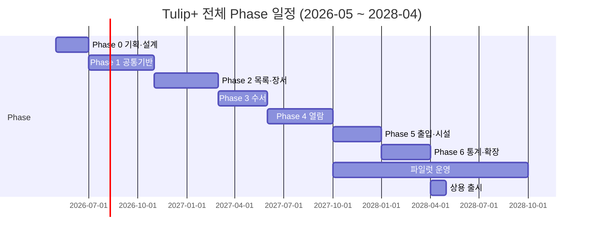
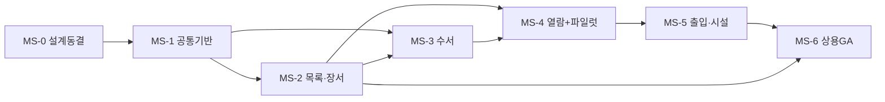
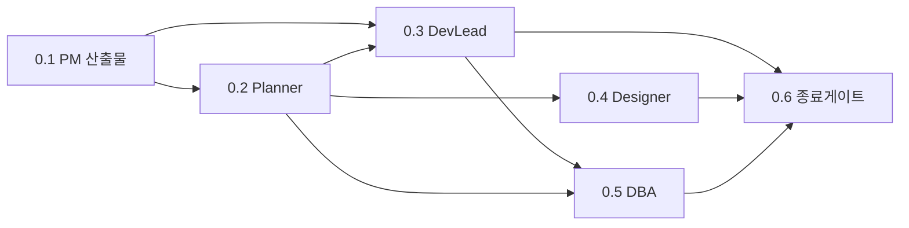

# 마일스톤 & WBS (Work Breakdown Structure)

| 항목 | 내용 |
|---|---|
| 프로젝트명 | Tulip+ 도서관통합관리시스템 |
| 문서 버전 | v0.1 Draft |
| 작성일 | 2026-05-11 |
| 작성자 | PM Agent |
| 관련 문서 | `01_project_charter.md`, `03_risk_register.md`, `04_communication_plan.md` |

---

## 1. 전체 일정 개요 (Macro Timeline)

| Phase | 기간 | 시작 | 종료 | 핵심 산출물 |
|---|---|---|---|---|
| Phase 0 — 기획·설계 | 2개월 | 2026-05 | 2026-06 | 헌장·WBS·요구사항·아키텍처·DB설계·디자인시스템 |
| Phase 1 — 공통기반 | 4개월 | 2026-07 | 2026-10 | 멀티테넌트·인증·권한·공통API·UI프레임 |
| Phase 2 — 목록·장서 | 4개월 | 2026-11 | 2027-02 | KORMARC 편목, Z39.50, 장서관리 |
| Phase 3 — 수서 | 3개월 | 2027-03 | 2027-05 | 발주·검수·예산·희망도서 |
| Phase 4 — 열람 | 4개월 | 2027-06 | 2027-09 | 대출·반납·예약·SIP2/NCIP |
| Phase 5 — 출입·시설 | 3개월 | 2027-10 | 2027-12 | 게이트·EAS·좌석·시설 예약 |
| Phase 6 — 통계·확장 | 3개월 | 2028-01 | 2028-03 | 대시보드·통계·외부 표준 인증 |

---

## 2. 마일스톤 정의

| MS ID | 마일스톤명 | 목표일 | 완료 기준 (Definition of Done) | 검증 책임 |
|---|---|---|---|---|
| **MS-0** | Phase 0 완료 — 설계 동결 | 2026-06-30 | 헌장 승인, WBS 승인, 요구사항 명세 v1.0, 아키텍처 설계서, DB 논리설계, 디자인시스템 v1.0, 리스크 등록부 v1.0 | PM (스폰서 승인) |
| **MS-1** | Phase 1 완료 — 공통기반 GA | 2026-10-31 | 멀티테넌트·인증·권한·공통API 통합테스트 통과, 부하 테스트 통과, QA 보고서 | DevLead + QA |
| **MS-2** | Phase 2 완료 — 목록·장서 GA | 2027-02-28 | KORMARC 입출력 100% 호환 시험 통과, Z39.50 검색·복사편목 동작, 장서 입고~제적 시나리오 통과 | DevLead + QA |
| **MS-3** | Phase 3 완료 — 수서 GA | 2027-05-31 | 발주~검수~예산 마감 시나리오 통과, 희망도서 워크플로 통과 | DevLead + QA |
| **MS-4** | Phase 4 완료 — 열람 GA + 파일럿 오픈 | 2027-09-30 | 대출·반납·예약·연체료 시나리오 통과, SIP2 자가대출반납기 1종 이상 호환 시험 통과, 파일럿 1개 기관 오픈 | PM + 고객 |
| **MS-5** | Phase 5 완료 — 출입·시설 GA | 2027-12-31 | 출입 게이트 연계, EAS 도난방지 트리거, 좌석발권, 시설예약 시나리오 통과 | DevLead + QA |
| **MS-6** | Phase 6 완료 — 상용 GA | 2028-03-31 | 통계·리포트, KOLIS-NET 정식 연계 인증, 10개 기관 도입 준비 완료 | PM (스폰서 승인) |

### 2.1 마일스톤별 의존성

> **크리티컬 패스**: MS-0 → MS-1 → MS-2 → MS-4 → MS-5 → MS-6 (목록·장서, 열람, 출입·시설은 직렬 의존)

---

## 3. WBS — 3레벨 분해

### 3.1 Phase 0 — 기획·설계 (상세 분해)

> Phase 0은 현재 진행 단계로, PM·Planner·DevLead·Designer·DBA 산출물 기준 상세 분해한다.

| WBS ID | 작업명 | 담당 | 산출물 | 기간 | 의존성 |
|---|---|---|---|---|---|
| **0.1** | **PM 산출물** | PM | — | 2주 | — |
| 0.1.1 | 프로젝트 헌장 작성 | PM | 01_project_charter.md | 3d | — |
| 0.1.2 | 마일스톤 & WBS 작성 | PM | 02_milestones_wbs.md | 3d | 0.1.1 |
| 0.1.3 | 리스크 등록부 초안 | PM | 03_risk_register.md | 3d | 0.1.1 |
| 0.1.4 | 커뮤니케이션 플랜 | PM | 04_communication_plan.md | 2d | 0.1.1 |
| 0.1.5 | 스폰서 검토·승인 | PM | 승인서 | 2d | 0.1.1~0.1.4 |
| **0.2** | **Planner 산출물** | Planner | — | 5주 | 0.1.5 |
| 0.2.1 | 도서관 유형별 업무 요구사항 인터뷰·정리 | Planner | 요구사항 정의서 | 1w | — |
| 0.2.2 | 6개 도메인 기능 명세 (수서/목록/열람/장서/출입/시설) | Planner | 기능명세서 v1.0 | 2w | 0.2.1 |
| 0.2.3 | 화면 흐름도·메뉴 구조도 | Planner | 화면정의서 | 1w | 0.2.2 |
| 0.2.4 | API 요구사항 정의서 | Planner | API 요구사항서 | 1w | 0.2.2 |
| **0.3** | **DevLead 산출물** | DevLead | — | 5주 | 0.2.1 |
| 0.3.1 | 멀티테넌트 아키텍처 설계 (격리 전략) | DevLead | 아키텍처설계서 | 1w | — |
| 0.3.2 | MSA 도메인 경계·서비스 분할 | DevLead | 서비스맵 | 1w | 0.3.1 |
| 0.3.3 | API 설계 규약 (공통 요청/응답·에러코드) | DevLead | API 표준서 | 3d | 0.3.1 |
| 0.3.4 | 인증·권한 표준 (OAuth2/JWT/RBAC) | DevLead | 인증설계서 | 3d | 0.3.1 |
| 0.3.5 | 외부 표준 연계 아키텍처 (KORMARC/Z39.50/SIP2) | DevLead | 연계설계서 | 1w | 0.3.2 |
| 0.3.6 | CI/CD·환경 구성 표준 | DevLead | DevOps 표준서 | 3d | 0.3.1 |
| 0.3.7 | 코딩·테스트·리뷰 표준 | DevLead | 개발 가이드라인 | 3d | — |
| **0.4** | **Designer 산출물** | Designer | — | 5주 | 0.2.3 |
| 0.4.1 | 디자인 시스템 v1.0 (색상·타이포·컴포넌트) | Designer | 디자인시스템 | 2w | — |
| 0.4.2 | 도서관 관리자 화면 와이어프레임 | Designer | 와이어프레임 | 1w | 0.2.3 |
| 0.4.3 | OPAC·이용자 화면 와이어프레임 | Designer | 와이어프레임 | 1w | 0.2.3 |
| 0.4.4 | HTML/CSS 퍼블리싱 (공통 레이아웃·핵심 화면 10종) | Designer | HTML/CSS | 2w | 0.4.1 |
| **0.5** | **DBA 산출물** | DBA | — | 4주 | 0.3.1 |
| 0.5.1 | 멀티테넌트 데이터 격리 전략 (Row vs Schema) | DBA | 격리설계서 | 1w | 0.3.1 |
| 0.5.2 | 6개 도메인 논리 데이터 모델 (ERD) | DBA | 논리ERD | 2w | 0.2.2 |
| 0.5.3 | 핵심 테이블 물리 설계·인덱스 전략 | DBA | 물리설계서 | 1w | 0.5.2 |
| 0.5.4 | KORMARC 저장 모델 설계 (정형 + JSONB 하이브리드) | DBA | KORMARC 스키마 | 1w | 0.5.2 |
| 0.5.5 | HA·백업·DR 전략 | DBA | DR 계획서 | 3d | 0.5.1 |
| **0.6** | **Phase 0 종료 게이트** | PM | — | 1w | 0.1~0.5 |
| 0.6.1 | 통합 검토 워크숍 | 전 팀 | 검토 보고서 | 2d | — |
| 0.6.2 | 설계 동결 (Baseline) | PM | Baseline v1.0 | 1d | 0.6.1 |
| 0.6.3 | Phase 1 킥오프 준비 | PM | 킥오프 자료 | 2d | 0.6.2 |

#### Phase 0 의존성 그래프

### 3.2 Phase 1 — 공통기반 (4개월)

| WBS ID | 작업명 | 담당 | 기간 |
|---|---|---|---|
| **1.1** | **인프라·DevOps** | DevLead + BackendSenior | 3w |
| 1.1.1 | 클라우드 환경 셋업 (Dev/Stg/Prod) | DevLead | 1w |
| 1.1.2 | Docker Compose / Kubernetes 구성 | DevLead | 1w |
| 1.1.3 | CI/CD 파이프라인 (GitHub Actions) | DevLead | 1w |
| **1.2** | **멀티테넌트 기반** | BackendSenior + DBA | 5w |
| 1.2.1 | tenant_id 기반 데이터 격리 구현 | BackendSenior | 2w |
| 1.2.2 | 테넌트 컨텍스트(요청 인터셉터) | BackendSenior | 1w |
| 1.2.3 | 테넌트 관리 콘솔 API | BackendDev | 1w |
| 1.2.4 | 테넌트별 정책·브랜딩 모델 | BackendDev | 1w |
| **1.3** | **인증·권한** | BackendSenior | 4w |
| 1.3.1 | OAuth2/JWT 발급·검증 | BackendSenior | 2w |
| 1.3.2 | RBAC 권한 모델 (사서/이용자/관리자) | BackendSenior | 1w |
| 1.3.3 | 외부 인증 연계 (학사정보, 행안부) - 골격 | BackendDev | 1w |
| **1.4** | **공통 API·라이브러리** | DevLead + BackendSenior | 3w |
| 1.4.1 | 공통 응답/에러 모델 | BackendSenior | 1w |
| 1.4.2 | 페이징·검색·정렬 표준 | BackendSenior | 1w |
| 1.4.3 | 감사 로그·이벤트 발행 | BackendSenior | 1w |
| **1.5** | **UI 프레임워크** | FrontendSenior | 5w |
| 1.5.1 | Next.js 프로젝트 셋업 + 공통 레이아웃 | FrontendSenior | 1w |
| 1.5.2 | 인증·라우팅·권한 가드 | FrontendSenior | 1w |
| 1.5.3 | 공통 컴포넌트 라이브러리 v1 | FrontendSenior | 2w |
| 1.5.4 | TanStack Query·API 클라이언트 | FrontendSenior | 1w |
| **1.6** | **테스트·릴리스** | QA + PM | 2w |
| 1.6.1 | 통합 테스트 시나리오·자동화 | QA | 1w |
| 1.6.2 | 부하 테스트 (멀티테넌트) | QA + DBA | 1w |

> **Phase 1 핵심 디펜던시**: 1.2(멀티테넌트) → 1.3(인증) → 1.4(공통API). 1.5(UI)는 1.4 완료 후 진입.

### 3.3 Phase 2 — 목록·장서 (4개월)

| WBS ID | 작업명 | 담당 | 기간 |
|---|---|---|---|
| **2.1** | KORMARC 데이터 모델·파서·편집기 | BackendSenior + DBA | 4w |
| **2.2** | MARC21 호환·변환 | BackendSenior | 2w |
| **2.3** | Z39.50 외부 검색·복사편목 | BackendSenior | 3w |
| **2.4** | 권위제어 (저자/주제) | BackendDev | 2w |
| **2.5** | 분류·청구기호·라벨 | BackendDev | 2w |
| **2.6** | 장서 등록·이관·폐기·점검 | BackendDev | 3w |
| **2.7** | 손망실·정정·재고 | BackendDev | 2w |
| **2.8** | UI: 편목 화면 (3pane 에디터) | FrontendSenior | 3w |
| **2.9** | UI: 장서 관리 화면 | FrontendDev | 2w |
| **2.10** | QA·통합 테스트 | QA | 2w |

> **Phase 2 핵심 디펜던시**: 2.1(KORMARC 코어) → 2.2~2.4. 2.6(장서)은 2.1 완료 후 진입. 편목 UI(2.8)는 KORMARC 모델 확정 후.

### 3.4 Phase 3 — 수서 (3개월)

| WBS ID | 작업명 | 담당 | 기간 |
|---|---|---|---|
| **3.1** | 예산 관리·회계연도 | BackendDev | 2w |
| **3.2** | 발주서·공급사·계약 | BackendDev | 2w |
| **3.3** | 입수·검수·정산 | BackendSenior | 3w |
| **3.4** | 희망도서 수집·승인 워크플로 | BackendDev | 2w |
| **3.5** | 연속간행물(시리얼) 발주 | BackendSenior | 2w |
| **3.6** | UI: 수서 화면 | FrontendDev | 3w |
| **3.7** | QA·통합 테스트 | QA | 2w |

> **Phase 3 핵심 디펜던시**: Phase 2의 목록 데이터 모델 필수. 3.3(입수)에서 목록 자동 생성 연계.

### 3.5 Phase 4 — 열람 (4개월)

| WBS ID | 작업명 | 담당 | 기간 |
|---|---|---|---|
| **4.1** | 회원 관리·등급·제한 정책 | BackendDev | 2w |
| **4.2** | 대출·반납·연장 | BackendSenior | 3w |
| **4.3** | 예약·우선순위·통보 | BackendSenior | 2w |
| **4.4** | 연체·연체료·이용제한 | BackendDev | 2w |
| **4.5** | 상호대차 (분관 간) | BackendSenior | 3w |
| **4.6** | SIP2 / NCIP 게이트웨이 (자가대출반납기) | BackendSenior | 3w |
| **4.7** | OPAC 통합검색 화면 | FrontendSenior | 3w |
| **4.8** | UI: 대출·반납·예약 화면 | FrontendDev | 3w |
| **4.9** | QA·하드웨어 호환성 시험 | QA | 3w |
| **4.10** | 파일럿 1개 기관 오픈 | PM | 2w |

> **Phase 4 핵심 디펜던시**: Phase 2의 장서·KORMARC 필수. 4.6(SIP2)는 외부 하드웨어 벤더 협조 필요.

### 3.6 Phase 5 — 출입·시설 (3개월)

| WBS ID | 작업명 | 담당 | 기간 |
|---|---|---|---|
| **5.1** | 출입게이트 연계 (Wiegand/Modbus 등) | BackendSenior | 3w |
| **5.2** | 출입로그·통계 | BackendDev | 2w |
| **5.3** | 시간대·자격별 출입 정책 | BackendDev | 2w |
| **5.4** | EAS 도난방지 연계 | BackendSenior | 2w |
| **5.5** | 열람실·좌석발권 | BackendDev | 3w |
| **5.6** | 세미나실·미디어실 예약 | BackendDev | 2w |
| **5.7** | UI: 출입·시설 화면 | FrontendDev | 3w |
| **5.8** | QA·하드웨어 호환성 시험 | QA | 2w |

### 3.7 Phase 6 — 통계·확장 (3개월)

| WBS ID | 작업명 | 담당 | 기간 |
|---|---|---|---|
| **6.1** | 통계 데이터 마트·집계 배치 | BackendSenior + DBA | 3w |
| **6.2** | 대시보드 (대출·장서·이용자·시설) | FrontendSenior | 4w |
| **6.3** | 표준 리포트 (월·연 보고) | BackendDev | 2w |
| **6.4** | KOLIS-NET 정식 연계 인증 | BackendSenior + PM | 4w |
| **6.5** | DLS·KERIS 연계 인증 | BackendSenior + PM | 3w |
| **6.6** | 도서관 유형별 패키지 분리 | DevLead | 2w |
| **6.7** | 상용 출시 준비 (운영 매뉴얼·계약 템플릿) | PM | 2w |

---

## 4. WBS 도메인 × Phase 매트릭스 (요약)

| 도메인 \\ Phase | P0 | P1 | P2 | P3 | P4 | P5 | P6 |
|---|---|---|---|---|---|---|---|
| 공통기반 | 설계 | **구현** | 보강 | 보강 | 보강 | 보강 | 운영 |
| 목록 | 설계 | - | **구현** | 연계 | 연계 | - | 통계 |
| 장서 | 설계 | - | **구현** | 연계 | 연계 | - | 통계 |
| 수서 | 설계 | - | - | **구현** | - | - | 통계 |
| 열람 | 설계 | - | - | - | **구현** | - | 통계 |
| 출입 | 설계 | - | - | - | - | **구현** | 통계 |
| 시설 | 설계 | - | - | - | - | **구현** | 통계 |

---

## 5. 진척 관리 방법

- **주간 진척 보고**: PM이 WBS 기준 작업단위별 % 진척 집계 (매주 금요일).
- **Phase 종료 게이트**: 각 Phase 종료 시점에 PM·DevLead·QA가 DoD 충족 여부 확인 후 PM이 다음 Phase 진입 승인.
- **변경관리**: WBS 변경은 PM 승인 (3일 이상 일정 영향 시 스폰서 통보).
- **버퍼**: 각 Phase 끝에 10% 버퍼(예: 4개월 Phase는 약 2주 버퍼)를 두어 리스크 대응.

---

## 6. 다음 갱신 시점
- **v0.2**: Phase 0 종료 시 (2026-06-30) — 실제 진척 반영 및 Phase 1 WBS 상세화.
- **v1.0**: Phase 1 킥오프 시점에 Baseline 동결.
