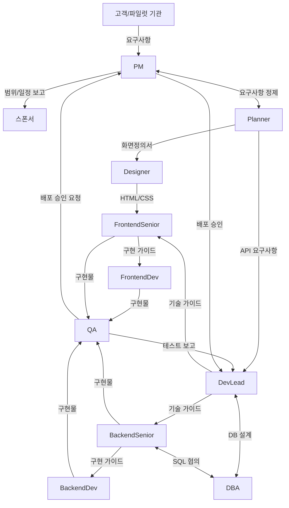
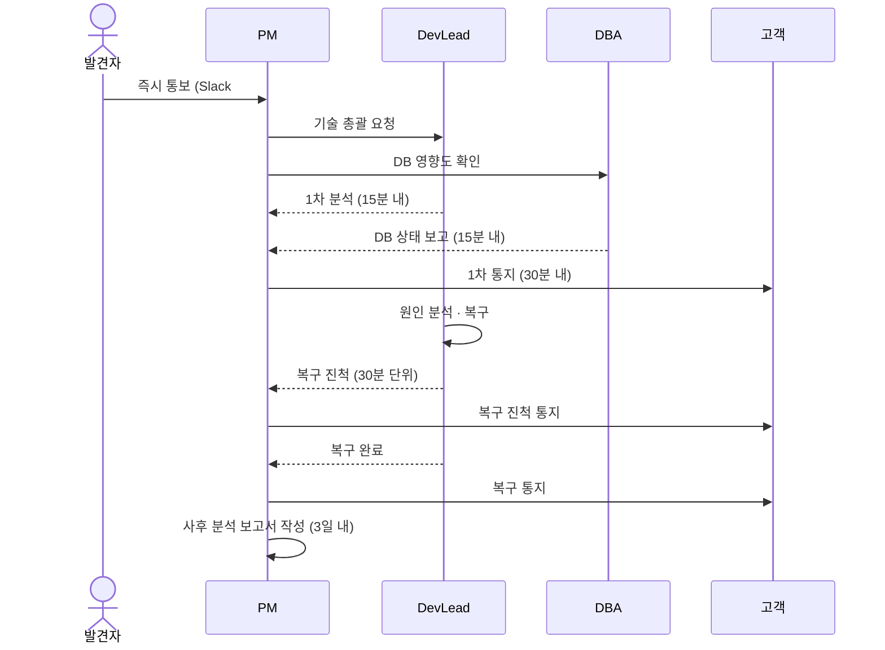
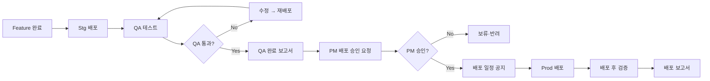

# 커뮤니케이션 · 거버넌스 플랜

| 항목 | 내용 |
|---|---|
| 프로젝트명 | Tulip+ 도서관통합관리시스템 |
| 문서 버전 | v0.1 Draft |
| 작성일 | 2026-05-11 |
| 작성자 | PM Agent |
| 관련 문서 | `01_project_charter.md`, `02_milestones_wbs.md`, `03_risk_register.md` |

---

## 1. 목적

본 문서는 Tulip+ 프로젝트에서 발생하는 모든 정보 흐름·의사결정·이슈 대응을 일관된 절차로 운영하기 위한 거버넌스 표준을 정의한다. CLAUDE.md에 정의된 멀티에이전트 협업 흐름을 본 프로젝트 운영에 맞게 구체화한다.

---

## 2. 정기 회의체

### 2.1 회의체 요약

| 회의체 | 주기 | 시간 | 주관 | 필수 참석 | 선택 참석 | 목적 |
|---|---|---|---|---|---|---|
| **일일 스탠드업** | 매일 | 15분 | DevLead | 전 개발자, QA | PM | 진척·블로커 공유 |
| **주간 진행회의** | 주 1회 (금) | 60분 | PM | PM, DevLead, Planner, QA, Designer | DBA, Senior | 주간 진척·이슈·다음주 계획 |
| **격주 운영위** | 격주 | 60분 | PM | PM, 스폰서, DevLead | Planner, QA | 마일스톤·리스크·범위 결정 |
| **격주 리스크 리뷰** | 격주 | 30분 | PM | PM, DevLead, DBA, QA | Planner | 리스크 등록부 갱신 |
| **스프린트 계획** | 2주 1회 | 90분 | DevLead | 전 개발자 | PM | 백로그 → 스프린트 |
| **스프린트 리뷰** | 2주 1회 | 60분 | DevLead | 전 개발자, QA, Planner | PM | 산출물 데모·피드백 |
| **스프린트 회고** | 2주 1회 | 45분 | DevLead | 전 개발자, QA | - | 프로세스 개선 |
| **고객(파일럿) 미팅** | 주 1회 | 60분 | PM | PM, Planner | DevLead, QA | 요구사항·UAT·피드백 |
| **DB 설계 리뷰** | 주 1회 | 45분 | DBA | DBA, BackendSenior | DevLead | 쿼리·인덱스·데이터 모델 |
| **Phase 종료 게이트** | Phase 종료 시 | 180분 | PM | 전 팀 + 스폰서 | - | DoD 검증·다음 Phase 승인 |
| **장애 대응 회의** | 발생 시 | - | PM | 발생 영역 관련자 전원 | - | Sev1·Sev2 장애 대응 |

### 2.2 회의 운영 원칙
- 모든 정기 회의는 **고정 시간·고정 참석자**로 운영한다.
- 회의록은 회의 종료 후 24시간 내 작성 및 공유 의무.
- 의사결정 사항은 회의록에 명시 (결정자·근거·후속 액션).
- 30분 이상 회의에는 사전 안건이 24시간 전 공유되어야 한다.
- 안건 없는 회의는 PM 판단 하에 취소 가능.

---

## 3. 보고 라인 (CLAUDE.md 협업 흐름 구체화)

### 3.1 협업 흐름도



### 3.2 정보 흐름별 보고 라인

| 정보 유형 | 발신 | 수신 | 매체 | 주기 |
|---|---|---|---|---|
| 고객 요구사항 | 고객 | PM | 이메일/미팅 | 수시 |
| 요구사항 정제 결과 | PM | Planner | 회의/Notion | 주 1회 |
| 기능 명세 | Planner | DevLead, Designer | Notion | 마일스톤별 |
| API 설계 | DevLead | BackendSenior, FrontendSenior | Notion/Git | 상시 |
| DB 설계 | DBA | DevLead, BackendSenior | Notion/Git | 상시 |
| 구현 가이드 | Senior | Dev | 코드 리뷰/Slack | 상시 |
| 일일 진척 | 개발자 | DevLead | 스탠드업/Jira | 매일 |
| 주간 진척 | DevLead | PM | 주간회의/Notion | 주 1회 |
| 마일스톤 진척 | PM | 스폰서, 전 팀 | 운영위/Notion | 격주 |
| 테스트 결과 | QA | DevLead, PM | Jira/리포트 | 스프린트별 |
| 배포 승인 | QA → PM → DevLead | - | 공식 문서 | 배포 전 |
| 장애 보고 | 발견자 | PM, DevLead, DBA | Slack(긴급)+이메일 | 즉시 |
| 리스크 | 전원 | PM | Notion | 상시 |

---

## 4. PR · 이슈 · 문서화 규약

### 4.1 Git 브랜치 전략

```
main                  ← 운영 배포 (보호 브랜치)
  └─ release/x.y      ← 릴리스 후보 (QA 검증)
       └─ develop     ← 통합 개발
            └─ feature/<phase>-<jira>-<요약>
            └─ fix/<phase>-<jira>-<요약>
            └─ hotfix/<jira>-<요약>  ← main에서 분기
```

### 4.2 PR 규칙

| 항목 | 규칙 |
|---|---|
| PR 제목 | `[<Phase>] <Jira ID> <요약>` (예: `[P2] LIB-123 KORMARC 245 필드 파서`) |
| PR 본문 | 변경 요약 / 관련 이슈 / 테스트 결과 / 스크린샷(UI) 필수 |
| 최소 리뷰어 | 1명 이상의 Senior 또는 DevLead |
| 머지 기준 | • CI 통과 (빌드·테스트·린트)<br>• Senior 리뷰 승인<br>• 공통 모듈은 DevLead 승인 필수<br>• DB 변경은 DBA 승인 필수 |
| 머지 방식 | Squash & Merge (커밋 1개로 합침) |
| Draft PR | 작업 진행 중일 때 사용 권장 |
| WIP 제한 | 1인당 동시 Open PR 3개 이하 |

### 4.3 PR 체크리스트 (템플릿)
```
## 변경 요약
- 

## 관련 이슈
- Jira: LIB-

## 테스트
- [ ] 단위 테스트 작성
- [ ] 로컬 통합 테스트 통과
- [ ] 회귀 영향 확인

## 체크리스트
- [ ] API 표준 준수 (공통 응답/에러)
- [ ] tenant_id 격리 적용 (DB 접근 시)
- [ ] 감사 로그 추가 (개인정보 접근 시)
- [ ] 문서 갱신 (필요 시)
- [ ] Breaking Change 여부 표시
```

### 4.4 이슈 관리 (Jira)

| 이슈 타입 | 키 prefix | 사용처 |
|---|---|---|
| Epic | LIB-EPIC- | Phase/도메인 단위 |
| Story | LIB- | 기능 단위 |
| Task | LIB- | 작업 단위 |
| Bug | LIB-BUG- | 결함 |
| Spike | LIB-SPK- | 기술 조사 |

#### 이슈 우선순위 (P0~P4)

| 우선순위 | 정의 | 대응 SLA |
|---|---|---|
| **P0 (Blocker)** | 서비스 전체 중단 / 데이터 손실 / 보안 사고 | 1시간 내 착수 |
| **P1 (Critical)** | 핵심 기능 동작 불가 | 4시간 내 착수 |
| **P2 (High)** | 일부 기능 동작 불가, 우회 가능 | 1영업일 내 착수 |
| **P3 (Medium)** | 사소한 결함, 비차단 | 1주 내 |
| **P4 (Low)** | 개선 사항, UX 마이너 | Best Effort |

### 4.5 문서화 규약

| 문서 유형 | 위치 | 책임자 | 갱신 시점 |
|---|---|---|---|
| PM 산출물 | `/Tulip/docs/01_pm/` | PM | 격주 |
| 기능 명세서 | `/Tulip/docs/02_planner/` | Planner | 기능 추가/변경 시 |
| 화면 설계 | `/Tulip/docs/03_designer/` | Designer | 화면 변경 시 |
| 아키텍처 · API 표준 | `/Tulip/docs/04_dev_lead/` | DevLead | 표준 변경 시 |
| 백엔드 가이드 | `/Tulip/docs/05_backend/` | BackendSenior | 변경 시 |
| 프론트 가이드 | `/Tulip/docs/06_frontend/` | FrontendSenior | 변경 시 |
| QA 테스트 케이스 | `/Tulip/docs/09_qa/` | QA | 스프린트별 |
| DB 스키마 · 가이드 | `/Tulip/docs/10_dba/` | DBA | 스키마 변경 시 |

#### 문서 작성 원칙
- 모든 문서 상단에 메타정보(버전·작성일·작성자) 표기.
- 변경 이력은 문서 하단 또는 별도 표로 관리.
- ADR (Architecture Decision Record) 형식으로 중요 결정은 별도 보관.
- 외부 공유용 문서와 내부 문서를 명확히 구분.

---

## 5. 이슈 에스컬레이션 절차

### 5.1 에스컬레이션 레벨

```
L0  발견자가 담당자에게 직접 알림 (15분 내)
 ↓
L1  담당자 + 해당 Senior가 대응 (1시간 내 미해결 시 L2)
 ↓
L2  DevLead 또는 DBA(영역별) 합류 (4시간 내 미해결 시 L3)
 ↓
L3  PM 합류, 영향도 평가 (1영업일 내 미해결 시 L4)
 ↓
L4  스폰서 보고 + 외부 자원 투입 검토
```

### 5.2 이슈 유형별 에스컬레이션 SLA

| 이슈 유형 | L0 → L1 | L1 → L2 | L2 → L3 | L3 → L4 |
|---|---|---|---|---|
| **P0 운영 장애** | 즉시 | 15분 | 30분 | 2시간 |
| **P1 운영 장애** | 30분 | 1시간 | 2시간 | 8시간 |
| **개발 블로커** | 1시간 | 4시간 | 1일 | 3일 |
| **일정 지연 (1주 미만)** | - | - | DevLead 즉시 | PM 보고 |
| **일정 지연 (1주 이상)** | - | - | - | PM → 스폰서 |
| **범위 변경 요청** | - | - | PM 즉시 | 스폰서 보고 |
| **표준 인증 지연** | - | - | PM 즉시 | 스폰서 보고 |

### 5.3 영역별 에스컬레이션 라인 (CLAUDE.md 협업 흐름 반영)

| 이슈 영역 | 1차 대응 | 2차 (Senior/Lead) | 3차 | 4차 |
|---|---|---|---|---|
| 백엔드 일반 | BackendDev | BackendSenior | DevLead | PM |
| 백엔드 복잡(KORMARC·SIP2 등) | BackendSenior | DevLead | PM | 스폰서 |
| 프론트엔드 일반 | FrontendDev | FrontendSenior | DevLead | PM |
| 프론트엔드 복잡(차트·에디터) | FrontendSenior | DevLead | PM | 스폰서 |
| DB·성능 | BackendSenior | DBA | DevLead | PM |
| 인증·권한·보안 | BackendSenior | DevLead | PM | 스폰서 |
| 인프라·CI/CD | DevLead | - | PM | 스폰서 |
| 기능 명세 모호성 | Planner | PM | - | 고객 |
| 디자인·UI 표준 | Designer | FrontendSenior | DevLead | - |
| 외부 표준(KOLIS-NET 등) | BackendSenior | PM | 스폰서 | - |
| 하드웨어 호환성 | BackendSenior | DevLead | PM | 벤더 |

### 5.4 장애 대응 절차 (Sev1 기준)



### 5.5 장애 대응 보고서 (Postmortem)
- Sev1 장애는 발생 3일 내 사후 분석 보고서 작성 의무.
- 형식: 발생 시각·복구 시각·영향 범위·원인·복구 조치·재발 방지 대책.
- 보고 라인: PM → DevLead → 스폰서 → 영향 받은 고객.
- 재발 방지 대책은 차기 리스크 등록부에 반영.

---

## 6. 배포 승인 프로세스

### 6.1 배포 환경

| 환경 | 용도 | 배포 권한 | 승인 |
|---|---|---|---|
| **Dev** | 개발자 통합 | 전 개발자 | 자동 |
| **Stg (Staging)** | QA 검증 | DevLead | DevLead 승인 |
| **Prod (Production)** | 운영 | DevOps Bot | **PM 승인** |

### 6.2 배포 프로세스 (Prod)



### 6.3 배포 승인 게이트

#### 필수 산출물 (PM 검토 대상)

| 산출물 | 작성 | 필수 여부 |
|---|---|---|
| QA 테스트 완료 보고서 | QA | 필수 |
| 회귀 테스트 결과 | QA | 필수 |
| 배포 체크리스트 (DB 변경·환경 변수·롤백 계획) | DevLead | 필수 |
| DB 마이그레이션 계획서 (DDL 있을 시) | DBA | 조건부 필수 |
| 부하 테스트 보고서 (성능 영향 변경 시) | DBA + QA | 조건부 필수 |
| 보안 영향도 보고서 (인증·권한 변경 시) | DevLead | 조건부 필수 |
| 고객 공지 초안 (UI/API Breaking 시) | PM + Planner | 조건부 필수 |

#### PM 승인 체크리스트

```
[ ] QA 보고서: 결함 0건 또는 잔여 결함 P2 이하만 허용
[ ] 회귀 테스트 100% 통과
[ ] 롤백 계획 명시 (5분 내 롤백 가능)
[ ] DB 마이그레이션은 무중단 또는 점검 시간 확보
[ ] 고객 공지 발송 완료 (Breaking 변경 시)
[ ] 배포 시각 확정 (운영 시간 외 권장)
[ ] 담당자(배포·모니터링·핫픽스) 지정 및 대기 확인
[ ] 모니터링 알람 임계치 점검
```

### 6.4 배포 일정 정책

| 시점 | 정책 |
|---|---|
| 정기 배포 | 매주 화·목 22:00 (운영 비피크 시간) |
| 긴급 배포 (Hotfix) | 24시간 운영 가능 (PM 즉시 승인) |
| 메이저 릴리스 | 사전 1주 고객 공지 + 점검 안내 |
| 금요일·공휴일 전일 | 배포 금지 (Hotfix 제외) |
| Phase 종료 시 | 별도 릴리스 노트 + 고객 트레이닝 |

### 6.5 배포 후 검증
- 배포 후 30분간 핵심 KPI(에러율·응답시간·트래픽) 모니터링.
- 이상 감지 시 PM 즉시 통보 + 5분 내 롤백 판단.
- 배포 보고서를 24시간 내 작성 (배포 시각·변경 항목·검증 결과).

---

## 7. 커뮤니케이션 채널

| 채널 | 용도 | 비고 |
|---|---|---|
| **Slack #tulip-general** | 전체 공지 | PM 운영 |
| **Slack #tulip-dev** | 개발 일상 대화 | DevLead 운영 |
| **Slack #tulip-incident** | 장애 대응 전용 | 알림 봇 연동 |
| **Slack #tulip-deploy** | 배포 공지·결과 | CI/CD 봇 연동 |
| **Slack DM** | 1:1 의사소통 | 의사결정은 공식 채널로 백업 |
| **Jira** | 이슈·작업 추적 | 모든 작업은 티켓 기반 |
| **Notion** | 문서·회의록·위키 | 정식 문서화 |
| **Git (GitHub)** | 코드·PR·릴리스 | 모든 코드 변경 |
| **이메일** | 외부 기관·고객 공식 커뮤니케이션 | PM 주관 |
| **전화** | P0 장애 시 긴급 연락 | 비상 연락망 분기별 갱신 |

### 7.1 채널 사용 원칙
- 의사결정은 반드시 공식 채널(Jira·Notion·이메일)에 기록.
- Slack DM 결정은 24시간 내 공식 채널로 옮긴다.
- 외부 커뮤니케이션은 PM을 통해서만 발신 (개별 직접 연락 금지).

---

## 8. 거버넌스 변경 관리

### 8.1 본 문서 갱신 절차
- 본 문서는 분기 1회 (또는 중대한 프로세스 변경 시) 갱신.
- 갱신안은 PM이 초안 작성 → 격주 운영위에서 승인.
- 승인된 갱신본은 즉시 효력 발생.

### 8.2 거버넌스 위반 시 처리
- 본 문서에 정의된 규약 위반(미허가 배포, 표준 미준수 등) 발생 시 PM이 사후 검토.
- 반복 위반 시 운영위 안건으로 상정하여 프로세스 강화.

---

## 9. 비상 연락망 (Sev1 대응)

| 역할 | 1차 연락 | 백업 | 연락 수단 |
|---|---|---|---|
| PM | (지정) | (지정) | 전화 + Slack |
| DevLead | (지정) | (지정) | 전화 + Slack |
| DBA | (지정) | (지정) | 전화 + Slack |
| BackendSenior | (지정) | (지정) | Slack + 전화 |
| FrontendSenior | (지정) | (지정) | Slack |
| QA | (지정) | (지정) | Slack |
| 스폰서 | (지정) | - | 전화 + 이메일 |
| 클라우드 사업자 지원 | (지정) | - | 전용 핫라인 |

> 분기 1회 비상 연락망 갱신 및 통화 훈련 시행.
