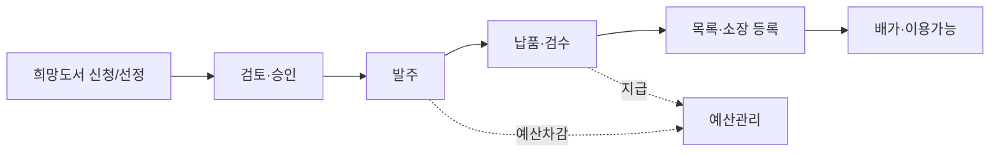

# 수서 요구사항 정의서 (Acquisition Requirements)

| 항목 | 내용 |
|---|---|
| 문서명 | 수서 요구사항 정의서 |
| 문서 ID | PLN-02 |
| 도메인 약어 | ACQ |
| 버전 | v0.1 Draft |
| 작성일 | 2026-05-11 |
| 작성자 | Planner Agent |
| 검토자 | PM, DevLead, DBA |
| 상태 | 초안 |

---

## 1. 개요

### 1.1 범위
자료 **선정·발주·검수·예산·기증·교환·연속간행물 구독**의 전 라이프사이클을 다룬다.

### 1.2 AS-IS / TO-BE
| 구분 | AS-IS | TO-BE |
|---|---|---|
| 희망도서 | 별도 게시판/엑셀로 관리 | OPAC 신청 → 워크플로 자동화 |
| 발주 | 엑셀 발주서 수기 작성 | 시스템 발주서 생성·납품처 통신 |
| 예산 | 별도 회계SW | 시스템 내 예산 트래킹·차감 |
| 검수 | 수기 체크 | 바코드/RFID 스캔 검수 |
| 연속간행물 | 별도 카드/엑셀 관리 | 시스템 내 호 단위 관리 |

### 1.3 핵심 업무 흐름

---

## 2. 기능 요구사항

### 2.1 선정 (Selection)

| 기능 ID | 기능명 | 설명 | 우선순위 | 적용 |
|---|---|---|---|---|
| ACQ-001 | 희망도서 신청(OPAC) | 이용자가 OPAC에서 ISBN/서지 검색 또는 직접 입력으로 신청 | High | 전체 |
| ACQ-002 | 희망도서 검토 | 사서가 중복소장·금액·정책 검토 후 채택/반려 | High | 전체 |
| ACQ-003 | 희망도서 알림 | 채택/반려/입수완료 시 신청자 알림 | High | 전체 |
| ACQ-004 | 선정 후보 등록 | 사서가 직접 선정 후보 자료 등록(서지검색·외부서지 import) | High | 전체 |
| ACQ-005 | 선정 일괄등록 | 도매상 추천 리스트 CSV/MARC import | Medium | 전체 |
| ACQ-006 | 선정 승인 워크플로 | 단계별 결재(사서→팀장→관장) 설정 가능 | High | 대학·공공 |
| ACQ-007 | 중복소장 체크 | ISBN·서명 기반 기존 소장·발주중 중복 경고 | High | 전체 |
| ACQ-008 | 선정 통계 | 분류별·기간별·신청자유형별 선정통계 | Medium | 전체 |
| ACQ-009 | 학과·부서별 선정 | 학과별 예산·선정 권한 분리 | Medium | 대학 |
| ACQ-010 | 교과연계 추천 | 교과목 코드·학년 기반 추천 자료 등록 | Low | 학교 |

### 2.2 발주 (Order)

| 기능 ID | 기능명 | 설명 | 우선순위 | 적용 |
|---|---|---|---|---|
| ACQ-020 | 발주서 생성 | 선정 자료 묶음으로 발주서 생성 | High | 전체 |
| ACQ-021 | 납품처 마스터 | 서점·출판사·도매상 정보 관리(견적·계약·할인율) | High | 전체 |
| ACQ-022 | 견적 요청·등록 | 다수 납품처 견적 요청·비교 | Medium | 대학·공공 |
| ACQ-023 | 발주 방식 | 수의·입찰·구매대행 등 방식 선택 | High | 공공 |
| ACQ-024 | 발주서 출력·송부 | PDF·이메일·납품처 시스템 전송 | High | 전체 |
| ACQ-025 | 발주 승인 워크플로 | 금액 구간별 결재선 차등 | High | 공공·대학 |
| ACQ-026 | 발주 취소·변경 | 발주 후 취소/수량변경 이력 관리 | High | 전체 |
| ACQ-027 | 발주 진행상태 | 발주중/일부납품/완료/취소 상태 추적 | High | 전체 |
| ACQ-028 | 발주 통계 | 납품처별·기간별 발주현황·정시납품률 | Medium | 전체 |

### 2.3 검수·납품 (Receipt)

| 기능 ID | 기능명 | 설명 | 우선순위 | 적용 |
|---|---|---|---|---|
| ACQ-030 | 납품 등록 | 발주 대비 실납품 수량·가격·할인 입력 | High | 전체 |
| ACQ-031 | 검수 처리 | 자료 상태(정상/파본/오품) 확인 후 검수 완료 | High | 전체 |
| ACQ-032 | 부분납품·재납품 | 일부 납품 후 잔여분 재납품 처리 | High | 전체 |
| ACQ-033 | 반품 처리 | 파본/오품 반품·재납품 요청 | High | 전체 |
| ACQ-034 | 가격 검증 | 발주가 vs 납품가 불일치 경고 | High | 공공 |
| ACQ-035 | 바코드/RFID 검수 | 스캐너로 일괄 검수 | Medium | 전체 |
| ACQ-036 | 납품 → 목록 인계 | 검수 완료 자료를 목록 등록 대기열에 자동 인계 | High | 전체 |
| ACQ-037 | 납품 → 소장 등록 | 등록번호 자동 채번 후 소장 정보 생성 | High | 전체 |

### 2.4 예산 관리 (Budget)

| 기능 ID | 기능명 | 설명 | 우선순위 | 적용 |
|---|---|---|---|---|
| ACQ-040 | 예산 편성 | 회계연도·예산항목별 편성·승인 | High | 전체 |
| ACQ-041 | 예산 분할 | 학과·부서·자료유형별 분할 배정 | High | 대학·공공 |
| ACQ-042 | 예산 집행 | 발주·검수 시 자동 차감 | High | 전체 |
| ACQ-043 | 예산 잔액 조회 | 실시간 잔액·집행률 조회 | High | 전체 |
| ACQ-044 | 예산 추경·전용 | 예산 증액·항목간 이체 | Medium | 공공·대학 |
| ACQ-045 | 예산 이월 | 미집행분 차기 이월 처리 | High | 공공·대학 |
| ACQ-046 | 예산 마감 | 회계연도 마감·결산 보고서 | High | 공공·대학 |
| ACQ-047 | 외화 예산 | 외화 발주 시 환율 적용·환차 처리 | Low | 대학 |
| ACQ-048 | 예산 알림 | 잔액 임계치(예: 10%) 도달 시 알림 | Medium | 전체 |

### 2.5 기증·교환 (Donation / Exchange)

| 기능 ID | 기능명 | 설명 | 우선순위 | 적용 |
|---|---|---|---|---|
| ACQ-050 | 기증 신청 접수 | 외부 기증자 신청서 등록 | High | 공공 |
| ACQ-051 | 기증 심사 | 기증자료 수증/거절 결정 | High | 공공 |
| ACQ-052 | 기증 등록 | 수증 자료 목록·소장 등록(가격=0 또는 기증가) | High | 전체 |
| ACQ-053 | 기증증서 발급 | 기증자 증서 자동 생성 | Medium | 공공·대학 |
| ACQ-054 | 교환 계약 관리 | 타기관과 자료 교환 계약 관리 | Low | 대학 |
| ACQ-055 | 교환 발송·수신 | 발송·수신 자료 트래킹 | Low | 대학 |

### 2.6 연속간행물 (Serials)

| 기능 ID | 기능명 | 설명 | 우선순위 | 적용 |
|---|---|---|---|---|
| ACQ-060 | 구독 계약 등록 | 잡지·저널 구독 계약(기간·금액·납품처) | High | 대학·공공 |
| ACQ-061 | 발행주기 관리 | 일/주/월/분기/연 등 발행주기 정의 | High | 대학·공공 |
| ACQ-062 | 호(Issue) 예측 | 발행주기 기반 자동 호 생성 예측 | High | 대학·공공 |
| ACQ-063 | 호별 입수 등록 | 실제 입수 호 체크·결호 등록 | High | 대학·공공 |
| ACQ-064 | 결호 클레임 | 미입수 호 납품처에 클레임 발송 | Medium | 대학 |
| ACQ-065 | 구독 갱신 | 구독 만료 알림·갱신 처리 | High | 대학 |
| ACQ-066 | 합본 관리 | 연도별 합본 제작 등록 | Low | 대학 |
| ACQ-067 | 전자저널 라이센스 | 전자저널 라이센스·접속 IP·동시접속수 | Medium | 대학 |

### 2.7 외부 연동·자동화

| 기능 ID | 기능명 | 설명 | 우선순위 | 적용 |
|---|---|---|---|---|
| ACQ-070 | ISBN 조회 | ISBN으로 외부 서지DB(국립중앙도서관·교보·알라딘) 조회 | High | 전체 |
| ACQ-071 | 출판사·서점 시스템 연동 | 표준 발주(EDI/JSON) 송신 | Medium | 대학·공공 |
| ACQ-072 | 도매상 신간 피드 | 신간정보 RSS/API 수신 | Low | 전체 |

---

## 3. 비기능 요구사항

| 구분 | 요구사항 |
|---|---|
| 성능 | 발주서 생성(100건 묶음) ≤ 3초 |
| 정합성 | 예산 차감은 트랜잭션으로 발주/검수와 원자성 보장 |
| 감사 | 예산·발주 모든 변경 이력 영구 보존 |
| 회계 표준 | 공공기관 회계연도(1.1~12.31), 학교 회계연도(3.1~2.28) 모두 지원 |

---

## 4. 외부 연동

| 연동 대상 | 프로토콜 | 용도 |
|---|---|---|
| 국립중앙도서관 서지DB | OpenAPI / Z39.50 | ISBN 서지 조회 |
| 교보문고·알라딘 등 도매 | OpenAPI | ISBN·가격 조회 |
| 출판사·서점 EDI | EDI/표준JSON | 발주서 송신 |
| 회계·ERP (옵션) | REST | 예산·집행 연동 (Y2 검토) |

---

## 5. 예외 처리 정책

| 케이스 | 처리 |
|---|---|
| 희망도서 중복소장 | 신청자에게 안내 후 신청 차단 또는 사서 검토로 강제 진행 |
| 예산 부족 | 발주 차단 + 예산 추가 요청 안내 |
| 납품 가격 불일치 | 사서 확인 후 강제 검수 또는 반품 처리 |
| 결호 클레임 무응답 | 30일 후 자동 분실 처리 |
| 기증 거절 자료 | 반환 또는 폐기 사유 등록 |
| 발주 취소 후 입고 | 자동 반품 처리 또는 수동 검수 전환 |

### 5.1 에러 코드

| 코드 | 메시지 |
|---|---|
| ACQ-E001 | 중복 소장된 자료입니다 |
| ACQ-E002 | 예산이 부족합니다 |
| ACQ-E003 | 발주 상태에서만 검수가 가능합니다 |
| ACQ-E004 | 회계연도가 마감되었습니다 |
| ACQ-E005 | 결재선이 설정되지 않았습니다 |

---

## 6. API 요구사항 개요

| API ID | Method | Path | 설명 |
|---|---|---|---|
| ACQ-API-001 | POST | /api/v1/acq/requests | 희망도서 신청 |
| ACQ-API-002 | GET | /api/v1/acq/requests | 희망도서 목록 |
| ACQ-API-003 | PATCH | /api/v1/acq/requests/{id}/approve | 희망도서 채택 |
| ACQ-API-010 | POST | /api/v1/acq/orders | 발주서 생성 |
| ACQ-API-011 | GET | /api/v1/acq/orders | 발주 목록 |
| ACQ-API-012 | PATCH | /api/v1/acq/orders/{id}/cancel | 발주 취소 |
| ACQ-API-020 | POST | /api/v1/acq/receipts | 검수 등록 |
| ACQ-API-030 | GET | /api/v1/acq/budgets | 예산 현황 |
| ACQ-API-031 | POST | /api/v1/acq/budgets | 예산 편성 |
| ACQ-API-040 | POST | /api/v1/acq/donations | 기증 접수 |
| ACQ-API-050 | POST | /api/v1/acq/serials | 구독 등록 |
| ACQ-API-051 | POST | /api/v1/acq/serials/{id}/issues | 호 입수 등록 |
| ACQ-API-060 | GET | /api/v1/acq/external/isbn/{isbn} | ISBN 외부 조회 |

---

## 7. 데이터 요구사항

핵심 엔티티: `AcqRequest`(희망도서), `Vendor`, `PurchaseOrder`, `PurchaseOrderItem`, `Receipt`, `Budget`, `BudgetItem`, `BudgetTransaction`, `Donation`, `SerialSubscription`, `SerialIssue`, `Approval`.

---

**식별된 수서 기능 수: 51개 (ACQ-001 ~ ACQ-072 중 부여번호 51개)**
