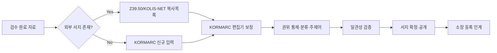

# 목록 요구사항 정의서 (Cataloging Requirements)

| 항목 | 내용 |
|---|---|
| 문서명 | 목록 요구사항 정의서 |
| 문서 ID | PLN-03 |
| 도메인 약어 | CAT |
| 버전 | v0.1 Draft |
| 작성일 | 2026-05-11 |
| 작성자 | Planner Agent |
| 검토자 | PM, DevLead, DBA |
| 상태 | 초안 |

---

## 1. 개요

### 1.1 범위
**KORMARC 기반 서지 편목**과 외부 표준(MARC21, Z39.50, KOLIS-NET) 연계, 분류·주제어 부여, 권위 통제, 일관성 검증을 다룬다.

### 1.2 AS-IS / TO-BE
| 구분 | AS-IS | TO-BE |
|---|---|---|
| 편목 도구 | 패키지별 폐쇄형 편집기 | 웹 기반 표준 KORMARC 편집기 |
| 외부 서지 활용 | 수기 입력 또는 패키지별 도구 | Z39.50 통합 검색·복사목록 |
| 공동목록 | KOLIS-NET 별도 클라이언트 | 시스템 내장 KOLIS-NET 송수신 |
| 권위 통제 | 사실상 미운영 | 권위레코드 시스템 운영 |
| 중복 처리 | 수동 발견 | 자동 중복 후보 탐지 |

### 1.3 핵심 업무 흐름

---

## 2. 기능 요구사항

### 2.1 KORMARC 편목 (Core Cataloging)

| 기능 ID | 기능명 | 설명 | 우선순위 | 적용 |
|---|---|---|---|---|
| CAT-001 | KORMARC 입력 | 통합서지용 KORMARC 신규 입력 (Leader·Directory·Field·Subfield) | High | 전체 |
| CAT-002 | KORMARC 수정 | 필드/지시기호/식별기호 단위 편집 | High | 전체 |
| CAT-003 | KORMARC 삭제 | 서지 삭제(소장 없을 때 / 강제삭제 권한별) | High | 전체 |
| CAT-004 | 필드 추가·복제·이동 | 반복가능 필드 관리 UX | High | 전체 |
| CAT-005 | 식별기호 단위 편집 | $a/$b/$c 등 식별기호 단위 입력 | High | 전체 |
| CAT-006 | 지시기호 가이드 | 필드별 지시기호 의미·코드 도움말 | High | 전체 |
| CAT-007 | 필수필드 검증 | 245(서명), 008(부호화) 등 필수 검증 | High | 전체 |
| CAT-008 | MARC 텍스트 입력 | 텍스트 형식 MARC 직접 붙여넣기·파싱 | Medium | 전체 |
| CAT-009 | MARC 양식 템플릿 | 자료유형별 입력 템플릿(단행본/연간/비도서) | High | 전체 |
| CAT-010 | 자료유형별 양식 자동 적용 | 유형 선택 시 필수필드·기본값 자동 세팅 | High | 전체 |
| CAT-011 | 미리보기 | ISBD 출력 형식·OPAC 표시 미리보기 | Medium | 전체 |
| CAT-012 | 변경 이력·되돌리기 | 서지 수정 이력·이전 버전 복원 | High | 전체 |
| CAT-013 | 임시저장·작업함 | 미완료 서지 보관함 관리 | Medium | 전체 |

### 2.2 MARC21 호환·변환

| 기능 ID | 기능명 | 설명 | 우선순위 | 적용 |
|---|---|---|---|---|
| CAT-020 | MARC21 import | MARC21 레코드 import 후 KORMARC 변환 | High | 대학 |
| CAT-021 | MARC21 export | KORMARC → MARC21 export | Medium | 대학 |
| CAT-022 | 변환 규칙 관리 | KORMARC↔MARC21 필드 매핑 규칙(관리자 편집) | Medium | 전체 |
| CAT-023 | 변환 오류 리포트 | 변환 불가/손실 필드 리포트 | Medium | 대학 |

### 2.3 외부 서지 검색·복사목록 (Z39.50 / OpenAPI)

| 기능 ID | 기능명 | 설명 | 우선순위 | 적용 |
|---|---|---|---|---|
| CAT-030 | Z39.50 대상 서버 관리 | KOLIS-NET·LOC·NDL·OCLC 등 서버 등록 | High | 전체 |
| CAT-031 | Z39.50 통합검색 | 다중 서버 동시 검색·결과 통합 | High | 전체 |
| CAT-032 | 복사목록 가져오기 | 검색 결과를 신규 서지로 import | High | 전체 |
| CAT-033 | 자관 서지 vs 외부 비교 | 외부 서지와 자관 서지 차이 비교·병합 | Medium | 대학 |
| CAT-034 | ISBN 일괄 복사목록 | ISBN 리스트로 일괄 외부 검색·import | High | 전체 |
| CAT-035 | KOLIS-NET OpenAPI 조회 | KOLIS-NET 서지 OpenAPI 검색 | High | 공공 |
| CAT-036 | KERIS-RISS 조회 | KERIS-RISS 학술서지 검색 | High | 대학 |

### 2.4 KOLIS-NET 공동목록 연계

| 기능 ID | 기능명 | 설명 | 우선순위 | 적용 |
|---|---|---|---|---|
| CAT-040 | KOLIS-NET 업로드 | 자관 서지를 KOLIS-NET 공동목록에 업로드 | High | 공공 |
| CAT-041 | KOLIS-NET 다운로드 | KOLIS-NET 공동목록 다운로드·갱신 | High | 공공 |
| CAT-042 | KOLIS-NET 송수신 이력 | 송신·수신 건수·오류 로그 | High | 공공 |
| CAT-043 | KOLIS-NET 송신 정책 | 자동 송신 주기·대상 필터 | Medium | 공공 |
| CAT-044 | DLS 공동목록 연계 | 학교도서관 DLS 송수신 | High | 학교 |

### 2.5 권위 통제·일관성

| 기능 ID | 기능명 | 설명 | 우선순위 | 적용 |
|---|---|---|---|---|
| CAT-050 | 권위레코드 CRUD | 저자·주제명·통일서명·총서명 권위레코드 | High | 대학·공공 |
| CAT-051 | 권위 참조·자동완성 | 100/700/600/650 등 입력 시 권위 자동완성 | High | 대학·공공 |
| CAT-052 | 권위 일관성 검증 | 비표준형 사용·이형 자동 매핑 | Medium | 대학 |
| CAT-053 | 권위 일괄 치환 | 권위명 변경 시 관련 서지 일괄 갱신 | Medium | 대학 |
| CAT-054 | 표목·이형 관리 | 표준형·이형(See/See also) 관리 | Medium | 대학 |

### 2.6 분류·주제어 부여

| 기능 ID | 기능명 | 설명 | 우선순위 | 적용 |
|---|---|---|---|---|
| CAT-060 | 분류기호 부여 | 056/082/090 등 분류기호 입력·KDC/DDC/LC 지원 | High | 전체 |
| CAT-061 | 청구기호 자동생성 | 분류기호 + 도서기호(저자기호) 자동조합 | High | 전체 |
| CAT-062 | 도서기호 규칙 | 저자기호표(리, 이재철저자기호) 적용 | High | 전체 |
| CAT-063 | 주제명 부여 | 600/610/630/650/651 등 주제명 부여 | High | 대학·공공 |
| CAT-064 | 분류표 브라우저 | KDC/DDC/LC 트리 탐색·검색 | High | 전체 |
| CAT-065 | 자동 분류 추천 | 서명/초록 기반 분류 추천 (Y2+) | Low | 전체 |

### 2.7 일괄 편집·서지 관리

| 기능 ID | 기능명 | 설명 | 우선순위 | 적용 |
|---|---|---|---|---|
| CAT-070 | 서지 일괄 편집 | 다수 서지에 동일 필드 일괄 수정 | High | 전체 |
| CAT-071 | 서지 결합 | 동일 서지로 판단되는 중복 서지 통합 | High | 전체 |
| CAT-072 | 서지 분리 | 잘못 통합된 서지 분리 | Medium | 전체 |
| CAT-073 | 중복 서지 후보 탐지 | ISBN·제목·저자 유사도 기반 중복 후보 추출 | High | 전체 |
| CAT-074 | 서지 잠금 | 동시편집 방지 잠금 | High | 전체 |
| CAT-075 | 서지 일괄 import | MARC 파일(.mrc, .xml) 일괄 import | High | 전체 |
| CAT-076 | 서지 일괄 export | MARC/MARCXML/JSON export | High | 전체 |

### 2.8 OPAC 노출·검색 색인

| 기능 ID | 기능명 | 설명 | 우선순위 | 적용 |
|---|---|---|---|---|
| CAT-080 | OPAC 색인 갱신 | 서지 등록/수정/삭제 시 검색 색인 동기화 | High | 전체 |
| CAT-081 | 서지 공개·비공개 | 미공개 서지·내부용 서지 관리 | High | 전체 |
| CAT-082 | 표목·검색 가중치 | 서명·저자·주제 검색 가중치 설정 | Medium | 전체 |

---

## 3. 비기능 요구사항

| 구분 | 요구사항 |
|---|---|
| 표준 호환 | KORMARC 통합서지용 100% 준수, KOLIS-NET 시험 통과 |
| 성능 | 서지 1건 저장 ≤ 1초, Z39.50 검색 응답 ≤ 5초/서버 |
| 데이터 무결성 | 서지-소장-회원(대출)의 참조무결성 보장 |
| 다국어 | 한국어·영어·일본어·중국어 입력·표시(유니코드 NFC) |
| 색인 | 서지 변경 후 색인 동기화 ≤ 30초 |

---

## 4. 외부 연동

| 연동 대상 | 프로토콜 | 용도 | 적용 |
|---|---|---|---|
| KOLIS-NET | OpenAPI / 파일업로드 | 공동목록 송수신 | 공공 |
| KERIS-RISS | OpenAPI | 학술서지 조회 | 대학 |
| DLS | OpenAPI | 학교 공동목록 | 학교 |
| LOC (LC) | Z39.50 | MARC21 서지 | 대학 |
| 국립중앙도서관 | Z39.50 / OpenAPI | KORMARC 서지 | 전체 |
| OCLC WorldCat | Z39.50 (옵션) | 국제 서지 | 대학 |

---

## 5. 예외 처리 정책

| 케이스 | 처리 |
|---|---|
| 필수필드 누락 | 저장 차단, 누락필드 강조 |
| 동시 편집 충돌 | 마지막 저장자 알림·잠금 우선 |
| Z39.50 서버 응답 없음 | 5초 timeout, 다른 서버 결과만 표시 |
| KOLIS-NET 송신 실패 | 큐에 적재 후 재시도(3회), 오류 리포트 |
| 서지 결합 시 소장 있음 | 소장은 결합 대상 서지로 자동 이관 |
| 권위명 변경 영향 大 | 사전 영향도 분석·승인 워크플로 |

### 5.1 에러 코드

| 코드 | 메시지 |
|---|---|
| CAT-E001 | 필수 필드(245$a)가 누락되었습니다 |
| CAT-E002 | 유효하지 않은 KORMARC 형식입니다 |
| CAT-E003 | 동일 ISBN 서지가 이미 존재합니다 |
| CAT-E004 | 외부 서지서버 응답이 없습니다 |
| CAT-E005 | 소장이 있는 서지는 삭제할 수 없습니다 |
| CAT-E006 | 권위레코드를 찾을 수 없습니다 |

---

## 6. API 요구사항 개요

| API ID | Method | Path | 설명 |
|---|---|---|---|
| CAT-API-001 | POST | /api/v1/cat/bibs | 서지 신규 등록 |
| CAT-API-002 | GET | /api/v1/cat/bibs/{id} | 서지 조회 (KORMARC 포맷) |
| CAT-API-003 | PUT | /api/v1/cat/bibs/{id} | 서지 수정 |
| CAT-API-004 | DELETE | /api/v1/cat/bibs/{id} | 서지 삭제 |
| CAT-API-010 | POST | /api/v1/cat/bibs/search | 서지 검색 |
| CAT-API-020 | POST | /api/v1/cat/external/z3950/search | Z39.50 외부 검색 |
| CAT-API-021 | POST | /api/v1/cat/external/import | 외부 서지 import |
| CAT-API-030 | POST | /api/v1/cat/bibs/merge | 서지 결합 |
| CAT-API-031 | POST | /api/v1/cat/bibs/split | 서지 분리 |
| CAT-API-040 | POST | /api/v1/cat/bibs/bulk-import | 일괄 import |
| CAT-API-050 | GET | /api/v1/cat/authorities | 권위레코드 조회 |
| CAT-API-060 | POST | /api/v1/cat/kolis/push | KOLIS-NET 송신 |

---

## 7. 데이터 요구사항

핵심 엔티티: `Bibliographic`(서지), `MarcField`, `MarcSubfield`, `AuthorityRecord`, `Classification`(분류표), `SubjectHeading`, `BibIndex`(검색색인), `BibChangeLog`, `Z3950Server`, `KolisSyncLog`.

---

**식별된 목록 기능 수: 51개 (CAT-001 ~ CAT-082 중 부여번호 51개)**
