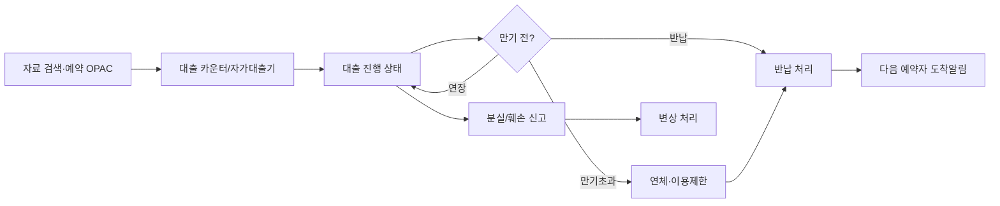

# 열람 요구사항 정의서 (Circulation Requirements)

| 항목 | 내용 |
|---|---|
| 문서명 | 열람 요구사항 정의서 |
| 문서 ID | PLN-04 |
| 도메인 약어 | CIR |
| 버전 | v0.1 Draft |
| 작성일 | 2026-05-11 |
| 작성자 | Planner Agent |
| 검토자 | PM, DevLead, DBA |
| 상태 | 초안 |

---

## 1. 개요

### 1.1 범위
**대출·반납·연장·예약·연체·분실·관간대차·OPAC·자가대출반납·비대면**의 전 흐름을 다룬다. 도서관 업무 중 가장 빈도가 높고 정책 적용이 복잡한 영역.

### 1.2 AS-IS / TO-BE
| 구분 | AS-IS | TO-BE |
|---|---|---|
| 대출/반납 | 사서 카운터 중심 | 카운터 + 자가대출기 + 모바일 |
| 예약 | 단순 FIFO | 정책 기반 우선순위·도착 알림 |
| 연체관리 | 일괄 배치 점검 | 실시간 상태·자동 정지 |
| OPAC | 검색 중심 | 검색·예약·내정보·희망도서·이용내역 통합 |
| 관간대차 | 별도 운영 | 시스템 내 통합 |

### 1.3 핵심 업무 흐름

---

## 2. 기능 요구사항

### 2.1 대출·반납·연장

| 기능 ID | 기능명 | 설명 | 우선순위 | 적용 |
|---|---|---|---|---|
| CIR-001 | 대출 처리 | 회원 인증 → 자료 스캔 → 정책 검증 → 대출 확정 | High | 전체 |
| CIR-002 | 반납 처리 | 자료 스캔 → 상태 확인 → 반납 처리 | High | 전체 |
| CIR-003 | 연장 처리 | 만기 전 연장(이용자/사서, 연장횟수·예약 유무 검증) | High | 전체 |
| CIR-004 | 일괄 대출/반납 | 다수 자료 동시 처리 | High | 전체 |
| CIR-005 | 회원 정책 검증 | 대출권수·연체상태·이용제한 검증 | High | 전체 |
| CIR-006 | 자료 정책 검증 | 자료유형 대출가능 여부, 관외대출 제한 | High | 전체 |
| CIR-007 | 대출이력 조회 | 회원/자료별 이력 | High | 전체 |
| CIR-008 | 회원-자료 상호 검증 | 회원유형 × 자료유형 교차 정책 적용 | High | 전체 |
| CIR-009 | 사서 강제 처리 | 정책 위반 시 사서 권한으로 강제 대출/반납 | Medium | 전체 |
| CIR-010 | 대출증·영수증 출력 | 영수증 인쇄·이메일·앱 알림 | Medium | 전체 |
| CIR-011 | 반납 시 자동 연체확인 | 반납 시 연체일·연체료 자동 계산 | High | 전체 |
| CIR-012 | 야간반납함 | 영업외 시간 반납 자료 익일 등록 | Medium | 공공 |

### 2.2 예약·우선순위·회수

| 기능 ID | 기능명 | 설명 | 우선순위 | 적용 |
|---|---|---|---|---|
| CIR-020 | 예약 신청 | 대출중 자료·미입수 자료 예약 | High | 전체 |
| CIR-021 | 예약 큐 관리 | 예약 순번·정책별 가중치 | High | 전체 |
| CIR-022 | 예약 도착 알림 | 자료 입고 시 1순위 예약자 알림 | High | 전체 |
| CIR-023 | 예약 보관기간 관리 | 도착 후 N일 미수령 시 자동 취소 | High | 전체 |
| CIR-024 | 예약 취소 | 이용자/사서 취소 | High | 전체 |
| CIR-025 | 자료 회수 요청 | 장기 대출 자료를 예약자 위해 회수 요청 | Medium | 대학 |
| CIR-026 | 예약대상 자료 검색 | OPAC에서 예약가능 여부 표시 | High | 전체 |
| CIR-027 | 예약현황 조회 | 회원/자료/관별 예약현황 | High | 전체 |

### 2.3 연체·연체료·이용제한

| 기능 ID | 기능명 | 설명 | 우선순위 | 적용 |
|---|---|---|---|---|
| CIR-030 | 연체 자동 산정 | 매일 배치로 연체일·연체료 갱신 | High | 전체 |
| CIR-031 | 연체료 부과정책 | 원/일 또는 이용정지일/연체일, 자료별 차등 | High | 전체 |
| CIR-032 | 연체료 면제·조정 | 사유 등록·승인 워크플로 | High | 전체 |
| CIR-033 | 연체료 수납 | 카운터·계좌·간편결제 수납 등록 | High | 공공 |
| CIR-034 | 이용제한 자동 적용 | 정책 충족 시 자동 정지 | High | 전체 |
| CIR-035 | 이용제한 해제 | 완납·기한경과·사서승인 시 해제 | High | 전체 |
| CIR-036 | 연체 안내 | 만기예정·만기당일·연체 단계별 알림 | High | 전체 |
| CIR-037 | 휴관일 산정 | 휴관일·공휴일 제외 연체일 계산 | High | 전체 |

### 2.4 분실·훼손·변상

| 기능 ID | 기능명 | 설명 | 우선순위 | 적용 |
|---|---|---|---|---|
| CIR-040 | 분실/훼손 신고 | 회원이 분실/훼손 신고 | High | 전체 |
| CIR-041 | 변상 처리 | 변상금액 산정·납부 등록 | High | 전체 |
| CIR-042 | 동종자료 변상 | 동일/동등자료 변상 등록 | High | 전체 |
| CIR-043 | 변상 후 자료 발견 | 변상 후 자료 발견 시 환불 처리 | Medium | 전체 |
| CIR-044 | 훼손 정도별 처리 | 경미/중대 훼손 차등 처리 | Medium | 전체 |

### 2.5 관간대차 (ILL)

| 기능 ID | 기능명 | 설명 | 우선순위 | 적용 |
|---|---|---|---|---|
| CIR-050 | 관간대차 신청 | 회원이 타관 자료 대차 신청 | High | 다관·대학 |
| CIR-051 | 관간대차 승인·발송 | 소장관에서 승인·발송 처리 | High | 다관 |
| CIR-052 | 도착·수령 처리 | 신청관에서 도착 처리·회원 수령 | High | 다관 |
| CIR-053 | 반환·발송 | 회원 반납·소장관 회송 | High | 다관 |
| CIR-054 | 관간대차 이력·통계 | 관별 송수신 통계 | Medium | 다관 |
| CIR-055 | 외부기관 ILL | KERIS·KOLIS-NET 기반 타기관 대차 | Low | 대학 |

### 2.6 OPAC (이용자)

| 기능 ID | 기능명 | 설명 | 우선순위 | 적용 |
|---|---|---|---|---|
| CIR-060 | OPAC 통합검색 | 키워드/필드별/패싯 검색 | High | 전체 |
| CIR-061 | OPAC 상세보기 | 서지·소장·예약가능 표시 | High | 전체 |
| CIR-062 | OPAC 예약 신청 | 로그인 후 예약 신청 | High | 전체 |
| CIR-063 | OPAC 내정보 | 대출·예약·연체·연체료 조회 | High | 전체 |
| CIR-064 | OPAC 연장 신청 | 본인 대출 자료 연장 | High | 전체 |
| CIR-065 | OPAC 희망도서 | 희망도서 신청·진행상태 조회 | High | 전체 |
| CIR-066 | OPAC 즐겨찾기·서가 | 개인 가상 서가·태그 | Medium | 전체 |
| CIR-067 | OPAC 이용내역 | 대출이력·연체이력 조회(개인정보보호) | High | 전체 |
| CIR-068 | OPAC 추천도서 | 신간·인기·연관 추천 | Medium | 전체 |
| CIR-069 | OPAC 모바일 반응형 | 모바일 최적화 UI | High | 전체 |
| CIR-070 | OPAC 다국어 | 한국어/영어 | Medium | 대학 |
| CIR-071 | OPAC 접근성 | KWCAG 2.2 AA | High | 공공 |

### 2.7 자가대출·반납 (RFID / SIP2 / NCIP)

| 기능 ID | 기능명 | 설명 | 우선순위 | 적용 |
|---|---|---|---|---|
| CIR-080 | SIP2 게이트웨이 | 자가대출반납기와 SIP2 통신 | High | 전체 |
| CIR-081 | NCIP 게이트웨이 | NCIP 표준 호환 | Medium | 대학 |
| CIR-082 | 자가대출 처리 | 자가대출기 거래 처리(인증·자료·정책검증) | High | 전체 |
| CIR-083 | 자가반납 처리 | 자가반납·EAS 해제 | High | 전체 |
| CIR-084 | 자가기기 모니터링 | 기기 온/오프라인·거래수·오류 모니터링 | High | 전체 |
| CIR-085 | 무인반납함(스마트반납함) | IoT 기반 무인 반납함 연동 | Medium | 공공 |
| CIR-086 | RFID 라벨 인쇄 | 자료 등록 시 RFID 라벨 인쇄·인코딩 | High | 전체 |

### 2.8 비대면·모바일

| 기능 ID | 기능명 | 설명 | 우선순위 | 적용 |
|---|---|---|---|---|
| CIR-090 | 비대면 대출 | 모바일 예약 후 무인사물함 수령 | Medium | 공공 |
| CIR-091 | 택배 대출 | 자료를 택배로 발송(공공도서관 사회서비스) | Low | 공공 |
| CIR-092 | 전자책 대출 연동 | 외부 전자책 플랫폼 SSO 연동 | Medium | 공공·대학 |
| CIR-093 | 모바일 회원증 | 앱·지갑 회원증 QR/NFC | High | 전체 |

### 2.9 사서 카운터·운영

| 기능 ID | 기능명 | 설명 | 우선순위 | 적용 |
|---|---|---|---|---|
| CIR-100 | 카운터 통합 UI | 회원 조회 + 대출/반납/연장/예약 통합 화면 | High | 전체 |
| CIR-101 | 회원 빠른조회 | 회원증/카드/이름/전화 빠른검색 | High | 전체 |
| CIR-102 | 대출 일일 마감 | 일일 거래·연체료 마감 보고서 | Medium | 공공 |
| CIR-103 | 카운터 인수인계 | 교대 시 미처리건 이관 | Medium | 공공 |

---

## 3. 비기능 요구사항

| 구분 | 요구사항 |
|---|---|
| 성능 | 대출 단건 처리 ≤ 500ms (정책 검증 포함) |
| 동시성 | 자가대출기 동시 100대 처리 가능 |
| 안정성 | SIP2/NCIP 통신 99.9% 가용성 |
| 정합성 | 대출/예약 상태 변경은 트랜잭션 보장 |
| 실시간 | 예약 도착 알림 ≤ 1분 |
| 배치 | 매일 00:00 연체 산정 배치, 1시간 내 완료 |

---

## 4. 외부 연동

| 연동 대상 | 프로토콜 | 용도 | 적용 |
|---|---|---|---|
| RFID 자가대출반납기 | SIP2 (TCP/IP) | 대출·반납 거래 | 전체 |
| 다관 ILS / 외부 ILS | NCIP | 관간대차 | 다관·대학 |
| 무인반납함 | HTTP API | 반납 이벤트 수신 | 공공 |
| 전자책 플랫폼 | OAuth2/SAML | SSO·이용권 연동 | 공공·대학 |
| SMS·카카오·이메일 | (CMN-070) | 알림 | 전체 |

---

## 5. 예외 처리 정책

| 케이스 | 처리 |
|---|---|
| 정책 위반 대출 시도 | 거부 + 사유 명시 (한도초과·연체·이용제한 등) |
| 대출 중 자료 재대출 | 차단(중복 대출 불가) |
| 휴관일에 만기 도래 | 다음 개관일로 만기일 자동 연장 |
| SIP2 거래 응답 없음 | 5초 timeout, 로컬 큐 적재·재전송 |
| 예약 수령 미접수 | N일 후 자동 취소·다음 순번 알림 |
| 연체료 미납 시 신규 대출 | 차단 또는 미납 안내 후 차단 정책 적용 |
| 분실 자료 발견 | 변상 환불 워크플로 |

### 5.1 에러 코드

| 코드 | 메시지 |
|---|---|
| CIR-E001 | 대출 권수 한도를 초과했습니다 |
| CIR-E002 | 연체 자료가 있어 대출할 수 없습니다 |
| CIR-E003 | 이용 제한 상태입니다 |
| CIR-E004 | 예약자가 있어 연장할 수 없습니다 |
| CIR-E005 | 관외 대출이 불가한 자료입니다 |
| CIR-E006 | 자료 상태가 대출 가능하지 않습니다 |
| CIR-E007 | 이미 예약한 자료입니다 |
| CIR-E008 | SIP2 통신에 실패했습니다 |

---

## 6. API 요구사항 개요

| API ID | Method | Path | 설명 |
|---|---|---|---|
| CIR-API-001 | POST | /api/v1/cir/checkouts | 대출 처리 |
| CIR-API-002 | POST | /api/v1/cir/returns | 반납 처리 |
| CIR-API-003 | POST | /api/v1/cir/renewals | 연장 처리 |
| CIR-API-010 | POST | /api/v1/cir/holds | 예약 신청 |
| CIR-API-011 | DELETE | /api/v1/cir/holds/{id} | 예약 취소 |
| CIR-API-020 | GET | /api/v1/cir/members/{id}/loans | 회원 대출현황 |
| CIR-API-021 | GET | /api/v1/cir/members/{id}/overdues | 회원 연체현황 |
| CIR-API-030 | POST | /api/v1/cir/fines/pay | 연체료 납부 |
| CIR-API-040 | POST | /api/v1/cir/lost-damaged | 분실/훼손 신고 |
| CIR-API-050 | POST | /api/v1/cir/ill/requests | 관간대차 신청 |
| CIR-API-060 | POST | /api/v1/cir/sip2 | SIP2 게이트웨이 |
| CIR-API-070 | GET | /api/v1/opac/search | OPAC 검색 |

---

## 7. 데이터 요구사항

핵심 엔티티: `Loan`(대출), `Hold`(예약), `Renewal`, `Fine`(연체료), `FinePayment`, `LostDamagedReport`, `IllRequest`, `Sip2Transaction`, `CirculationPolicy`, `OpacSearchLog`.

---

**식별된 열람 기능 수: 70개 (CIR-001 ~ CIR-103 중 부여번호 70개)**
