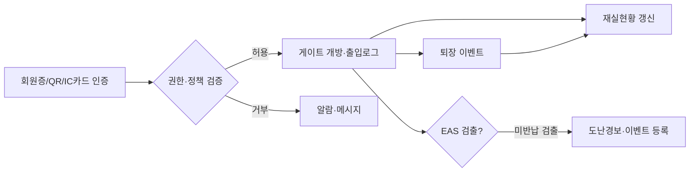

# 출입관리 요구사항 정의서 (Access Control Requirements)

| 항목 | 내용 |
|---|---|
| 문서명 | 출입관리 요구사항 정의서 |
| 문서 ID | PLN-06 |
| 도메인 약어 | ACS |
| 버전 | v0.1 Draft |
| 작성일 | 2026-05-11 |
| 작성자 | Planner Agent |
| 검토자 | PM, DevLead, DBA |
| 상태 | 초안 |

---

## 1. 개요

### 1.1 범위
**회원증·IC카드·QR 출입 인증, 스피드게이트·EAS 도난방지 게이트 연동, 출입이력·재실현황, 출입권한 정책, 임시증, 보안 이벤트** 관리.

### 1.2 AS-IS / TO-BE
| 구분 | AS-IS | TO-BE |
|---|---|---|
| 인증매체 | 회원증·바코드 | 회원증/QR/IC카드/모바일 NFC |
| 게이트 | 단순 카운터 | 표준 인터페이스 통합·이벤트 수집 |
| 출입이력 | 일부 기록 | 실시간 수집·재실현황 대시보드 |
| 도난방지 | 단독 운영 | 시스템 통합·미반납 자료 추적 |
| 권한 | 단일 정책 | 회원유형·시간·요일·구역별 정책 |

### 1.3 핵심 흐름

---

## 2. 기능 요구사항

### 2.1 인증·게이트 연동

| 기능 ID | 기능명 | 설명 | 우선순위 | 적용 |
|---|---|---|---|---|
| ACS-001 | 회원증 인증(바코드) | 회원증 바코드/QR 스캔 인증 | High | 전체 |
| ACS-002 | IC카드 인증 | IC카드·교통카드·학생증 IC | High | 대학·학교 |
| ACS-003 | 모바일 QR 인증 | 앱 QR 코드 인증 | High | 전체 |
| ACS-004 | 모바일 NFC 인증 | NFC 태그 인증 | Medium | 대학 |
| ACS-005 | 지문·생체 인증 | (옵션) 생체 인증 게이트 | Low | 대학 |
| ACS-006 | 스피드게이트 연동 | 게이트 장비 표준 인터페이스(HTTP/Serial) | High | 전체 |
| ACS-007 | 인증 응답 시간 | 인증 응답 ≤ 500ms 보장 | High | 전체 |
| ACS-008 | 오프라인 인증 캐시 | 네트워크 단절 시 캐시 기반 인증 | Medium | 전체 |
| ACS-009 | 다중 게이트 통합 | 입구·출구·구역 게이트 통합 관리 | High | 대학·공공 |
| ACS-010 | 게이트 장비 모니터링 | 온/오프라인·통신상태·장애 알림 | High | 전체 |

### 2.2 EAS 도난방지 게이트

| 기능 ID | 기능명 | 설명 | 우선순위 | 적용 |
|---|---|---|---|---|
| ACS-020 | EAS 이벤트 수신 | RFID/AM/EM 방식 EAS 게이트 이벤트 | High | 전체 |
| ACS-021 | 도난경보 등록 | 미반납 자료 통과 시 보안이벤트 등록 | High | 전체 |
| ACS-022 | 미반납 자료 식별 | RFID 태그로 자료 식별·회원 매핑 | High | 전체 |
| ACS-023 | 대출 검증 결합 | 대출완료 자료는 게이트 통과 허용 | High | 전체 |
| ACS-024 | 도난경보 처리 워크플로 | 경보 → 사서 확인 → 처리(허용/회수) | High | 전체 |
| ACS-025 | EAS-RFID 통합 모드 | 자가대출 후 게이트 통과 비활성화 동기화 | High | 전체 |
| ACS-026 | 도난경보 통계 | 일별·게이트별 경보 통계·오경보율 | Medium | 전체 |

### 2.3 출입권한·정책

| 기능 ID | 기능명 | 설명 | 우선순위 | 적용 |
|---|---|---|---|---|
| ACS-030 | 출입정책 마스터 | 회원유형 × 시간대 × 요일 × 구역 정책 | High | 전체 |
| ACS-031 | 시간대별 출입 제한 | 야간/주말 제한, 시험기간 확장 | High | 대학 |
| ACS-032 | 구역별 출입 제한 | 일반·자료실·열람실·보존서고 별 권한 | High | 대학·공공 |
| ACS-033 | 외부인 제한 | 외부인 출입 가능 시간·횟수 제한 | High | 대학 |
| ACS-034 | 연체·이용제한 게이트 차단 | 연체·정지회원 출입 차단 정책 | Medium | 대학 |
| ACS-035 | 1인 1회 입장 정책 | 좌석점유 동시 입장 제한 | Medium | 대학 |
| ACS-036 | 출입권한 위임 | 사서 권한으로 임시 허용 | Medium | 전체 |

### 2.4 출입이력·재실현황

| 기능 ID | 기능명 | 설명 | 우선순위 | 적용 |
|---|---|---|---|---|
| ACS-040 | 출입이력 기록 | 회원·시간·게이트·방향·결과 기록 | High | 전체 |
| ACS-041 | 회원별 출입이력 | 회원의 출입 이력 조회 | High | 전체 |
| ACS-042 | 게이트별 통과 통계 | 게이트별 시간대 통과수 | High | 전체 |
| ACS-043 | 재실현황 실시간 | 현재 도서관 내 인원수·구역별 점유 | High | 대학·공공 |
| ACS-044 | 출입 패턴 분석 | 시간대·요일·계절 패턴 | Medium | 대학·공공 |
| ACS-045 | 출입 알림 | 본인 출입 이력 알림(보호자용 학생) | Medium | 학교 |
| ACS-046 | 학교 NEIS 연동 | 학생 출결 자료 연계 | Medium | 학교 |
| ACS-047 | 휴관일 출입 차단 | 휴관일·운영시간 외 출입 차단 | High | 전체 |

### 2.5 임시증·외부방문자

| 기능 ID | 기능명 | 설명 | 우선순위 | 적용 |
|---|---|---|---|---|
| ACS-050 | 임시증 발급 | 외부방문자 신분 확인·임시증 발급 | High | 대학·공공 |
| ACS-051 | 임시증 유효기간 | 시간·일 단위 유효기간 설정 | High | 대학·공공 |
| ACS-052 | 방문자 사전등록 | 방문 사전 등록 시스템 | Medium | 대학 |
| ACS-053 | 방문 목적·동반자 | 방문 사유·동반자 등록 | Low | 대학 |
| ACS-054 | 임시증 회수·만료 | 회수 처리·자동 만료 | High | 전체 |

### 2.6 보안 이벤트·알림

| 기능 ID | 기능명 | 설명 | 우선순위 | 적용 |
|---|---|---|---|---|
| ACS-060 | 보안 이벤트 로그 | 도난경보·비인가출입·장비장애 통합 로그 | High | 전체 |
| ACS-061 | 실시간 알림 | 사서/관장에 즉시 알림 (앱푸시·SMS) | High | 전체 |
| ACS-062 | CCTV 연동 | 보안이벤트 시 CCTV 시각 마킹 (옵션) | Low | 대학·공공 |
| ACS-063 | 이벤트 처리·종결 | 이벤트 확인·조치·종결 워크플로 | High | 전체 |
| ACS-064 | 일일 보안 보고서 | 일/주/월 보안 이벤트 보고서 | Medium | 전체 |

---

## 3. 비기능 요구사항

| 구분 | 요구사항 |
|---|---|
| 성능 | 인증 응답 ≤ 500ms |
| 가용성 | 게이트 통신 99.9%, 오프라인 캐시 보조 |
| 보안 | 출입이력 위변조 방지 (감사로그·해시) |
| 보존 | 출입이력 최소 1년, 보안이벤트 5년 |
| 동시성 | 1개 도서관 동시 출입 100건/초 처리 |
| 개인정보 | 출입이력 마스킹·열람권한 통제 |

---

## 4. 외부 연동

| 연동 대상 | 프로토콜 | 용도 | 적용 |
|---|---|---|---|
| 스피드게이트 | HTTP API / Serial(RS-232/485) | 인증·개방 명령 | 전체 |
| EAS 게이트 | 벤더 SDK / TCP | 도난경보 수신 | 전체 |
| RFID 리더(게이트 내장) | 벤더 SDK | 자료 식별 | 전체 |
| 학교 NEIS | API | 학생 출결 연계 | 학교 |
| CCTV NVR | RTSP / ONVIF (옵션) | 영상 마킹 | 대학 |
| 모바일 앱 | OAuth2 + QR | 출입 인증 | 전체 |

---

## 5. 예외 처리 정책

| 케이스 | 처리 |
|---|---|
| 인증 실패 | 거부 + 경고음 + 사유 표시 (한도/시간/연체) |
| 게이트 통신 단절 | 오프라인 캐시 인증·후속 동기화 |
| EAS 오경보 | 사서 확인 후 통과 허용·오경보 기록 |
| 미반납 자료 통과 | 도난경보 + 자료 식별 + 회원 조회 |
| 임시증 미반납 | 만료시간 후 자동 무효화·알림 |
| 정지 회원 출입 시도 | 정책에 따라 차단/허용 |
| 도서관 휴관일 출입 시도 | 차단 + 휴관 안내 |

### 5.1 에러 코드

| 코드 | 메시지 |
|---|---|
| ACS-E001 | 출입 권한이 없습니다 |
| ACS-E002 | 운영시간이 아닙니다 |
| ACS-E003 | 이용 제한 상태입니다 |
| ACS-E004 | 게이트 통신에 실패했습니다 |
| ACS-E005 | 임시증이 만료되었습니다 |
| ACS-E006 | 도난경보: 미반납 자료가 감지되었습니다 |

---

## 6. API 요구사항 개요

| API ID | Method | Path | 설명 |
|---|---|---|---|
| ACS-API-001 | POST | /api/v1/acs/auth | 출입 인증 요청 |
| ACS-API-002 | POST | /api/v1/acs/events | 출입 이벤트 등록 (게이트 → 서버) |
| ACS-API-003 | POST | /api/v1/acs/eas-alarms | EAS 도난경보 등록 |
| ACS-API-010 | GET | /api/v1/acs/occupancy | 재실현황 조회 |
| ACS-API-011 | GET | /api/v1/acs/history | 출입이력 조회 |
| ACS-API-020 | POST | /api/v1/acs/temp-passes | 임시증 발급 |
| ACS-API-030 | GET | /api/v1/acs/policies | 출입정책 조회 |
| ACS-API-040 | GET | /api/v1/acs/security-events | 보안 이벤트 조회 |

---

## 7. 데이터 요구사항

핵심 엔티티: `Gate`, `AccessEvent`, `EasAlarm`, `Occupancy`, `AccessPolicy`, `TempPass`, `SecurityEvent`, `GateDeviceStatus`.

---

**식별된 출입관리 기능 수: 38개 (ACS-001 ~ ACS-064 중 부여번호 38개)**
