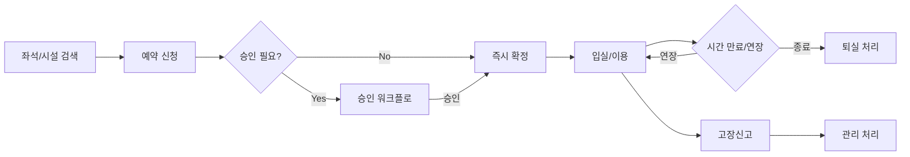

# 시설관리 요구사항 정의서 (Facility Requirements)

| 항목 | 내용 |
|---|---|
| 문서명 | 시설관리 요구사항 정의서 |
| 문서 ID | PLN-07 |
| 도메인 약어 | FAC |
| 버전 | v0.1 Draft |
| 작성일 | 2026-05-11 |
| 작성자 | Planner Agent |
| 검토자 | PM, DevLead, DBA |
| 상태 | 초안 |

---

## 1. 개요

### 1.1 범위
**열람석·캐럴 좌석예약, 회의실·세미나실 예약, 시설 점검·고장신고, 이용시간·예약정책, 이용통계** 관리.

### 1.2 AS-IS / TO-BE
| 구분 | AS-IS | TO-BE |
|---|---|---|
| 좌석예약 | 키오스크 단독 운영 | 모바일·웹·키오스크 통합 |
| 회의실 예약 | 전화·게시판 | 시스템 예약·승인 워크플로 |
| 좌석 점유 추적 | 수동 | 게이트 연동·자동 점유/해제 |
| 시설 점검 | 별도 대장 | 시스템 점검 이력·고장신고 |

### 1.3 핵심 흐름

---

## 2. 기능 요구사항

### 2.1 좌석예약 (열람석·캐럴)

| 기능 ID | 기능명 | 설명 | 우선순위 | 적용 |
|---|---|---|---|---|
| FAC-001 | 좌석 마스터 | 열람실·구역·좌석 번호·속성(콘센트/모니터/조명) 마스터 | High | 대학·공공 |
| FAC-002 | 실시간 좌석현황 | 좌석 점유/예약/이용가능 실시간 표시 | High | 대학·공공 |
| FAC-003 | 좌석 예약 신청 | 회원이 좌석 예약 신청(즉시·예약) | High | 대학·공공 |
| FAC-004 | 자동 좌석배정 | 정책 기반 자동 배정(이용자 선호·구역) | Medium | 대학 |
| FAC-005 | 좌석 변경·반납 | 이용 중 좌석 변경, 조기 반납 | High | 대학 |
| FAC-006 | 이용시간 연장 | 만료 전 연장(횟수·시간 제한) | High | 대학 |
| FAC-007 | 입·퇴실 처리 | 키오스크·게이트·앱 통한 입퇴실 | High | 대학 |
| FAC-008 | 좌석 자동 해제 | 미입실(N분), 장기 이석(M분) 자동 해제 | High | 대학 |
| FAC-009 | 캐럴(개인열람실) 예약 | 일/주/학기 단위 캐럴 예약 | Medium | 대학 |
| FAC-010 | 좌석 페널티 정책 | 미사용·노쇼·이석 위반 페널티(N일 이용제한) | High | 대학 |
| FAC-011 | 동반자 좌석 | 그룹 동반 좌석 예약 | Low | 대학 |
| FAC-012 | 장애인·우선좌석 | 우선좌석 별도 정책 | High | 공공·대학 |
| FAC-013 | 모바일 좌석예약 | 앱·모바일웹 좌석예약 | High | 대학·공공 |

### 2.2 회의실·세미나실 예약

| 기능 ID | 기능명 | 설명 | 우선순위 | 적용 |
|---|---|---|---|---|
| FAC-020 | 시설 마스터 | 회의실·세미나실·스튜디오 마스터(수용인원·장비) | High | 대학·공공 |
| FAC-021 | 시설 예약 신청 | 시설 검색·일정 선택 예약 | High | 대학·공공 |
| FAC-022 | 승인 워크플로 | 관리자 승인 (단계·자동승인 정책) | High | 대학·공공 |
| FAC-023 | 사용시간 제한 | 1회 최대시간·1주 최대횟수 정책 | High | 대학 |
| FAC-024 | 정기예약 | 주간·학기 정기 예약 | Medium | 대학 |
| FAC-025 | 예약 충돌 검증 | 시간 중첩 자동 차단 | High | 대학·공공 |
| FAC-026 | 사용 후기·평가 | 사용 후 시설 상태 평가 | Low | 대학 |
| FAC-027 | 시설 사용신청서 | 사용 목적·참여자 명단·첨부파일 | Medium | 대학·공공 |
| FAC-028 | 시설 사용비 | 유료시설 사용비·결제 | Low | 공공 |

### 2.3 시설 점검·고장신고

| 기능 ID | 기능명 | 설명 | 우선순위 | 적용 |
|---|---|---|---|---|
| FAC-040 | 시설 점검 계획 | 정기 점검 일정·체크리스트 | Medium | 대학·공공 |
| FAC-041 | 점검 실행 기록 | 점검 결과·이상유무·조치 등록 | Medium | 대학·공공 |
| FAC-042 | 고장신고 접수 | 이용자/직원 고장신고 (사진 첨부) | High | 대학·공공 |
| FAC-043 | 고장 처리 워크플로 | 접수 → 배정 → 처리 → 완료 | High | 대학·공공 |
| FAC-044 | 시설 사용중지 | 점검·고장 중 예약 차단 | High | 대학 |
| FAC-045 | 분실물 관리 | 분실물 등록·인계·반환 | Medium | 공공 |
| FAC-046 | 외부 업체 작업 | 외주 작업자 출입·작업 기록 | Low | 대학·공공 |

### 2.4 이용시간·정책

| 기능 ID | 기능명 | 설명 | 우선순위 | 적용 |
|---|---|---|---|---|
| FAC-050 | 이용시간 정책 | 시설별 이용 가능 시간대 | High | 대학·공공 |
| FAC-051 | 휴관·휴실 일정 | 시설 휴실·정비 일정 | High | 대학·공공 |
| FAC-052 | 예약 가능 기간 | 사전 예약 가능일·최소예약시간 | High | 대학 |
| FAC-053 | 예약 취소 정책 | 취소 시한·노쇼 정책 | High | 대학·공공 |
| FAC-054 | 시설별 권한 정책 | 회원유형별 이용 가능 시설 | High | 대학 |
| FAC-055 | 동시 예약 제한 | 회원당 동시 예약 한도 | High | 대학 |

### 2.5 이용 통계

| 기능 ID | 기능명 | 설명 | 우선순위 | 적용 |
|---|---|---|---|---|
| FAC-060 | 좌석 이용률 통계 | 시간대·요일·구역별 점유율 | High | 대학·공공 |
| FAC-061 | 시설 예약 통계 | 시설별·기간별 예약·실사용 | High | 대학·공공 |
| FAC-062 | 시설 노쇼율 | 예약 후 미사용 비율 | Medium | 대학 |
| FAC-063 | 회원별 이용 패턴 | 회원의 좌석·시설 이용 패턴 | Medium | 대학 |
| FAC-064 | 고장 빈도 분석 | 시설별 고장 빈도·종류 | Medium | 대학·공공 |

---

## 3. 비기능 요구사항

| 구분 | 요구사항 |
|---|---|
| 성능 | 좌석현황 실시간 갱신 ≤ 5초 |
| 동시성 | 좌석예약 동시 100건/초 처리(낙관적 락) |
| 정합성 | 동시 예약 충돌 0건 |
| 모바일 | 모바일 반응형·앱 푸시 알림 |
| 가용성 | 키오스크 오프라인 단기 동작 가능 |

---

## 4. 외부 연동

| 연동 대상 | 프로토콜 | 용도 |
|---|---|---|
| 좌석발권 키오스크 | HTTP API | 좌석예약 거래 |
| 출입게이트 (ACS) | 내부 연동 | 입실/퇴실 자동 감지 |
| 모바일 앱 | OAuth2 | 예약·QR 입실 |
| 결제 PG (옵션) | PG API | 유료시설 결제 |

---

## 5. 예외 처리 정책

| 케이스 | 처리 |
|---|---|
| 동시 예약 충돌 | 낙관적 락 + 충돌 시 안내 |
| 미입실 | N분 후 자동 해제·페널티 적용 |
| 장기 이석 | 게이트 퇴실 후 M분 미복귀 시 자동 해제 |
| 노쇼(시설) | 회수·페널티(이용제한 N일) |
| 시설 고장 중 예약 | 차단 + 대체시설 안내 |
| 휴관 중 예약 시도 | 차단 + 휴관 안내 |

### 5.1 에러 코드

| 코드 | 메시지 |
|---|---|
| FAC-E001 | 이미 예약된 좌석/시설입니다 |
| FAC-E002 | 예약 가능 시간이 아닙니다 |
| FAC-E003 | 이용 한도를 초과했습니다 |
| FAC-E004 | 이용 제한(페널티) 상태입니다 |
| FAC-E005 | 시설 점검 중입니다 |
| FAC-E006 | 미입실로 좌석이 해제되었습니다 |

---

## 6. API 요구사항 개요

| API ID | Method | Path | 설명 |
|---|---|---|---|
| FAC-API-001 | GET | /api/v1/fac/seats | 좌석 현황 조회 |
| FAC-API-002 | POST | /api/v1/fac/seats/reservations | 좌석 예약 |
| FAC-API-003 | DELETE | /api/v1/fac/seats/reservations/{id} | 좌석 예약 취소 |
| FAC-API-004 | POST | /api/v1/fac/seats/reservations/{id}/extend | 시간 연장 |
| FAC-API-005 | POST | /api/v1/fac/seats/check-in | 입실 |
| FAC-API-006 | POST | /api/v1/fac/seats/check-out | 퇴실 |
| FAC-API-010 | GET | /api/v1/fac/rooms | 회의실 목록 |
| FAC-API-011 | POST | /api/v1/fac/rooms/reservations | 회의실 예약 |
| FAC-API-012 | PATCH | /api/v1/fac/rooms/reservations/{id}/approve | 예약 승인 |
| FAC-API-020 | POST | /api/v1/fac/issues | 고장신고 |
| FAC-API-030 | GET | /api/v1/fac/stats/occupancy | 좌석 이용률 |

---

## 7. 데이터 요구사항

핵심 엔티티: `Seat`, `SeatZone`, `SeatReservation`, `Room`, `RoomReservation`, `RoomApproval`, `FacilityIssue`, `FacilityCheckup`, `LostFound`, `FacilityPolicy`, `FacilityCloseSchedule`.

---

**식별된 시설관리 기능 수: 37개 (FAC-001 ~ FAC-064 중 부여번호 37개)**
