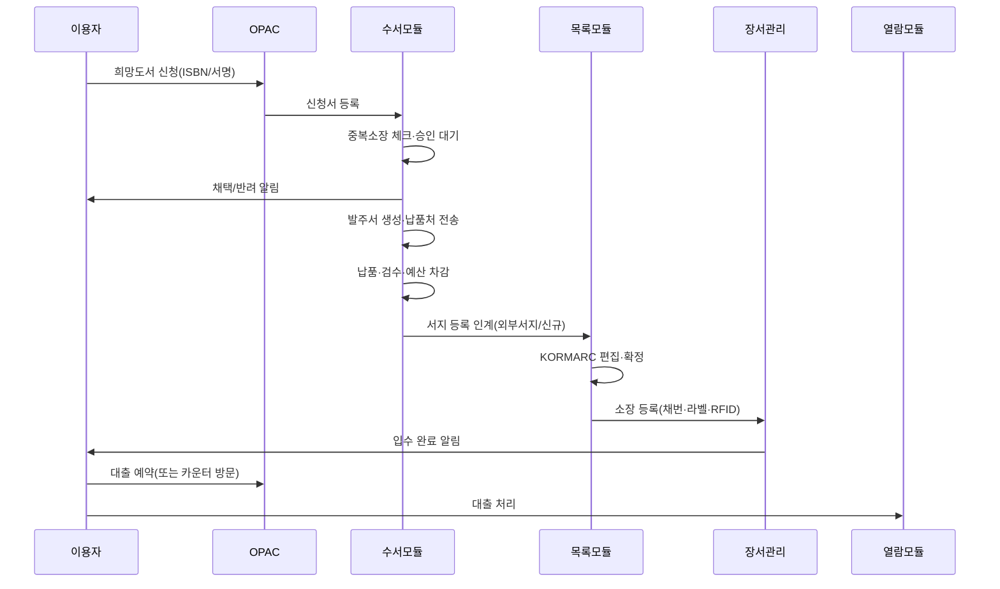
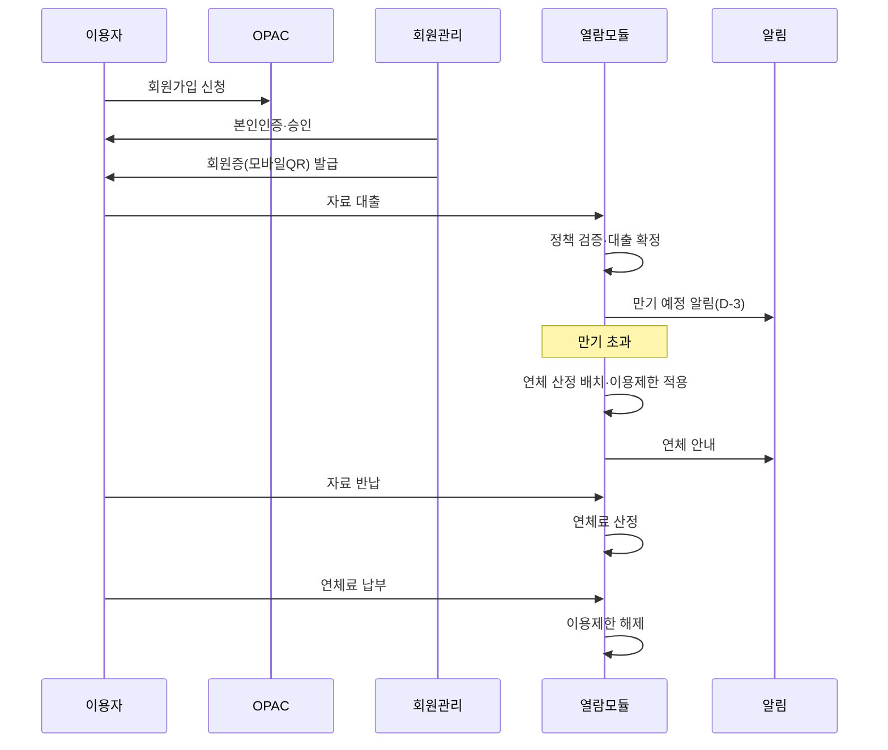
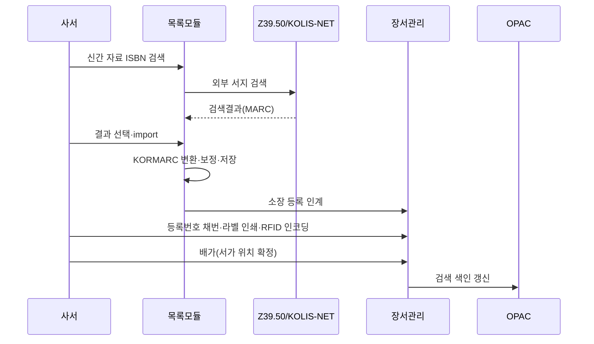
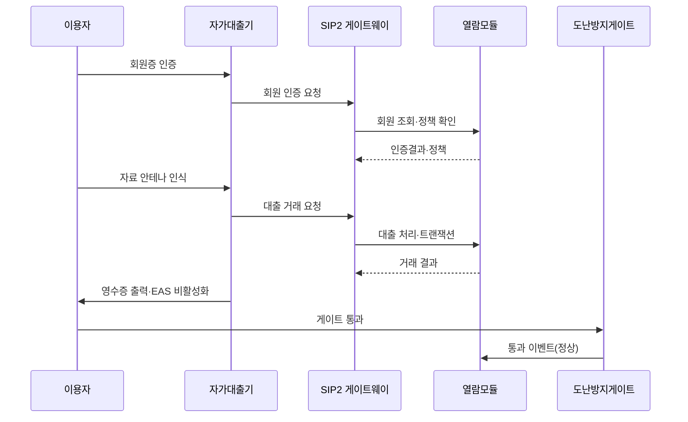
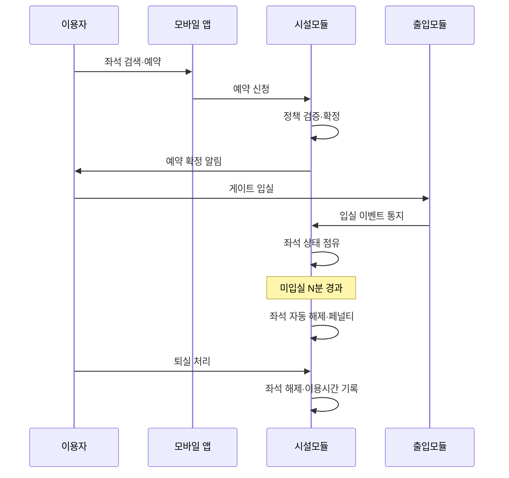
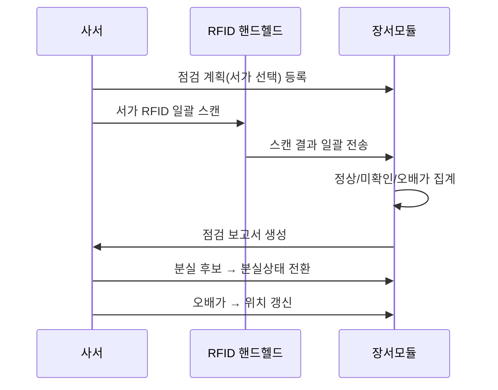
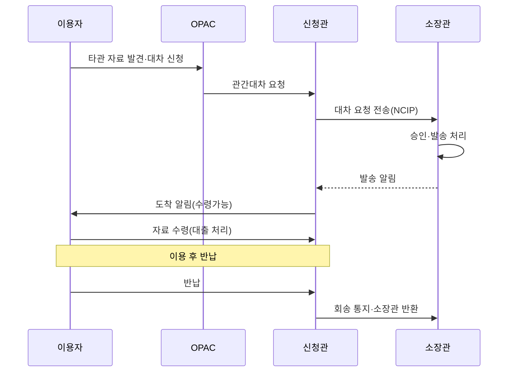

# 화면 흐름·메뉴 IA 초안 (Screen Flow & Information Architecture)

| 항목 | 내용 |
|---|---|
| 문서명 | 화면 흐름·메뉴 IA |
| 문서 ID | PLN-08 |
| 버전 | v0.1 Draft |
| 작성일 | 2026-05-11 |
| 작성자 | Planner Agent |
| 검토자 | PM, DevLead, Designer, FrontendSenior |
| 상태 | 초안 |

---

## 1. 문서 목적

Tulip+ 도서관통합관리시스템의 **사이트맵(IA), 핵심 사용자 시나리오, 화면 목록 매트릭스**를 제시한다. 본 문서는 Designer의 와이어프레임·디자인 시스템과 FrontendSenior의 라우팅·컴포넌트 구조 설계의 기초 입력으로 활용된다.

## 2. 사용자 페르소나

| Persona | 약어 | 주 사용 영역 | 디바이스 |
|---|---|---|---|
| 시스템 관리자(플랫폼 운영자) | SA | 테넌트·플랜·모니터링 | 데스크톱 |
| 관장 | DIR | 대시보드·결재·통계 | 데스크톱·태블릿 |
| 사서(편목/수서/열람) | LIB | 전 업무 영역 | 데스크톱·핸드헬드 |
| 일반 사서·열람담당 | CIR | 대출/반납/회원 | 데스크톱·POS |
| 일반 이용자 | USR | OPAC·예약·내정보·좌석 | 모바일·데스크톱 |
| 외부 이용자(임시증) | EXT | 검색만 | 모바일·키오스크 |

---

## 3. 사이트맵 (3 레벨)

### 3.1 관리자/사서 시스템

```
[Tulip+ 관리시스템]
├── 1. 대시보드
│   ├── 1.1 통합 대시보드 (KPI)
│   ├── 1.2 일일 운영현황
│   └── 1.3 알림센터
├── 2. 회원관리
│   ├── 2.1 회원 조회
│   ├── 2.2 회원 등록·수정
│   ├── 2.3 회원유형 관리
│   ├── 2.4 회원증 발급
│   ├── 2.5 회원 일괄등록
│   └── 2.6 회원 통계
├── 3. 목록(편목)
│   ├── 3.1 서지 검색·관리
│   ├── 3.2 KORMARC 편집기
│   ├── 3.3 외부서지 검색(Z39.50)
│   ├── 3.4 KOLIS-NET 송수신
│   ├── 3.5 권위레코드 관리
│   ├── 3.6 분류표·주제어
│   ├── 3.7 일괄 import/export
│   └── 3.8 서지 결합/분리/중복
├── 4. 수서
│   ├── 4.1 희망도서 관리
│   ├── 4.2 선정 후보 관리
│   ├── 4.3 발주 관리
│   ├── 4.4 납품처 관리
│   ├── 4.5 검수·납품 등록
│   ├── 4.6 예산 관리
│   ├── 4.7 기증·교환
│   └── 4.8 연속간행물 구독
├── 5. 장서관리
│   ├── 5.1 소장 등록·조회
│   ├── 5.2 등록번호 채번 정책
│   ├── 5.3 라벨·RFID 인코딩
│   ├── 5.4 장서 점검(인벤토리)
│   ├── 5.5 이관·재배가
│   ├── 5.6 제적·폐기
│   ├── 5.7 보존서가·귀중자료
│   └── 5.8 장서 통계
├── 6. 열람(대출/반납)
│   ├── 6.1 대출/반납 카운터
│   ├── 6.2 예약 관리
│   ├── 6.3 연체·연체료
│   ├── 6.4 분실/훼손·변상
│   ├── 6.5 관간대차
│   ├── 6.6 자가기기 모니터링
│   └── 6.7 대출 통계
├── 7. 출입관리
│   ├── 7.1 게이트·장비 관리
│   ├── 7.2 출입정책
│   ├── 7.3 출입이력 조회
│   ├── 7.4 재실현황
│   ├── 7.5 EAS·보안이벤트
│   └── 7.6 임시증 발급
├── 8. 시설관리
│   ├── 8.1 좌석 마스터·현황
│   ├── 8.2 좌석 예약 관리
│   ├── 8.3 회의실/세미나실
│   ├── 8.4 시설 점검·고장신고
│   ├── 8.5 분실물
│   └── 8.6 시설 이용 통계
├── 9. 통계·리포트
│   ├── 9.1 정형 리포트
│   ├── 9.2 비정형 리포트
│   ├── 9.3 KOLIS-NET 통계 제출
│   ├── 9.4 KERIS·DLS 통계
│   └── 9.5 스케줄 리포트
├── 10. 정책·코드
│   ├── 10.1 대출/예약/연체 정책
│   ├── 10.2 코드·공통마스터
│   ├── 10.3 분류표·도서기호
│   └── 10.4 알림 템플릿
├── 11. 시스템·관리자
│   ├── 11.1 관(Branch) 관리
│   ├── 11.2 운영시간·휴관일
│   ├── 11.3 권한·역할
│   ├── 11.4 사용자(직원)
│   ├── 11.5 외부 연동 설정
│   ├── 11.6 감사로그·개인정보 접근로그
│   └── 11.7 테넌트(시스템 관리자)
└── 12. 내정보
    ├── 12.1 비밀번호 변경
    ├── 12.2 알림 설정
    └── 12.3 로그아웃
```

### 3.2 이용자 OPAC

```
[Tulip+ OPAC]
├── 1. 홈
│   ├── 1.1 통합 검색바
│   ├── 1.2 신간·인기·추천
│   └── 1.3 공지사항
├── 2. 자료 검색
│   ├── 2.1 통합 검색
│   ├── 2.2 상세 검색
│   ├── 2.3 분류 브라우즈
│   └── 2.4 검색 결과
├── 3. 자료 상세
│   ├── 3.1 서지 정보
│   ├── 3.2 소장 정보·예약가능
│   ├── 3.3 예약 신청
│   └── 3.4 관련 자료
├── 4. 내정보(MyLibrary)
│   ├── 4.1 대출 현황
│   ├── 4.2 예약 현황
│   ├── 4.3 연체·연체료
│   ├── 4.4 이용 이력
│   ├── 4.5 희망도서 신청·진행
│   ├── 4.6 즐겨찾기·태그
│   └── 4.7 회원증·내정보 수정
├── 5. 좌석·시설
│   ├── 5.1 좌석 현황·예약
│   ├── 5.2 회의실 예약
│   └── 5.3 내 예약 관리
├── 6. 도서관 안내
│   ├── 6.1 이용안내·정책
│   ├── 6.2 운영시간·휴관
│   └── 6.3 공지사항·이벤트
└── 7. 로그인·회원가입
    ├── 7.1 일반 로그인
    ├── 7.2 SSO 로그인 (학교/기관)
    └── 7.3 회원가입·본인인증
```

---

## 4. 핵심 사용자 시나리오

### 4.1 시나리오 1: 희망도서 신청 → 발주 → 입고 → 대출



### 4.2 시나리오 2: 회원가입 → 대출 → 연체 → 완납·해제



### 4.3 시나리오 3: 외부서지 복사목록 → 소장 등록 → 배가



### 4.4 시나리오 4: 자가대출(RFID/SIP2)



### 4.5 시나리오 5: 좌석 예약·이용·페널티



### 4.6 시나리오 6: 장서점검(RFID) → 분실/오배가 처리



### 4.7 시나리오 7: 관간대차 (다관)



---

## 5. 화면 목록 매트릭스 (도메인 × 사용자)

> 화면 ID 규칙: `SCR-{도메인}-{역할}-{일련번호}`. 역할: `A`(관리자/사서), `O`(OPAC 이용자), `K`(키오스크), `M`(모바일).

### 5.1 공통(CMN)

| 화면 ID | 화면명 | 역할 | 주요기능 |
|---|---|---|---|
| SCR-CMN-A-001 | 로그인 | A | 로그인·SSO·비밀번호 찾기 |
| SCR-CMN-A-002 | 통합 대시보드 | A | KPI·차트·알림 |
| SCR-CMN-A-003 | 회원 조회/검색 | A | 회원 검색·필터·정렬 |
| SCR-CMN-A-004 | 회원 등록/수정 | A | 신규/수정 폼·동의·인증 |
| SCR-CMN-A-005 | 회원유형 관리 | A | 유형 CRUD·정책 매핑 |
| SCR-CMN-A-006 | 회원 일괄등록 | A | CSV/Excel 업로드 |
| SCR-CMN-A-007 | 회원증 발급 | A | QR/바코드/IC 발급 |
| SCR-CMN-A-008 | 코드 관리 | A | 코드그룹·코드값 CRUD |
| SCR-CMN-A-009 | 권한·역할 | A | 역할·권한·매핑 |
| SCR-CMN-A-010 | 정책 관리 | A | 대출/예약/연체/시설 정책 |
| SCR-CMN-A-011 | 관(Branch) 관리 | A | 관 CRUD·운영시간 |
| SCR-CMN-A-012 | 알림 템플릿 | A | 알림 템플릿·테스트 |
| SCR-CMN-A-013 | 감사·접근로그 | A | 검색·다운로드 |
| SCR-CMN-A-014 | 내정보 | A | 비밀번호·알림설정 |

### 5.2 수서(ACQ)

| 화면 ID | 화면명 | 역할 | 주요기능 |
|---|---|---|---|
| SCR-ACQ-A-001 | 희망도서 신청 관리 | A | 목록·검토·승인 |
| SCR-ACQ-A-002 | 선정 후보 관리 | A | 신간·외부 import |
| SCR-ACQ-A-003 | 발주서 작성·관리 | A | 발주 생성·승인·전송 |
| SCR-ACQ-A-004 | 납품처 마스터 | A | 납품처·계약·견적 |
| SCR-ACQ-A-005 | 검수·납품 등록 | A | 검수 결과·반품 |
| SCR-ACQ-A-006 | 예산 편성·관리 | A | 편성·집행·잔액 |
| SCR-ACQ-A-007 | 예산 보고서 | A | 집행·이월·결산 |
| SCR-ACQ-A-008 | 기증·교환 관리 | A | 접수·심사·증서 |
| SCR-ACQ-A-009 | 연속간행물 구독 | A | 구독·호 입수·결호 |
| SCR-ACQ-A-010 | 수서 통계 | A | 선정·발주·납품 통계 |
| SCR-ACQ-O-001 | OPAC 희망도서 신청 | O | 신청 폼 |
| SCR-ACQ-O-002 | OPAC 희망도서 진행 | O | 진행상태 조회 |

### 5.3 목록(CAT)

| 화면 ID | 화면명 | 역할 | 주요기능 |
|---|---|---|---|
| SCR-CAT-A-001 | 서지 검색 | A | 키워드·필드 검색 |
| SCR-CAT-A-002 | KORMARC 편집기 | A | 필드/지시기호/식별기호 편집 |
| SCR-CAT-A-003 | 서지 상세 | A | 서지·소장·이력 |
| SCR-CAT-A-004 | 외부서지 검색(Z39.50) | A | 다중서버 검색·import |
| SCR-CAT-A-005 | KOLIS-NET 송수신 | A | 송신·수신·이력 |
| SCR-CAT-A-006 | 권위레코드 관리 | A | CRUD·이형 관리 |
| SCR-CAT-A-007 | 분류표 브라우즈 | A | KDC/DDC/LC 트리 |
| SCR-CAT-A-008 | 서지 일괄 import/export | A | MARC 파일·MARCXML |
| SCR-CAT-A-009 | 서지 결합/분리/중복 | A | 중복 후보·머지 |
| SCR-CAT-A-010 | 임시저장함 | A | 작업중 서지 |

### 5.4 열람(CIR)

| 화면 ID | 화면명 | 역할 | 주요기능 |
|---|---|---|---|
| SCR-CIR-A-001 | 대출/반납 카운터 | A | 회원·자료 통합 처리 |
| SCR-CIR-A-002 | 예약 관리 | A | 예약 목록·도착처리·취소 |
| SCR-CIR-A-003 | 연체·연체료 | A | 연체현황·면제·수납 |
| SCR-CIR-A-004 | 분실/훼손 처리 | A | 신고·변상·환불 |
| SCR-CIR-A-005 | 관간대차 관리 | A | 신청·발송·도착·회송 |
| SCR-CIR-A-006 | 자가기기 모니터링 | A | 기기 상태·거래 |
| SCR-CIR-A-007 | 대출 통계·일일마감 | A | 일/주/월 통계 |
| SCR-CIR-O-001 | OPAC 메인 | O | 검색바·신간·추천 |
| SCR-CIR-O-002 | 통합 검색 결과 | O | 결과·패싯·정렬 |
| SCR-CIR-O-003 | 자료 상세 | O | 서지·소장·예약 |
| SCR-CIR-O-004 | MyLibrary 대출 | O | 대출·연장 |
| SCR-CIR-O-005 | MyLibrary 예약 | O | 예약 현황·취소 |
| SCR-CIR-O-006 | MyLibrary 연체·이용내역 | O | 연체·이력 |
| SCR-CIR-K-001 | 자가대출 키오스크 | K | 인증·스캔·영수증 |
| SCR-CIR-K-002 | 자가반납 키오스크 | K | 스캔·반납·예약알림 |
| SCR-CIR-M-001 | 모바일 OPAC | M | 모바일 반응형 검색 |
| SCR-CIR-M-002 | 모바일 회원증 | M | QR/NFC |

### 5.5 장서관리(COL)

| 화면 ID | 화면명 | 역할 | 주요기능 |
|---|---|---|---|
| SCR-COL-A-001 | 소장 등록 | A | 등록·채번·라벨 |
| SCR-COL-A-002 | 소장 조회/수정 | A | 검색·수정·이력 |
| SCR-COL-A-003 | 채번 정책 | A | 관별 채번 규칙 |
| SCR-COL-A-004 | 라벨·RFID 인코딩 | A | 라벨 일괄·RFID 쓰기 |
| SCR-COL-A-005 | 장서 점검 | A | 계획·스캔·보고서 |
| SCR-COL-A-006 | 이관·재배가 | A | 이관 워크플로 |
| SCR-COL-A-007 | 제적·폐기 | A | 신청·승인·처리 |
| SCR-COL-A-008 | 보존서가·귀중자료 | A | 별도 관리 |
| SCR-COL-A-009 | 장서 통계 | A | 분류·이용률·미이용 |
| SCR-COL-A-010 | 점검 핸드헬드 | A/M | 모바일 점검 UI |

### 5.6 출입관리(ACS)

| 화면 ID | 화면명 | 역할 | 주요기능 |
|---|---|---|---|
| SCR-ACS-A-001 | 게이트·장비 관리 | A | 장비 상태·설정 |
| SCR-ACS-A-002 | 출입정책 | A | 시간·구역·유형별 정책 |
| SCR-ACS-A-003 | 출입이력 조회 | A | 회원·게이트별 |
| SCR-ACS-A-004 | 재실현황 | A | 실시간 점유 |
| SCR-ACS-A-005 | EAS·보안이벤트 | A | 이벤트·처리 |
| SCR-ACS-A-006 | 임시증 발급 | A | 발급·회수 |
| SCR-ACS-K-001 | 출입 키오스크 | K | 임시증 셀프 발급 |

### 5.7 시설관리(FAC)

| 화면 ID | 화면명 | 역할 | 주요기능 |
|---|---|---|---|
| SCR-FAC-A-001 | 좌석 마스터·현황 | A | 좌석 등록·실시간 점유 |
| SCR-FAC-A-002 | 좌석 예약 관리 | A | 예약·이용·페널티 |
| SCR-FAC-A-003 | 회의실 예약 관리 | A | 승인·일정 |
| SCR-FAC-A-004 | 시설 점검·고장신고 | A | 점검·고장 처리 |
| SCR-FAC-A-005 | 분실물 관리 | A | 등록·반환 |
| SCR-FAC-A-006 | 시설 통계 | A | 이용률·노쇼 |
| SCR-FAC-O-001 | 좌석 현황·예약 (OPAC) | O | 좌석맵·예약 |
| SCR-FAC-O-002 | 회의실 예약 (OPAC) | O | 일정·신청 |
| SCR-FAC-M-001 | 모바일 좌석예약 | M | 좌석맵·QR 입실 |
| SCR-FAC-K-001 | 좌석발권 키오스크 | K | 회원증·좌석 선택 |

### 5.8 통계·시스템·관리자 영역

| 화면 ID | 화면명 | 역할 | 주요기능 |
|---|---|---|---|
| SCR-STA-A-001 | 정형 리포트 | A | 표준 양식 |
| SCR-STA-A-002 | 비정형 리포트 | A | 조건검색·엑셀 |
| SCR-STA-A-003 | KOLIS·KERIS·DLS 통계 | A | 국가표준 제출 |
| SCR-SYS-SA-001 | 테넌트 관리 | SA | 테넌트·플랜 |
| SCR-SYS-SA-002 | 시스템 모니터링 | SA | 가용성·성능 |
| SCR-SYS-A-001 | 외부 연동 설정 | A | SSO·API 키 |

---

## 6. 화면 수 요약

| 도메인 | 관리자/사서(A) | OPAC(O) | 키오스크(K) | 모바일(M) | 합계 |
|---|---|---|---|---|---|
| CMN | 14 | - | - | - | 14 |
| ACQ | 10 | 2 | - | - | 12 |
| CAT | 10 | - | - | - | 10 |
| CIR | 7 | 6 | 2 | 2 | 17 |
| COL | 10(1중복) | - | - | - | 10 |
| ACS | 6 | - | 1 | - | 7 |
| FAC | 6 | 2 | 1 | 1 | 10 |
| 통계/시스템 | 6 | - | - | - | 6 |
| **총계** | **69** | **10** | **4** | **3** | **86** |

---

## 7. 후속 작업 (Designer / FrontendSenior 입력)

| 후속 산출물 | 담당 | 입력 |
|---|---|---|
| 와이어프레임 | Designer | 본 IA 사이트맵·화면 매트릭스 |
| 디자인 시스템 | Designer | 페르소나·디바이스 매트릭스 |
| 라우팅·페이지 구조 | FrontendSenior | 화면 ID·역할별 메뉴 |
| API 계약 | DevLead·BackendSenior | 각 도메인 요구사항의 API 표 |

---

**식별된 화면 수: 86개 (관리자 69 / OPAC 10 / 키오스크 4 / 모바일 3)**
