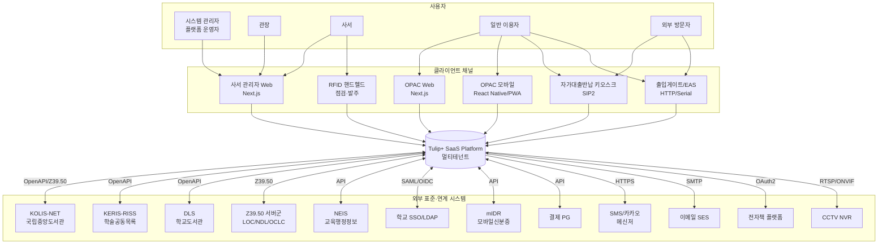
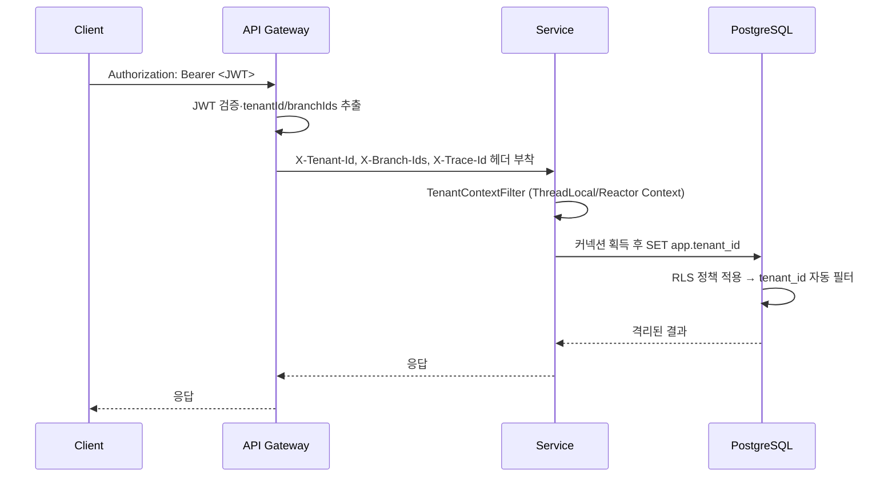
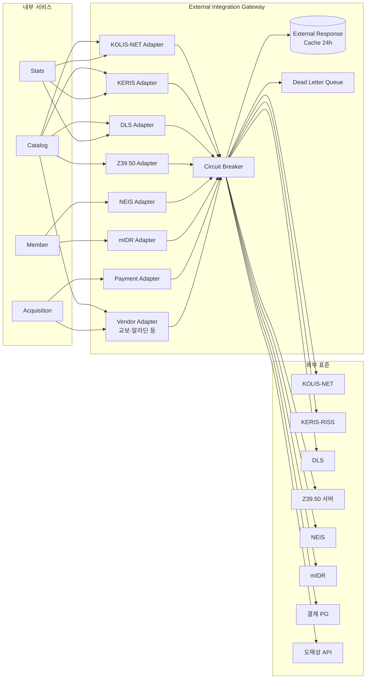
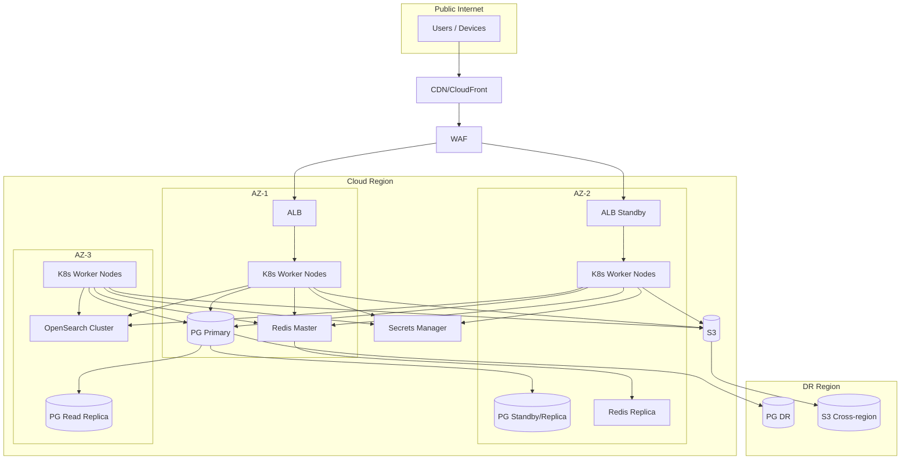

# 시스템 아키텍처 개요 (Architecture Overview)

| 항목 | 내용 |
|---|---|
| 문서명 | Tulip+ 시스템 아키텍처 개요 |
| 문서 ID | DEV-01 |
| 버전 | v0.1 Draft |
| 작성일 | 2026-05-11 |
| 작성자 | DevLead Agent |
| 검토자 | PM, DBA, BackendSenior, FrontendSenior |
| 입력 | `01_pm/01~04`, `02_planner/00~08` |
| 후속 | `02_service_decomposition.md`, `10_dba/*` |
| 상태 | Phase 0 초안 |

---

## 1. 문서 목적

본 문서는 Tulip+ 도서관통합관리시스템의 **상위 시스템 아키텍처**를 정의한다. Planner 357개 기능과 PM 헌장·리스크를 입력으로, 멀티테넌트 SaaS의 컨텍스트·컨테이너·배치 토폴로지·외부 표준 연계 구조·인프라 전략을 결정한다. 후속 산출물(서비스 분할, API 표준, DB 설계, 인증 설계)의 기준이 된다.

### 1.1 아키텍처 결정 원칙
1. **표준 우선**: KORMARC, Z39.50, SIP2, NCIP, KOLIS-NET, KERIS, DLS 등 외부 표준을 어댑터로 격리.
2. **테넌트 안전성**: 모든 경로에 `tenantId` 강제, RLS + 토큰 검증 이중화 (R-06 회피).
3. **하드웨어 추상화**: 게이트·키오스크·EAS는 게이트웨이 서비스에서 어댑터 패턴으로 흡수 (R-04, R-05).
4. **점진적 확장**: Phase 1 단일 클러스터 → Phase 4 이후 도메인별 분리.
5. **장애 격리**: 외부 시스템 응답 지연(R-09)이 핵심 트랜잭션에 전파되지 않도록 비동기·서킷 브레이커.

---

## 2. C4 Level 1 — 시스템 컨텍스트

---

## 3. C4 Level 2 — 컨테이너 다이어그램

```mermaid
graph TB
    subgraph 클라이언트
        FE_ADMIN[사서 관리자<br/>Next.js SSR/CSR]
        FE_OPAC[OPAC Web/PWA<br/>Next.js SSR/ISR]
        FE_MOB[OPAC Mobile<br/>React Native]
        DEV_KIOSK[키오스크 SW<br/>Electron/Native]
        DEV_HH[RFID Handheld<br/>Android App]
    end

    subgraph Edge[Edge Layer]
        CDN[CDN<br/>CloudFront]
        WAF[WAF + DDoS]
        LB[Global LB<br/>NLB/ALB]
    end

    subgraph Gateway[게이트웨이 계층]
        GW[Spring Cloud Gateway<br/>API Gateway]
        BFF_ADMIN[BFF: Admin<br/>Spring Boot]
        BFF_OPAC[BFF: OPAC<br/>Spring Boot]
        HW_GW[Hardware Gateway<br/>SIP2/NCIP/EAS]
    end

    subgraph Core[핵심 마이크로서비스]
        IAM[IAM Service<br/>OAuth2/JWT]
        TENANT[Tenant Service<br/>관·구독·정책]
        MEMBER[Member Service<br/>회원·인증연동]
        CODE[Code/Policy Service<br/>마스터·정책엔진]
        CAT_S[Catalog Service<br/>KORMARC·권위]
        COL_S[Collection Service<br/>소장·점검·제적]
        ACQ_S[Acquisition Service<br/>발주·예산·시리얼]
        CIR_S[Circulation Service<br/>대출·예약·연체]
        ACS_S[Access Service<br/>출입·EAS]
        FAC_S[Facility Service<br/>좌석·시설]
        STAT[Stats/Report Service<br/>리포트·대시보드]
        NOTI[Notification Service<br/>SMS/메일/푸시]
        FILE[File Service<br/>업로드·미디어]
        EXT_GW[External Integration Gateway<br/>KOLIS·Z39.50·NEIS]
        SEARCH[Search Service<br/>OPAC 검색 BFF]
    end

    subgraph Async[비동기 메시징]
        BUS[Event Bus<br/>Kafka 또는 RabbitMQ]
        OUTBOX[Outbox Workers]
        BATCH[Spring Batch<br/>연체/통계/이월]
    end

    subgraph Data[데이터 저장]
        PG_MAIN[(PostgreSQL Primary<br/>도메인별 스키마)]
        PG_REPLICA[(PostgreSQL Read Replicas)]
        ES[(OpenSearch/ES<br/>OPAC 검색 인덱스)]
        REDIS[(Redis<br/>세션·캐시·Rate Limit)]
        S3[(S3 Object Storage<br/>MARC파일·라벨·첨부)]
        DW[(데이터 마트<br/>통계·DW)]
    end

    subgraph Obs[관측·운영]
        APM[APM/Trace<br/>OpenTelemetry]
        LOG[Log Pipeline<br/>ELK/Loki]
        METRIC[Prometheus + Grafana]
        SIEM[Audit/SIEM]
    end

    FE_ADMIN --> CDN
    FE_OPAC --> CDN
    FE_MOB --> WAF
    DEV_KIOSK --> WAF
    DEV_HH --> WAF
    CDN --> WAF --> LB --> GW

    GW --> BFF_ADMIN
    GW --> BFF_OPAC
    DEV_KIOSK -->|SIP2| HW_GW
    GATE_HW[게이트/EAS] -->|HTTP/Serial| HW_GW

    BFF_ADMIN --> IAM
    BFF_ADMIN --> TENANT
    BFF_ADMIN --> MEMBER
    BFF_ADMIN --> CAT_S
    BFF_ADMIN --> COL_S
    BFF_ADMIN --> ACQ_S
    BFF_ADMIN --> CIR_S
    BFF_ADMIN --> ACS_S
    BFF_ADMIN --> FAC_S
    BFF_ADMIN --> STAT

    BFF_OPAC --> SEARCH
    BFF_OPAC --> MEMBER
    BFF_OPAC --> CIR_S
    BFF_OPAC --> FAC_S
    BFF_OPAC --> ACQ_S

    HW_GW --> CIR_S
    HW_GW --> ACS_S

    CAT_S --> EXT_GW
    ACQ_S --> EXT_GW
    STAT --> EXT_GW

    CAT_S -->|색인 이벤트| BUS
    CIR_S -->|대출이벤트| BUS
    ACQ_S -->|입수이벤트| BUS
    MEMBER -->|회원이벤트| BUS
    BUS --> SEARCH
    BUS --> NOTI
    BUS --> STAT
    BUS --> OUTBOX
    BATCH --> PG_REPLICA

    IAM --> REDIS
    TENANT --> PG_MAIN
    MEMBER --> PG_MAIN
    CODE --> PG_MAIN
    CAT_S --> PG_MAIN
    COL_S --> PG_MAIN
    ACQ_S --> PG_MAIN
    CIR_S --> PG_MAIN
    ACS_S --> PG_MAIN
    FAC_S --> PG_MAIN
    SEARCH --> ES
    FILE --> S3
    STAT --> DW

    PG_MAIN --> PG_REPLICA

    Core --> APM
    Core --> LOG
    Core --> METRIC
    IAM --> SIEM
```

---

## 4. 멀티테넌트 격리 전략

### 4.1 격리 모델 선택

| 격리 방식 | 장점 | 단점 | Tulip+ 적용 |
|---|---|---|---|
| Database 격리 | 완전 격리, 백업 단순 | 비용↑, 운영부담↑, 1,000 테넌트 시 불가 | 미채택 (대형 단일 기관 옵션) |
| Schema 격리 | 논리적 분리, 마이그레이션 분리 | 인덱스·캐시 메모리 폭증 | **옵션 (Y2 이후 대형 기관)** |
| **Row-level (tenant_id) 격리** | 비용 효율, 통계·운영 단순 | 누설 리스크, 모든 쿼리 강제 필요 | **기본 채택 (Phase 1~)** |

### 4.2 채택: 하이브리드 Row-level + Schema 옵션

> PM 헌장 5.1 "Row-level 격리 + 옵션별 Schema 분리"와 R-06 회피 전략에 부합. DBA `10_dba/`에서 구체 DDL 정의.

| 구성 | 적용 |
|---|---|
| 기본 격리 | 모든 도메인 테이블에 `tenant_id BIGINT NOT NULL` 컬럼, 모든 쿼리·인덱스에 포함 |
| PostgreSQL RLS | 정책으로 `tenant_id = current_setting('app.tenant_id')` 강제 적용 |
| 강제 격리 | JDBC 커넥션 획득 시 `SET app.tenant_id = ?` 세팅, MyBatis Interceptor가 누락 차단 |
| 공유 마스터 | 분류표(KDC/DDC), 코드 마스터, KORMARC 양식 표준 등은 `tenant_id IS NULL` 또는 별도 `meta` 스키마 |
| 전용 인스턴스 옵션 | Y2 이후 대형 공공·대학 요청 시 별도 스키마 또는 DB 분리 (CMN-006 구독 플랜) |
| 검증 자동화 | CI에 RLS 회귀 테스트 1만건 매트릭스 (회원·서지·대출 전 도메인) |

### 4.3 테넌트 컨텍스트 전파 흐름

### 4.4 시스템 관리자(플랫폼 운영자) 특별 처리
- `role: PLATFORM_ADMIN` 토큰만 명시적 `X-Tenant-Id` 헤더로 임의 테넌트 전환 허용.
- 전환 시 감사로그 `AUDIT_TENANT_SWITCH` 의무 기록 (CMN-082, R-10 대응).

---

## 5. 클라이언트 채널 아키텍처

### 5.1 채널별 특성

| 채널 | 기술 | 사용자 | 렌더링 | 인증 | 오프라인 |
|---|---|---|---|---|---|
| 사서 관리자 Web | Next.js (App Router) | 사서·관장·SA | SSR + CSR | OAuth2 Auth Code + PKCE | 미지원 |
| OPAC Web | Next.js | 일반 이용자 | SSR + ISR (목록·서지) | Optional Login + OIDC | 캐시 |
| OPAC Mobile | PWA (1차) / React Native (Y2) | 일반 이용자 | CSR + Service Worker | OIDC | 회원증 QR 로컬 캐시 |
| 자가대출반납기 | Electron 또는 Native | 이용자(무인) | CSR | SIP2 Login (login_uid/pw) | 5분 큐 |
| RFID 핸드헬드 | Android App (장서점검·검수) | 사서 | Native | OAuth2 Device Flow | 일괄 동기화 |
| 출입게이트 | 임베디드/PC + HTTP | 무인 | - | 게이트 디바이스 토큰 | 캐시 인증 |
| EAS 게이트 | 벤더 SDK + Webhook | 무인 | - | 디바이스 토큰 | 이벤트 큐 |

### 5.2 BFF (Backend for Frontend) 분리 근거

- **관리자 BFF**: 복잡한 화면별 다중 도메인 집계 (예: 대출 카운터 → 회원 + 자료 + 정책 + 연체 동시 조회). 권한 매트릭스 다중 검증 필요.
- **OPAC BFF**: SSR 렌더링 캐시·SEO·검색 최적화. ES 직접 호출, 익명 사용자 캐싱.
- **Hardware Gateway**: SIP2/NCIP 프로토콜 변환, 디바이스 인증·세션 관리, EAS 이벤트 수신.

---

## 6. 외부 시스템 연동 아키텍처

### 6.1 통합 게이트웨이 패턴

모든 외부 표준 연계는 **External Integration Gateway**가 단일 진입점으로 흡수한다. 외부 응답 지연(R-09)과 표준 변경(R-02, R-03)의 영향 격리.

### 6.2 외부 연동 정책

| 연동 대상 | 통신 방식 | 동기/비동기 | 타임아웃 | 캐시 | 재시도 |
|---|---|---|---|---|---|
| KOLIS-NET (서지 검색) | OpenAPI | 동기 (사용자 검색) | 5s | 24h | 3회 (지수백오프) |
| KOLIS-NET (서지 송신) | 파일업로드 | 비동기 큐 | - | - | 3회 + DLQ |
| KOLIS-NET (통계 제출) | 파일업로드 | 비동기 | - | - | 무제한 (수동확인) |
| KERIS-RISS / DLS | OpenAPI | 동기 + 캐시 | 5s | 24h | 3회 |
| Z39.50 다중서버 | TCP/BER | 비동기 병렬 | 5s/서버 | 24h | 1회 (개별) |
| NEIS (학생 동기화) | API | 야간 배치 + 변경 푸시 | - | - | 무제한 |
| mIDR / SSO / LDAP | SAML/OIDC | 동기 (인증) | 3s | 세션 | 0 (실패 표시) |
| 결제 PG | API | 동기 + 콜백 | 10s | - | 콜백 멱등 |
| 도매상 ISBN 조회 | API | 동기 | 3s | 7일 | 3회 |
| SIP2 자가대출 | TCP Persistent | 동기 | 5s | - | 클라이언트 큐 |
| NCIP 관간대차 | SOAP/HTTP | 비동기 메시징 | - | - | 3회 + Saga 보상 |
| EAS 게이트 | Webhook/TCP | 비동기 이벤트 | - | - | 이벤트 큐 |
| SMS/카카오/이메일 | HTTPS API | 비동기 큐 | 5s | - | 3회 + DLQ |

### 6.3 ADR-001: Z39.50 응답 지연 격리
- 결정: Z39.50 호출은 **API Gateway에서 별도 워커 풀**로 분리, 메인 OPAC 검색 응답과 결합하지 않는다.
- 근거: R-09. 외부 서버 응답 5초 초과 시 OPAC 사용성 저하 방지.
- 결과: 사용자에게 "외부 결과 로딩 중" 상태를 비동기 폴링·SSE로 표시.

---

## 7. 인프라 토폴로지

### 7.1 배치 아키텍처

### 7.2 환경 구분

| 환경 | 용도 | 인프라 | 데이터 |
|---|---|---|---|
| Local | 개발자 PC | Docker Compose | Mock + 일부 샘플 |
| Dev | 통합 개발 | K8s namespace `dev` | 가짜 데이터 |
| Stg | QA·UAT | K8s namespace `stg`, 본운영 동일 토폴로지 (축소) | 마스킹된 운영 복제본 |
| Prod | 운영 | K8s 전용 클러스터, Multi-AZ | 실 운영 데이터 |
| DR | 재해복구 | 별도 리전 Warm Standby | 매시간 WAL 복제 |

### 7.3 핵심 비기능 요구 매핑 (PM 헌장 3.2)

| 요구사항 | 아키텍처 대응 |
|---|---|
| 가용성 99.5% | Multi-AZ, K8s HPA, PG HA(Patroni 또는 RDS Multi-AZ), 무중단 배포(Blue-Green) |
| P99 응답 500ms | Read Replica 분리, Redis 캐시, OpenSearch 검색 |
| 테넌트 격리 사고 0건 | RLS + JWT 검증 + CI 회귀 + 분기 침투 테스트 |
| 동시 1,000명 부하 | HPA + Stateless 서비스 + 캐시 + 인덱스 최적화 (DBA 협업) |
| 부하 테스트 통과 | Phase 1 1차, Phase 4 시나리오 부하 (대출·OPAC) |

---

## 8. 도메인×채널×외부 매트릭스

| 도메인 | 사서 Admin | OPAC | 키오스크 | 핸드헬드 | 게이트 | 외부 연동 |
|---|---|---|---|---|---|---|
| CMN (공통) | O | O | - | - | - | SSO, LDAP, mIDR, NEIS, SMS, Email |
| ACQ (수서) | O | O (희망) | - | - | - | ISBN DB, KOLIS, 도매상, 결제 |
| CAT (목록) | O | (검색만) | - | - | - | KOLIS, KERIS, DLS, Z39.50 |
| CIR (열람) | O | O | O | - | - | SIP2, NCIP, 전자책, SMS |
| COL (장서) | O | - | - | O | - | RFID Encoder, 라벨 프린터 |
| ACS (출입) | O | - | O (임시증) | - | O | NEIS, CCTV, RFID |
| FAC (시설) | O | O | O (좌석) | - | (입퇴실) | 결제 PG |

---

## 9. 핵심 아키텍처 결정 사항 (ADR 요약)

| ADR | 결정 | 근거 |
|---|---|---|
| ADR-001 | Z39.50 별도 워커풀 + 비동기 응답 | R-09 외부 지연 격리 |
| ADR-002 | tenant_id Row-level + PostgreSQL RLS | R-06 격리 + 비용효율 |
| ADR-003 | SIP2/NCIP/EAS 모두 Hardware Gateway에서 어댑터 흡수 | R-04, R-05 벤더 다양성 |
| ADR-004 | KORMARC = 정형 컬럼(검색) + JSONB(원본) 하이브리드 | R-08 검색 성능 + 호환성 |
| ADR-005 | OPAC 검색은 OpenSearch/ES 색인, 서지 본문은 PG | 검색 성능 + 정합성 |
| ADR-006 | 관간대차·재고차감은 Saga + Outbox | R-18 분산 정합성 |
| ADR-007 | 정책(대출권수·기간 등) 데이터 외부화 + Policy Engine 검토 | R-16 분기 폭증 방지 |
| ADR-008 | BFF는 관리자/OPAC/Hardware 3개로 분리 | 채널별 요구 상이 |
| ADR-009 | 이벤트 버스 1차 Kafka 우선 (Outbox 패턴) | 도메인 이벤트 + 통계 + 알림 |
| ADR-010 | 무중단 배포 Blue-Green, PG 변경은 무중단 마이그레이션 | R-21 가용성 |

---

## 10. 후속 산출물 인계

| 인계 대상 | 참조 문서 | 내용 |
|---|---|---|
| BackendSenior / Dev | `05_backend/` | 본 컨테이너 구조 기반 모듈 구현 |
| DBA | `10_dba/` | 4.2 격리 모델, 8.x KORMARC 하이브리드 ERD 상세화 |
| FrontendSenior | `06_frontend/` | 5.1 채널별 렌더링 전략 기반 라우팅·BFF 클라이언트 |
| QA | `09_qa/` | 6.2 외부 연동 정책에 따른 호환성 시험 |

---

## 변경 이력

| 버전 | 일자 | 변경 내용 | 작성자 |
|---|---|---|---|
| v0.1 | 2026-05-11 | Phase 0 초안 작성 | DevLead |
