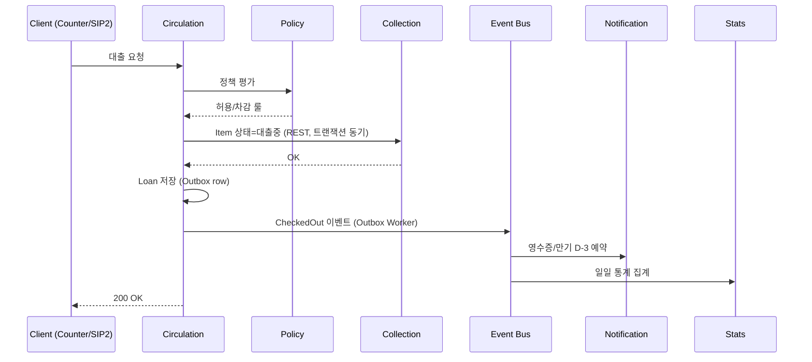
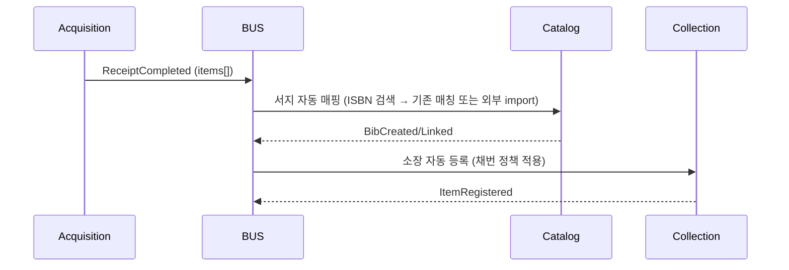
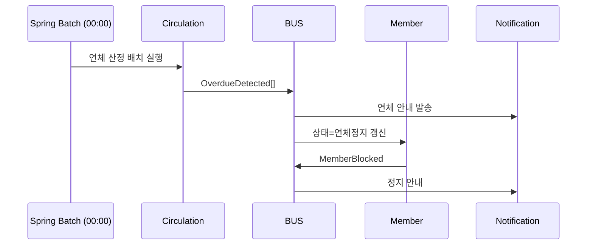
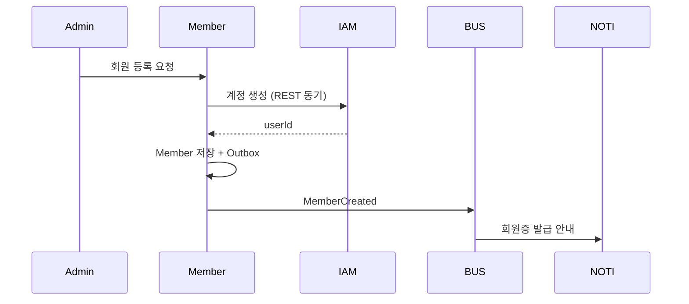
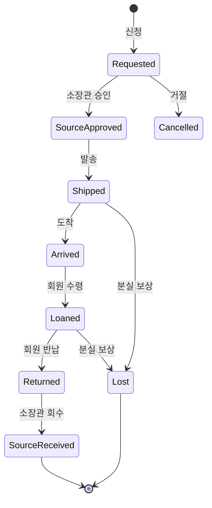
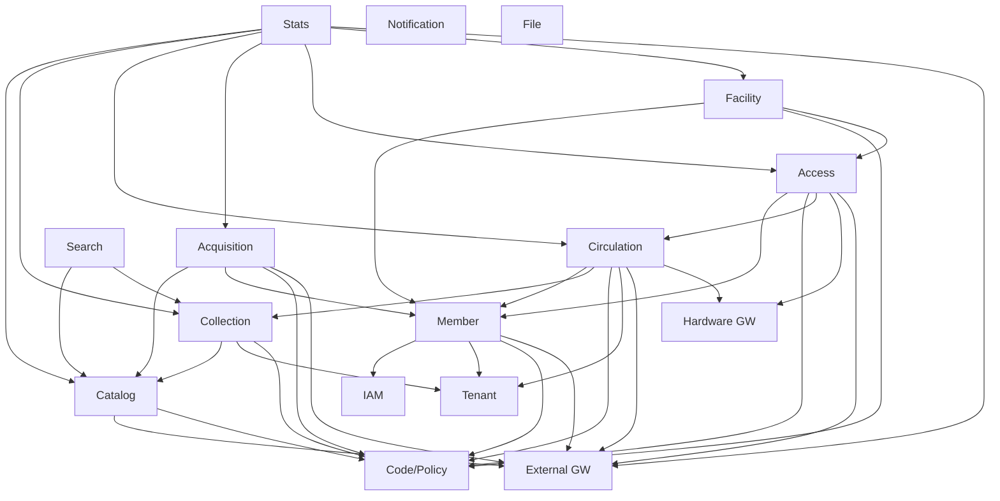

# MSA 서비스 분할도 (Service Decomposition)

| 항목 | 내용 |
|---|---|
| 문서명 | Tulip+ 마이크로서비스 분할도 |
| 문서 ID | DEV-02 |
| 버전 | v0.1 Draft |
| 작성일 | 2026-05-11 |
| 작성자 | DevLead Agent |
| 검토자 | PM, DBA, BackendSenior |
| 입력 | `01_architecture_overview.md`, Planner 357개 기능 |
| 후속 | `03_api_standards.md`, BackendSenior 구현 계획 |
| 상태 | Phase 0 초안 |

---

## 1. 분할 원칙 (Decomposition Principles)

| 원칙 | 내용 |
|---|---|
| **Bounded Context** | 도서관 6개 업무 도메인(ACQ/CAT/CIR/COL/ACS/FAC) + 공통(CMN)을 컨텍스트 경계로 채택 |
| **데이터 소유권** | 한 서비스가 자기 스키마의 쓰기 권한을 단독 보유, 타 서비스는 API/이벤트로만 접근 |
| **변경 빈도** | KORMARC·정책엔진처럼 변경 빈도가 다른 영역 분리 |
| **확장 단위** | OPAC 검색·통계는 트래픽 특성이 다르므로 독립 확장 |
| **장애 격리** | 외부 의존(KOLIS, Z39.50, SIP2) 서비스는 핵심 트랜잭션과 분리 |
| **팀 단위** | BackendSenior·BackendDev 2그룹이 서비스를 분할 소유 가능한 크기 |

> 단, **Phase 1~2 초기에는 동일 코드베이스의 모듈식 모놀리스로 시작** 후 Phase 4 이후 컨테이너 단위로 분리하는 **Strangler Fig** 접근 (R-11/R-12 일정 리스크 완화).

---

## 2. 서비스 카탈로그 (15개 마이크로서비스)

> 각 서비스의 책임·도메인 객체·엔드포인트·DB 스키마·담당팀을 정의한다.

### 2.1 IAM Service (`iam-service`)

| 항목 | 내용 |
|---|---|
| **책임** | 인증, 토큰 발급/검증, OAuth2 IdP, MFA, 비밀번호 정책, 세션 관리 |
| **도메인 객체** | `UserCredential`, `OAuthClient`, `RefreshToken`, `MfaDevice`, `LoginAttempt`, `PasswordHistory` |
| **REST 엔드포인트 그룹** | `/api/v1/auth/*`, `/api/v1/oauth2/*`, `/api/v1/mfa/*` |
| **동기 의존** | Member Service (계정-회원 매핑), Tenant Service (테넌트 활성 확인) |
| **비동기 발행 이벤트** | `IamUserLoggedIn`, `IamLoginFailed`, `IamPasswordChanged` |
| **DB 스키마** | `iam_*` |
| **외부 연동** | SSO/LDAP, OIDC IdP, mIDR |
| **담당팀** | BackendSenior (구현), DevLead (설계) |
| **Planner 기능 매핑** | CMN-016, CMN-022 |

### 2.2 Tenant Service (`tenant-service`)

| 항목 | 내용 |
|---|---|
| **책임** | 테넌트·관(Branch)·서가/장소 마스터, 구독 플랜, 운영시간·휴관 |
| **도메인 객체** | `Tenant`, `Branch`, `Location`, `BranchHour`, `Holiday`, `SubscriptionPlan`, `TenantConfig` |
| **REST** | `/api/v1/tenants/*`, `/api/v1/branches/*`, `/api/v1/locations/*`, `/api/v1/holidays/*` |
| **동기 의존** | - |
| **비동기 발행** | `TenantCreated`, `BranchUpdated`, `HolidayChanged` |
| **DB 스키마** | `tenant_*` |
| **외부 연동** | - |
| **담당팀** | BackendDev (CRUD), DevLead (계층/정책 설계) |
| **Planner 기능 매핑** | CMN-001~008 |

### 2.3 Member Service (`member-service`)

| 항목 | 내용 |
|---|---|
| **책임** | 회원·회원유형·회원증·이용제한·개인정보 동의 |
| **도메인 객체** | `Member`, `MemberType`, `MemberCard`, `MemberStatus`, `MemberConsent`, `FamilyGroup` |
| **REST** | `/api/v1/members/*`, `/api/v1/member-types/*`, `/api/v1/member-cards/*` |
| **동기 의존** | IAM (계정 생성), Tenant (관 소속), Code/Policy (회원유형 정책) |
| **비동기 발행** | `MemberCreated`, `MemberStatusChanged`, `MemberBlocked`, `MemberUnblocked` |
| **비동기 수신** | `OverdueDetected` → 상태 변경, `FineSettled` → 해제 |
| **DB 스키마** | `member_*` |
| **외부 연동** | NEIS, 학교 학적, mIDR |
| **담당팀** | BackendSenior (외부연동) + BackendDev (CRUD) |
| **Planner 기능 매핑** | CMN-010~022 |

### 2.4 Code & Policy Service (`code-policy-service`)

| 항목 | 내용 |
|---|---|
| **책임** | 코드 마스터(자료유형·통화·언어), 분류표, 주제명, 정책 엔진(대출/예약/연체/출입/시설) |
| **도메인 객체** | `CodeGroup`, `Code`, `Classification`, `SubjectHeading`, `Policy`, `PolicyRule`, `PolicyVersion` |
| **REST** | `/api/v1/codes/*`, `/api/v1/classifications/*`, `/api/v1/policies/*` |
| **동기 의존** | - (가장 하위) |
| **비동기 발행** | `PolicyChanged`, `CodeReloaded` |
| **DB 스키마** | `code_*`, `policy_*` (정책은 버전관리) |
| **외부 연동** | - |
| **담당팀** | BackendSenior (정책엔진) + BackendDev (CRUD) |
| **Planner 기능 매핑** | CMN-030~037, CMN-040~047, CMN-050~058 |
| **비고** | 정책 평가 함수는 라이브러리 형태로도 노출 (CIR/ACS/FAC가 동기 호출) |

### 2.5 Catalog Service (`catalog-service`)

| 항목 | 내용 |
|---|---|
| **책임** | KORMARC/MARC21 서지, 권위레코드, 분류·주제어 부여, 결합·분리, OPAC 색인 발행 |
| **도메인 객체** | `Bibliographic`, `MarcField`, `MarcSubfield`, `AuthorityRecord`, `BibChangeLog`, `BibLock`, `Z3950Server`, `KolisSyncLog` |
| **REST** | `/api/v1/cat/bibs/*`, `/api/v1/cat/authorities/*`, `/api/v1/cat/external/*` |
| **동기 의존** | External Integration GW (Z39.50, KOLIS), Code/Policy (분류) |
| **비동기 발행** | `BibCreated`, `BibUpdated`, `BibDeleted`, `BibMerged` (→ Search 색인) |
| **DB 스키마** | `cat_*` (정형 + JSONB 하이브리드 — ADR-004) |
| **외부 연동** | KOLIS-NET, KERIS, DLS, Z39.50 (게이트웨이 경유) |
| **담당팀** | BackendSenior (KORMARC) |
| **Planner 기능 매핑** | CAT-001~082 (51개) |
| **비고** | R-01·R-12 Critical 리스크 집중 영역, 외부 전문가 자문 |

### 2.6 Collection Service (`collection-service`)

| 항목 | 내용 |
|---|---|
| **책임** | 소장(개별자료), 등록번호 채번, 라벨/RFID, 점검, 이관, 제적·폐기, 장서 통계 원천 |
| **도메인 객체** | `Item`, `ItemStatus`, `AccessionRule`, `Inventory`, `InventoryScan`, `Transfer`, `Withdrawal`, `WithdrawalApproval`, `ItemLocationHistory`, `RareItem` |
| **REST** | `/api/v1/col/items/*`, `/api/v1/col/inventories/*`, `/api/v1/col/transfers/*`, `/api/v1/col/withdrawals/*`, `/api/v1/col/labels/*` |
| **동기 의존** | Catalog (서지 참조), Tenant (관·서가), Code/Policy (채번 규칙) |
| **비동기 발행** | `ItemRegistered`, `ItemStatusChanged`, `ItemTransferred`, `ItemWithdrawn` |
| **비동기 수신** | `BibDeleted` → 검증, `ReceiptCompleted` → 자동 등록 |
| **DB 스키마** | `col_*` |
| **외부 연동** | RFID Encoder, 라벨 프린터 (디바이스 SDK는 핸드헬드/카운터 클라이언트) |
| **담당팀** | BackendDev (CRUD) + BackendSenior (채번·이관 트랜잭션) |
| **Planner 기능 매핑** | COL-001~074 (50개) |

### 2.7 Acquisition Service (`acquisition-service`)

| 항목 | 내용 |
|---|---|
| **책임** | 희망도서, 선정, 발주, 납품처, 검수, 예산, 기증, 교환, 연속간행물 |
| **도메인 객체** | `AcqRequest`, `Vendor`, `PurchaseOrder`, `PurchaseOrderItem`, `Receipt`, `Budget`, `BudgetItem`, `BudgetTransaction`, `Donation`, `SerialSubscription`, `SerialIssue`, `Approval` |
| **REST** | `/api/v1/acq/requests/*`, `/api/v1/acq/orders/*`, `/api/v1/acq/receipts/*`, `/api/v1/acq/budgets/*`, `/api/v1/acq/donations/*`, `/api/v1/acq/serials/*` |
| **동기 의존** | Catalog (서지), Member (신청자), Code/Policy (예산 정책), External GW (ISBN) |
| **비동기 발행** | `OrderPlaced`, `ReceiptCompleted`, `BudgetDeducted`, `SerialIssueArrived` |
| **비동기 수신** | `BibCreated` → 발주-목록 매핑 갱신 |
| **DB 스키마** | `acq_*` |
| **외부 연동** | ISBN DB(국립중앙도서관/교보/알라딘), EDI 발주, 결제 PG |
| **담당팀** | BackendDev (CRUD) + BackendSenior (예산 트랜잭션·시리얼) |
| **Planner 기능 매핑** | ACQ-001~072 (51개) |

### 2.8 Circulation Service (`circulation-service`)

| 항목 | 내용 |
|---|---|
| **책임** | 대출/반납/연장, 예약, 연체/연체료, 분실/훼손/변상, 관간대차 |
| **도메인 객체** | `Loan`, `Hold`, `Renewal`, `Fine`, `FinePayment`, `LostDamagedReport`, `IllRequest`, `CirculationPolicy(View)` |
| **REST** | `/api/v1/cir/checkouts`, `/api/v1/cir/returns`, `/api/v1/cir/renewals`, `/api/v1/cir/holds/*`, `/api/v1/cir/fines/*`, `/api/v1/cir/ill/*` |
| **동기 의존** | Member, Collection (Item 상태), Code/Policy (대출정책 평가), Tenant (휴관일) |
| **비동기 발행** | `CheckedOut`, `Returned`, `HoldArrived`, `OverdueDetected`, `FineCharged`, `IllShipped` |
| **비동기 수신** | `PolicyChanged`, `HolidayChanged` |
| **DB 스키마** | `cir_*` |
| **외부 연동** | (Hardware GW 경유) SIP2, NCIP, 무인반납함, 전자책 SSO |
| **담당팀** | BackendSenior (트랜잭션·SIP2·관간대차) + BackendDev (UI 카운터) |
| **Planner 기능 매핑** | CIR-001~103 중 자가대출/OPAC 일부는 별도 (70개) |
| **비고** | 가장 트래픽 높음 → 캐시·Read Replica 최우선, R-07 부하 대응 |

### 2.9 Access Service (`access-service`)

| 항목 | 내용 |
|---|---|
| **책임** | 게이트 인증, 출입로그, 재실현황, 출입정책, EAS 도난경보, 임시증, 보안이벤트 |
| **도메인 객체** | `Gate`, `AccessEvent`, `EasAlarm`, `Occupancy`, `AccessPolicy`, `TempPass`, `SecurityEvent`, `GateDeviceStatus` |
| **REST** | `/api/v1/acs/auth`, `/api/v1/acs/events`, `/api/v1/acs/eas-alarms`, `/api/v1/acs/occupancy`, `/api/v1/acs/temp-passes/*`, `/api/v1/acs/security-events` |
| **동기 의존** | Member (인증), Code/Policy (출입정책), Circulation (대출완료 자료 확인) |
| **비동기 발행** | `Entered`, `Exited`, `TheftAlarmRaised` |
| **비동기 수신** | `MemberBlocked` → 출입 차단 갱신 |
| **DB 스키마** | `acs_*` (대용량 시계열, 파티셔닝 필수) |
| **외부 연동** | (Hardware GW) 게이트, EAS, RFID, CCTV, NEIS |
| **담당팀** | BackendSenior (게이트·EAS) + BackendDev (정책·이력) |
| **Planner 기능 매핑** | ACS-001~064 (38개) |

### 2.10 Facility Service (`facility-service`)

| 항목 | 내용 |
|---|---|
| **책임** | 좌석·시설 마스터, 좌석 예약·자동해제, 회의실 예약·승인, 점검·고장신고, 분실물 |
| **도메인 객체** | `Seat`, `SeatZone`, `SeatReservation`, `Room`, `RoomReservation`, `RoomApproval`, `FacilityIssue`, `FacilityCheckup`, `LostFound`, `FacilityPolicy`, `FacilityCloseSchedule` |
| **REST** | `/api/v1/fac/seats/*`, `/api/v1/fac/rooms/*`, `/api/v1/fac/issues/*`, `/api/v1/fac/lost-found/*` |
| **동기 의존** | Member, Code/Policy, Access (입퇴실 이벤트), Tenant (시설 마스터) |
| **비동기 발행** | `SeatReserved`, `SeatReleased`, `RoomApproved`, `IssueReported` |
| **비동기 수신** | `Entered`/`Exited` → 좌석 점유 동기화 |
| **DB 스키마** | `fac_*` |
| **외부 연동** | 좌석발권 키오스크 (Hardware GW), 결제 PG (유료시설) |
| **담당팀** | BackendDev (CRUD) + BackendSenior (자동해제·낙관락) |
| **Planner 기능 매핑** | FAC-001~064 (37개) |

### 2.11 Search Service (`search-service`)

| 항목 | 내용 |
|---|---|
| **책임** | OPAC 통합검색, 패싯, 추천, 색인 동기화 |
| **도메인 객체** | `BibIndex`, `OpacSearchLog`, `RecommendationModel(stub)` |
| **REST** | `/api/v1/opac/search`, `/api/v1/opac/suggest`, `/api/v1/opac/facets` |
| **동기 의존** | Catalog, Collection (소장수·예약가능 표시) |
| **비동기 수신** | `BibCreated/Updated/Deleted`, `ItemRegistered/StatusChanged` |
| **DB 스키마** | OpenSearch/ES 인덱스 + PG 로그 |
| **외부 연동** | - |
| **담당팀** | BackendSenior (색인 설계) |
| **Planner 기능 매핑** | CAT-080~082, CIR-060, CIR-068~069 |

### 2.12 Statistics & Report Service (`stats-report-service`)

| 항목 | 내용 |
|---|---|
| **책임** | KPI 대시보드, 정형/비정형 리포트, KOLIS/KERIS/DLS 통계 제출, 데이터 마트 |
| **도메인 객체** | `ReportTemplate`, `ReportRun`, `ScheduledReport`, `StatMart` |
| **REST** | `/api/v1/stats/*`, `/api/v1/reports/*` |
| **동기 의존** | 모든 도메인 (Read Replica 또는 DW 경유) |
| **비동기 수신** | `*Created`, `Returned`, `CheckedOut`, `ItemWithdrawn` 등 (집계 마트) |
| **DB 스키마** | `stat_*` (Star schema, 파티셔닝) |
| **외부 연동** | KOLIS-NET 통계 제출, KERIS, DLS |
| **담당팀** | BackendSenior (집계 배치) + DBA (마트 모델) |
| **Planner 기능 매핑** | CMN-060~066, COL-060~067, ACQ-008/028, CIR-007/027, FAC-060~064 등 통계 일체 |

### 2.13 Notification Service (`notification-service`)

| 항목 | 내용 |
|---|---|
| **책임** | 알림 템플릿, 채널 전송(SMS·이메일·푸시·카카오·LMS), 수신 동의, 발송 이력 |
| **도메인 객체** | `NotificationTemplate`, `NotificationRequest`, `NotificationDelivery`, `ChannelConfig`, `OptOut` |
| **REST** | `/api/v1/notifications/*`, `/api/v1/notification-templates/*` |
| **비동기 수신** | `HoldArrived`, `OverdueDetected`, `ReceiptCompleted`, `AcqRequestApproved`, `TheftAlarmRaised` 등 |
| **DB 스키마** | `noti_*` |
| **외부 연동** | SES/SendGrid, 카카오 비즈, NHN SMS, FCM/APNs |
| **담당팀** | BackendDev |
| **Planner 기능 매핑** | CMN-070~073 |

### 2.14 File Service (`file-service`)

| 항목 | 내용 |
|---|---|
| **책임** | 파일 업로드/다운로드(presigned URL), MARC 파일, 라벨 PDF, 첨부, 이미지 |
| **도메인 객체** | `FileObject`, `FileAccessLog` |
| **REST** | `/api/v1/files/*` |
| **외부 연동** | S3 / 호환 객체스토리지 |
| **담당팀** | BackendDev |
| **Planner 기능 매핑** | CMN 첨부 일반, ACQ 첨부, FAC-042 사진, CAT 일괄 import/export 파일 |

### 2.15 External Integration Gateway (`external-gateway`)

| 항목 | 내용 |
|---|---|
| **책임** | 외부 표준(KOLIS-NET/KERIS/DLS/Z39.50/NEIS/mIDR/도매상/결제PG) 어댑터, 서킷 브레이커, 캐시 |
| **도메인 객체** | `ExternalCall`, `ExternalCache`, `ExternalCircuitState`, `DLQEntry` |
| **REST** | `/internal/ext/*` (내부 전용) |
| **외부 연동** | 6장 전체 |
| **담당팀** | BackendSenior |
| **Planner 기능 매핑** | CAT-030~044, ACQ-070~072, CMN-016 일부, COL/CIR 외부 호출 |

### 2.16 Hardware Gateway (`hardware-gateway`) — 별도 컨테이너

| 항목 | 내용 |
|---|---|
| **책임** | SIP2/NCIP 프로토콜 변환, EAS 이벤트 수신, RFID 디바이스 통신, 좌석발권 키오스크 |
| **외부 연동** | 자가대출반납기, 무인반납함, 출입게이트, EAS 게이트, 좌석 키오스크 |
| **담당팀** | BackendSenior |
| **Planner 기능 매핑** | CIR-080~086, ACS-006~010, ACS-020~026, FAC 키오스크 |

### 2.17 BFF — Admin / OPAC (2개)

| 항목 | 내용 |
|---|---|
| **책임** | 화면별 다중 도메인 집계, 응답 가공, 권한 매트릭스 검증 |
| **담당팀** | BackendSenior + FrontendSenior 협업 |

---

## 3. Planner 357개 기능 × 서비스 매핑 매트릭스

> 각 도메인 기능ID 범위가 어느 서비스에 매핑되는지 추적.

### 3.1 도메인 × 서비스 매트릭스

| 기능 ID 범위 | 기능명 군 | 주 서비스 | 보조 서비스 |
|---|---|---|---|
| CMN-001~008 | 테넌트·관 | Tenant | - |
| CMN-010~022 | 회원·이용자 | Member | IAM, External GW (NEIS/mIDR) |
| CMN-030~037 | 코드·마스터 | Code/Policy | - |
| CMN-040~047 | 권한·역할 | IAM | Tenant (관 권한) |
| CMN-050~058 | 정책 | Code/Policy | CIR/ACS/FAC (소비) |
| CMN-060~066 | 통계 공통 | Stats/Report | - |
| CMN-070~073 | 알림 | Notification | - |
| CMN-080~083 | 감사·로그 | IAM (인증로그) + 각 서비스 (도메인 로그) | SIEM 적재 |
| ACQ-001~010 | 선정·희망도서 | Acquisition | Catalog (서지), Notification |
| ACQ-020~028 | 발주 | Acquisition | External GW (EDI) |
| ACQ-030~037 | 검수·납품 | Acquisition | Catalog (인계), Collection (인계) |
| ACQ-040~048 | 예산 | Acquisition | - |
| ACQ-050~055 | 기증·교환 | Acquisition | Catalog, Collection |
| ACQ-060~067 | 연속간행물 | Acquisition | Notification (클레임) |
| ACQ-070~072 | 외부 연동 | External GW | Acquisition |
| CAT-001~013 | KORMARC 편목 | Catalog | - |
| CAT-020~023 | MARC21 변환 | Catalog | - |
| CAT-030~036 | Z39.50/외부 | External GW | Catalog |
| CAT-040~044 | KOLIS/DLS | External GW | Catalog |
| CAT-050~054 | 권위제어 | Catalog | - |
| CAT-060~065 | 분류·주제어 | Catalog | Code/Policy (분류표) |
| CAT-070~076 | 일괄 편집 | Catalog | File (Import/Export) |
| CAT-080~082 | OPAC 색인 | Search | Catalog (이벤트) |
| CIR-001~012 | 대출·반납·연장 | Circulation | Member, Collection |
| CIR-020~027 | 예약 | Circulation | Notification |
| CIR-030~037 | 연체 | Circulation | Code/Policy, Notification |
| CIR-040~044 | 분실·훼손·변상 | Circulation | - |
| CIR-050~055 | 관간대차 (ILL) | Circulation | External GW (NCIP) |
| CIR-060~071 | OPAC | OPAC BFF + Search | Circulation, Member |
| CIR-080~086 | 자가대출 (SIP2/RFID) | Hardware GW | Circulation |
| CIR-090~093 | 비대면·모바일 | Circulation | OPAC BFF |
| CIR-100~103 | 사서 카운터 | Admin BFF | Circulation, Member |
| COL-001~013 | 소장 등록·채번 | Collection | Catalog |
| COL-020~030 | 장서점검 | Collection | Hardware GW (RFID) |
| COL-040~046 | 이관·재배가 | Collection | - |
| COL-050~059 | 제적·폐기 | Collection | - |
| COL-060~067 | 장서 통계 | Stats/Report | Collection |
| COL-070~074 | 보존·귀중자료 | Collection | - |
| ACS-001~010 | 인증·게이트 | Access | Hardware GW, Member |
| ACS-020~026 | EAS 도난방지 | Access | Hardware GW, Circulation |
| ACS-030~036 | 출입정책 | Access | Code/Policy |
| ACS-040~047 | 출입이력·재실 | Access | External GW (NEIS) |
| ACS-050~054 | 임시증 | Access | - |
| ACS-060~064 | 보안이벤트 | Access | Notification |
| FAC-001~013 | 좌석예약 | Facility | Access (입퇴실) |
| FAC-020~028 | 회의실·세미나실 | Facility | Notification (승인 알림) |
| FAC-040~046 | 점검·고장신고 | Facility | File (사진) |
| FAC-050~055 | 이용시간 정책 | Facility | Code/Policy |
| FAC-060~064 | 시설 통계 | Stats/Report | Facility |

> **총 357개 기능 = CMN 60 + ACQ 51 + CAT 51 + CIR 70 + COL 50 + ACS 38 + FAC 37**, 모두 위 매트릭스로 추적 가능.

### 3.2 서비스별 책임 기능 수 요약

| 서비스 | 직접 책임 기능 수 (대략) | Phase |
|---|---|---|
| IAM | 9 | Phase 1 |
| Tenant | 8 | Phase 1 |
| Member | 13 | Phase 1 |
| Code/Policy | 24 | Phase 1 |
| Catalog | 38 | Phase 2 |
| Collection | 41 | Phase 2 |
| Acquisition | 44 | Phase 3 |
| Circulation | 49 | Phase 4 |
| Access | 28 | Phase 5 |
| Facility | 30 | Phase 5 |
| Search | 6 | Phase 2 |
| Stats/Report | 22 | Phase 6 |
| Notification | 4 | Phase 1 |
| File | (cross) | Phase 1 |
| External GW | 14 | Phase 2~ |
| Hardware GW | 15 | Phase 4~ |
| Admin BFF / OPAC BFF | (집계) | Phase 1~ |

---

## 4. 도메인 이벤트 흐름

### 4.1 핵심 이벤트 카탈로그

| 이벤트 | 발행자 | 주요 구독자 | 페이로드 (요약) |
|---|---|---|---|
| `MemberCreated` | Member | IAM, Notification, Stats | memberId, tenantId, type |
| `MemberStatusChanged` | Member | Circulation, Access | memberId, oldStatus, newStatus |
| `BibCreated` / `BibUpdated` / `BibDeleted` | Catalog | Search, Stats | bibId, marcSummary |
| `ItemRegistered` | Collection | Search (소장수 갱신), Stats | itemId, bibId, branchId |
| `ItemStatusChanged` | Collection | Search, Circulation | itemId, status |
| `ReceiptCompleted` | Acquisition | Catalog (목록 인계), Collection (자동 등록), Notification | receiptId, items |
| `OrderPlaced` | Acquisition | Stats, Notification | orderId, total |
| `BudgetDeducted` | Acquisition | Stats | budgetId, amount |
| `CheckedOut` | Circulation | Collection (상태→대출중), Notification (영수증), Stats | loanId, memberId, itemId |
| `Returned` | Circulation | Collection (상태→정상), Hold (도착 알림 트리거), Stats | loanId |
| `HoldArrived` | Circulation | Notification, Member | holdId, memberId |
| `OverdueDetected` | Circulation (배치) | Member (상태→연체), Notification | loanId, days |
| `FineCharged` | Circulation | Member, Notification | fineId, amount |
| `FineSettled` | Circulation | Member (해제) | fineId |
| `IllShipped` / `IllReceived` / `IllReturned` | Circulation | NCIP Gateway, Notification | illId |
| `Entered` / `Exited` | Access | Facility (좌석 동기), Stats | memberId, gateId |
| `TheftAlarmRaised` | Access | Notification, SIEM | eventId, itemId, memberId |
| `SeatReserved` / `SeatReleased` | Facility | Stats | reservationId |
| `RoomApproved` | Facility | Notification | reservationId |
| `PolicyChanged` | Code/Policy | All policy consumers | policyId, version |

### 4.2 대표 흐름 — 대출 완료 → 재고/통계/알림



### 4.3 대표 흐름 — 발주 완료 → 목록·소장 자동 생성



### 4.4 대표 흐름 — 연체 발생 → 알림 → 이용제한



### 4.5 대표 흐름 — 회원 등록 → 인증 발급



---

## 5. 메시징 인프라 결정

### 5.1 메시지 브로커

| 항목 | Kafka (1순위) | RabbitMQ (대안) |
|---|---|---|
| 처리량 | 매우 높음 (수만 msg/sec) | 중간 (수천 msg/sec) |
| 메시지 보존 | 길게 보존 (재처리·이벤트소싱) | 큐 소비 후 삭제 |
| 정렬 보장 | 파티션 키 단위 | 큐 단위 |
| 멀티 구독 | 토픽-컨슈머그룹 | Exchange-Queue |
| 운영 복잡도 | 높음 | 낮음 |
| Tulip+ 채택 | **기본 채택** | (옵션: 알림 큐 별도) |

### 5.2 토픽 네이밍 표준

```
tulip.<domain>.<event>.v<version>
예시:
  tulip.cir.checked-out.v1
  tulip.cat.bib-updated.v1
  tulip.acs.theft-alarm.v1
```

키: `tenantId` (파티션) → 테넌트 단위 순서 보장.

---

## 6. 데이터 일관성 전략

### 6.1 패턴 선택

| 시나리오 | 패턴 | 비고 |
|---|---|---|
| 단일 서비스 내 트랜잭션 | 로컬 ACID | PostgreSQL 트랜잭션 |
| 서비스 간 비동기 일관성 | **Outbox + Polling Publisher** | 이벤트 누락 방지 (R-18) |
| 관간대차 / ILL | **Saga (Choreography)** | 보상 트랜잭션 명시 |
| 발주 → 검수 → 목록 → 소장 인계 | Saga (Orchestration) | 실패 시 단계별 롤백 |
| 대출 ↔ 소장 상태 | Synchronous REST (트랜잭션 중요) | 동일 트랜잭션 경계 못 가지므로 Item 상태는 낙관락 + 이벤트 보정 |
| 예산 차감 | 로컬 트랜잭션 + Outbox | 발주/검수 동일 서비스 내 처리 (Acquisition) |
| 검색 색인 | Eventually Consistent | 색인 지연 30초 SLA |

### 6.2 Outbox 패턴

```sql
-- 모든 도메인 서비스 공통
CREATE TABLE outbox_event (
    id BIGSERIAL PRIMARY KEY,
    tenant_id BIGINT NOT NULL,
    aggregate_type VARCHAR(64) NOT NULL,
    aggregate_id VARCHAR(128) NOT NULL,
    event_type VARCHAR(128) NOT NULL,
    payload JSONB NOT NULL,
    headers JSONB,
    trace_id VARCHAR(64),
    occurred_at TIMESTAMPTZ NOT NULL DEFAULT NOW(),
    published_at TIMESTAMPTZ,
    retry_count INT NOT NULL DEFAULT 0,
    status VARCHAR(16) NOT NULL DEFAULT 'PENDING'
);
CREATE INDEX idx_outbox_pending ON outbox_event(status, occurred_at) WHERE status='PENDING';
```

Outbox Worker가 1초마다 폴링 → Kafka 발행 → `published_at` 갱신.

### 6.3 관간대차 Saga 예시



각 상태 전이는 별도 이벤트, 실패 시 **보상 이벤트**(`IllCompensated`)로 회복.

---

## 7. 서비스 의존성 그래프



> **하위(공통) 서비스**: IAM, Tenant, Code/Policy, File, Notification, External GW, Hardware GW
> **도메인 서비스**: Member, Catalog, Collection, Acquisition, Circulation, Access, Facility
> **상위 집계 서비스**: Search, Stats/Report

---

## 8. 서비스 카드 — 핵심 요약표

| # | 서비스 | DB 스키마 | 주 Phase | 담당 | 외부 의존 |
|---|---|---|---|---|---|
| 1 | iam-service | `iam_*` | P1 | BS | SSO, mIDR |
| 2 | tenant-service | `tenant_*` | P1 | BD | - |
| 3 | member-service | `member_*` | P1 | BS+BD | NEIS, mIDR |
| 4 | code-policy-service | `code_*`/`policy_*` | P1 | BS+BD | - |
| 5 | catalog-service | `cat_*` | P2 | BS | KOLIS, KERIS, DLS, Z39.50 |
| 6 | collection-service | `col_*` | P2 | BD+BS | RFID Encoder |
| 7 | acquisition-service | `acq_*` | P3 | BD+BS | ISBN, EDI, PG |
| 8 | circulation-service | `cir_*` | P4 | BS+BD | SIP2, NCIP |
| 9 | access-service | `acs_*` | P5 | BS+BD | 게이트, EAS, NEIS, CCTV |
| 10 | facility-service | `fac_*` | P5 | BD+BS | 키오스크, PG |
| 11 | search-service | OpenSearch | P2 | BS | - |
| 12 | stats-report-service | `stat_*` (DW) | P6 | BS+DBA | KOLIS/KERIS/DLS 통계 |
| 13 | notification-service | `noti_*` | P1 | BD | SES, SMS, 카카오, FCM |
| 14 | file-service | S3 + `file_*` | P1 | BD | S3 |
| 15 | external-gateway | `ext_*` (로그/캐시) | P2~ | BS | 6장 전체 |
| 16 | hardware-gateway | `hw_*` (디바이스 상태) | P4~ | BS | SIP2/NCIP/EAS/RFID/키오스크 |
| 17 | admin-bff | (stateless) | P1~ | BS+FS | 모든 도메인 |
| 18 | opac-bff | (stateless) | P2~ | BS+FS | Search, CIR, MEM, FAC, ACQ |

> 핵심 마이크로서비스 **15개** + BFF **2개** + Hardware Gateway **1개** = 총 **17~18개 컨테이너**.

---

## 9. 후속 산출물 인계

| 인계 대상 | 작업 |
|---|---|
| BackendSenior | 서비스별 도메인 모델·API 구현, Saga·Outbox 구현 |
| DBA | 서비스 × 스키마 매핑 기반 ERD 및 인덱스 설계 |
| QA | 서비스 간 계약 테스트(CDC) 시나리오 작성 |
| PM | Phase별 서비스 진척 추적 가능 |

---

## 변경 이력

| 버전 | 일자 | 변경 내용 | 작성자 |
|---|---|---|---|
| v0.1 | 2026-05-11 | Phase 0 초안 — 357개 기능 매핑 완료 | DevLead |
