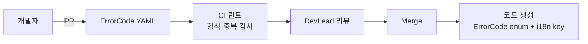

# 에러 코드 체계 (Error Code System)

| 항목 | 내용 |
|---|---|
| 문서명 | Tulip+ 에러 코드 표준 |
| 문서 ID | DEV-04 |
| 버전 | v0.1 Draft |
| 작성일 | 2026-05-11 |
| 작성자 | DevLead Agent |
| 검토자 | BackendSenior, FrontendSenior, QA, Planner |
| 입력 | `03_api_standards.md`, Planner 각 도메인 에러코드 |
| 후속 | 메시지 리소스 번들 `messages.properties`, QA 케이스 |
| 상태 | Phase 0 초안 |

---

## 1. 목적과 적용

본 문서는 Tulip+ 전 시스템(15개 마이크로서비스 + BFF + Gateway)에서 발생하는 에러를 **일관된 코드 체계**로 표준화한다. 클라이언트(웹·모바일·키오스크), 외부 연동 모듈, 운영자 콘솔이 동일한 코드를 해석할 수 있어야 한다.

- Planner 산출물의 도메인별 에러 코드(`CMN-E001`, `CIR-E001` 등)는 본 표준 코드 체계로 **재발급**.
- 모든 신규 에러는 본 문서에 등록 후 사용 (DevLead 승인).

---

## 2. 에러 코드 구조

### 2.1 형식

```
TLP-{DOMAIN}-{HTTP}-{SEQ}
```

| 세그먼트 | 의미 | 자릿수 | 예시 |
|---|---|---|---|
| `TLP` | Tulip+ 제품 prefix (고정) | 3 | TLP |
| `DOMAIN` | 도메인 약어 | 3 | CMN, ACQ, CAT, CIR, COL, ACS, FAC, AUT, EXT, SYS |
| `HTTP` | HTTP 상태 코드 | 3 | 400, 401, 403, 404, 409, 422, 423, 429, 500, 502, 503 |
| `SEQ` | 도메인-HTTP 조합 내 4자리 순번 | 4 | 0001~9999 |

### 2.2 예시

| 코드 | 의미 |
|---|---|
| `TLP-CIR-422-0001` | 열람 도메인 / 비즈니스 규칙 위반 / 1번 (대출 권수 초과) |
| `TLP-CMN-401-0001` | 공통 도메인 / 미인증 / 1번 (토큰 만료) |
| `TLP-CAT-409-0002` | 목록 도메인 / 충돌 / 2번 (서지 동시 편집) |
| `TLP-EXT-504-0001` | 외부 연동 / 시간초과 / 1번 (Z39.50 응답 없음) |

### 2.3 도메인 약어

| 약어 | 의미 | 대상 서비스 |
|---|---|---|
| CMN | 공통(테넌트·회원·코드·정책·알림) | Tenant, Member, Code/Policy, Notification, File |
| AUT | 인증·인가 | IAM |
| ACQ | 수서 | Acquisition |
| CAT | 목록·서지 | Catalog |
| CIR | 열람·대출 | Circulation |
| COL | 장서관리 | Collection |
| ACS | 출입관리 | Access |
| FAC | 시설관리 | Facility |
| EXT | 외부 연동 (KOLIS/Z39.50/NEIS/SIP2 등) | External GW, Hardware GW |
| SYS | 시스템·인프라 (DB·캐시·메시지 브로커) | 전체 |

### 2.4 HTTP 카테고리 매핑

| HTTP | 의미 | 사용 |
|---|---|---|
| 400 | 입력 검증 실패 | 필수값·형식·범위 |
| 401 | 미인증 | 토큰 없음·만료 |
| 403 | 권한 없음 | 역할 부족, 테넌트 격리 위반 |
| 404 | 자원 없음 | 미존재 ID |
| 409 | 상태/중복 충돌 | 중복 ID, ETag 불일치, 상태 충돌 |
| 422 | 비즈니스 규칙 위반 | 정책 위반 (대출권수, 예산부족 등) |
| 423 | 잠금 | 계정/서지 잠금 |
| 429 | 한도 초과 | Rate Limit |
| 500 | 서버 내부 오류 | 미처리 예외 |
| 502 | 업스트림 오류 | 외부 API 실패 |
| 503 | 일시 사용 불가 | 점검·과부하 |
| 504 | 업스트림 시간초과 | Z39.50, KOLIS 응답 없음 |

---

## 3. 에러 응답 구조 (재확인)

```json
{
  "success": false,
  "code": "TLP-CIR-422-0001",
  "messageKey": "error.cir.loan.exceed_quota",
  "message": "대출 권수 한도를 초과했습니다",
  "userMessage": "현재 대출 가능 권수를 초과했습니다. 반납 후 다시 시도해 주세요.",
  "fieldErrors": [],
  "debug": { "currentLoans": 10, "maxLoans": 10, "service": "circulation-service" },
  "timestamp": "2026-05-11T14:00:00+09:00",
  "traceId": "00-4bf92f3577b34da6..."
}
```

| 필드 | 용도 |
|---|---|
| `code` | 시스템·운영자 추적용 (불변, 다국어 미적용) |
| `messageKey` | 다국어 리소스 키 (i18n) |
| `message` | 시스템 메시지 (관리자·로그) |
| `userMessage` | 사용자 친화 메시지 (OPAC 등) |
| `fieldErrors` | 입력 검증 실패 시 필드별 |
| `debug` | 비-운영 환경 진단 정보 |

---

## 4. 메시지 다국어 키 표준

### 4.1 키 규칙

```
error.<domain>.<entity>.<reason>
```

| 예시 | 의미 |
|---|---|
| `error.aut.token.expired` | 토큰 만료 |
| `error.cmn.member.duplicate` | 회원 중복 |
| `error.cir.loan.exceed_quota` | 대출 권수 초과 |
| `error.cir.loan.member_blocked` | 회원 이용 제한 |
| `error.cat.bib.missing_required_field` | 서지 필수 필드 누락 |
| `error.acs.gate.unauthorized` | 출입 권한 없음 |
| `error.ext.z3950.timeout` | Z39.50 타임아웃 |

### 4.2 리소스 번들 위치

```
backend/src/main/resources/i18n/messages_ko.properties
backend/src/main/resources/i18n/messages_en.properties
backend/src/main/resources/i18n/messages_ja.properties (Y2)
```

### 4.3 사용자 메시지 vs 디버그 메시지 분리

| 종류 | 대상 | 톤 |
|---|---|---|
| `userMessage` | OPAC 이용자 | 친화적·조치 가능한 문장 ("반납 후 다시 시도해 주세요") |
| `message` | 사서·관리자 | 정확한 시스템 용어 ("대출 권수 한도(10) 초과") |
| `debug.exception`, `debug.cause` | 개발자 | Stack trace 등 (비-운영) |

운영 환경에서는 `debug` 자동 마스킹. PII 노출 금지.

---

## 5. 공통/인증 에러 코드

### 5.1 AUT — 인증·인가 (IAM)

| 코드 | HTTP | messageKey | 메시지 | 사용 예 |
|---|---|---|---|---|
| TLP-AUT-401-0001 | 401 | `error.aut.token.missing` | 인증 토큰이 없습니다 | Authorization 헤더 누락 |
| TLP-AUT-401-0002 | 401 | `error.aut.token.expired` | 인증 토큰이 만료되었습니다 | exp 초과 |
| TLP-AUT-401-0003 | 401 | `error.aut.token.invalid` | 유효하지 않은 토큰입니다 | 서명 검증 실패 |
| TLP-AUT-401-0004 | 401 | `error.aut.login.failed` | 아이디 또는 비밀번호가 일치하지 않습니다 | - |
| TLP-AUT-401-0005 | 401 | `error.aut.mfa.required` | 추가 인증(MFA)이 필요합니다 | - |
| TLP-AUT-401-0006 | 401 | `error.aut.mfa.invalid` | MFA 코드가 일치하지 않습니다 | - |
| TLP-AUT-401-0007 | 401 | `error.aut.sso.failed` | 외부 인증(SSO) 실패 | SAML/OIDC 실패 |
| TLP-AUT-403-0001 | 403 | `error.aut.permission.denied` | 권한이 없습니다 | RBAC 검증 실패 |
| TLP-AUT-403-0002 | 403 | `error.aut.tenant.mismatch` | 다른 테넌트의 자원입니다 | tenantId 불일치 |
| TLP-AUT-403-0003 | 403 | `error.aut.branch.mismatch` | 해당 관에 권한이 없습니다 | branchId 불일치 |
| TLP-AUT-403-0004 | 403 | `error.aut.role.insufficient` | 필요한 역할이 없습니다 | role 부족 |
| TLP-AUT-403-0005 | 403 | `error.aut.scope.insufficient` | 토큰 scope가 부족합니다 | OAuth2 scope |
| TLP-AUT-423-0001 | 423 | `error.aut.account.locked` | 계정이 잠겨있습니다 | 5회 오류 잠금 |
| TLP-AUT-423-0002 | 423 | `error.aut.password.expired` | 비밀번호가 만료되었습니다 | 90일 초과 |
| TLP-AUT-409-0001 | 409 | `error.aut.password.history` | 최근 사용한 비밀번호는 사용할 수 없습니다 | 이력 정책 |
| TLP-AUT-422-0001 | 422 | `error.aut.password.weak` | 비밀번호 복잡도 요건 미달 | - |
| TLP-AUT-429-0001 | 429 | `error.aut.login.too_many` | 로그인 시도가 너무 많습니다 | Rate Limit |
| TLP-AUT-403-0006 | 403 | `error.aut.consent.required` | 개인정보 동의가 필요합니다 | - |
| TLP-AUT-401-0008 | 401 | `error.aut.device.untrusted` | 등록되지 않은 디바이스입니다 | 키오스크 토큰 |
| TLP-AUT-403-0007 | 403 | `error.aut.tenant.suspended` | 테넌트 구독이 만료되었습니다 | 구독 정지 |

### 5.2 CMN — 공통

| 코드 | HTTP | messageKey | 메시지 |
|---|---|---|---|
| TLP-CMN-400-0001 | 400 | `error.cmn.validation.required` | 필수값이 누락되었습니다 |
| TLP-CMN-400-0002 | 400 | `error.cmn.validation.format` | 입력 형식이 올바르지 않습니다 |
| TLP-CMN-400-0003 | 400 | `error.cmn.validation.range` | 입력값이 허용 범위를 벗어났습니다 |
| TLP-CMN-400-0004 | 400 | `error.cmn.validation.length` | 입력 길이가 허용 범위를 벗어났습니다 |
| TLP-CMN-400-0005 | 400 | `error.cmn.validation.invalid_enum` | 유효하지 않은 코드값입니다 |
| TLP-CMN-400-0006 | 400 | `error.cmn.file.too_large` | 파일 크기가 한도를 초과했습니다 |
| TLP-CMN-400-0007 | 400 | `error.cmn.file.unsupported_type` | 지원하지 않는 파일 형식입니다 |
| TLP-CMN-404-0001 | 404 | `error.cmn.resource.not_found` | 요청하신 자원을 찾을 수 없습니다 |
| TLP-CMN-404-0002 | 404 | `error.cmn.member.not_found` | 회원을 찾을 수 없습니다 |
| TLP-CMN-404-0003 | 404 | `error.cmn.branch.not_found` | 관(Branch)을 찾을 수 없습니다 |
| TLP-CMN-404-0004 | 404 | `error.cmn.policy.not_found` | 정책을 찾을 수 없습니다 |
| TLP-CMN-409-0001 | 409 | `error.cmn.duplicate.entity` | 이미 존재하는 데이터입니다 |
| TLP-CMN-409-0002 | 409 | `error.cmn.duplicate.member_id` | 이미 사용 중인 회원ID입니다 |
| TLP-CMN-409-0003 | 409 | `error.cmn.state.conflict` | 현재 상태에서 작업을 수행할 수 없습니다 |
| TLP-CMN-409-0004 | 409 | `error.cmn.etag.mismatch` | 다른 사용자가 먼저 수정했습니다 |
| TLP-CMN-422-0001 | 422 | `error.cmn.policy.violation` | 정책을 위반했습니다: {policyName} |
| TLP-CMN-422-0002 | 422 | `error.cmn.member.consent_required` | 개인정보 처리 동의가 필요합니다 |
| TLP-CMN-422-0003 | 422 | `error.cmn.bulk.partial_failure` | 일괄처리 중 일부가 실패했습니다 |
| TLP-CMN-429-0001 | 429 | `error.cmn.rate_limit.exceeded` | 요청이 너무 많습니다 |
| TLP-CMN-500-0001 | 500 | `error.cmn.system.unknown` | 시스템 오류가 발생했습니다 |
| TLP-CMN-503-0001 | 503 | `error.cmn.system.maintenance` | 시스템 점검 중입니다 |
| TLP-CMN-503-0002 | 503 | `error.cmn.feature.disabled` | 사용할 수 없는 기능입니다 |

### 5.3 SYS — 시스템·인프라

| 코드 | HTTP | messageKey | 메시지 |
|---|---|---|---|
| TLP-SYS-500-0001 | 500 | `error.sys.db.connection` | 데이터베이스 연결 실패 |
| TLP-SYS-500-0002 | 500 | `error.sys.db.deadlock` | 데이터 처리 충돌이 발생했습니다 |
| TLP-SYS-500-0003 | 500 | `error.sys.cache.failure` | 캐시 오류가 발생했습니다 |
| TLP-SYS-500-0004 | 500 | `error.sys.mq.publish_failed` | 이벤트 발행 실패 |
| TLP-SYS-503-0001 | 503 | `error.sys.dependency.unavailable` | 의존 서비스를 사용할 수 없습니다 |
| TLP-SYS-503-0002 | 503 | `error.sys.circuit.open` | 회로 차단 상태입니다 |
| TLP-SYS-504-0001 | 504 | `error.sys.timeout` | 처리 시간 초과 |

---

## 6. 도메인별 에러 코드 (최소 20개)

### 6.1 ACQ — 수서

| 코드 | HTTP | messageKey | 메시지 | 카테고리 |
|---|---|---|---|---|
| TLP-ACQ-400-0001 | 400 | `error.acq.request.invalid_isbn` | 유효하지 않은 ISBN입니다 | 검증 |
| TLP-ACQ-400-0002 | 400 | `error.acq.order.empty_items` | 발주 항목이 비어있습니다 | 검증 |
| TLP-ACQ-400-0003 | 400 | `error.acq.budget.negative` | 예산 금액은 0 이상이어야 합니다 | 검증 |
| TLP-ACQ-403-0001 | 403 | `error.acq.budget.no_access` | 해당 예산에 권한이 없습니다 | 권한 |
| TLP-ACQ-403-0002 | 403 | `error.acq.approval.not_approver` | 결재 권한이 없습니다 | 권한 |
| TLP-ACQ-404-0001 | 404 | `error.acq.order.not_found` | 발주서를 찾을 수 없습니다 | 자원 |
| TLP-ACQ-404-0002 | 404 | `error.acq.vendor.not_found` | 납품처를 찾을 수 없습니다 | 자원 |
| TLP-ACQ-404-0003 | 404 | `error.acq.budget.not_found` | 예산을 찾을 수 없습니다 | 자원 |
| TLP-ACQ-404-0004 | 404 | `error.acq.serial.not_found` | 구독 정보를 찾을 수 없습니다 | 자원 |
| TLP-ACQ-409-0001 | 409 | `error.acq.request.duplicate` | 동일 ISBN으로 진행 중인 신청이 있습니다 | 충돌 |
| TLP-ACQ-409-0002 | 409 | `error.acq.order.cannot_cancel` | 검수가 시작된 발주는 취소할 수 없습니다 | 상태 |
| TLP-ACQ-409-0003 | 409 | `error.acq.receipt.already_done` | 이미 검수가 완료된 항목입니다 | 상태 |
| TLP-ACQ-409-0004 | 409 | `error.acq.budget.year_closed` | 회계연도가 마감되었습니다 | 상태 |
| TLP-ACQ-422-0001 | 422 | `error.acq.policy.duplicate_holding` | 이미 소장하고 있는 자료입니다 | 정책 |
| TLP-ACQ-422-0002 | 422 | `error.acq.budget.insufficient` | 예산이 부족합니다 | 정책 |
| TLP-ACQ-422-0003 | 422 | `error.acq.approval.line_missing` | 결재선이 설정되지 않았습니다 | 정책 |
| TLP-ACQ-422-0004 | 422 | `error.acq.receipt.price_mismatch` | 발주가와 납품가가 일치하지 않습니다 | 정책 |
| TLP-ACQ-422-0005 | 422 | `error.acq.serial.missed_issue` | 결호 클레임 한도 초과 | 정책 |
| TLP-ACQ-422-0006 | 422 | `error.acq.donation.rejected_item` | 기증 거절된 자료입니다 | 정책 |
| TLP-ACQ-502-0001 | 502 | `error.acq.external.isbn_lookup_failed` | ISBN 외부 조회에 실패했습니다 | 외부 |
| TLP-ACQ-502-0002 | 502 | `error.acq.external.edi_failed` | 납품처 EDI 송신에 실패했습니다 | 외부 |

### 6.2 CAT — 목록

| 코드 | HTTP | messageKey | 메시지 | 카테고리 |
|---|---|---|---|---|
| TLP-CAT-400-0001 | 400 | `error.cat.marc.invalid_format` | 유효하지 않은 KORMARC 형식입니다 | 검증 |
| TLP-CAT-400-0002 | 400 | `error.cat.marc.missing_required` | 필수 필드(245$a 등)가 누락되었습니다 | 검증 |
| TLP-CAT-400-0003 | 400 | `error.cat.marc.invalid_indicator` | 지시기호 값이 잘못되었습니다 | 검증 |
| TLP-CAT-400-0004 | 400 | `error.cat.marc.invalid_subfield` | 식별기호 값이 잘못되었습니다 | 검증 |
| TLP-CAT-400-0005 | 400 | `error.cat.import.parse_failed` | MARC 파일 파싱에 실패했습니다 | 검증 |
| TLP-CAT-400-0006 | 400 | `error.cat.search.query_too_complex` | 검색 조건이 너무 복잡합니다 | 검증 |
| TLP-CAT-403-0001 | 403 | `error.cat.bib.no_edit_permission` | 서지 편집 권한이 없습니다 | 권한 |
| TLP-CAT-403-0002 | 403 | `error.cat.bib.delete_forbidden` | 서지 삭제 권한이 없습니다 | 권한 |
| TLP-CAT-404-0001 | 404 | `error.cat.bib.not_found` | 서지를 찾을 수 없습니다 | 자원 |
| TLP-CAT-404-0002 | 404 | `error.cat.authority.not_found` | 권위레코드를 찾을 수 없습니다 | 자원 |
| TLP-CAT-404-0003 | 404 | `error.cat.classification.not_found` | 분류기호를 찾을 수 없습니다 | 자원 |
| TLP-CAT-404-0004 | 404 | `error.cat.z3950_server.not_found` | Z39.50 대상 서버 정보가 없습니다 | 자원 |
| TLP-CAT-409-0001 | 409 | `error.cat.bib.duplicate_isbn` | 동일 ISBN 서지가 이미 존재합니다 | 충돌 |
| TLP-CAT-409-0002 | 409 | `error.cat.bib.concurrent_edit` | 다른 사서가 편집 중입니다 | 충돌 |
| TLP-CAT-409-0003 | 409 | `error.cat.bib.has_holdings` | 소장이 있는 서지는 삭제할 수 없습니다 | 상태 |
| TLP-CAT-409-0004 | 409 | `error.cat.merge.has_conflicts` | 서지 결합 시 충돌 필드가 있습니다 | 충돌 |
| TLP-CAT-422-0001 | 422 | `error.cat.authority.invalid_form` | 비표준 표목 사용이 감지되었습니다 | 정책 |
| TLP-CAT-422-0002 | 422 | `error.cat.classification.invalid_for_type` | 자료유형에 맞지 않는 분류입니다 | 정책 |
| TLP-CAT-422-0003 | 422 | `error.cat.kolis.push_policy_violation` | KOLIS-NET 송신 정책 위반 | 정책 |
| TLP-CAT-502-0001 | 502 | `error.cat.external.z3950_response_invalid` | Z39.50 서버 응답이 유효하지 않습니다 | 외부 |
| TLP-CAT-502-0002 | 502 | `error.cat.external.kolis_push_failed` | KOLIS-NET 송신에 실패했습니다 | 외부 |
| TLP-CAT-504-0001 | 504 | `error.cat.external.z3950_timeout` | Z39.50 서버 응답 시간 초과 | 외부 |

### 6.3 CIR — 열람

| 코드 | HTTP | messageKey | 메시지 | 카테고리 |
|---|---|---|---|---|
| TLP-CIR-400-0001 | 400 | `error.cir.checkout.empty_items` | 대출 자료가 비어있습니다 | 검증 |
| TLP-CIR-400-0002 | 400 | `error.cir.return.empty_items` | 반납 자료가 비어있습니다 | 검증 |
| TLP-CIR-400-0003 | 400 | `error.cir.hold.invalid_item` | 예약할 수 없는 자료 형식입니다 | 검증 |
| TLP-CIR-400-0004 | 400 | `error.cir.fine.invalid_amount` | 잘못된 결제 금액입니다 | 검증 |
| TLP-CIR-403-0001 | 403 | `error.cir.member.no_self_action` | 본인 자료가 아닙니다 | 권한 |
| TLP-CIR-403-0002 | 403 | `error.cir.staff_override.denied` | 사서 강제처리 권한이 없습니다 | 권한 |
| TLP-CIR-404-0001 | 404 | `error.cir.loan.not_found` | 대출 정보를 찾을 수 없습니다 | 자원 |
| TLP-CIR-404-0002 | 404 | `error.cir.hold.not_found` | 예약 정보를 찾을 수 없습니다 | 자원 |
| TLP-CIR-404-0003 | 404 | `error.cir.fine.not_found` | 연체료 정보를 찾을 수 없습니다 | 자원 |
| TLP-CIR-404-0004 | 404 | `error.cir.ill.not_found` | 관간대차 정보를 찾을 수 없습니다 | 자원 |
| TLP-CIR-409-0001 | 409 | `error.cir.loan.already_returned` | 이미 반납된 자료입니다 | 상태 |
| TLP-CIR-409-0002 | 409 | `error.cir.loan.already_loaned` | 이미 대출 중인 자료입니다 | 상태 |
| TLP-CIR-409-0003 | 409 | `error.cir.hold.already_exists` | 이미 예약한 자료입니다 | 충돌 |
| TLP-CIR-409-0004 | 409 | `error.cir.hold.cannot_cancel` | 도착 처리된 예약은 취소할 수 없습니다 | 상태 |
| TLP-CIR-422-0001 | 422 | `error.cir.loan.exceed_quota` | 대출 권수 한도를 초과했습니다 | 정책 |
| TLP-CIR-422-0002 | 422 | `error.cir.loan.has_overdue` | 연체 자료가 있어 대출할 수 없습니다 | 정책 |
| TLP-CIR-422-0003 | 422 | `error.cir.member.blocked` | 이용 제한 상태입니다 | 정책 |
| TLP-CIR-422-0004 | 422 | `error.cir.renewal.has_hold` | 예약자가 있어 연장할 수 없습니다 | 정책 |
| TLP-CIR-422-0005 | 422 | `error.cir.item.not_loanable` | 관외 대출이 불가한 자료입니다 | 정책 |
| TLP-CIR-422-0006 | 422 | `error.cir.item.invalid_status` | 자료 상태가 대출 가능하지 않습니다 | 정책 |
| TLP-CIR-422-0007 | 422 | `error.cir.renewal.exceed_count` | 연장 횟수를 초과했습니다 | 정책 |
| TLP-CIR-422-0008 | 422 | `error.cir.fine.unpaid` | 미납 연체료가 있어 대출할 수 없습니다 | 정책 |
| TLP-CIR-502-0001 | 502 | `error.cir.sip2.transaction_failed` | SIP2 통신에 실패했습니다 | 외부 |
| TLP-CIR-502-0002 | 502 | `error.cir.ncip.transaction_failed` | NCIP 통신에 실패했습니다 | 외부 |
| TLP-CIR-504-0001 | 504 | `error.cir.sip2.timeout` | SIP2 응답 시간 초과 | 외부 |

### 6.4 COL — 장서관리

| 코드 | HTTP | messageKey | 메시지 | 카테고리 |
|---|---|---|---|---|
| TLP-COL-400-0001 | 400 | `error.col.item.invalid_accession_rule` | 등록번호 채번 규칙이 잘못되었습니다 | 검증 |
| TLP-COL-400-0002 | 400 | `error.col.label.invalid_template` | 라벨 템플릿이 잘못되었습니다 | 검증 |
| TLP-COL-400-0003 | 400 | `error.col.inventory.scan_format` | 스캔 데이터 형식이 잘못되었습니다 | 검증 |
| TLP-COL-403-0001 | 403 | `error.col.withdrawal.no_approver` | 제적 승인 권한이 없습니다 | 권한 |
| TLP-COL-403-0002 | 403 | `error.col.rare.access_denied` | 귀중자료 접근 권한이 없습니다 | 권한 |
| TLP-COL-404-0001 | 404 | `error.col.item.not_found` | 소장 자료를 찾을 수 없습니다 | 자원 |
| TLP-COL-404-0002 | 404 | `error.col.inventory.not_found` | 점검 정보를 찾을 수 없습니다 | 자원 |
| TLP-COL-404-0003 | 404 | `error.col.transfer.not_found` | 이관 정보를 찾을 수 없습니다 | 자원 |
| TLP-COL-404-0004 | 404 | `error.col.withdrawal.not_found` | 제적 정보를 찾을 수 없습니다 | 자원 |
| TLP-COL-404-0005 | 404 | `error.col.accession_rule.not_found` | 채번 규칙이 설정되지 않았습니다 | 자원 |
| TLP-COL-409-0001 | 409 | `error.col.item.accession_duplicate` | 등록번호가 이미 사용 중입니다 | 충돌 |
| TLP-COL-409-0002 | 409 | `error.col.item.in_inventory` | 점검 진행 중인 자료입니다 | 상태 |
| TLP-COL-409-0003 | 409 | `error.col.withdrawal.pending_approval` | 제적 승인 대기 중입니다 | 상태 |
| TLP-COL-409-0004 | 409 | `error.col.item.transferring` | 이관 중인 자료는 작업할 수 없습니다 | 상태 |
| TLP-COL-409-0005 | 409 | `error.col.item.has_loan` | 대출 중인 자료는 제적할 수 없습니다 | 상태 |
| TLP-COL-422-0001 | 422 | `error.col.rare.no_external_loan` | 보존서가 자료는 외부대출 불가합니다 | 정책 |
| TLP-COL-422-0002 | 422 | `error.col.withdrawal.reason_required` | 제적 사유가 필요합니다 | 정책 |
| TLP-COL-422-0003 | 422 | `error.col.label.encoding_required` | RFID 인코딩이 필요합니다 | 정책 |
| TLP-COL-422-0004 | 422 | `error.col.inventory.locked_scope` | 점검 범위 잠금 충돌 | 정책 |
| TLP-COL-502-0001 | 502 | `error.col.rfid.encode_failed` | RFID 인코딩에 실패했습니다 | 외부 |
| TLP-COL-502-0002 | 502 | `error.col.label.print_failed` | 라벨 인쇄에 실패했습니다 | 외부 |

### 6.5 ACS — 출입관리

| 코드 | HTTP | messageKey | 메시지 | 카테고리 |
|---|---|---|---|---|
| TLP-ACS-400-0001 | 400 | `error.acs.auth.invalid_credential` | 인증 정보가 잘못되었습니다 | 검증 |
| TLP-ACS-400-0002 | 400 | `error.acs.event.invalid_payload` | 이벤트 페이로드가 잘못되었습니다 | 검증 |
| TLP-ACS-400-0003 | 400 | `error.acs.temp_pass.invalid_period` | 유효기간이 잘못되었습니다 | 검증 |
| TLP-ACS-403-0001 | 403 | `error.acs.gate.no_permission` | 출입 권한이 없습니다 | 권한 |
| TLP-ACS-403-0002 | 403 | `error.acs.zone.no_permission` | 해당 구역 출입 권한이 없습니다 | 권한 |
| TLP-ACS-403-0003 | 403 | `error.acs.security.no_access` | 보안 이벤트 조회 권한이 없습니다 | 권한 |
| TLP-ACS-404-0001 | 404 | `error.acs.gate.not_found` | 게이트 정보를 찾을 수 없습니다 | 자원 |
| TLP-ACS-404-0002 | 404 | `error.acs.policy.not_found` | 출입 정책을 찾을 수 없습니다 | 자원 |
| TLP-ACS-404-0003 | 404 | `error.acs.temp_pass.not_found` | 임시증을 찾을 수 없습니다 | 자원 |
| TLP-ACS-404-0004 | 404 | `error.acs.event.not_found` | 출입 이벤트를 찾을 수 없습니다 | 자원 |
| TLP-ACS-409-0001 | 409 | `error.acs.temp_pass.expired` | 임시증이 만료되었습니다 | 상태 |
| TLP-ACS-409-0002 | 409 | `error.acs.gate.already_inside` | 이미 입장된 상태입니다 | 상태 |
| TLP-ACS-422-0001 | 422 | `error.acs.outside_hours` | 운영시간이 아닙니다 | 정책 |
| TLP-ACS-422-0002 | 422 | `error.acs.member.blocked` | 이용 제한 상태입니다 | 정책 |
| TLP-ACS-422-0003 | 422 | `error.acs.holiday.closed` | 휴관일입니다 | 정책 |
| TLP-ACS-422-0004 | 422 | `error.acs.visitor.limit_exceeded` | 외부인 출입 한도를 초과했습니다 | 정책 |
| TLP-ACS-422-0005 | 422 | `error.acs.theft_alarm` | 도난경보: 미반납 자료가 감지되었습니다 | 정책 |
| TLP-ACS-422-0006 | 422 | `error.acs.gate.duplicate_entry` | 동일 시간대 중복 입장 시도 | 정책 |
| TLP-ACS-502-0001 | 502 | `error.acs.gate.communication_failed` | 게이트 통신에 실패했습니다 | 외부 |
| TLP-ACS-502-0002 | 502 | `error.acs.eas.event_invalid` | EAS 이벤트 처리 실패 | 외부 |
| TLP-ACS-504-0001 | 504 | `error.acs.gate.timeout` | 게이트 응답 시간 초과 | 외부 |

### 6.6 FAC — 시설관리

| 코드 | HTTP | messageKey | 메시지 | 카테고리 |
|---|---|---|---|---|
| TLP-FAC-400-0001 | 400 | `error.fac.reservation.invalid_period` | 예약 시간이 잘못되었습니다 | 검증 |
| TLP-FAC-400-0002 | 400 | `error.fac.seat.invalid_zone` | 잘못된 좌석 구역입니다 | 검증 |
| TLP-FAC-400-0003 | 400 | `error.fac.issue.no_attachment` | 고장 사진이 필요합니다 | 검증 |
| TLP-FAC-403-0001 | 403 | `error.fac.reservation.not_owner` | 본인 예약이 아닙니다 | 권한 |
| TLP-FAC-403-0002 | 403 | `error.fac.room.no_approver` | 시설 승인 권한이 없습니다 | 권한 |
| TLP-FAC-404-0001 | 404 | `error.fac.seat.not_found` | 좌석을 찾을 수 없습니다 | 자원 |
| TLP-FAC-404-0002 | 404 | `error.fac.room.not_found` | 회의실을 찾을 수 없습니다 | 자원 |
| TLP-FAC-404-0003 | 404 | `error.fac.reservation.not_found` | 예약 정보를 찾을 수 없습니다 | 자원 |
| TLP-FAC-404-0004 | 404 | `error.fac.issue.not_found` | 고장 신고를 찾을 수 없습니다 | 자원 |
| TLP-FAC-409-0001 | 409 | `error.fac.seat.already_reserved` | 이미 예약된 좌석입니다 | 충돌 |
| TLP-FAC-409-0002 | 409 | `error.fac.room.time_conflict` | 시간이 겹치는 예약이 있습니다 | 충돌 |
| TLP-FAC-409-0003 | 409 | `error.fac.reservation.already_checked_in` | 이미 입실한 예약입니다 | 상태 |
| TLP-FAC-409-0004 | 409 | `error.fac.seat.released_no_show` | 미입실로 좌석이 해제되었습니다 | 상태 |
| TLP-FAC-422-0001 | 422 | `error.fac.reservation.outside_hours` | 예약 가능 시간이 아닙니다 | 정책 |
| TLP-FAC-422-0002 | 422 | `error.fac.reservation.exceed_quota` | 이용 한도를 초과했습니다 | 정책 |
| TLP-FAC-422-0003 | 422 | `error.fac.member.penalty` | 이용 제한(페널티) 상태입니다 | 정책 |
| TLP-FAC-422-0004 | 422 | `error.fac.facility.under_maintenance` | 시설 점검 중입니다 | 정책 |
| TLP-FAC-422-0005 | 422 | `error.fac.facility.closed_schedule` | 휴실 일정입니다 | 정책 |
| TLP-FAC-422-0006 | 422 | `error.fac.seat.no_show_penalty` | 노쇼 페널티가 적용됩니다 | 정책 |
| TLP-FAC-422-0007 | 422 | `error.fac.extension.exceed_count` | 연장 한도 초과 | 정책 |
| TLP-FAC-502-0001 | 502 | `error.fac.payment.failed` | 결제에 실패했습니다 | 외부 |

### 6.7 EXT — 외부 연동 (KOLIS/Z39.50/NEIS/SIP2/PG)

| 코드 | HTTP | messageKey | 메시지 |
|---|---|---|---|
| TLP-EXT-401-0001 | 401 | `error.ext.credential.invalid` | 외부 시스템 인증정보가 잘못되었습니다 |
| TLP-EXT-403-0001 | 403 | `error.ext.access.denied` | 외부 시스템 접근이 거부되었습니다 |
| TLP-EXT-404-0001 | 404 | `error.ext.resource.not_found` | 외부 자원을 찾을 수 없습니다 |
| TLP-EXT-422-0001 | 422 | `error.ext.kolis.spec_mismatch` | KOLIS-NET 규격과 일치하지 않습니다 |
| TLP-EXT-422-0002 | 422 | `error.ext.dls.spec_mismatch` | DLS 규격과 일치하지 않습니다 |
| TLP-EXT-422-0003 | 422 | `error.ext.neis.consent_required` | NEIS 동의 정보가 필요합니다 |
| TLP-EXT-422-0004 | 422 | `error.ext.marc.conversion_loss` | MARC 변환 시 손실이 발생했습니다 |
| TLP-EXT-429-0001 | 429 | `error.ext.quota.exceeded` | 외부 시스템 호출 한도 초과 |
| TLP-EXT-502-0001 | 502 | `error.ext.upstream.bad_response` | 외부 응답이 유효하지 않습니다 |
| TLP-EXT-502-0002 | 502 | `error.ext.kolis.push_failed` | KOLIS-NET 송신 실패 |
| TLP-EXT-502-0003 | 502 | `error.ext.neis.sync_failed` | NEIS 동기화 실패 |
| TLP-EXT-502-0004 | 502 | `error.ext.payment.gateway_error` | 결제 게이트웨이 오류 |
| TLP-EXT-503-0001 | 503 | `error.ext.circuit.open` | 외부 시스템 회로 차단 상태 |
| TLP-EXT-504-0001 | 504 | `error.ext.z3950.timeout` | Z39.50 응답 시간 초과 |
| TLP-EXT-504-0002 | 504 | `error.ext.kolis.timeout` | KOLIS-NET 응답 시간 초과 |
| TLP-EXT-504-0003 | 504 | `error.ext.sip2.timeout` | SIP2 응답 시간 초과 |
| TLP-EXT-504-0004 | 504 | `error.ext.ncip.timeout` | NCIP 응답 시간 초과 |
| TLP-EXT-504-0005 | 504 | `error.ext.gate.timeout` | 게이트 디바이스 응답 시간 초과 |

---

## 7. 코드 생성·등록 절차

### 7.1 신규 에러 코드 등록 흐름



### 7.2 ErrorCode YAML 예시 (`error-codes/cir.yaml`)

```yaml
service: circulation-service
domain: CIR
codes:
  - code: TLP-CIR-422-0001
    http: 422
    key: error.cir.loan.exceed_quota
    category: policy
    messageKo: "대출 권수 한도를 초과했습니다"
    messageEn: "Loan limit exceeded"
    userMessageKo: "현재 대출 가능 권수를 초과했습니다. 반납 후 다시 시도해 주세요."
    introducedIn: v1.0
```

### 7.3 자동 생성 산출물
- `ErrorCode` Java enum
- `messages_ko.properties` 자동 갱신
- OpenAPI `components.schemas.ErrorCode` enum 등록
- 운영자 콘솔용 검색 가능한 코드 색인

---

## 8. 클라이언트 표시 규약

| 상황 | 표시 위치 | 사용 필드 |
|---|---|---|
| OPAC 일반 사용자 | 인라인 알림·토스트 | `userMessage` |
| 사서 카운터 | 모달 + 코드 표시 | `message` + `code` (지원 호출용) |
| 키오스크 | 단순 그림+문구 | `userMessage` (요약) |
| 관리자 콘솔 | 토스트 + 상세 패널 | `code`, `message`, `debug` (stg) |
| 모바일 | 인라인·토스트 | `userMessage` |
| 외부 시스템 (디바이스) | 로그 적재 | `code`, `traceId` |

운영 환경 응답에서 `debug`는 **제외**, `message`는 PII 미포함을 보장.

---

## 9. QA·테스트 연계

| 항목 | 내용 |
|---|---|
| 단위 테스트 | 각 비즈니스 룰 위반 시 정확한 ErrorCode 반환 검증 |
| 통합 테스트 | 응답 envelope에 `code`, `messageKey`, `timestamp`, `traceId` 존재 검증 |
| 다국어 테스트 | `Accept-Language` 별 messageKo/En 매핑 |
| 회귀 테스트 | 에러 코드 변경 금지 (코드는 불변, 메시지만 변경 허용) |

---

## 10. 마이그레이션 가이드 — Planner 기존 코드 → TLP-* 매핑

| Planner 코드 | 새 코드 |
|---|---|
| CMN-E001 | TLP-CMN-400-0001 |
| CMN-E002 | TLP-CMN-400-0002 |
| CMN-E010 | TLP-AUT-401-0001 |
| CMN-E011 | TLP-AUT-401-0004 |
| CMN-E020 | TLP-AUT-403-0001 |
| CMN-E021 | TLP-AUT-403-0002 |
| CMN-E030 | TLP-CMN-404-0001 |
| CMN-E040 | TLP-CMN-409-0001 |
| CMN-E041 | TLP-CMN-409-0003 |
| CMN-E050 | TLP-CMN-422-0001 |
| CMN-E060 | TLP-AUT-423-0001 |
| CMN-E070 | TLP-CMN-429-0001 |
| CMN-E900 | TLP-CMN-500-0001 |
| CMN-E901 | TLP-CMN-503-0001 |
| ACQ-E001 | TLP-ACQ-422-0001 |
| ACQ-E002 | TLP-ACQ-422-0002 |
| ACQ-E003 | TLP-ACQ-409-0002 |
| ACQ-E004 | TLP-ACQ-409-0004 |
| ACQ-E005 | TLP-ACQ-422-0003 |
| CAT-E001 | TLP-CAT-400-0002 |
| CAT-E002 | TLP-CAT-400-0001 |
| CAT-E003 | TLP-CAT-409-0001 |
| CAT-E004 | TLP-CAT-502-0001 / TLP-CAT-504-0001 |
| CAT-E005 | TLP-CAT-409-0003 |
| CAT-E006 | TLP-CAT-404-0002 |
| CIR-E001 | TLP-CIR-422-0001 |
| CIR-E002 | TLP-CIR-422-0002 |
| CIR-E003 | TLP-CIR-422-0003 |
| CIR-E004 | TLP-CIR-422-0004 |
| CIR-E005 | TLP-CIR-422-0005 |
| CIR-E006 | TLP-CIR-422-0006 |
| CIR-E007 | TLP-CIR-409-0003 |
| CIR-E008 | TLP-CIR-502-0001 / TLP-EXT-504-0003 |
| COL-E001 | TLP-COL-409-0001 |
| COL-E002 | TLP-COL-404-0005 |
| COL-E003 | TLP-COL-409-0002 |
| COL-E004 | TLP-COL-409-0003 |
| COL-E005 | TLP-COL-409-0004 |
| COL-E006 | TLP-COL-422-0001 |
| ACS-E001 | TLP-ACS-403-0001 |
| ACS-E002 | TLP-ACS-422-0001 |
| ACS-E003 | TLP-ACS-422-0002 |
| ACS-E004 | TLP-ACS-502-0001 |
| ACS-E005 | TLP-ACS-409-0001 |
| ACS-E006 | TLP-ACS-422-0005 |
| FAC-E001 | TLP-FAC-409-0001 |
| FAC-E002 | TLP-FAC-422-0001 |
| FAC-E003 | TLP-FAC-422-0002 |
| FAC-E004 | TLP-FAC-422-0003 |
| FAC-E005 | TLP-FAC-422-0004 |
| FAC-E006 | TLP-FAC-409-0004 |

---

## 변경 이력

| 버전 | 일자 | 변경 내용 | 작성자 |
|---|---|---|---|
| v0.1 | 2026-05-11 | Phase 0 초안 — 도메인당 20+ 코드 발급, 마이그레이션 매핑 포함 | DevLead |
