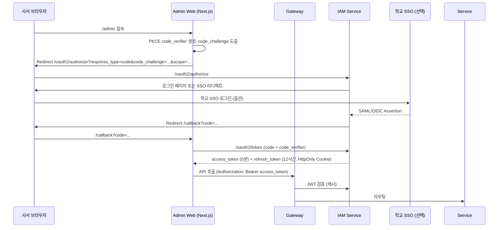
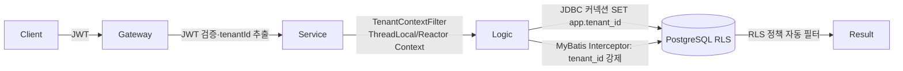

# 보안 및 인증·인가 표준 (Security & Auth Standards)

| 항목 | 내용 |
|---|---|
| 문서명 | Tulip+ 보안·인증 표준 |
| 문서 ID | DEV-05 |
| 버전 | v0.1 Draft |
| 작성일 | 2026-05-11 |
| 작성자 | DevLead Agent |
| 검토자 | PM, DBA, BackendSenior, 법무·개인정보보호 검토 |
| 입력 | `01_architecture_overview.md`, `02_service_decomposition.md`, Planner 공통 요구사항, PM 리스크 R-06/R-10/R-21 |
| 후속 | IAM 서비스 상세 설계, 운영 보안 Runbook |
| 상태 | Phase 0 초안 |

---

## 1. 보안 원칙 (Security Principles)

| 원칙 | 적용 |
|---|---|
| **Defense in Depth** | WAF + Gateway + Service + DB(RLS) + Audit, 4중 방어 |
| **Least Privilege** | 모든 역할·서비스 계정·DB 계정 최소 권한 |
| **Zero Trust 내부** | 서비스 간 통신도 mTLS + JWT (서비스 토큰) |
| **Tenant Safety First** | 모든 경로에 tenantId 강제, RLS 의무 (R-06 회피) |
| **Encryption Everywhere** | TLS 1.2+ 전송, AES-256 저장, 키는 KMS |
| **Auditability** | 모든 권한 변경·개인정보 접근·정책 변경 감사로그 (R-10) |
| **Fail Secure** | 인증/인가 시스템 장애 시 차단 (개방 금지) |
| **PII Minimization** | 필요 최소 수집·짧은 보관·마스킹 |
| **Compliance by Design** | 개인정보보호법·전자정부법·CSAP 요건 반영 |

---

## 2. 인증 아키텍처 — OAuth2 + JWT

### 2.1 인증 흐름 결정 매트릭스

| 클라이언트 | 인증 흐름 | 토큰 위치 | 비고 |
|---|---|---|---|
| 사서 관리자 Web (Next.js) | **OAuth2 Authorization Code + PKCE** | HttpOnly Secure Cookie (refresh) + In-memory (access) | 표준 SPA 보안 |
| OPAC Web (Next.js) | OAuth2 Authorization Code + PKCE (로그인 시) | HttpOnly Cookie + SSR 세션 | 익명 검색 허용 |
| OPAC Mobile (PWA) | OAuth2 Authorization Code + PKCE | Secure Storage | 모바일 SDK |
| OPAC Mobile (Native, Y2) | OAuth2 + PKCE (Native flow) | Keychain/Keystore | - |
| 자가대출반납기 (SIP2) | **Client Credentials (디바이스)** + 회원증 인증은 SIP2 자체 | 디바이스 메모리 | 디바이스 등록 필수 |
| 출입게이트·EAS | Client Credentials + 디바이스 인증서 | TPM/HSM | mTLS 권장 |
| 핸드헬드 RFID | OAuth2 **Device Authorization Grant** | App secure storage | 사서 로그인 |
| 서비스 간 | Service-to-Service JWT (Client Credentials) | Authorization Bearer | 단명(5분) |
| 외부 SSO (학교/공공) | **SAML 2.0** 또는 **OIDC** | IdP 발급, 우리는 Federated | LDAP fallback |
| mIDR (모바일신분증) | 행정안전부 API + 콜백 | 별도 검증 | 본인인증 용 |

### 2.2 OAuth2 인가 흐름 — 관리자



### 2.3 OAuth2 흐름 — OPAC 이용자

- PKCE 필수.
- 회원가입 시 본인인증(mIDR/카카오/네이버) → 정회원(CMN-013) 전환.
- Refresh Token Rotation: 갱신 시 새 refresh로 교체, 재사용 탐지 시 전체 세션 무효.

### 2.4 JWT 클레임 표준

#### Access Token

```json
{
  "iss": "https://iam.tulip.example.com",
  "aud": ["tulip-admin", "tulip-opac"],
  "sub": "usr_01H9X...",                  // 사용자 ID
  "tenantId": "tnt_001",                  // 테넌트 ID
  "libraryIds": ["lib_001", "lib_002"],   // 사용자가 접근 가능한 관 목록
  "primaryBranchId": "lib_001",           // 현재 활성 관
  "roles": ["LIBRARIAN_HEAD", "CATALOGER"],
  "scopes": ["cir:read", "cir:write", "cat:read", "cat:write"],
  "memberType": "STAFF",
  "deviceId": null,                       // 디바이스 토큰일 때 채움
  "amr": ["pwd", "mfa"],                  // 인증 방식
  "iat": 1715404830,
  "exp": 1715405130,                      // 5분
  "jti": "01H9X..."                       // 토큰 고유 ID
}
```

| 클레임 | 의무 | 설명 |
|---|---|---|
| `iss` | O | 발급자 |
| `aud` | O | 대상 클라이언트 |
| `sub` | O | 사용자 식별자 |
| `tenantId` | O | **테넌트 — 검증 의무** |
| `libraryIds` | O | 권한 있는 관 목록 |
| `roles` | O | 역할 (RBAC) |
| `scopes` | O | 권한 스코프 (`{domain}:{action}`) |
| `memberType` | O | STAFF / PATRON / DEVICE / PLATFORM_ADMIN |
| `amr` | O | 인증 방식 (MFA 검증용) |
| `exp` | O | 만료 (5분) |
| `jti` | O | 토큰 고유 ID (블랙리스트용) |

#### Refresh Token
- HttpOnly Secure Cookie, SameSite=Lax.
- 만료: 12시간 (관리자) / 30일 (OPAC) / 7일 (모바일).
- DB 저장 (Redis): `(jti, userId, deviceId, family)`. Rotation 시 family 추적.

#### 서비스 토큰
- `sub=svc_circulation`, `scopes=[internal:*]`, `exp=5분`.
- mTLS와 결합.

### 2.5 토큰 서명·키 관리

| 항목 | 결정 |
|---|---|
| 알고리즘 | **RS256** (RSA 2048bit) — Public key 분산 검증 가능 |
| 키 보관 | KMS (AWS KMS / 동등) |
| 키 회전 | 90일마다 자동 회전, kid로 다중 키 지원 |
| JWKS 공개 | `https://iam.tulip.example.com/.well-known/jwks.json` |
| 토큰 블랙리스트 | Redis (jti, exp), 로그아웃·이상 탐지 시 |

---

## 3. 권한 모델 (RBAC + ABAC)

### 3.1 모델 구성

```
User ──(N:M)── Role ──(N:M)── Permission
  │                                  │
  └─── DataScope (ABAC) ─────────────┘
         (tenantId, libraryIds, memberTypes, locationIds)
```

### 3.2 시스템 역할 (Role) 매트릭스

| Role | 사용자 | 주 기능 | scope 예시 |
|---|---|---|---|
| `PLATFORM_ADMIN` | 플랫폼 운영자 | 테넌트 관리, 모니터링, 강제전환 | `*:*` |
| `PLATFORM_OPERATOR` | 플랫폼 운영 | 모니터링, 장애대응 | `*:read`, `tenant:write` |
| `TENANT_ADMIN` | 테넌트 IT 관리자 | 테넌트 설정, 외부연동, 사용자 | `tenant:*`, `user:*`, `policy:write` |
| `DIRECTOR` | 관장 | 정책 승인, 대시보드 | `*:read`, `policy:approve`, `withdrawal:approve` |
| `LIBRARIAN_HEAD` | 팀장 사서 | 결재, 정책 변경 | `*:read`, `*:write` (자기 관) |
| `LIBRARIAN_CATALOGER` | 편목 사서 | CAT 전반 | `cat:*`, `col:write` |
| `LIBRARIAN_ACQ` | 수서 사서 | ACQ 전반 | `acq:*`, `cat:read` |
| `LIBRARIAN_CIR` | 열람 사서 | 대출/반납/회원 | `cir:*`, `member:write`, `cat:read` |
| `LIBRARIAN_COLLECTION` | 장서 사서 | 점검·이관·제적 | `col:*`, `cat:read` |
| `LIBRARIAN_FACILITY` | 시설/출입 사서 | 좌석·시설·출입 | `fac:*`, `acs:*` |
| `STAFF_GENERAL` | 일반 직원 | 카운터 처리 | `cir:write`, `member:read` |
| `STAFF_PARTTIME` | 시간제 사서 | 한정 카운터 | `cir:write` (시간 제약 ABAC) |
| `PATRON_REGULAR` | 정회원 | OPAC 전 기능 | `opac:*`, `mylib:write` |
| `PATRON_ASSOCIATE` | 준회원 | OPAC 검색·열람 | `opac:read` |
| `EXTERNAL_VISITOR` | 외부 방문자 | 검색만 | `opac:read` (시간 제약) |
| `DEVICE_KIOSK` | 자가대출기 | SIP2 거래 | `device:cir`, `device:fac` |
| `DEVICE_GATE` | 출입게이트 | 인증·이벤트 | `device:acs` |
| `SERVICE_INTERNAL` | 내부 서비스 | 서비스 간 호출 | `internal:*` |

### 3.3 Scope 표준

```
{domain}:{action}
domain: cmn, aut, acq, cat, cir, col, acs, fac, opac, mylib, stats, report, internal, device
action: read, write, approve, admin
```

예: `cir:write`, `acq:approve`, `stats:read`, `internal:cir`.

### 3.4 ABAC (속성 기반) 결합

RBAC만으로 부족한 경우 (R-16 정책 분기 폭증 대응):

| 속성 | 적용 |
|---|---|
| `tenantId` | 절대 격리 — 토큰 vs 자원 일치 검증 |
| `libraryIds` | 다관 환경에서 사용자 권한 관 외 차단 |
| `memberType` | 특정 자료유형 대출 권한 (학부생 X, 교수 O) |
| `timeWindow` | 시간제 사서는 근무시간 외 차단, 외부인 18~22시 제한 |
| `locationId` | 보존서가 접근, 귀중자료 열람 |
| `ownership` | 본인 자료만 (이용자 자기 대출 조회) |
| `policyTag` | 도서관 유형(공공/대학/학교)별 |

### 3.5 권한 평가 우선순위

```
1. 거부 우선 (Explicit Deny)
2. 테넌트 격리 위반 → 즉시 차단
3. 역할 기반 Permission 매칭
4. Scope 검증
5. ABAC 속성 평가
6. 명시적 허용 없으면 차단 (Deny by default)
```

### 3.6 권한 어노테이션 (Spring Security)

```java
@PreAuthorize("hasScope('cir:write') and isSameTenant(#req.tenantId) and isInBranch(#req.branchId)")
public LoanResponse checkout(@RequestBody CheckoutRequest req) { ... }

@PreAuthorize("hasRole('LIBRARIAN_COLLECTION') and canWithdraw(#itemId)")
public void withdraw(@PathVariable String itemId) { ... }

@PreAuthorize("hasScope('opac:read') and isOwnLoan(#loanId)")
public LoanDetail myLoan(@PathVariable String loanId) { ... }
```

### 3.7 권한 매트릭스 (요약 — 도메인별)

| 도메인 / 역할 | DIRECTOR | LIB_HEAD | LIB_CAT | LIB_ACQ | LIB_CIR | LIB_COL | LIB_FAC | STAFF | PATRON | DEVICE |
|---|---|---|---|---|---|---|---|---|---|---|
| 대시보드/통계 (CMN) | R | R | R | R | R | R | R | R | - | - |
| 회원관리 (CMN) | R | RW | R | R | RW | R | R | R | self | - |
| 정책 (CMN) | Approve | RW | R | R | R | R | R | R | - | - |
| 코드/마스터 (CMN) | RW | RW | R | R | R | R | R | R | - | - |
| 수서 (ACQ) | Approve | RW | R | RW | R | R | - | R | request | - |
| 목록 (CAT) | R | RW | RW | R | R | R | - | R | search | - |
| 열람 (CIR) | R | RW | R | R | RW | R | - | RW | self | RW |
| 장서 (COL) | Approve | RW | R | R | R | RW | - | R | - | - |
| 출입 (ACS) | R | RW | - | - | - | - | RW | R | self | RW |
| 시설 (FAC) | R | RW | - | - | - | - | RW | R | RW (자기) | RW |

> R=Read, W=Write, RW=Read+Write, Approve=승인 권한, self=본인 자료만.

---

## 4. 테넌트 컨텍스트 전파

### 4.1 강제 흐름



### 4.2 핵심 구현 규칙

| 위치 | 규칙 |
|---|---|
| Gateway | JWT 서명 검증, `tenantId`/`libraryIds` 추출 후 `X-Tenant-Id` 헤더 강제 부착 (클라이언트 헤더는 폐기·재발급) |
| Service Filter | `TenantContextFilter`에서 ThreadLocal 또는 Reactor Context에 보관 |
| MyBatis | Interceptor가 모든 쿼리에 tenant_id WHERE 추가 누락 검증 → 누락 시 예외 |
| JDBC | 커넥션 풀에서 가져올 때 `SET app.tenant_id = ?` 실행 |
| PostgreSQL | RLS 정책 의무 (`USING (tenant_id = current_setting('app.tenant_id')::bigint)`) |
| 캐시 키 | Redis 키에 tenantId prefix 강제 (`t:{tenantId}:cache:...`) |
| 이벤트 메시지 | Kafka 키 = tenantId, 페이로드에도 tenantId 포함 |
| 로그 | MDC에 tenantId 자동 주입 |
| 검색 인덱스 | OpenSearch 인덱스에 tenantId 필드 + 필터 강제 |

### 4.3 시스템 관리자 전환

- `role=PLATFORM_ADMIN` 토큰만 `X-Tenant-Id` 헤더로 다른 테넌트 임의 접근 허용.
- 모든 전환은 감사로그 `AUDIT_TENANT_SWITCH` (5년 보존).

### 4.4 회귀 테스트 (R-06 의무)

- CI에 "tenant_id 누설 회귀 테스트" 의무: 매 PR에서 1만건 매트릭스 (10 테넌트 × 1000 데이터).
- 한 건이라도 누설 시 PR 차단.
- 분기 1회 외부 침투 테스트.

---

## 5. 비밀번호·MFA·SSO·세션 정책

### 5.1 비밀번호 정책

| 항목 | 값 |
|---|---|
| 최소 길이 | 12자 (관리자) / 10자 (이용자) |
| 복잡도 | 영문 대/소문자 + 숫자 + 특수문자 중 3종 이상 |
| 사용 금지 | 회원번호·이름·생년월일·일반 사전어 |
| 만료 | 90일 (관리자) / 365일 (이용자) |
| 이력 | 최근 5개 재사용 금지 |
| 잠금 | 5회 연속 오류 시 30분 잠금 |
| 저장 | **BCrypt cost 12 이상** (PBKDF2 또는 Argon2 검토) |
| 임시 비밀번호 | 발급 시 24시간 유효, 첫 로그인 시 강제 변경 |

### 5.2 MFA (Multi-Factor Authentication)

| 대상 | MFA 정책 |
|---|---|
| `PLATFORM_ADMIN`, `TENANT_ADMIN` | **필수** (TOTP, WebAuthn) |
| `DIRECTOR`, `LIBRARIAN_HEAD` | 권장 |
| 일반 사서 | 선택 (관리자가 강제 가능) |
| OPAC 이용자 | 선택 (간편 로그인 외) |

방식: TOTP(Google/Authy), SMS OTP, WebAuthn(FIDO2). SMS는 보조.

### 5.3 SSO·LDAP 연동

| 외부 IdP | 프로토콜 | 적용 |
|---|---|---|
| 학교 SSO | SAML 2.0 (1차) / OIDC (지원 시) | 대학·학교 |
| LDAP / Active Directory | LDAP v3 + StartTLS | 대학 직원 |
| NEIS (학생) | API + 본인인증 | 학교 (학적 동기화) |
| mIDR | 행정안전부 API | 공공 (정회원 본인인증) |
| 카카오/네이버 OAuth | OAuth2 | 공공 (간편 로그인) |

SSO 매핑: 외부 사용자 식별자 ↔ 내부 `Member`/`User` 매핑 테이블 (CMN-016).

### 5.4 세션 정책

| 항목 | 값 |
|---|---|
| Access Token | 5분 |
| Refresh Token (관리자) | 12시간 (idle 60분 → 자동 만료) |
| Refresh Token (OPAC) | 30일 (idle 7일) |
| Refresh Token (Mobile) | 30일 + Rotation |
| 동시 세션 | 사용자당 5개 (디바이스), 초과 시 가장 오래된 것 무효 |
| 강제 로그아웃 | 관리자 권한, jti 블랙리스트 즉시 적용 |
| 비밀번호 변경 시 | 다른 모든 세션 무효 |

---

## 6. API 보안

### 6.1 Rate Limit (재확인 — `03_api_standards.md` 11장)

- Redis 기반 (`fixed window` 또는 `token bucket`).
- 사용자 + IP + 디바이스 ID 기준 다중 차원.

### 6.2 CSRF

- Cookie 인증 사용 시 **Double Submit Cookie + SameSite=Lax** 또는 **Custom Header (X-CSRF-Token)** 의무.
- 순수 Bearer 토큰 사용 시 CSRF 영향 없음 (SPA 일반 케이스).

### 6.3 CORS

- 화이트리스트 운영 (테넌트별 OPAC 도메인).
- `Access-Control-Allow-Credentials: true` 사용 시 origin 정확 매치 필수.

### 6.4 IDOR (Insecure Direct Object Reference) 방지

- 모든 자원 조회 시 `tenantId`·`libraryIds`·`ownership` 검증.
- ID는 UUIDv7 (예측 불가, 시간순 정렬 가능).
- 자동화 검사: 단위 테스트에서 타 테넌트 ID 호출 → 404/403 검증.

### 6.5 Input Validation

| 계층 | 검증 |
|---|---|
| Gateway | 페이로드 크기 (10MB cap), Content-Type, 헤더 인젝션 |
| BFF/Controller | Bean Validation (`@NotBlank`, `@Size`, `@Pattern`) |
| Service | 비즈니스 규칙 검증 |
| DB | 제약조건 + RLS |

### 6.6 SQL Injection 방지

- MyBatis는 `#{}` 파라미터 바인딩 의무 (DevLead 코드 리뷰에서 차단).
- 동적 SQL은 화이트리스트 컬럼/정렬만 허용.

### 6.7 SSRF 방지

- External Gateway에서 도메인 화이트리스트 (KOLIS/KERIS/DLS/Z39.50 등록 서버만).
- 내부 메타데이터 IP(169.254.169.254 등) 차단.

### 6.8 Secret 관리

- 평문 저장 절대 금지 (코드·설정·로그·DB).
- AWS Secrets Manager / Vault 사용, 런타임 주입.
- 키 회전 (DB 비밀번호 90일, API 키 180일).

### 6.9 의존성 보안

- CI 단계에서 SCA(Software Composition Analysis): Dependabot, Snyk, Trivy.
- 컨테이너 이미지 스캔 (취약점 Critical/High → 빌드 실패).

---

## 7. 감사 로그 (Audit Logging)

### 7.1 두 종류 분리

| 종류 | 내용 | 대상 |
|---|---|---|
| **변경 이력 (Change History)** | 도메인 객체의 값 변경 (CMN-081) | 회원·서지·정책·소장 등 |
| **접근 이력 (Access Log)** | 개인정보 조회·다운로드 (CMN-082, PIPA) | 회원 PII, 출입로그, 대출이력 |

### 7.2 변경 이력 표준 스키마

```sql
CREATE TABLE audit_change_log (
  id BIGSERIAL PRIMARY KEY,
  tenant_id BIGINT NOT NULL,
  service VARCHAR(64) NOT NULL,
  entity_type VARCHAR(64) NOT NULL,    -- 예: Member, Bibliographic, Policy
  entity_id VARCHAR(128) NOT NULL,
  action VARCHAR(16) NOT NULL,         -- CREATE/UPDATE/DELETE
  changed_by VARCHAR(64) NOT NULL,
  changed_at TIMESTAMPTZ NOT NULL DEFAULT NOW(),
  before_value JSONB,
  after_value JSONB,
  diff JSONB,                          -- 변경 필드만
  reason TEXT,
  client_ip INET,
  trace_id VARCHAR(64)
);
```

### 7.3 접근 이력 표준 스키마

```sql
CREATE TABLE audit_access_log (
  id BIGSERIAL PRIMARY KEY,
  tenant_id BIGINT NOT NULL,
  service VARCHAR(64) NOT NULL,
  resource_type VARCHAR(64) NOT NULL,   -- 예: MemberPII, LoanHistory
  resource_id VARCHAR(128),
  action VARCHAR(32) NOT NULL,          -- READ/EXPORT/DOWNLOAD/PRINT
  accessed_by VARCHAR(64) NOT NULL,
  accessed_at TIMESTAMPTZ NOT NULL DEFAULT NOW(),
  purpose VARCHAR(255),                 -- 접근 사유
  client_ip INET,
  user_agent TEXT,
  trace_id VARCHAR(64)
);
```

### 7.4 감사 대상 의무 항목

| 카테고리 | 대상 |
|---|---|
| 인증 | 로그인 성공·실패, 비밀번호 변경, MFA 변경, 토큰 무효화 |
| 권한 | 역할 부여·회수, 권한 변경 (CMN-046) |
| 회원 PII | 회원 정보 조회 (개인정보 포함 필드), 다운로드, 일괄 export |
| 정책 | 정책 변경·승인 |
| 서지·장서 | 삭제, 결합·분리, 제적 승인 |
| 대출이력 | 회원별 대출이력 조회 (사서) |
| 출입이력 | 출입로그 조회·export |
| 시스템 | 테넌트 전환, 외부연동 키 변경 |

### 7.5 보존 기간

| 로그 종류 | 보존 |
|---|---|
| 개인정보 접근 로그 | **5년** (PM 헌장 5.1, 법정) |
| 변경 이력 (회원·정책) | 5년 |
| 변경 이력 (서지·장서) | 영구 (이력 가치) |
| 인증 로그 | 1년 |
| 보안 이벤트 | 5년 |
| 일반 운영 로그 | 90일 → 콜드 스토리지 1년 |

### 7.6 위변조 방지

- 감사 로그 테이블은 **append-only**, UPDATE/DELETE 차단(Trigger/Permission).
- 별도 보관 (SIEM, 분리 DB 또는 WORM 스토리지).
- 체크섬·해시 체인 (블록체인 스타일은 옵션, Y2 검토).

---

## 8. 개인정보 보호 (PII / PIPA 준수)

### 8.1 PII 컬럼 식별표

| 엔티티 | PII 컬럼 | 분류 | 처리 |
|---|---|---|---|
| Member | 이름, 생년월일, 휴대폰, 이메일, 주소, 본인인증값 | 일반 PII | **암호화 저장** (AES-256, KMS) |
| Member | 주민번호 마지막 7자리 | 고유식별정보 | 저장 금지 (필요 시 해시) |
| Member | 학번, 사번 | 일반 PII | 암호화 |
| MemberCard | 카드번호 | 일반 PII | 토큰화 |
| LoanHistory | 회원ID + 자료 | 민감 (열람 비밀) | 접근 제한 + 감사로그 |
| AccessEvent | 회원ID + 시각 + 게이트 | 민감 (위치추적) | 접근 제한 + 보존 1년 |
| FinePayment | 결제 카드/계좌 | 결제정보 | PG 토큰화, 평문 저장 금지 |
| FacilityIssue | 첨부 사진 | 일반 | 자동 얼굴 모자이크 권장 (Y2) |

### 8.2 PII 처리 원칙

| 단계 | 정책 |
|---|---|
| 수집 | 동의 이력 의무 (CMN-020), 수집 항목 최소화 |
| 저장 | 전송 TLS 1.2+, 저장 AES-256, 키는 KMS, 검색 필요 시 결정적 암호 또는 토큰 |
| 사용 | 권한 매트릭스에 따라 접근, 화면 마스킹 (휴대폰 010-****-1234) |
| 공유 | 제3자 제공 동의 별도 (CMN-020), 송신 시 암호화 |
| 보관 | 보존기간 만료 시 자동 익명화 |
| 파기 | 탈퇴 후 5년 (CMN-011), 자동 익명화 처리 |

### 8.3 마스킹 규칙

| 필드 | 표시 형식 | 권한 |
|---|---|---|
| 휴대폰 | `010-****-1234` | 일반 사서 |
| 이메일 | `ho***@example.com` | 일반 사서 |
| 주소 | `서울시 강남구 ***` | 일반 사서 |
| 생년월일 | `1990-**-**` | 일반 사서 |
| 학번·사번 | 평문 | 권한 보유 사서 |
| 평문 풀 노출 | - | DIRECTOR + 사유 입력 + 감사로그 |

### 8.4 가명·익명 처리

- 통계·DW에서는 **k-익명성 + 일반화** (예: 연령대, 시군구).
- 5년 후 자동 익명화: `member_id` → 해시, PII 컬럼 NULL.

### 8.5 정보주체 권리 대응

| 권리 | 처리 |
|---|---|
| 열람 | OPAC 내정보, 사서 직접 발급 |
| 정정 | OPAC 내정보 수정, 사서 처리 |
| 삭제·파기 | 탈퇴 처리 → 5년 후 익명화 |
| 처리정지 | 임시 비활성 → 30일 후 안내 |

---

## 9. 디바이스 보안 (키오스크·게이트·핸드헬드)

| 항목 | 정책 |
|---|---|
| 디바이스 등록 | Tenant별 디바이스 등록, 고유 client_id + secret (Secrets Manager) |
| 디바이스 인증서 | TPM/HSM에 X.509 인증서 (mTLS) |
| 자가대출기 SIP2 | TLS 위 SIP2 + 사전 등록된 IP/시리얼 화이트리스트 |
| 출입게이트 | 디바이스 토큰 + IP 화이트리스트 + 디바이스 헬스체크 |
| 핸드헬드 | 사서 OAuth2 Device Flow 로그인, 오프라인 캐시 8시간 |
| 분실/도난 | 즉시 원격 무효화 (jti 블랙리스트) |
| 펌웨어 | 서명 검증 후 OTA 업데이트 |

---

## 10. 컴플라이언스 매핑

| 법규/표준 | 적용 항목 |
|---|---|
| **개인정보보호법(PIPA)** | 동의·열람·정정·삭제권, 접근로그 5년, 암호화 (PM R-10) |
| **전자정부법** | 전자기록 보존, 보안 점검 |
| **클라우드 보안인증(CSAP)** | 멀티테넌트 격리, 암호화, 접근통제, 감사 |
| **ISMS-P** | 정보보호관리체계, 분기 점검 (R-10) |
| **PCI-DSS** | (결제 PG 위탁으로 범위 최소화) 토큰화 의무 |
| **KORMARC 인증** | 호환성 (R-01) |
| **WCAG / KWCAG 2.2 AA** | 접근성 (CMN 비기능 요구) |

---

## 11. 보안 운영 절차

### 11.1 보안 점검 주기

| 점검 | 주기 |
|---|---|
| 자동 SAST/SCA | 매 PR |
| 컨테이너 스캔 | 매 빌드 |
| DAST | 주 1회 (Stg) |
| 침투 테스트 (내부) | 분기 1회 |
| 침투 테스트 (외부 위탁) | 연 1회 |
| 보안 감사 (감사로그·권한) | 분기 1회 |
| 비상 연락망·DR 훈련 | 분기 1회 (PM 협업) |

### 11.2 사고 대응 (Security Incident)

```
탐지 (SIEM/알림)
  ↓ 5분
초동 분석 (DevLead/보안담당)
  ↓ 30분
격리 (영향 범위 차단)
  ↓ 1시간
근본 원인 분석 + 복구
  ↓ 24시간
피해 알림 (개인정보 유출 시 PIPA 72시간 내 통지)
  ↓ 3일
사후 보고서 (Postmortem)
```

### 11.3 키 회전·만료 카드

| 키/비밀 | 회전 주기 | 담당 |
|---|---|---|
| JWT 서명 키 (RSA) | 90일 | DevLead |
| DB 비밀번호 | 90일 | DBA |
| 외부 API 키 (KOLIS/KERIS 등) | 180일 또는 외부 정책 | BackendSenior |
| TLS 인증서 | 60일 전 갱신 | DevLead |
| 디바이스 인증서 | 1년 | DevLead |
| 사용자 비밀번호 정책 | 90일 만료 | 자동 |

---

## 12. 후속 산출물 인계

| 인계 대상 | 작업 |
|---|---|
| BackendSenior | IAM 서비스 상세 구현, Spring Security 설정, Filter Chain |
| DBA | RLS 정책 SQL, 암호화 컬럼 DDL, audit 테이블 파티셔닝 |
| FrontendSenior | OAuth2 PKCE 클라이언트, 토큰 저장 전략, 마스킹 컴포넌트 |
| QA | 권한 매트릭스 테스트, 테넌트 격리 회귀, 침투 테스트 시나리오 |
| 보안담당(Y1) | 운영 Runbook, 사고 대응 절차 |

---

## 변경 이력

| 버전 | 일자 | 변경 내용 | 작성자 |
|---|---|---|---|
| v0.1 | 2026-05-11 | Phase 0 초안 | DevLead |
