# 코딩 규약 & PR/문서화 표준 (Coding Standards & PR Guidelines)

| 항목 | 내용 |
|---|---|
| 문서명 | Tulip+ 코딩 규약·PR·CI/CD 표준 |
| 문서 ID | DEV-06 |
| 버전 | v0.1 Draft |
| 작성일 | 2026-05-11 |
| 작성자 | DevLead Agent |
| 검토자 | BackendSenior, FrontendSenior, QA, DBA |
| 입력 | `01~05_dev_lead`, PM `04_communication_plan.md` |
| 후속 | 서비스별 코드 템플릿, ESLint/Checkstyle config |
| 상태 | Phase 0 초안 |

---

## 1. 적용 범위

본 문서는 Tulip+ 전체 코드베이스 (Backend 15+개 마이크로서비스, Frontend 관리자·OPAC, 인프라 IaC, 테스트 코드)에 의무 적용된다. 위반 PR은 DevLead가 머지 차단.

---

## 2. Backend (Java 17+ / Spring Boot 3.x)

### 2.1 프로젝트 구조 — Multi-Module Gradle

```
tulip-backend/
├── settings.gradle.kts
├── build.gradle.kts                       # 공통 의존성
├── buildSrc/                              # 컨벤션 플러그인
├── platform/
│   ├── tulip-bom/                         # 의존성 버전 BOM
│   └── tulip-common/                      # 공통 라이브러리
│       ├── tulip-common-core/             # ErrorCode, Response, Trace
│       ├── tulip-common-security/         # JWT, TenantContext
│       ├── tulip-common-web/              # Filter, Interceptor
│       ├── tulip-common-data/             # MyBatis, RLS Interceptor
│       └── tulip-common-event/            # Outbox, Kafka Helper
├── services/
│   ├── iam-service/
│   ├── tenant-service/
│   ├── member-service/
│   ├── code-policy-service/
│   ├── catalog-service/
│   ├── collection-service/
│   ├── acquisition-service/
│   ├── circulation-service/
│   ├── access-service/
│   ├── facility-service/
│   ├── search-service/
│   ├── stats-report-service/
│   ├── notification-service/
│   ├── file-service/
│   ├── external-gateway/
│   └── hardware-gateway/
├── bff/
│   ├── admin-bff/
│   └── opac-bff/
└── infra/
    ├── api-gateway/
    └── batch/
```

### 2.2 패키지 구조 — Layered

```
com.tulip.<service>
├── application/        # Application Service (유스케이스 조립)
│   ├── command/        # CQRS Command
│   ├── query/          # CQRS Query
│   └── service/        # 서비스 (트랜잭션 경계)
├── domain/             # 도메인 모델 (POJO)
│   ├── model/          # Entity, ValueObject
│   ├── policy/         # 비즈니스 정책 (정책엔진 사용)
│   ├── event/          # 도메인 이벤트
│   └── repository/     # Repository 인터페이스
├── infrastructure/     # 외부 어댑터 (DB, MQ, 외부 API)
│   ├── persistence/    # MyBatis Mapper 구현
│   │   ├── mapper/
│   │   └── entity/
│   ├── messaging/      # Kafka Producer/Consumer
│   ├── external/       # 외부 API Client
│   └── config/
├── interfaces/         # 진입 어댑터
│   ├── rest/           # @RestController
│   │   ├── v1/
│   │   └── dto/
│   ├── grpc/           # (옵션)
│   └── consumer/       # 메시지 컨슈머
└── TulipXxxApplication.java
```

### 2.3 네이밍 컨벤션

| 대상 | 컨벤션 | 예시 |
|---|---|---|
| 패키지 | 소문자 단어 | `com.tulip.circulation.application` |
| 클래스 | PascalCase | `CheckoutCommandService` |
| 인터페이스 | PascalCase, `I` prefix 금지 | `MemberRepository` |
| 추상 클래스 | `Abstract` prefix | `AbstractEventHandler` |
| Enum | PascalCase / 값은 UPPER_SNAKE | `LoanStatus.LOANED` |
| 메소드 | camelCase, 동사로 시작 | `findActiveLoansByMember()` |
| 변수·필드 | camelCase | `currentLoanCount` |
| 상수 | UPPER_SNAKE_CASE | `MAX_LOAN_COUNT` |
| 테스트 | `xxxTest` / `xxxIT` | `CheckoutServiceTest`, `CheckoutIT` |
| DTO | `XxxRequest`, `XxxResponse` | `CheckoutRequest`, `CheckoutResponse` |
| Mapper 인터페이스 | `XxxMapper` | `LoanMapper` |
| Mapper XML | `XxxMapper.xml` | `LoanMapper.xml` |
| Controller | `XxxController` | `LoanController` |
| Configuration | `XxxConfig` | `SecurityConfig` |

### 2.4 예외 처리 표준

```java
// 1) 비즈니스 예외 계층
public abstract class TulipException extends RuntimeException {
    private final ErrorCode errorCode;
    public TulipException(ErrorCode code, String message, Throwable cause) { ... }
}

public class BusinessException extends TulipException { ... }    // 422 비즈니스 규칙
public class NotFoundException extends TulipException { ... }    // 404
public class ConflictException extends TulipException { ... }    // 409
public class ForbiddenException extends TulipException { ... }   // 403
public class ExternalException extends TulipException { ... }    // 502/504

// 2) 전역 핸들러
@RestControllerAdvice
public class GlobalExceptionHandler {
    @ExceptionHandler(BusinessException.class)
    public ResponseEntity<ErrorResponse> handle(BusinessException ex) { ... }
    // ... 표준 envelope 변환
}
```

**규칙**:
- 도메인 예외는 도메인 모듈에서 throw, infrastructure 예외(`SQLException`)는 잡아서 도메인 예외로 변환.
- 예외에 ErrorCode 의무 부착 (`04_error_codes.md` 참조).
- `catch (Exception e) { ... }`는 최상위 핸들러에서만.
- 절대 빈 catch 금지 (`catch (Exception ignored) {}`).
- 로그에 stacktrace는 ERROR 레벨에서만, 비즈니스 예외는 WARN.

### 2.5 트랜잭션 경계

| 규칙 | 설명 |
|---|---|
| **Application Service에만 `@Transactional`** | Controller·Mapper에 절대 금지 |
| 읽기 전용 | `@Transactional(readOnly = true)` 명시 |
| 전파 옵션 | 기본 `REQUIRED`, 보상 트랜잭션은 `REQUIRES_NEW` |
| 격리 수준 | PostgreSQL 기본 `READ_COMMITTED`, 회계 등 strict는 `REPEATABLE_READ` |
| Outbox | 도메인 변경과 Outbox 삽입은 **동일 트랜잭션** |
| 외부 호출 금지 | 트랜잭션 내에서 외부 API 호출 금지 (락 점유) |
| 락 timeout | `lock_timeout = 5s`, deadlock 감지 시 재시도(최대 3회) |
| 트랜잭션 길이 | 1초 이내 권장, 1초 초과는 DBA 협의 (R-07 부하) |

```java
@Service
@RequiredArgsConstructor
public class CheckoutCommandService {
    private final LoanRepository loanRepository;
    private final OutboxEventStore outboxStore;
    private final PolicyEvaluator policyEvaluator;

    @Transactional
    public LoanResponse checkout(CheckoutCommand cmd) {
        var policy = policyEvaluator.evaluate(cmd);   // 캐시된 정책 (외부 호출 X)
        var loan = Loan.create(cmd, policy);
        loanRepository.save(loan);
        outboxStore.publish(new CheckedOutEvent(loan));
        return LoanResponse.from(loan);
    }
}
```

### 2.6 도메인 모델 작성 규칙

- 가급적 **불변(Immutable)** + 생성자/팩토리 메서드.
- `@Setter` 지양, 상태 변경은 의도가 드러나는 메서드 (`loan.renew(renewer)`, `loan.markReturned()`).
- ValueObject(`Money`, `BarCode`, `CallNumber`)는 record 활용.
- 도메인 객체는 `@Component` 금지 (POJO 유지).
- Persistence Entity와 도메인 Entity는 **분리** (MyBatis ResultMap → Domain 변환).

### 2.7 Lombok 사용 정책

| 권장 | 제한 |
|---|---|
| `@RequiredArgsConstructor` (생성자 주입) | `@Data` 금지 (도메인 객체) |
| `@Getter` (값 객체) | `@AllArgsConstructor` 지양 |
| `@Builder` (DTO·복잡 객체) | `@EqualsAndHashCode` 신중 (ID 기반만) |
| `@Slf4j` | - |

### 2.8 MyBatis 매퍼 규약

| 규칙 | 내용 |
|---|---|
| **인터페이스 + XML 분리** | `LoanMapper.java` + `resources/mapper/LoanMapper.xml` |
| 파라미터 바인딩 | **`#{}` 의무**, `${}` 절대 금지 (SQL Injection 방지) |
| 동적 SQL | `${}` 가 필요한 경우 화이트리스트 검증 (정렬·테이블명) |
| ResultMap | 명시적 사용, `<resultMap id="loanMap">` 명명 |
| Auto Mapping | underscore_to_camelCase 활성화 |
| 쿼리당 라인 수 | 50줄 이하 권장, 초과 시 분리 |
| 복잡 쿼리 | DBA 사전 리뷰 (R-07) |
| 매퍼 메소드명 | `selectXxx`, `insertXxx`, `updateXxx`, `deleteXxx`, `countXxx` |
| tenant_id | 모든 쿼리에 명시 (RLS 보조), Interceptor가 누락 검출 |
| 인덱스 활용 | EXPLAIN 결과 첨부 (PR에 대용량 쿼리는 의무) |

#### Mapper XML 예시

```xml
<?xml version="1.0" encoding="UTF-8"?>
<!DOCTYPE mapper PUBLIC "-//mybatis.org//DTD Mapper 3.0//EN"
  "http://mybatis.org/dtd/mybatis-3-mapper.dtd">
<mapper namespace="com.tulip.circulation.infrastructure.persistence.mapper.LoanMapper">

  <resultMap id="loanMap" type="com.tulip.circulation.domain.model.Loan">
    <id property="id" column="id"/>
    <result property="memberId" column="member_id"/>
    <result property="itemId" column="item_id"/>
    <result property="loanedAt" column="loaned_at"/>
    <result property="dueAt" column="due_at"/>
    <result property="status" column="status"
            typeHandler="com.tulip.common.LoanStatusTypeHandler"/>
  </resultMap>

  <select id="findActiveByMember" resultMap="loanMap">
    SELECT id, member_id, item_id, loaned_at, due_at, status
    FROM cir_loan
    WHERE tenant_id = #{tenantId}
      AND member_id = #{memberId}
      AND status IN ('LOANED','OVERDUE','RENEWED')
    ORDER BY loaned_at DESC
    LIMIT #{limit} OFFSET #{offset}
  </select>
</mapper>
```

### 2.9 로깅 표준

- SLF4J + Logback, JSON 출력 (운영).
- MDC에 `tenantId`, `traceId`, `userId`, `requestId` 자동 주입.
- 레벨: ERROR(즉각 대응), WARN(주의), INFO(주요 비즈니스 이벤트), DEBUG(개발), TRACE(미사용).
- PII 출력 금지 (휴대폰·이메일·주소 등 — 마스킹 의무).
- `log.info("user logged in: userId={}", userId)` 형식. 문자열 결합 금지.

### 2.10 테스트 표준

| 종류 | 도구 | 범위 | 커버리지 목표 |
|---|---|---|---|
| 단위 테스트 | JUnit 5 + Mockito + AssertJ | 도메인 + Application | **80%** |
| 매퍼 테스트 | `@MybatisTest` + Testcontainers | Mapper SQL | 핵심 매퍼 100% |
| 통합 테스트 | `@SpringBootTest` + Testcontainers (PG, Kafka, Redis) | 서비스 단위 | 핵심 시나리오 |
| 계약 테스트 | Spring Cloud Contract 또는 Pact | 서비스 간 API | 변경 시 |
| E2E 테스트 | Playwright + Newman | 핵심 사용자 시나리오 | Phase별 핵심 |
| 부하 테스트 | k6 / Gatling | 핵심 API | Phase 1 종료 / Phase 4 종료 (R-07) |
| 보안 테스트 | OWASP ZAP DAST | 주기 | 주 1회 (Stg) |
| RLS 회귀 | 자체 프레임워크 | 모든 도메인 | 매 PR (R-06) |

#### 테스트 명명

```java
@Test
@DisplayName("연체 회원은 대출할 수 없다 — TLP-CIR-422-0002")
void shouldRejectCheckoutWhenMemberHasOverdue() { ... }
```

### 2.11 정적 분석·코드 품질

| 도구 | 적용 |
|---|---|
| **Checkstyle** | Google Java Style 기반 커스텀 (BAN: `@Data`, `e.printStackTrace()`, System.out) |
| **SpotBugs** | High/Critical 시 PR 차단 |
| **PMD** | 옵션 |
| **SonarQube** | 신규 코드 Coverage 80%, Code Smell <5/1000 LOC |
| **OpenAPI 린트** | spectral |
| **JaCoCo** | 커버리지 측정 |

### 2.12 의존성 정책

| 정책 | 내용 |
|---|---|
| BOM | `tulip-bom`에서 버전 중앙 관리 |
| Spring Boot | 3.3.x LTS (PM 헌장 5.4) |
| 신규 라이브러리 도입 | DevLead 승인 필수 |
| 라이센스 | Apache 2.0, MIT, BSD 허용 / GPL·AGPL 금지 |
| 보안 | Dependabot + Snyk, Critical CVE 24시간 내 대응 |

---

## 3. Frontend (Next.js 14+ / TypeScript)

### 3.1 프로젝트 구조

```
tulip-frontend/
├── apps/
│   ├── admin/                  # 사서 관리자 (Next.js App Router)
│   │   ├── src/app/            # App Router 라우팅
│   │   │   ├── (auth)/         # 로그인 등
│   │   │   ├── (main)/         # 메인 레이아웃 + 보호 라우트
│   │   │   │   ├── dashboard/
│   │   │   │   ├── members/
│   │   │   │   ├── cat/        # 목록
│   │   │   │   ├── cir/        # 열람
│   │   │   │   ├── col/        # 장서
│   │   │   │   ├── acq/        # 수서
│   │   │   │   ├── acs/        # 출입
│   │   │   │   └── fac/        # 시설
│   │   │   └── api/            # BFF 프록시 라우트
│   │   ├── src/features/       # 도메인별 feature 모듈
│   │   │   ├── members/
│   │   │   │   ├── components/
│   │   │   │   ├── hooks/
│   │   │   │   ├── api/
│   │   │   │   ├── types/
│   │   │   │   └── index.ts
│   │   │   └── ...
│   │   ├── src/shared/         # 공통 hook/util
│   │   └── src/widgets/        # 페이지 조립용 widget
│   └── opac/                   # OPAC (Next.js App Router, SSR/ISR)
├── packages/
│   ├── ui/                     # 공통 컴포넌트 라이브러리 (디자인 시스템)
│   ├── api-client/             # OpenAPI codegen 결과
│   ├── auth/                   # 인증 hooks (Auth Context, useAuth)
│   ├── i18n/                   # 다국어
│   ├── theme/                  # 디자인 토큰
│   ├── icons/
│   └── eslint-config/
├── package.json (workspace)
├── turbo.json (Turborepo)
└── tsconfig.base.json
```

### 3.2 App Router 라우팅 표준

| 패턴 | 적용 |
|---|---|
| `(group)` | 레이아웃 그룹 (인증 라우트 vs 메인) |
| `[id]` | 동적 세그먼트 — UUID 검증 |
| `loading.tsx` | 페이지 로딩 UI 의무 |
| `error.tsx` | 에러 경계 의무 |
| `not-found.tsx` | 404 페이지 의무 |
| `layout.tsx` | 상위 레이아웃 (사이드바·헤더) |
| middleware.ts | 인증 가드, locale, 테넌트 컨텍스트 |

### 3.3 렌더링 전략

| 화면 | 전략 | 근거 |
|---|---|---|
| 관리자 대시보드 | SSR + CSR (인터랙티브 차트) | 로그인 필요, 캐시 불가 |
| 회원·자료 목록 | CSR + TanStack Query | 빈번한 갱신·정렬·필터 |
| OPAC 홈 (신간·인기) | ISR (60초) | 정적·SEO 중요 |
| OPAC 검색 결과 | SSR | SEO + 빠른 첫 응답 |
| OPAC 자료 상세 | SSR + ISR | SEO + 캐시 |
| OPAC MyLibrary | CSR + 인증 가드 | 개인정보 |
| KORMARC 편집기 | CSR | 무거운 인터랙션 |
| 모바일 좌석맵 | CSR + WebSocket | 실시간 |

### 3.4 상태 관리

| 종류 | 도구 |
|---|---|
| 서버 상태 (API 데이터) | **TanStack Query (v5)** |
| 클라이언트 전역 상태 | **Zustand** (가벼움) |
| 폼 상태 | **React Hook Form + Zod** |
| URL 상태 (검색 조건) | **nuqs** 또는 URLSearchParams |
| 인증 상태 | Context + JWT in-memory |
| Redux/MobX | 사용 금지 (단순성) |

### 3.5 컴포넌트 작성 규칙

| 규칙 | 내용 |
|---|---|
| Feature-based 폴더링 | `features/<domain>/components/<Component>.tsx` |
| 공통 컴포넌트 | `packages/ui/` (Designer 디자인시스템 산출물 기반) |
| Props 타입 | Interface 명시, `React.FC` 사용 지양 |
| 함수형 컴포넌트만 | Class component 금지 |
| 컴포넌트당 1파일 | 100라인 초과 시 분할 |
| Storybook | 공통 컴포넌트 의무 |
| 접근성 | KWCAG 2.2 AA — aria-label, role, alt, focus 관리 |
| 키보드 네비게이션 | 모든 인터랙션 키보드 가능해야 함 |

### 3.6 API 클라이언트

- OpenAPI 3.x → `openapi-typescript-codegen`으로 클라이언트 자동 생성.
- TanStack Query 통합:

```ts
// packages/api-client/queries/loans.ts
export const useLoans = (memberId: string) =>
  useQuery({
    queryKey: ['loans', memberId],
    queryFn: () => LoansApi.getMemberLoans({ memberId }),
    staleTime: 30_000,
  });

export const useCheckout = () =>
  useMutation({
    mutationFn: (req: CheckoutRequest) =>
      LoansApi.checkout({ body: req, headers: { 'Idempotency-Key': uuid() } }),
    onSuccess: () => queryClient.invalidateQueries({ queryKey: ['loans'] }),
  });
```

### 3.7 TypeScript 규칙

| 규칙 | 내용 |
|---|---|
| `strict: true`, `noImplicitAny: true` | tsconfig 의무 |
| `any` 사용 금지 | `unknown` 또는 정확한 타입 |
| `enum` 대신 `as const` 객체 또는 union | tree-shaking 유리 |
| Zod 스키마 | API 응답·폼 입력 검증 |
| Discriminated Union | 상태 모델링 (`status: 'loading' \| 'success' \| 'error'`) |
| `unknown` 캐치 | `catch (e: unknown) { if (e instanceof Error) ...}` |

### 3.8 ESLint / Prettier

- 공통 config: `packages/eslint-config/`
- 규칙: airbnb base + `@typescript-eslint` + `eslint-plugin-react-hooks` + `eslint-plugin-jsx-a11y` + Tailwind 정렬 플러그인.
- Prettier: `printWidth: 100`, `singleQuote: true`, `semi: true`, `trailingComma: 'all'`.

### 3.9 다국어 (i18n)

- `next-intl` 또는 `react-i18next`.
- 메시지 키: `<feature>.<section>.<field>` (예: `cir.checkout.exceedQuota`).
- 에러 메시지는 백엔드 `messageKey` 그대로 사용 → 클라이언트 사전에서 번역.

### 3.10 Frontend 테스트

| 종류 | 도구 |
|---|---|
| 단위 | Vitest + Testing Library |
| 컴포넌트 | Testing Library + Storybook Play 함수 |
| E2E | **Playwright** (PM 헌장 기술 스택) |
| 접근성 | jest-axe + Lighthouse CI |
| 시각 회귀 | Chromatic (옵션) |

커버리지 목표: 핵심 feature 70% 이상, 공통 컴포넌트 90% 이상.

---

## 4. DB 마이그레이션·스키마 관리

### 4.1 도구 — Flyway

- 위치: `services/<svc>/src/main/resources/db/migration/V{ver}__<desc>.sql`
- 버전: `V20260711_001__create_loan_table.sql` (날짜 + 일련번호)
- 절대 수정 금지 (Repeatable는 `R__` prefix만 수정 가능).
- 모든 DDL은 **DBA 승인**.

### 4.2 변경 정책

| 변경 | 정책 |
|---|---|
| 컬럼 추가 | Nullable로 추가 → 백필 → NOT NULL (3단계 무중단) |
| 컬럼 삭제 | Deprecation 6개월 후 |
| 인덱스 추가/변경 | DBA 협의 필수 |
| 데이터 마이그레이션 | 별도 배치, idempotent |
| 운영 적용 | 사전 점검 + 무중단 절차 (R-21) |

---

## 5. Git 브랜치 전략

```
main                    ← 운영 (보호, PR 머지 + DevLead 승인 + CI 통과)
  └─ release/x.y.z      ← 릴리스 후보 (QA 검증)
       └─ develop       ← 통합 개발 (모든 feature 통합)
            ├─ feature/<phase>-<JIRA>-<요약>
            ├─ fix/<phase>-<JIRA>-<요약>
            ├─ refactor/<JIRA>-<요약>
            ├─ chore/<JIRA>-<요약>
            └─ docs/<JIRA>-<요약>

hotfix/<JIRA>-<요약>     ← main에서 분기 → main + develop 동시 머지
```

### 5.1 브랜치 규칙

| 항목 | 값 |
|---|---|
| 보호 브랜치 | `main`, `release/*`, `develop` |
| Force Push | 금지 |
| Direct Commit | 금지 (모든 변경은 PR) |
| 머지 방식 | `feature → develop`: Squash & Merge / `release → main`: Merge Commit |
| 브랜치 이름 | 케밥-케이스, 영문, 60자 이하 |

### 5.2 커밋 메시지 — Conventional Commits

```
<type>(<scope>): <subject>

<body>

<footer>
```

| type | 의미 |
|---|---|
| feat | 신규 기능 |
| fix | 버그 수정 |
| refactor | 리팩토링 (기능 변경 없음) |
| perf | 성능 개선 |
| test | 테스트 추가/수정 |
| docs | 문서 |
| chore | 빌드·설정·잡일 |
| build | 빌드 시스템 |
| ci | CI 설정 |
| style | 코드 스타일 (포맷팅) |
| revert | 이전 커밋 되돌리기 |

**scope**: 서비스명 또는 영역 (`cir`, `cat`, `iam`, `admin-ui`, `opac-ui`, `infra`).

#### 예시

```
feat(cir): SIP2 게이트웨이 체크아웃 트랜잭션 구현

- TLP-CIR-422-* 정책 위반 응답 매핑
- Idempotency-Key 적용
- Outbox 이벤트 CheckedOut 발행

Refs: LIB-1234
```

#### Breaking Change

```
feat(cat)!: KORMARC 응답 구조 변경

BREAKING CHANGE: GET /api/v1/cat/bibs/{id} 응답 필드 marc.fields 구조가 배열로 변경됨.
v2 마이그레이션 가이드: docs/migration/v2.md
```

---

## 6. PR (Pull Request) 표준

### 6.1 PR 제목

```
[<Phase>] <Jira ID> <type>: <요약>
예: [P2] LIB-1234 feat(cat): KORMARC 245 필드 파서
```

### 6.2 PR 본문 템플릿

```markdown
## 변경 요약
(왜, 무엇이 바뀌었는지 1~3줄)

## 관련 이슈
- Jira: LIB-1234
- 관련 문서: `docs/04_dev_lead/02_service_decomposition.md`

## 변경 사항
- 
- 

## 테스트
- [ ] 단위 테스트 작성·통과
- [ ] 통합 테스트 통과
- [ ] 로컬 수동 시나리오 검증
- [ ] 회귀 영향 확인 (예: 동일 도메인 다른 화면)

## 영향 범위·롤백
- 영향: (DB, 외부 API, UI)
- 롤백 계획: 

## 체크리스트
- [ ] **API 표준 준수** (envelope, URL, status code)
- [ ] **ErrorCode 적용** (`TLP-XXX-NNN-NNNN`)
- [ ] **tenant_id 격리** (DB 접근 시)
- [ ] **권한 어노테이션** (`@PreAuthorize`)
- [ ] **Idempotency-Key** 필요 시 적용
- [ ] **감사 로그** (개인정보·정책·삭제 변경 시)
- [ ] **다국어 메시지 키** 사용
- [ ] **OpenAPI 어노테이션** 부착
- [ ] **PII 노출 없음** (로그·응답)
- [ ] **Breaking Change** 여부 표시
- [ ] 문서 갱신 (필요 시)
- [ ] CI 통과 (빌드·테스트·린트·SCA·OpenAPI 린트)

## 스크린샷 (UI 변경 시)
| 변경 전 | 변경 후 |
|---|---|
|  |  |
```

### 6.3 PR 크기 정책

| 라인 수 | 권장 |
|---|---|
| ~300 LOC | 권장 (빠른 리뷰) |
| 300~800 LOC | 가능 (논리 단위) |
| 800+ LOC | 가급적 분할, DevLead 사전 협의 |

### 6.4 리뷰어 정책

| 변경 영역 | 필수 리뷰어 |
|---|---|
| 일반 기능 (개별 서비스) | 해당 Senior 1명 |
| 공통 모듈 (`tulip-common-*`) | **DevLead 필수** |
| 인증·권한 | **DevLead 필수** |
| DB 스키마 (Flyway) | **DBA 필수** |
| API 표준 변경 | **DevLead 필수** |
| 외부 연동 (KOLIS·SIP2 등) | **BackendSenior 필수** |
| Frontend 공통 컴포넌트 | **FrontendSenior 필수** |
| 인프라 (K8s, IaC) | **DevLead 필수** |
| CI/CD | **DevLead 필수** |

### 6.5 머지 기준

- ✅ 모든 CI 통과
- ✅ 필수 리뷰어 승인 ≥ 1
- ✅ Conversation 모두 해소
- ✅ 충돌 없음
- ✅ Draft 상태 아님

### 6.6 코드 리뷰 체크리스트

```
[ ] 비즈니스 로직 정확성 (요구사항·기능명세 부합)
[ ] 도메인 모델 응집도·결합도 (불필요한 외부 의존?)
[ ] 트랜잭션 경계 적절 (외부 호출 트랜잭션 내 X)
[ ] 예외 처리·ErrorCode 적용
[ ] tenant_id 격리·권한 검증 (R-06)
[ ] N+1 쿼리·인덱스 활용 (DBA 협업)
[ ] 테스트 커버리지·시나리오 충실
[ ] 명확한 네이밍 (변수·메서드·테스트명)
[ ] 중복 코드 (DRY)
[ ] 성능 위험 (반복문 내 외부 호출, 대량 메모리)
[ ] 보안 (입력 검증, SQL Injection, XSS, IDOR)
[ ] 로그·감사 (PII 노출 X, MDC trace 활용)
[ ] 문서·주석 (API 변경 시 OpenAPI, 복잡 로직)
[ ] Breaking Change 여부 표시
[ ] 정책 분기 폭증 방지 (R-16) — 외부화 가능한가?
```

### 6.7 리뷰 코멘트 가이드

| Prefix | 의미 |
|---|---|
| `[BLOCK]` | 머지 차단 (수정 필수) |
| `[MUST]` | 반드시 반영 |
| `[NIT]` | 사소한 개선 |
| `[Q]` | 질문 |
| `[FYI]` | 정보 공유 |
| `[FUTURE]` | 별도 티켓으로 |

존중·구체적·예시 제공. "이렇게 하면 어떨까요?" 형식 권장.

---

## 7. CI/CD 파이프라인

### 7.1 GitHub Actions 단계

```mermaid
graph LR
    A[PR 생성/Push] --> B[Lint]
    B --> C[Build]
    C --> D[Unit Test]
    D --> E[Integration Test]
    E --> F[SCA<br/>Dependency/Container Scan]
    F --> G[OpenAPI Lint]
    G --> H[Coverage Report]
    H --> I[Sonar Quality Gate]
    I --> J{PR Merged?}
    J -- Yes --> K[Build & Push Image]
    K --> L[Deploy Dev]
    L --> M[Smoke Test]
    M --> N[Manual Approval]
    N --> O[Deploy Stg]
    O --> P[E2E Test]
    P --> Q[Performance Test<br/>Phase 종료 시]
    Q --> R[QA Sign-off]
    R --> S[PM Approval]
    S --> T[Deploy Prod<br/>Blue-Green]
    T --> U[Smoke + Monitor 30min]
```



### 7.2 단계별 세부

| 단계 | 도구 | 실패 시 |
|---|---|---|
| Lint | Checkstyle, ESLint, Prettier, spectral | PR 차단 |
| Build | Gradle / Turbo | PR 차단 |
| Unit Test | JUnit, Vitest | PR 차단 |
| Integration | Testcontainers | PR 차단 |
| Coverage | JaCoCo, Vitest coverage | 80% 미달 시 경고 (신규 코드는 차단) |
| SCA | Dependabot, Snyk, Trivy | Critical 차단 |
| OpenAPI Lint | spectral | PR 차단 |
| Sonar | SonarQube | Quality Gate 실패 시 차단 |
| RLS 회귀 | 자체 프레임워크 | 누설 1건이라도 차단 |
| Image Scan | Trivy | Critical/High 차단 |
| Deploy Dev | ArgoCD / Helm | 자동 |
| Deploy Stg | ArgoCD | DevLead 승인 |
| Deploy Prod | ArgoCD Blue-Green | PM 승인 (커뮤니케이션 플랜 6.3) |
| Smoke Test | Newman | 실패 시 자동 롤백 |
| E2E | Playwright | 회귀 핵심 시나리오 |
| Performance | k6 / Gatling | Phase 종료 시 |

### 7.3 배포 환경

| 환경 | 클러스터 | 데이터 | 배포 방식 |
|---|---|---|---|
| Dev | K8s `tulip-dev` | 합성 데이터 | 자동 (develop merge) |
| Stg | K8s `tulip-stg` | 마스킹 운영 복제본 | DevLead 승인 |
| Prod | K8s `tulip-prod` (Multi-AZ) | 운영 | **PM 승인** + Blue-Green |
| DR | 별도 리전 | Warm Standby | 자동 동기화 |

### 7.4 배포 후 모니터링

- 30분간 핵심 KPI 모니터링 (`커뮤니케이션 플랜 6.5`).
- APM (Datadog/Elastic APM) + Prometheus 알람.
- 이상 감지 시 5분 내 자동 롤백 판단.

### 7.5 Feature Flag

- 도구: Unleash 또는 자체 구현 (`code-policy-service`에 통합).
- 외부 표준 인증(R-20 KOLIS-NET) 등 의존 기능 격리.
- 테넌트별 토글 가능.

---

## 8. 문서화 표준

### 8.1 문서 종류·위치

| 문서 | 위치 | 책임 |
|---|---|---|
| Architecture·API·표준 | `docs/04_dev_lead/` | DevLead |
| 서비스별 README | `services/<svc>/README.md` | 서비스 담당 |
| ADR (결정 기록) | `docs/04_dev_lead/adr/ADR-NNN-<title>.md` | DevLead 또는 결정자 |
| OpenAPI | `services/<svc>/openapi/v1/openapi.yaml` | 서비스 담당 |
| 운영 Runbook | `docs/runbook/<topic>.md` | DevLead + 운영 |
| 데이터 모델 (ERD) | `docs/10_dba/` | DBA |

### 8.2 ADR 템플릿

```markdown
# ADR-001: Z39.50 응답 지연 격리 패턴

## 상태
Accepted (2026-05-11)

## 컨텍스트
PM 리스크 R-09: Z39.50 외부 응답이 5초를 초과할 수 있으며 OPAC 사용성 저하 우려.

## 결정
Z39.50 호출을 별도 워커풀로 분리, 비동기 SSE로 결과 전달.

## 결과
- 장점: OPAC 메인 응답 지연 격리
- 단점: 클라이언트 비동기 처리 필요
- 영향: External Gateway 설계, OPAC UI 진행 표시

## 대안
1. 동기 호출 + 5초 타임아웃 — UX 저하
2. 캐시만 활용 — 신규 자료 검색 불가
```

### 8.3 코드 주석

- JavaDoc / TSDoc: public API, 복잡한 비즈니스 로직, 외부 표준 매핑(KORMARC 필드).
- TODO/FIXME는 Jira 티켓 ID 첨부 의무.
- "왜" 위주, "무엇"은 코드로 표현.

---

## 9. 보안·운영 운영규칙 (코드 차원)

| 규칙 | 검증 |
|---|---|
| Secret 절대 커밋 금지 | `gitleaks` CI 단계 |
| `.env` 파일 git 무시 | `.gitignore` 확인 |
| 로그에 PII 출력 금지 | 정적 분석 룰 |
| 외부 호출은 External GW 경유 | 코드 리뷰 |
| MyBatis `${}` 사용 금지 | Checkstyle 룰 |
| Random은 SecureRandom | Checkstyle 룰 |
| 트랜잭션 내 외부 호출 금지 | 코드 리뷰 |

---

## 10. 표준 위반 처리

1. **CI 자동 차단** — 린트·테스트·OpenAPI·보안 스캔
2. **코드 리뷰 차단** — DevLead 또는 Senior가 `[BLOCK]` 코멘트
3. **반복 위반** — DevLead가 운영회의 안건 상정
4. **사후 감사** — 분기 1회 코드 품질 리뷰

---

## 11. 후속 작업

| 산출물 | 담당 | 시점 |
|---|---|---|
| `tulip-common-*` 모듈 초기 코드 | DevLead + BackendSenior | Phase 1 1주차 |
| Checkstyle / ESLint config 파일 | DevLead | Phase 1 1주차 |
| GitHub Actions 파이프라인 YAML | DevLead | Phase 1 2주차 |
| ArgoCD App 정의 | DevLead | Phase 1 2주차 |
| 서비스 템플릿 (cookiecutter) | DevLead | Phase 1 3주차 |
| OpenAPI codegen 자동화 | BackendSenior + FrontendSenior | Phase 1 3주차 |

---

## 변경 이력

| 버전 | 일자 | 변경 내용 | 작성자 |
|---|---|---|---|
| v0.1 | 2026-05-11 | Phase 0 초안 | DevLead |
