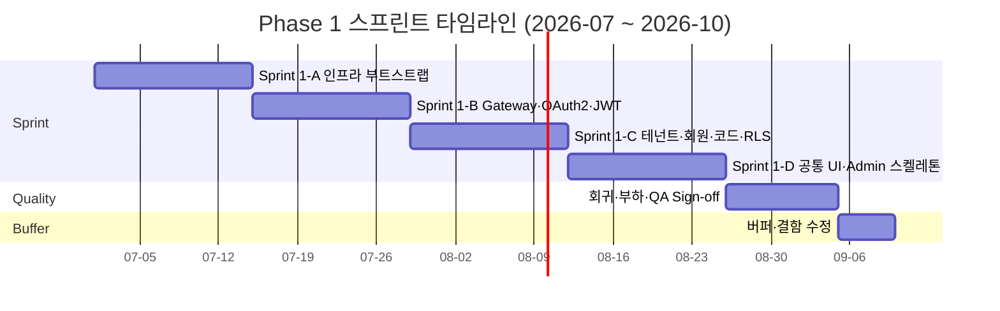
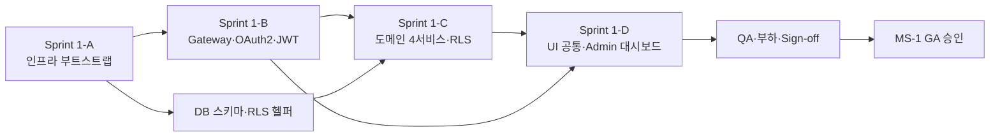

# Phase 1 스프린트 분해 계획서 (Phase 1 Sprint Plan)

| 항목 | 내용 |
|---|---|
| 문서명 | Phase 1 공통기반 스프린트 분해 계획서 |
| 문서 ID | DEV-07 |
| 버전 | v0.1 Draft |
| 작성일 | 2026-05-11 |
| 작성자 | DevLead Agent |
| 검토자 | PM, BackendSenior, FrontendSenior, DBA, QA |
| 입력 | `01_pm/02_milestones_wbs.md`, `04_dev_lead/01~06`, `10_dba/01` |
| 후속 | `08_infra_and_tooling_decisions.md`, 스프린트별 백로그 |
| 대상 기간 | 2026-07-01 ~ 2026-10-31 (4개월, 8주 = 4 스프린트 × 2주, +버퍼 2주) |
| 상태 | Phase 0 초안 |

---

## 1. 문서 목적

Phase 1 "공통기반 구축"을 **4개 스프린트(1-A / 1-B / 1-C / 1-D)**로 분해하여, 각 스프린트의 **목표(Sprint Goal)**, **DoD(Definition of Done)**, **산출물**, **담당 에이전트**, **의존성**, **리스크**, **데모 시나리오**를 정의한다. 본 계획은 MS-1(2026-10-31 공통기반 GA) 달성을 위한 실행 단위이며, WBS Phase 1(`1.1~1.6`)을 시간 축으로 정렬한 결과이다.

---

## 2. Phase 1 전체 개요

### 2.1 스프린트 타임라인

| Sprint | 기간 | 핵심 목표 | 데모 산출물 |
|---|---|---|---|
| **1-A** | 2026-07-01 ~ 07-14 | 인프라 부트스트랩 | Docker Compose `make up` → 모든 인프라 컨테이너 기동 + Hello World 서비스 CI 그린 |
| **1-B** | 2026-07-15 ~ 07-28 | API Gateway + IAM(OAuth2/JWT) | `curl -X POST /api/v1/auth/login` → Access Token 발급, Gateway가 JWT 검증 후 보호 엔드포인트 라우팅 |
| **1-C** | 2026-07-29 ~ 08-11 | 테넌트/라이브러리/회원/코드 마스터 (RLS) | 2개 테넌트 환경에서 회원 CRUD 시연 + RLS 회귀 매트릭스 1만건 GREEN |
| **1-D** | 2026-08-12 ~ 08-25 | 공통 프론트엔드 + Admin 대시보드 스켈레톤 | 사서 관리자가 브라우저에서 로그인 → 대시보드 진입 → 회원 목록 조회·등록 |
| **QA/버퍼** | 2026-08-26 ~ 09-09 | 통합·부하 테스트, 결함 수정 | QA Sign-off, MS-1 PM 승인 |

> 실제 WBS에서 Phase 1은 4개월이지만, 본 계획은 **개발 8주 + QA/버퍼 2주**로 압축한 코어 구간을 정의한다. 잔여 8주는 Phase 2 준비(KORMARC 모델 PoC) 및 외부 연동(Notification/File) 기능 추가 슬랙으로 활용한다.

### 2.2 누적 인수조건 (Phase 1 GA 기준)

- [ ] 멀티테넌트 격리 자동회귀 1만건 100% PASS
- [ ] OAuth2 Authorization Code + PKCE 플로 동작
- [ ] JWT 검증 (Gateway·서비스 이중화) 동작
- [ ] 4개 도메인 서비스(Tenant·Member·Code/Policy·IAM) REST API 50% 구현
- [ ] 사서 관리자 로그인 → 대시보드 → 회원 CRUD UX 통과
- [ ] CI/CD 파이프라인 (lint·test·build·SCA·container scan) 그린
- [ ] 부하 테스트 100 RPS 5분 P99 < 500ms 통과
- [ ] DevLead·QA Sign-off, PM MS-1 승인서

---

## 3. Sprint 1-A — 인프라 부트스트랩

| 항목 | 내용 |
|---|---|
| **기간** | 2026-07-01 ~ 2026-07-14 (2주) |
| **Sprint Goal** | "팀 전원이 `git clone && make up && make dev`로 1분 내에 동일한 개발환경을 띄울 수 있다." |
| **선행조건** | Phase 0 완료, 클라우드 계정·GitHub Org 셋업 완료 |

### 3.1 작업 항목 (WBS 매핑: 1.1.1~1.1.3 + 신규 IF-A)

| ID | 작업 | 담당 | 산출물 |
|---|---|---|---|
| **1-A.1** | 모노레포 골격 생성 (`tulip-backend`, `tulip-frontend`) | DevLead | settings.gradle.kts, pnpm-workspace.yaml, turbo.json |
| **1-A.2** | `tulip-bom` BOM 모듈 + 공통 라이브러리 5종 스켈레톤 (`common-core/web/security/data/event`) | DevLead + BackendSenior | platform/tulip-common/* |
| **1-A.3** | Docker Compose 11종 인프라 정의 (PG/Redis/Kafka/Keycloak/MinIO/Mailhog/Prom/Grafana/Loki/Tempo/ES) | DevLead | infra/compose/docker-compose.yml |
| **1-A.4** | PostgreSQL 15 컨테이너 + 확장 설치 (pgcrypto, pg_trgm, unaccent, btree_gin, pgaudit) | DBA | init.sql, postgresql.conf |
| **1-A.5** | Flyway 베이스라인 `V1__init.sql` (스키마 7개: tenant_*, member_*, iam_*, code_*, policy_*, noti_*, file_*) + RLS 헬퍼 함수 | DBA | services/*/db/migration/V1__init.sql |
| **1-A.6** | Hello World 서비스 (`tenant-service`) 1개 — 헬스체크 + `/api/v1/ping` | BackendDev | services/tenant-service/ 초기 코드 |
| **1-A.7** | GitHub Actions 베이스라인 (lint/build/unit/integration/sca/container build) | DevLead | .github/workflows/ci.yml |
| **1-A.8** | 개발자 환경 셋업 자동화 (`Makefile`, `make up/seed/dev/down/clean`) | DevLead | Makefile, scripts/* |
| **1-A.9** | Checkstyle + Spotless + ESLint + Prettier + spectral config 통합 | DevLead | buildSrc/, packages/eslint-config/, .spectral.yaml |
| **1-A.10** | Frontend 모노레포 (`apps/admin`, `apps/opac`, `packages/ui/api-client/auth/config/design-tokens`) 골격 | FrontendSenior | tulip-frontend 전체 골격 |

### 3.2 Definition of Done

- [ ] `git clone` 후 신규 개발자 PC에서 `make up && make dev` 1회로 모든 인프라+백엔드 1개+프론트엔드 2개가 부팅
- [ ] PostgreSQL에 7개 스키마가 생성되고 RLS 정책 함수가 등록됨
- [ ] `tenant-service`가 `/actuator/health` UP 응답
- [ ] GitHub Actions CI가 `main` 푸시에서 5분 이내 GREEN
- [ ] PR 템플릿·CODEOWNERS·브랜치 보호 룰 적용
- [ ] 공통 라이브러리 5종이 Maven 로컬 저장소에 published
- [ ] Storybook이 `packages/ui`에서 부팅, 첫 컴포넌트(Button) 등록

### 3.3 데모 시나리오

> **데모 목표: "1분 부트스트랩"**
>
> 1. 신규 개발자(가상) PC에서 `git clone` 수행
> 2. `make up` — 11개 인프라 컨테이너가 모두 healthy
> 3. `make seed` — 샘플 테넌트 2개·라이브러리 3개·회원 100명 시드 적재
> 4. `make dev` — `tenant-service` + `apps/admin`이 hot-reload로 기동
> 5. 브라우저에서 `http://localhost:3000` 접속 → "Tulip+ Admin" 랜딩 페이지 + API 헬스 GREEN 표시
> 6. PR 생성 → CI 파이프라인 5분 내 그린

### 3.4 담당 에이전트 매트릭스

| 에이전트 | 작업 |
|---|---|
| DevLead | 1-A.1, 1-A.2(공통), 1-A.3, 1-A.7, 1-A.8, 1-A.9 |
| BackendSenior | 1-A.2(common-security/data/event) |
| BackendDev | 1-A.6 |
| FrontendSenior | 1-A.10 |
| DBA | 1-A.4, 1-A.5 |
| QA | CI 단계에 smoke test 자리표시자 작성 |

### 3.5 의존성·리스크

| 종류 | 내용 | 대응 |
|---|---|---|
| 의존성 (외부) | Keycloak 24 컨테이너 이미지 가용 | docker-compose에 image hash 고정 |
| 리스크 R-A1 | Apple Silicon(arm64) vs amd64 이미지 호환 | 멀티 아키텍처 매니페스트 검증, Dockerfile에 `--platform=$BUILDPLATFORM` |
| 리스크 R-A2 | Kafka KRaft 모드 안정성 | Phase 1은 Zookeeper 모드 1차, KRaft는 Phase 2 마이그레이션 검토 |
| 리스크 R-A3 | 모노레포 빌드 시간 폭증 | Gradle Build Cache + Turborepo remote cache 사용 |

---

## 4. Sprint 1-B — API Gateway + OAuth2 + JWT

| 항목 | 내용 |
|---|---|
| **기간** | 2026-07-15 ~ 2026-07-28 (2주) |
| **Sprint Goal** | "사서/이용자가 OAuth2 로그인으로 토큰을 받고, Gateway가 JWT를 검증하여 보호된 API를 라우팅한다." |
| **선행조건** | Sprint 1-A 완료, Keycloak Realm 디자인 확정 |

### 4.1 작업 항목 (WBS 매핑: 1.3.1~1.3.3, 1.1.2의 Gateway 부분)

| ID | 작업 | 담당 | 산출물 |
|---|---|---|---|
| **1-B.1** | Spring Cloud Gateway 라우팅 정의 (Admin/OPAC/Hardware 경로 분기) | DevLead + BackendSenior | services/infra/api-gateway/ |
| **1-B.2** | Keycloak Realm `tulip` 설정 (Client: admin-web, opac-web, hardware-gateway), Role 매트릭스 | BackendSenior + DevLead | infra/keycloak/realm-export.json |
| **1-B.3** | `iam-service` OAuth2 Resource Server + Token Introspection + Refresh Token | BackendSenior | services/iam-service/* |
| **1-B.4** | JWT 발급/검증 (`common-security`) — JWS RS256, Claim 검증, JTI 블랙리스트(Redis) | BackendSenior | platform/tulip-common/tulip-common-security/* |
| **1-B.5** | `TenantContextFilter` (Gateway → 서비스 헤더 전파: X-Tenant-Id, X-Branch-Ids, X-Trace-Id, X-Roles) | DevLead | common-web 모듈 |
| **1-B.6** | OAuth2 Authorization Code + PKCE 통합 테스트 (Playwright + WireMock) | QA + BackendSenior | tests/integration/auth/* |
| **1-B.7** | RBAC `@PreAuthorize` 가이드 + ABAC(테넌트 기반) Voter | DevLead | common-security/rbac/* |
| **1-B.8** | MFA 인터페이스 골격 (TOTP — Phase 2 활성화 예정) | BackendSenior | iam-service/mfa/* |
| **1-B.9** | 외부 SSO Federation 인터페이스 (SAML/OIDC) — 어댑터 스텁 | BackendDev | iam-service/federation/* |
| **1-B.10** | 로그인/토큰 발급 부하 테스트 (k6) — 100 RPS, P99 < 200ms | QA | tests/load/auth.js |

### 4.2 Definition of Done

- [ ] Authorization Code + PKCE 플로로 Access Token 발급 성공
- [ ] Refresh Token 회전(rotation) 동작
- [ ] Gateway가 JWT 서명·만료·issuer·audience·tenant claim 검증
- [ ] `tenant-service`(1-A에서 만든) 보호 엔드포인트가 인증 없이 401, 인증 있을 시 200
- [ ] JTI 블랙리스트(Redis) 로그아웃 시 동작
- [ ] RLS 회귀: 다른 테넌트 JWT로 데이터 누설 0건
- [ ] 로그인 API 부하 테스트 통과 (100 RPS, P99 < 200ms)
- [ ] OpenAPI 문서 `/auth/*` 생성

### 4.3 데모 시나리오

> **데모 목표: "OAuth2 로그인 + 보호 API 호출"**
>
> 1. `apps/admin`에서 "로그인" 클릭 → Keycloak 로그인 페이지로 리다이렉트
> 2. `librarian@demo-tenant-1` 계정으로 로그인 + PKCE 검증 완료
> 3. Access Token + Refresh Token이 발급되어 Admin SPA에 안전 저장(httpOnly 쿠키 + memory)
> 4. SPA가 `GET /api/v1/tenants/me` 호출 → Gateway가 JWT 검증 → tenant-service 응답
> 5. Postman에서 다른 테넌트 JWT로 동일 호출 → 403 또는 빈 결과(누설 없음)
> 6. Refresh Token 회전 동작 확인 (만료 임박 시 자동 재발급)

### 4.4 담당 에이전트 매트릭스

| 에이전트 | 작업 |
|---|---|
| DevLead | 1-B.1(설계), 1-B.2(공동), 1-B.5, 1-B.7 |
| BackendSenior | 1-B.1(구현), 1-B.3, 1-B.4, 1-B.8 |
| BackendDev | 1-B.9 |
| QA | 1-B.6, 1-B.10 |

### 4.5 의존성·리스크

| 종류 | 내용 | 대응 |
|---|---|---|
| 의존성 | Sprint 1-A 인프라 컨테이너 기동 | 블로커 시 mock Keycloak으로 대체 |
| 리스크 R-B1 | Keycloak Realm export/import 충돌 | IaC(Terraform/keycloak-config-cli)로 선언적 관리 |
| 리스크 R-B2 | PKCE 흐름 Next.js App Router 호환성 | `@auth/nextjs` 또는 자체 핸들러 PoC 선행 |
| 리스크 R-B3 (R-06) | tenant claim 누락·위변조 | Gateway에서 claim 필수 검증 + 서비스에서 2차 검증 |

---

## 5. Sprint 1-C — 테넌트/라이브러리/회원/코드 마스터 (RLS 적용)

| 항목 | 내용 |
|---|---|
| **기간** | 2026-07-29 ~ 2026-08-11 (2주) |
| **Sprint Goal** | "4개 도메인 서비스의 CRUD가 동작하고, PostgreSQL RLS로 테넌트가 완전 격리된다." |
| **선행조건** | Sprint 1-B 완료 (JWT tenant claim 검증) |

### 5.1 작업 항목 (WBS 매핑: 1.2.1~1.2.4, CMN-001~037)

| ID | 작업 | 담당 | 산출물 |
|---|---|---|---|
| **1-C.1** | `tenant-service` CRUD (Tenant, Branch, Location, Holiday, BranchHour, SubscriptionPlan) | BackendDev | services/tenant-service/* |
| **1-C.2** | `member-service` CRUD (Member, MemberType, MemberCard, MemberConsent) + IAM 계정 연동 | BackendDev + BackendSenior | services/member-service/* |
| **1-C.3** | `code-policy-service` (CodeGroup, Code, CodeI18n, Classification) — 마스터 시드 KDC/DDC 일부 | BackendDev | services/code-policy-service/* |
| **1-C.4** | Policy Engine 골격 (Rule·Version 모델 + 단순 평가기) — Phase 4 본격 사용 예정 | BackendSenior | code-policy-service/policy/* |
| **1-C.5** | RLS 정책 활성화 + JDBC Interceptor (`SET app.tenant_id`) + MyBatis Plugin (tenant_id 누락 차단) | DBA + BackendSenior | common-data/rls/* |
| **1-C.6** | Audit Log 공통 (`tlp_cmn_audit_log`) + JSONB diff 라이브러리 | BackendSenior | common-data/audit/* |
| **1-C.7** | Outbox 패턴 구현 (Outbox 테이블 + Polling Publisher → Kafka) | BackendSenior | common-event/outbox/* |
| **1-C.8** | 도메인 이벤트 발행: `TenantCreated`, `MemberCreated`, `MemberStatusChanged`, `CodeReloaded` | BackendDev | services/*/event/* |
| **1-C.9** | `notification-service` 스켈레톤 + Mailhog 연동 (회원 가입 환영 메일) | BackendDev | services/notification-service/* |
| **1-C.10** | RLS 회귀 자동화 프레임워크 (1만건 매트릭스: 회원·테넌트·코드 모든 조합) | QA + DBA | tests/rls-regression/* |
| **1-C.11** | OpenAPI 문서 4종 + spectral 린트 통과 | 각 서비스 담당 | services/*/openapi/v1/openapi.yaml |
| **1-C.12** | PII 암호화 (pgcrypto) — 전화·이메일·주소 컬럼 | DBA + BackendSenior | DDL + common-data/crypto/* |

### 5.2 Definition of Done

- [ ] 4개 서비스의 핵심 CRUD가 OpenAPI 명세대로 응답
- [ ] 2개 테넌트(`demo-tenant-1`, `demo-tenant-2`)에서 각각 회원 100명·관 3개 시드
- [ ] RLS 회귀 매트릭스 10,000건 100% PASS (다른 테넌트 데이터 누설 0건)
- [ ] Outbox → Kafka 이벤트 발행 검증 (E2E 100건)
- [ ] PII 컬럼 암호화 저장 + 검색용 해시 컬럼 동작
- [ ] Audit Log가 회원 생성·수정·삭제·로그인 시 자동 적재
- [ ] OpenAPI 4종 spectral 린트 100% 통과
- [ ] 단위/통합 테스트 커버리지 80% 이상

### 5.3 데모 시나리오

> **데모 목표: "멀티테넌트 회원 관리 + 완전 격리"**
>
> 1. 테넌트 A 사서가 로그인 → 회원 100명 목록 표시 (다른 테넌트 회원 0건)
> 2. 새 회원 등록 → IAM 계정 자동 생성 → 환영 이메일이 Mailhog에 도착
> 3. 회원 정보 수정 → Audit Log에 변경 diff 기록 + `MemberStatusChanged` Kafka 이벤트 확인
> 4. 테넌트 B 사서로 전환 로그인 → 동일 회원 ID URL 접근 시 404 (격리 확인)
> 5. 시스템 관리자 로그인 → `X-Tenant-Id` 헤더로 임의 테넌트 전환 → Audit Log에 `AUDIT_TENANT_SWITCH` 기록
> 6. RLS 회귀 자동 매트릭스 1만건 결과 보고서 출력

### 5.4 담당 에이전트 매트릭스

| 에이전트 | 작업 |
|---|---|
| DevLead | 1-C.5(설계), 1-C.11(린트 검증) |
| BackendSenior | 1-C.2(IAM 연동), 1-C.4, 1-C.5(구현), 1-C.6, 1-C.7, 1-C.12 |
| BackendDev | 1-C.1, 1-C.2(CRUD), 1-C.3, 1-C.8, 1-C.9 |
| DBA | 1-C.5(RLS), 1-C.10, 1-C.12(DDL) |
| QA | 1-C.10, 1-C.11(계약 테스트) |

### 5.5 의존성·리스크

| 종류 | 내용 | 대응 |
|---|---|---|
| 의존성 | Sprint 1-B JWT tenant claim | 블로커 시 헤더 mock 토큰으로 분리 진행 |
| 리스크 R-C1 (R-06) | RLS 누락 → 테넌트 누설 | MyBatis Plugin 강제 차단 + 회귀 1만건 + 침투 테스트 |
| 리스크 R-C2 | Outbox 폴링 지연(>30초) | 인덱스 `(status, occurred_at)` + Listen/Notify로 push 보완 |
| 리스크 R-C3 | PII 암호화 키 관리 | KMS 또는 Vault PoC, Phase 1은 환경변수 + 회전 절차 문서화 |
| 리스크 R-C4 | 코드 마스터 초기 데이터 양 | KDC/DDC 일부만 시드, Phase 2에서 전체 import |

---

## 6. Sprint 1-D — 공통 프론트엔드 + 사서 관리자 대시보드 스켈레톤 + 로그인 플로

| 항목 | 내용 |
|---|---|
| **기간** | 2026-08-12 ~ 2026-08-25 (2주) |
| **Sprint Goal** | "사서가 브라우저에서 로그인 → 대시보드 진입 → 회원 목록·등록 UX를 종단간 사용한다." |
| **선행조건** | Sprint 1-C 완료 (회원 API 가용) |

### 6.1 작업 항목 (WBS 매핑: 1.5.1~1.5.4)

| ID | 작업 | 담당 | 산출물 |
|---|---|---|---|
| **1-D.1** | `apps/admin` Next.js App Router 라우팅 골격 (`(auth)`, `(main)/dashboard`, `(main)/members`) | FrontendSenior | apps/admin/src/app/* |
| **1-D.2** | 인증 가드 미들웨어 + Auth Context (httpOnly 쿠키 + 메모리 access token + refresh 자동 회전) | FrontendSenior | packages/auth/* |
| **1-D.3** | `packages/ui` 1차 컴포넌트 20종 (Button, Input, Select, Modal, Toast, Table, Pagination, Form, DatePicker, Tabs, Card, Badge, Avatar, Skeleton, Drawer, Tooltip, Breadcrumb, Sidebar, Header, Layout) | FrontendSenior | packages/ui/* |
| **1-D.4** | shadcn/ui 기반 + Tailwind 4 + Designer 디자인 토큰 통합 (`@tulip/design-tokens`) | FrontendSenior | packages/design-tokens/* |
| **1-D.5** | OpenAPI codegen 자동화 (`@tulip/api-client`) — tenant/member/code/auth 4종 | FrontendSenior + BackendSenior | packages/api-client/* |
| **1-D.6** | TanStack Query 5 통합 (`useMembers`, `useCreateMember`, `useMember`) | FrontendDev | apps/admin/src/features/members/* |
| **1-D.7** | 로그인 페이지 + Keycloak 리다이렉트 + 토큰 처리 | FrontendDev | apps/admin/src/app/(auth)/* |
| **1-D.8** | 대시보드 페이지 (헤더·사이드바·KPI 카드 4개 — 회원수/대출수/연체수/오늘 입고) | FrontendDev | apps/admin/src/app/(main)/dashboard/* |
| **1-D.9** | 회원 목록 화면 (검색·필터·페이징·정렬) + 회원 등록 모달 | FrontendDev | apps/admin/src/features/members/* |
| **1-D.10** | 다국어 i18n 초기 사전 (ko/en) + 에러 메시지 키 매핑 | FrontendDev | packages/i18n/* |
| **1-D.11** | 접근성 점검 (KWCAG 2.2 AA) + Playwright E2E 5종 (로그인/로그아웃/회원목록/회원등록/검색) | QA + FrontendDev | tests/e2e/* |
| **1-D.12** | Storybook 컴포넌트 카탈로그 + Chromatic 또는 정적 빌드 배포 | FrontendSenior | packages/ui/.storybook/* |

### 6.2 Definition of Done

- [ ] `apps/admin`이 빌드 + 배포 (Vercel preview 또는 Dev 환경)
- [ ] 로그인→대시보드→회원목록→회원등록 E2E 5개 시나리오 GREEN
- [ ] `packages/ui` 20개 컴포넌트가 Storybook에 등록 + a11y 검사 통과
- [ ] OpenAPI 변경 시 codegen 자동 실행 (CI 단계)
- [ ] 다국어 ko/en 전환 동작
- [ ] Lighthouse Score (Performance/Accessibility/Best Practices/SEO) 각 90+ (admin 메인)
- [ ] Bundle size 분석 (대시보드 초기 chunk < 200KB gzipped)
- [ ] 컴포넌트 단위 테스트 커버리지 70% 이상

### 6.3 데모 시나리오

> **데모 목표: "End-to-End 사서 로그인 → 회원 등록"**
>
> 1. 사서가 `https://admin.dev.tulip.test`에 접속 → 자동으로 `/login`으로 리다이렉트
> 2. Keycloak 로그인 페이지에서 `librarian@demo-tenant-1` 로그인
> 3. 대시보드 진입 — KPI 카드 4개 표시(회원 100명, 대출 0, 연체 0, 입고 0)
> 4. 좌측 사이드바 "회원관리" 클릭 → 회원 100명 페이지네이션 표시
> 5. "신규 등록" 버튼 → 모달에서 회원 정보 입력 → 저장 → 토스트 메시지 + 목록 자동 갱신
> 6. 회원 검색(이름 부분일치) + 필터(회원유형) + 정렬 동작 확인
> 7. 로그아웃 → 로그인 페이지 복귀 + 토큰 무효화 확인

### 6.4 담당 에이전트 매트릭스

| 에이전트 | 작업 |
|---|---|
| DevLead | OpenAPI codegen 표준 가이드, 컴포넌트 라이브러리 기준 제시 |
| FrontendSenior | 1-D.1~1-D.5, 1-D.12 |
| FrontendDev | 1-D.6~1-D.10 |
| BackendSenior | 1-D.5(OpenAPI 정합) |
| QA | 1-D.11 |
| Designer | (Phase 0 산출물) 디자인 토큰·HTML 퍼블리싱 인계 |

### 6.5 의존성·리스크

| 종류 | 내용 | 대응 |
|---|---|---|
| 의존성 | Sprint 1-C 회원 API + Designer HTML 퍼블리싱 인계 | Mock API로 병행 개발 가능 |
| 리스크 R-D1 | Next.js 15 App Router + Tailwind 4 호환성 (둘 다 새 버전) | Phase 0 말 PoC 선행 검증 완료 가정 |
| 리스크 R-D2 | 디자인 토큰과 shadcn/ui 충돌 | Designer와 사전 매핑 워크숍 (Sprint 1-D 1일차) |
| 리스크 R-D3 | a11y 키보드 네비게이션 누락 | Playwright + axe-core 자동 검사 CI 단계 |

---

## 7. 스프린트 간 의존성 그래프

### 7.1 크리티컬 패스

`1-A → 1-B → 1-C → 1-D → QA → MS-1` — 직렬, 1주 지연도 MS-1 지연 직결.

### 7.2 병렬 처리 가능 항목

| 스프린트 | 병렬 가능 항목 | 담당 |
|---|---|---|
| 1-A | DBA의 DDL + DevLead의 Compose | 동시 진행 |
| 1-B | Frontend가 1-D 준비(Mock API로 디자인 시스템 구축) | FrontendSenior |
| 1-C | QA가 RLS 회귀 프레임워크 사전 작성 | QA |
| 1-D | Notification·File 서비스 후순위 기능 추가 | BackendDev |

---

## 8. Phase 1 종료 게이트 (Sprint Review → MS-1)

### 8.1 종료 조건 (DoD 누적)

| 카테고리 | 조건 | 검증자 |
|---|---|---|
| 기능 | 4 도메인 CRUD + 인증 + UI 데모 시나리오 통과 | DevLead |
| 품질 | 단위 80% / 통합 핵심 100% / E2E 5종 / a11y 통과 | QA |
| 비기능 | 100 RPS / P99 < 500ms / 회원 1만 / 멀티 테넌트 10개 시뮬레이션 | QA + DBA |
| 보안 | RLS 회귀 1만건 / OWASP ZAP 클린 / Secret leak 0 / pen test 1차 | QA + DevLead |
| 운영 | CI/CD Blue-Green 1회 Dev→Stg 시연 / 롤백 절차 검증 | DevLead |
| 문서 | OpenAPI 4종 / ADR-001~010 / Runbook 5종 / README 서비스별 | DevLead |
| 승인 | QA Sign-off → PM 승인 → MS-1 마일스톤 클로즈 | PM |

### 8.2 Phase 2 진입 준비물

- Phase 1 Retrospective (2026-09-05 예정)
- Phase 2 킥오프 자료 (KORMARC 모델 PoC 결과 포함)
- Phase 1 부채 리스트 (Tech Debt Register)
- 외부 컨설팅 (KORMARC 전문가) 일정 확정

---

## 9. 진척 관리·보고

### 9.1 데일리·위클리 리듬

| 주기 | 미팅 | 산출물 |
|---|---|---|
| 매일 09:30 | 데일리 스탠드업 (15분, 비동기 Slack 또는 동기 Huddle) | 진행/막힘 트래커 |
| 매주 화요일 14:00 | 스프린트 백로그 그루밍 | 다음 스프린트 후보 |
| 격주 금요일 16:00 | 스프린트 리뷰 + 데모 | 데모 영상·인수확인서 |
| 격주 금요일 17:00 | 스프린트 회고 (KPT) | 액션아이템 |
| 매주 금요일 18:00 | PM 주간 진척 보고 | WBS % 갱신 |

### 9.2 KPI

| KPI | 목표 |
|---|---|
| 스프린트 약속 vs 완료 | ≥ 85% |
| PR 평균 리뷰 시간 | < 24시간 |
| CI 실패율 | < 10% |
| 결함 발생률 (스프린트당) | < 5건 (Severity Major 이상) |
| 결함 종결 시간 | < 3일 (Major), < 7일 (Minor) |
| RLS 누설 | **0건** (절대 기준) |

---

## 10. 변경 이력

| 버전 | 일자 | 변경 내용 | 작성자 |
|---|---|---|---|
| v0.1 | 2026-05-11 | Phase 0 초안 — 4 스프린트 분해 및 DoD 정의 | DevLead Agent |
