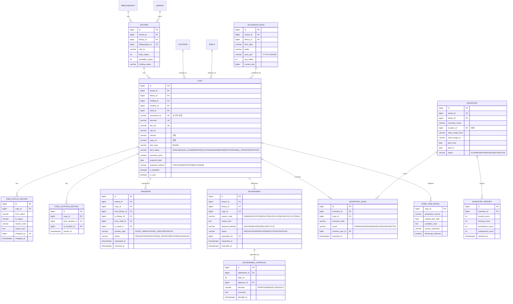
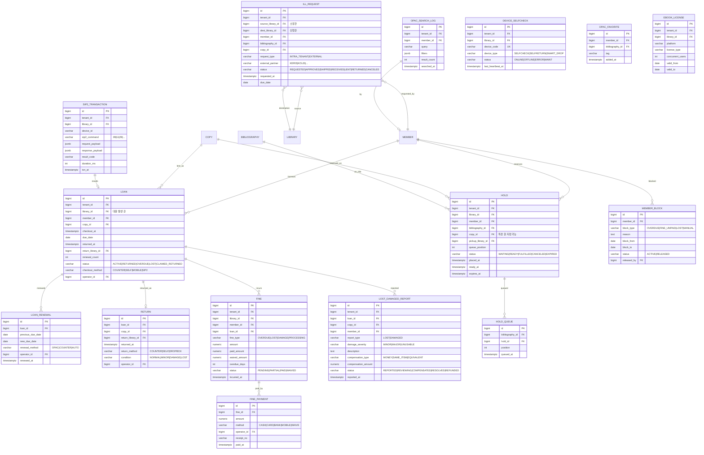
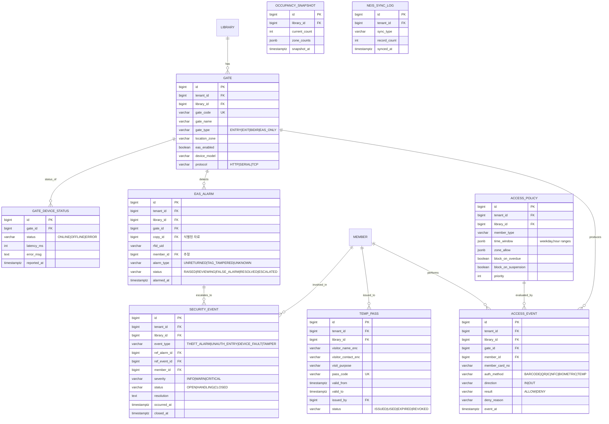
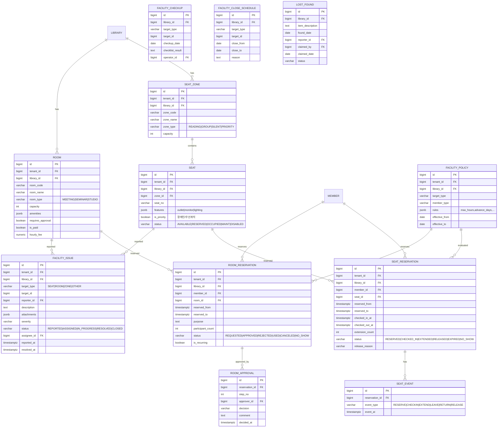
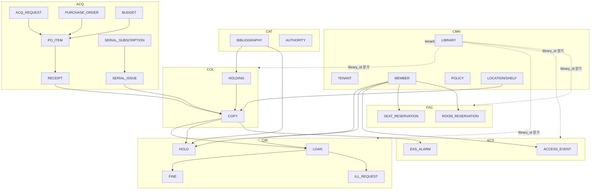

# 마스터 ERD (Master ERD)

| 항목 | 내용 |
|---|---|
| 문서명 | 마스터 ERD |
| 문서 ID | DBA-02 |
| 버전 | v0.1 Draft |
| 작성일 | 2026-05-11 |
| 작성자 | DBA Agent |
| 검토자 | DevLead, BackendSenior |
| 상태 | 초안 |
| 대상 DBMS | PostgreSQL 15+ |

---

## 1. 문서 개요

본 문서는 Tulip+ 도서관통합관리시스템의 **도메인별 데이터 모델**을 ERD(Mermaid `erDiagram`)로 표현한다. Planner 6개 도메인 요구사항 + 공통(CMN)에서 도출된 ~120개 엔티티(총 7개 도메인)를 다룬다.

### 1.1 표기 규약

- 카디널리티: `||--o{`(1:N), `||--||`(1:1), `}o--o{`(N:M)
- 필수 컬럼: `NOT NULL` (생략 표기), 선택: `nullable`
- PK: `PK`, FK: `FK`, UNIQUE: `UK`
- 모든 엔티티는 공통 컬럼(`tenant_id`, `library_id`, `created_at`, ...) 보유 — ERD에서는 핵심 컬럼만 발췌
- 도메인 약어: CMN/ACQ/CAT/CIR/COL/ACS/FAC
- 도메인 간 FK는 도메인 경계도(`§10`)에 별도 표기

### 1.2 식별 엔티티 총괄

| 도메인 | 엔티티 수 | 핵심 엔티티 |
|---|---|---|
| CMN | 22 | tenant, library, member, role, code, policy, audit_log |
| CAT | 13 | bibliography, marc_field, authority, classification |
| COL | 13 | holding, copy, inventory, transfer, withdrawal |
| ACQ | 16 | acq_request, vendor, purchase_order, budget, donation, serial |
| CIR | 16 | loan, hold, fine, lost_damaged, ill_request, sip2_txn |
| ACS | 9 | gate, access_event, eas_alarm, temp_pass, security_event |
| FAC | 11 | seat, seat_reservation, room, room_reservation, issue |
| **합계** | **100** | — |

---

## 2. CMN — 공통/플랫폼 도메인

```mermaid
erDiagram
    TENANT ||--o{ LIBRARY : has
    TENANT ||--o{ MEMBER : has
    TENANT ||--o{ ROLE : has
    TENANT ||--o{ POLICY : has
    TENANT ||--o{ SUBSCRIPTION_PLAN : has
    TENANT ||--o{ CODE : extends

    LIBRARY ||--o{ LIBRARY_CALENDAR : has
    LIBRARY ||--o{ LOCATION : has
    LIBRARY ||--o{ SHELF : has

    MEMBER ||--o{ MEMBER_CARD : owns
    MEMBER }o--|| MEMBER_TYPE : classified_as
    MEMBER ||--o{ MEMBER_STATUS_HISTORY : has
    MEMBER ||--o{ MEMBER_CONSENT : has
    MEMBER ||--o{ USER_ROLE : assigned

    ROLE ||--o{ ROLE_PERMISSION : grants
    PERMISSION ||--o{ ROLE_PERMISSION : included_in
    MEMBER ||--o{ USER_ROLE : has
    ROLE ||--o{ USER_ROLE : assigned_to

    CODE_GROUP ||--o{ CODE : contains
    CODE ||--o{ CODE_I18N : translated
    CLASSIFICATION ||--o{ CLASSIFICATION : parent

    POLICY ||--o{ POLICY_RULE : rules
    POLICY ||--o{ POLICY_HISTORY : history

    NOTIFICATION_TEMPLATE ||--o{ NOTIFICATION_LOG : used_by

    TENANT {
        bigint id PK
        varchar tenant_code UK
        varchar tenant_name
        varchar plan_code FK
        varchar status
        date subscription_from
        date subscription_to
    }
    LIBRARY {
        bigint id PK
        bigint tenant_id FK
        bigint parent_library_id FK "본관-분관"
        varchar library_code UK
        varchar library_name
        varchar branch_type "MAIN|BRANCH|MOBILE"
        varchar address
        boolean is_integrated_loan "다관 통합대출 여부"
    }
    LIBRARY_CALENDAR {
        bigint id PK
        bigint library_id FK
        date calendar_date
        varchar day_type "OPEN|CLOSED|HOLIDAY|SPECIAL"
        time open_time
        time close_time
    }
    LOCATION {
        bigint id PK
        bigint library_id FK
        varchar location_code
        varchar location_name
        varchar location_type "STACK|READING|RARE|CLOSED"
    }
    SHELF {
        bigint id PK
        bigint location_id FK
        varchar shelf_code
        varchar call_no_range_from
        varchar call_no_range_to
    }
    MEMBER {
        bigint id PK
        bigint tenant_id FK
        ulid public_id UK
        varchar member_no UK
        varchar name_enc "암호화"
        varchar phone_enc "암호화"
        varchar email
        varchar email_hash "검색용"
        varchar address_enc "암호화"
        varchar ci_enc "본인인증 CI"
        bigint member_type_id FK
        varchar member_grade "REGULAR|ASSOCIATE"
        varchar status "ACTIVE|DORMANT|SUSPENDED|WITHDRAWN"
        date join_date
        date expire_date
    }
    MEMBER_TYPE {
        bigint id PK
        bigint tenant_id FK
        varchar type_code
        varchar type_name
        varchar applies_to "PUBLIC|UNIV|SCHOOL"
    }
    MEMBER_CARD {
        bigint id PK
        bigint member_id FK
        varchar card_no UK
        varchar card_type "BARCODE|IC|QR|MOBILE"
        varchar status
        date issued_date
        date expire_date
    }
    MEMBER_STATUS_HISTORY {
        bigint id PK
        bigint member_id FK
        varchar from_status
        varchar to_status
        varchar reason
        timestamptz changed_at
    }
    MEMBER_CONSENT {
        bigint id PK
        bigint member_id FK
        varchar consent_type "COLLECT|USE|3RDPARTY|MARKETING"
        boolean is_granted
        timestamptz granted_at
        timestamptz revoked_at
    }
    ROLE {
        bigint id PK
        bigint tenant_id FK
        varchar role_code UK
        varchar role_name
        varchar role_scope "PLATFORM|TENANT|LIBRARY"
    }
    PERMISSION {
        bigint id PK
        varchar permission_code UK
        varchar resource
        varchar action
    }
    ROLE_PERMISSION {
        bigint role_id PK
        bigint permission_id PK
    }
    USER_ROLE {
        bigint id PK
        bigint member_id FK
        bigint role_id FK
        bigint library_id FK "관 한정 (NULL=전체)"
        date valid_from
        date valid_to
    }
    CODE_GROUP {
        varchar group_code PK
        varchar group_name
        text description
    }
    CODE {
        bigint id PK
        bigint tenant_id FK "0=공유"
        varchar group_code FK
        varchar code
        varchar code_name
        int sort_order
        jsonb extra
    }
    CODE_I18N {
        bigint code_id PK
        varchar locale PK
        varchar label
    }
    CLASSIFICATION {
        bigint id PK
        varchar scheme "KDC|DDC|LC|UDC"
        varchar class_code
        varchar class_name
        int level
        bigint parent_id FK
    }
    POLICY {
        bigint id PK
        bigint tenant_id FK
        bigint library_id FK "NULL=테넌트 공통"
        varchar policy_type "LOAN|HOLD|FINE|ACCESS|FACILITY"
        varchar policy_name
        date effective_from
        date effective_to
        int priority
    }
    POLICY_RULE {
        bigint id PK
        bigint policy_id FK
        jsonb conditions "member_type,item_type,..."
        jsonb actions "loan_limit,loan_days,fine_amount,..."
    }
    POLICY_HISTORY {
        bigint id PK
        bigint policy_id FK
        jsonb before_value
        jsonb after_value
        timestamptz changed_at
    }
    SUBSCRIPTION_PLAN {
        bigint id PK
        varchar plan_code UK
        varchar plan_name
        jsonb features
        numeric monthly_fee
    }
    NOTIFICATION_TEMPLATE {
        bigint id PK
        bigint tenant_id FK
        varchar template_code
        varchar channel "EMAIL|SMS|KAKAO|PUSH"
        varchar locale
        varchar subject
        text body_template
    }
    NOTIFICATION_LOG {
        bigint id PK
        bigint tenant_id FK
        bigint member_id FK
        bigint template_id FK
        varchar channel
        varchar status "QUEUED|SENT|FAILED|READ"
        timestamptz sent_at
    }
    AUDIT_LOG {
        bigint id PK
        bigint tenant_id FK
        bigint actor_member_id FK
        varchar action
        varchar target_resource
        bigint target_id
        jsonb before_value
        jsonb after_value
        varchar ip_address
        timestamptz acted_at
    }
```



### 2.1 CMN 엔티티 목록 (22)

tenant, library, library_calendar, location, shelf, member, member_type, member_card, member_status_history, member_consent, role, permission, role_permission, user_role, code_group, code, code_i18n, classification, policy, policy_rule, policy_history, subscription_plan, notification_template, notification_log, audit_log.

---

## 3. CAT — 목록(Cataloging) 도메인

```mermaid
erDiagram
    BIBLIOGRAPHY ||--o{ MARC_FIELD : composed_of
    BIBLIOGRAPHY ||--o{ MARC_RECORD_RAW : has_raw
    BIBLIOGRAPHY ||--o{ BIB_CLASSIFICATION : classified
    BIBLIOGRAPHY ||--o{ BIB_SUBJECT : subjected
    BIBLIOGRAPHY ||--o{ BIB_AUTHORITY_LINK : linked
    BIBLIOGRAPHY ||--o{ BIB_CHANGE_LOG : history
    BIBLIOGRAPHY ||--o{ BIB_INDEX_TSV : indexed_by

    AUTHORITY ||--o{ AUTHORITY_VARIANT : has_form
    AUTHORITY ||--o{ BIB_AUTHORITY_LINK : referenced
    CLASSIFICATION ||--o{ BIB_CLASSIFICATION : referenced

    Z3950_SERVER ||--o{ EXTERNAL_FETCH_LOG : queried
    KOLIS_SYNC_LOG ||--o{ BIBLIOGRAPHY : synced

    BIBLIOGRAPHY {
        bigint id PK
        bigint tenant_id FK
        ulid public_id UK
        varchar bib_status "DRAFT|PUBLISHED|HIDDEN|MERGED|DELETED"
        varchar marc_format "KORMARC|MARC21"
        varchar leader VARCHAR(24)
        varchar material_type "BK|SE|MX|MU|VM|CR|ER"
        varchar language
        varchar title_main
        varchar title_sort
        varchar author_main
        varchar publisher
        varchar pub_year
        varchar isbn
        varchar issn
        bigint merged_into_id FK "결합된 대상"
    }
    MARC_FIELD {
        bigint id PK
        bigint bibliography_id FK
        varchar tag VARCHAR(3) "020,245,700..."
        char ind1
        char ind2
        smallint occurrence_no
        char field_type "C|D"
        text control_value
        jsonb subfields "[{code,value}]"
    }
    MARC_RECORD_RAW {
        bigint id PK
        bigint bibliography_id FK
        varchar source "Z3950|KOLIS|KERIS|IMPORT|MANUAL"
        varchar source_id
        text raw_marc
        varchar format "ISO2709|MARCXML|JSON"
        timestamptz fetched_at
    }
    AUTHORITY {
        bigint id PK
        bigint tenant_id FK
        varchar auth_type "PERSON|CORP|MEETING|UNIFORM_TITLE|SUBJECT|SERIES"
        varchar heading_main
        varchar heading_sort
        jsonb marc_data
    }
    AUTHORITY_VARIANT {
        bigint id PK
        bigint authority_id FK
        varchar variant_type "SEE|SEE_ALSO"
        varchar heading
    }
    BIB_AUTHORITY_LINK {
        bigint id PK
        bigint bibliography_id FK
        bigint authority_id FK
        varchar field_tag
        smallint occurrence_no
    }
    BIB_CLASSIFICATION {
        bigint id PK
        bigint bibliography_id FK
        bigint classification_id FK
        varchar class_code
        varchar scheme "KDC|DDC|LC"
        boolean is_primary
    }
    BIB_SUBJECT {
        bigint id PK
        bigint bibliography_id FK
        varchar subject_heading
        varchar scheme "LCSH|KSH|NDLSH"
    }
    BIB_INDEX_TSV {
        bigint bibliography_id PK
        tsvector tsv_title
        tsvector tsv_author
        tsvector tsv_subject
        tsvector tsv_full
    }
    BIB_CHANGE_LOG {
        bigint id PK
        bigint bibliography_id FK
        bigint changed_by FK
        char op_type "I|U|D|M|S"
        jsonb before_value
        jsonb after_value
        text reason
        timestamptz op_at
    }
    Z3950_SERVER {
        bigint id PK
        bigint tenant_id FK
        varchar server_code
        varchar server_name
        varchar host
        int port
        varchar database
        varchar charset
        int timeout_ms
    }
    EXTERNAL_FETCH_LOG {
        bigint id PK
        bigint tenant_id FK
        bigint server_id FK
        varchar query
        int result_count
        int duration_ms
        varchar status
        timestamptz fetched_at
    }
    KOLIS_SYNC_LOG {
        bigint id PK
        bigint tenant_id FK
        varchar sync_type "UPLOAD|DOWNLOAD"
        int record_count
        int success_count
        int error_count
        text error_summary
        timestamptz synced_at
    }
```

### 3.1 CAT 엔티티 목록 (13)

bibliography, marc_field, marc_record_raw, authority, authority_variant, bib_authority_link, bib_classification, bib_subject, bib_index_tsv, bib_change_log, z3950_server, external_fetch_log, kolis_sync_log.

---

## 4. COL — 장서(Collection) 도메인



### 4.1 COL 엔티티 목록 (13)

holding, copy, accession_rule, item_status_history, item_location_history, inventory, inventory_scan, inventory_report, transfer, withdrawal, withdrawal_approval, rare_item_detail, (preservation_log Y2).

---

## 5. ACQ — 수서(Acquisition) 도메인

```mermaid
erDiagram
    ACQ_REQUEST ||--o{ ACQ_REQUEST_APPROVAL : approved_by
    ACQ_REQUEST }o--|| MEMBER : requested_by

    PURCHASE_ORDER ||--o{ PURCHASE_ORDER_ITEM : has
    PURCHASE_ORDER ||--o{ PURCHASE_ORDER_APPROVAL : approved_by
    PURCHASE_ORDER }o--|| VENDOR : ordered_to
    PURCHASE_ORDER_ITEM ||--o{ RECEIPT_ITEM : received_via
    PURCHASE_ORDER_ITEM }o--|| ACQ_REQUEST : fulfills
    PURCHASE_ORDER_ITEM }o--o| BIBLIOGRAPHY : refers

    RECEIPT ||--o{ RECEIPT_ITEM : has
    RECEIPT_ITEM ||--o{ COPY : creates
    RECEIPT ||--o{ RECEIPT_INVOICE : invoiced

    BUDGET ||--o{ BUDGET_ALLOCATION : split
    BUDGET ||--o{ BUDGET_TRANSACTION : transacted
    BUDGET_ALLOCATION ||--o{ BUDGET_TRANSACTION : drawn

    DONATION ||--o{ DONATION_ITEM : contains
    DONATION_ITEM ||--o| COPY : becomes

    SERIAL_SUBSCRIPTION ||--o{ SERIAL_ISSUE : expects
    SERIAL_ISSUE ||--o| COPY : becomes

    ACQ_REQUEST {
        bigint id PK
        bigint tenant_id FK
        bigint library_id FK
        bigint member_id FK
        varchar source "OPAC|STAFF|BULK"
        varchar title
        varchar author
        varchar isbn
        varchar publisher
        varchar pub_year
        numeric expected_price
        varchar status "SUBMITTED|REVIEWING|APPROVED|REJECTED|ORDERED|RECEIVED|CLOSED"
        text reject_reason
    }
    ACQ_REQUEST_APPROVAL {
        bigint id PK
        bigint request_id FK
        int step_no
        bigint approver_id FK
        varchar decision
        timestamptz decided_at
    }
    VENDOR {
        bigint id PK
        bigint tenant_id FK
        varchar vendor_code UK
        varchar vendor_name
        varchar business_no
        varchar contact_name
        varchar contact_phone
        varchar contact_email
        numeric default_discount_rate
        varchar payment_terms
        varchar status
    }
    PURCHASE_ORDER {
        bigint id PK
        bigint tenant_id FK
        bigint library_id FK
        bigint vendor_id FK
        varchar order_no UK
        varchar order_type "PURCHASE|BID|AGENT"
        date order_date
        numeric total_amount
        varchar currency
        numeric fx_rate
        varchar status "DRAFT|APPROVED|SENT|PARTIAL|RECEIVED|CANCELED"
    }
    PURCHASE_ORDER_ITEM {
        bigint id PK
        bigint order_id FK
        bigint acq_request_id FK
        bigint bibliography_id FK
        varchar title
        varchar isbn
        int order_qty
        int received_qty
        numeric unit_price
        numeric discount_rate
        bigint budget_allocation_id FK
    }
    PURCHASE_ORDER_APPROVAL {
        bigint id PK
        bigint order_id FK
        int step_no
        bigint approver_id FK
        varchar decision
        timestamptz decided_at
    }
    RECEIPT {
        bigint id PK
        bigint tenant_id FK
        bigint library_id FK
        bigint order_id FK
        varchar receipt_no UK
        date receipt_date
        varchar status "DRAFT|INSPECTING|COMPLETED|REJECTED"
    }
    RECEIPT_ITEM {
        bigint id PK
        bigint receipt_id FK
        bigint order_item_id FK
        int received_qty
        int normal_qty
        int defect_qty
        numeric actual_price
        varchar defect_reason
    }
    RECEIPT_INVOICE {
        bigint id PK
        bigint receipt_id FK
        varchar invoice_no
        date invoice_date
        numeric invoice_amount
        date payment_due_date
        varchar payment_status
    }
    BUDGET {
        bigint id PK
        bigint tenant_id FK
        bigint library_id FK
        varchar fiscal_year
        varchar budget_code
        varchar budget_name
        numeric total_amount
        numeric committed_amount
        numeric spent_amount
        varchar status "ACTIVE|CLOSED"
    }
    BUDGET_ALLOCATION {
        bigint id PK
        bigint budget_id FK
        varchar allocation_code "DEPT|ITEM_TYPE|..."
        varchar allocation_target
        numeric allocated_amount
        numeric remaining_amount
    }
    BUDGET_TRANSACTION {
        bigint id PK
        bigint budget_id FK
        bigint allocation_id FK
        varchar txn_type "COMMIT|DISBURSE|REFUND|REALLOC|CARRYOVER"
        numeric amount
        bigint ref_order_id FK
        bigint ref_receipt_id FK
        text reason
        timestamptz txn_at
    }
    DONATION {
        bigint id PK
        bigint tenant_id FK
        bigint library_id FK
        varchar donor_name_enc
        varchar donor_contact_enc
        date received_date
        varchar status "RECEIVED|REVIEWING|ACCEPTED|REJECTED|REGISTERED"
        text note
    }
    DONATION_ITEM {
        bigint id PK
        bigint donation_id FK
        varchar title
        varchar isbn
        int qty
        numeric estimated_value
        bigint resulting_copy_id FK
    }
    SERIAL_SUBSCRIPTION {
        bigint id PK
        bigint tenant_id FK
        bigint library_id FK
        bigint vendor_id FK
        bigint bibliography_id FK
        varchar issn
        varchar frequency "DAILY|WEEKLY|MONTHLY|QUARTERLY|ANNUAL|IRREGULAR"
        date subscribe_from
        date subscribe_to
        numeric subscription_fee
        varchar status
    }
    SERIAL_ISSUE {
        bigint id PK
        bigint subscription_id FK
        varchar volume
        varchar issue_no
        date expected_date
        date received_date
        varchar status "EXPECTED|RECEIVED|MISSING|CLAIMED|BOUND"
        bigint resulting_copy_id FK
    }
```



### 5.1 ACQ 엔티티 목록 (16)

acq_request, acq_request_approval, vendor, purchase_order, purchase_order_item, purchase_order_approval, receipt, receipt_item, receipt_invoice, budget, budget_allocation, budget_transaction, donation, donation_item, serial_subscription, serial_issue.

---

## 6. CIR — 열람(Circulation) 도메인



### 6.1 CIR 엔티티 목록 (16)

loan, loan_renewal, return, hold, hold_queue, fine, fine_payment, lost_damaged_report, member_block, ill_request, sip2_transaction, device_selfcheck, opac_search_log, opac_favorite, ebook_license, (counter_session Y2).

---

## 7. ACS — 출입관리(Access Control) 도메인



### 7.1 ACS 엔티티 목록 (9)

gate, access_event, eas_alarm, access_policy, temp_pass, security_event, gate_device_status, occupancy_snapshot, neis_sync_log.

---

## 8. FAC — 시설(Facility) 도메인



### 8.1 FAC 엔티티 목록 (11)

seat_zone, seat, seat_reservation, seat_event, room, room_reservation, room_approval, facility_issue, facility_checkup, facility_close_schedule, lost_found, facility_policy.

---

## 9. 도메인 간 외래키 관계 (Cross-Domain FK)



### 9.1 핵심 도메인 간 연결 정리

| 출발 | 도착 | 의미 |
|---|---|---|
| `tlp_cat_bibliography.id` | `tlp_col_holding.bibliography_id` | 서지 → 소장 |
| `tlp_col_holding.id` | `tlp_col_copy.holding_id` | 소장 → 개별자료 |
| `tlp_col_copy.id` | `tlp_cir_loan.copy_id` | 자료 → 대출 |
| `tlp_cir_loan.id` | `tlp_cir_fine.loan_id` | 대출 → 연체료 |
| `tlp_cir_loan.id` | `tlp_cir_lost_damaged_report.loan_id` | 대출 → 분실/훼손 |
| `tlp_acq_purchase_order_item.id` | `tlp_acq_receipt_item.order_item_id` | 발주 → 검수 |
| `tlp_acq_receipt_item.id` → 채번 → | `tlp_col_copy` | 검수 → 등록 |
| `tlp_acq_serial_issue.id` | `tlp_col_copy.id` | 호 → 자료(권차) |
| `tlp_col_copy.id` | `tlp_acs_eas_alarm.copy_id` | 자료 → EAS 경보 |
| `tlp_cmn_member.id` | `tlp_cir_loan.member_id`, `tlp_acs_access_event.member_id`, `tlp_fac_*_reservation.member_id` | 회원 → 모든 트랜잭션 |
| `tlp_cmn_library.id` | `tlp_col_copy.library_id`, `tlp_cir_loan.library_id`, ... | 다관 분기 |

---

## 10. 다관(Library) 분기 표현 — 핵심 격리 규칙

| 테이블 | tenant_id | library_id | 비고 |
|---|---|---|---|
| `tlp_cmn_member` | ✅ | NULL(테넌트 회원) | 다관 공유 회원 |
| `tlp_cat_bibliography` | ✅ | NULL | 서지는 테넌트 공유 (권장) |
| `tlp_col_holding` | ✅ | ✅ | 관별 소장 |
| `tlp_col_copy` | ✅ | ✅ | 관별 등록번호 |
| `tlp_acq_purchase_order` | ✅ | ✅ | 관별 발주 |
| `tlp_cir_loan` | ✅ | ✅ | 대출 발생 관 |
| `tlp_acs_access_event` | ✅ | ✅ | 관별 게이트 |
| `tlp_fac_seat_reservation` | ✅ | ✅ | 관별 좌석 |

- 다관 통합대출(`is_integrated_loan = true`)인 테넌트는 회원이 모든 관의 자료를 대출 가능.
- 단관 운영 테넌트는 sentinel `library_id = <기본관 id>` 1개 강제.

---

## 11. 카디널리티·필수/옵션 정리 (요약)

| 관계 | 카디널리티 | 옵션 |
|---|---|---|
| Tenant → Library | 1:N | 1 이상 필수 |
| Library → Library (parent) | 0..1:N | 본관-분관 |
| Bibliography → Holding | 1:N | 0 가능 (서지만 등록한 미입수) |
| Holding → Copy | 1:N | 1 이상 권장 |
| Member → Loan | 1:N | 0 가능 |
| Copy → Loan | 1:N (시점별 1대출 활성) | 동시 ACTIVE 1건 제약 |
| Loan → Fine | 1:N | 0 가능 |
| Hold → Loan (이행) | 0..1:0..1 | 예약 → 대출 |
| AcqRequest → PO_Item | 0..1:1 | OPAC 신청 미경유 발주 가능 |
| Serial_Subscription → Serial_Issue | 1:N | 예측·실입수 |

---

## 12. 변경 이력

| 버전 | 일자 | 작성자 | 내용 |
|---|---|---|---|
| v0.1 | 2026-05-11 | DBA Agent | 100개 엔티티 식별, 7개 도메인 ERD 작성, 도메인 간 FK 명시. |
